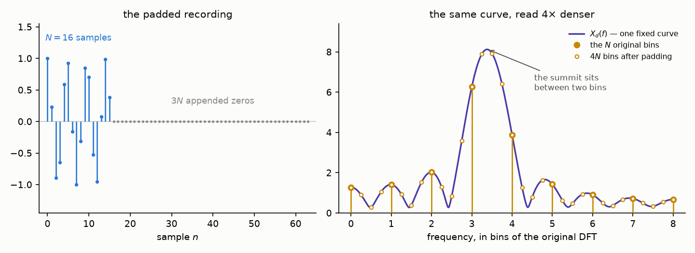

Back in [Part 1 of the spectrogram series](/posts/fourier-series-to-spectrogram-part-1/)
we promised that several *different* creatures answer to the name
"Fourier", showed a 2×2 table as a teaser, and walked its bottom row — from
the Fourier **series** to the **discrete** Fourier transform. (Throughout
this post, "Part 1", "Part 2" and "Part 3" refer to the parts of that
series — this post itself is not a Part 4, just a close relative.) This post is
the payoff of that teaser: we meet the remaining shades — the Fourier
**transform** and its **discrete-time** cousin — and, more importantly,
build *every bridge between the four*. None of the four is an axiom; each
is another one pushed through a limit, a sampling, or a periodization.

Here is the whole map at once — the four shades in their corners, and the
five bridges numbered in the order we will cross them:

Two conventions carried over from the trilogy: frequencies live in hertz
(the exponentials are $e^{\pm 2 \pi i f t}$, no loose $\omega$'s), and all
the machinery for *discrete* signals — the delta function, the sifting
property, the comb — is the one built honestly in
[Part 1](/posts/fourier-series-to-spectrogram-part-1/#from-the-series-to-the-dft);
we will lean on it without re-deriving. And a calibration of rigor: most
steps today are honest, and where the classical fine print matters we will
say so and point to it — but at a few junctures (an approximation slipped
inside an infinite sum, a summation swapped with an integral) we will
still argue like physicists. Part 1 shows what making a single such swap
fully honest costs; doing it for every bridge would triple the post.

## The cast, in one paragraph each

**The Fourier series** (Part 1's workhorse): a periodic signal with period
$P$ is a weighted sum of harmonics — frequencies $\frac{n}{P}$, a discrete
grid with step $\frac{1}{P}$:

$$
x(t) = \sum_{n = -\infty}^{\infty} c_n\, e^{2 \pi i \frac{n}{P} t},
\qquad
c_n = \frac{1}{P} \int_{-P/2}^{P/2} x(t)\, e^{-2 \pi i \frac{n}{P} t}\, dt.
$$

Continuous periodic time, discrete frequency. The other three shades we
will *construct* — from this one.

## Bridge one: Fourier series → Fourier transform

The series serves periodic signals only. What about a signal that never
repeats — a single pulse, a spoken sentence, anything from the real world?
Call it a periodic signal whose period is *infinite*, and watch what
happens to the machinery as $P$ grows:

In the time domain the copies march off to infinity, leaving one pulse. In
the frequency domain something more interesting happens. Rewrite the
series, multiplying and dividing by $P$:

$$
x(t) = \sum_{n=-\infty}^{\infty} c_n\, e^{2 \pi i \frac{n}{P} t}
     = \sum_{n=-\infty}^{\infty} \left( c_n P \right) e^{2 \pi i f_n t} \cdot \frac{1}{P},
\qquad f_n = \frac{n}{P}.
$$

The combination $c_n P$ is an integral that no longer hides a $\frac{1}{P}$:

$$
c_n P = \int_{-P/2}^{P/2} x(t)\, e^{-2 \pi i f_n t}\, dt.
$$

As $P \to \infty$, the integration limits open up to the whole axis, and
$c_n P$ approaches the value of one fixed function at the point $f_n$ —
give it a name:

$$
X(f) = \int_{-\infty}^{\infty} x(t)\, e^{-2 \pi i f t}\, dt.
$$

Now look at the sum we are left with:

$$
x(t) \approx \sum_{n=-\infty}^{\infty} X(f_n)\, e^{2 \pi i f_n t} \cdot \frac{1}{P}
$$

This final sum is an *integral sum* — a Riemann sum, an old friend from
Part 1 — for the function $X(f)\, e^{2 \pi i f t}$ over the partition
$f_n$ of the frequency axis, whose norm is the difference of adjacent
points: $f_{n+1} - f_n = \frac{1}{P}$. As $P \to \infty$, the norm of the
partition goes to $0$, and the sum converges to the integral:

$$
x(t) = \int_{-\infty}^{\infty} X(f)\, e^{2 \pi i f t}\, df
$$

(understood as a symmetric limit of the integration bounds — the
[Cauchy principal value](https://en.wikipedia.org/wiki/Cauchy_principal_value);
more on this in a moment).

Meet the second shade. $X(f)$ is the **Fourier transform** of $x(t)$, and
the last formula — the **Fourier integral** — is its inversion: the signal
reassembled from a *continuum* of frequencies. Everything is as in the
series, with the sum over a discrete grid of harmonics matured into an
integral over all frequencies, and the coefficients $c_n$ matured into a
*density* $X(f)$ (per unit of frequency — that is what the extra $P$ was
doing).

<b>Two remarks on honesty</b> (when the principal value actually matters)

Formally, *both* integrals are defined with the
symmetric-limit — principal-value — reading, and for a good reason: the
definition must make sense even for inputs that are *not* absolutely
integrable, and the inversion integral will need exactly that generosity.
The real distinction between the two is *when the principal value has
actual work to do*. Feed the forward transform an [absolutely
integrable](https://en.wikipedia.org/wiki/Absolutely_integrable_function)
signal — our standing assumption — and the caution turns out to be
vacuous: $\left| x(t)\, e^{-2 \pi i f t} \right| = |x(t)|$, the integral
converges absolutely, and every reasonable reading of it agrees. The
inversion integral enjoys no such luck. Its input is $X$ — and $X$ need
not be absolutely integrable *even when $x$ was*: our rectangular pulse's
transform will turn out to be a
[sinc](https://en.wikipedia.org/wiki/Sinc_function), with tails dying like
$\frac{1}{f}$ — too slowly (we compute it in bridge two). So there the principal value
genuinely earns its keep. The [inversion
theorem](https://en.wikipedia.org/wiki/Fourier_inversion_theorem) pins
down exactly when the symmetric limit returns $x(t)$ — under far weaker
assumptions than our physicist's derivation used. This is precisely how
[Zorich's *Mathematical Analysis
II*](https://matan.math.msu.su/media/uploads/2020/03/V.A.Zorich-Kniga-II-9-izdanie-Temp-Corr-3.pdf)
sets things up on p. 524 of the 9th Russian edition: both definitions
carry the principal-value clause, and the absolute-convergence remark
follows immediately for integrable inputs.

## Bridge two: Fourier transform → Fourier series

Now walk the same bridge in the opposite direction — it reveals something
the limit hid. Take an *aperiodic* signal $x(t)$ of finite extent (finite
**support**, in the math vocabulary): zero outside
$\left[ -\frac{\tau}{2}, \frac{\tau}{2} \right]$. It has a Fourier
transform $X(f)$. Pick a period $P$ at least as large as the support,
$P \ge \tau$, and copy the signal every $P$: this gives the periodic
extension $x_P(t)$ — Part 1's gluing again — and the copies never overlap:

The extension is periodic, so it has a Fourier *series*; compute its
coefficients:

$$
c_n = \frac{1}{P} \int_{-P/2}^{P/2} x_P(t)\, e^{-2 \pi i \frac{n}{P} t}\, dt
    = \frac{1}{P} \int_{-\infty}^{\infty} x(t)\, e^{-2 \pi i \frac{n}{P} t}\, dt
$$

— inside one period, $x_P$ *is* $x$ (the other copies live outside), so the
finite integral quietly unfolds into the infinite one. But the right-hand
side is the Fourier transform of $x$, evaluated at $f_n = \frac{n}{P}$:

$$
c_n = \frac{1}{P}\, X\!\left( \frac{n}{P} \right).
$$

Read it as a picture: the Fourier coefficients of the periodized signal are
*samples of one continuous curve* — the transform $\frac{1}{P} X(f)$ is the
**envelope** of the discrete spectrum. Make the period longer, and the
samples pack tighter along the same envelope, until they fuse into it:

(The stems in the picture are drawn as $P \cdot c_n$ — the raw coefficients
themselves shrink like $\frac{1}{P}$ and would sink into the axis; the
*shape* is what survives, and the shape is $X(f)$.)

And what *is* that envelope, for the rectangular pulse of the pictures?
For once, a transform we can compute end to end — the pulse has height $1$
on $\left[ -\frac{1}{2}, \frac{1}{2} \right]$, so:

$$
\begin{aligned}
X(f) = \int_{-1/2}^{1/2} e^{-2 \pi i f t}\, dt
     &= \left. \frac{e^{-2 \pi i f t}}{-2 \pi i f} \right|_{t=-1/2}^{t=1/2} \\
     &= \frac{e^{\pi i f} - e^{-\pi i f}}{2 \pi i f}
      = \frac{\sin(\pi f)}{\pi f},
\end{aligned}
$$

the last step being Euler's formula run backwards,
$\sin z = \frac{1}{2i} \left( e^{iz} - e^{-iz} \right)$. This damped
ripple is the [**sinc** function](https://en.wikipedia.org/wiki/Sinc_function)
— the curve the stems of the figure trace, and the promised troublemaker
of bridge one: its tails die like $\frac{1}{f}$, too slowly for absolute
integrability, which is exactly why the inversion integral keeps its
principal-value clause.

This bridge also plants the law that will organize everything below.
Periodizing the signal made its spectrum discrete — samples on the grid
$\frac{n}{P}$. **Periodic in time ⇔ discrete in frequency**, and the
period in one domain sets the grid step in the other: $P$ seconds of
period — $\frac{1}{P}$ hertz between harmonics. The bridge we have just
crossed is the *left edge* of [our map](#the-square) — and by the end of
this post the same law will run every road on it.

## Bridge three: Fourier transform → DTFT

So far both shades live on continuous time. Enter the sampled world —
through the honest gate built in Part 1: a discrete signal is the analog
signal times the comb,
$x_d(t) = x(t) \cdot \text{Ш}_T(t) = \sum_n x(nT)\, \delta(t - nT)$.
This object has a perfectly good Fourier transform — compute it honestly,
step by step:

$$
\begin{aligned}
X_d(f) &= \int_{-\infty}^{\infty} x_d(t)\, e^{-2 \pi i f t}\, dt
        = \int_{-\infty}^{\infty} \left( \sum_{n=-\infty}^{\infty} x(t)\, \delta(t - nT) \right) e^{-2 \pi i f t}\, dt \\
       &= \sum_{n=-\infty}^{\infty} \int_{-\infty}^{\infty} x(t)\, \delta(t - nT)\, e^{-2 \pi i f t}\, dt \\
       &= \sum_{n=-\infty}^{\infty} x(nT)\, e^{-2 \pi i f n T}.
\end{aligned}
$$

Three moves. First, substitute the comb model. Second, swap the sum with
the integral — and note that this time the sum is *infinite*: in Part 1
the matching swap held by plain linearity of finitely many terms, while
here it is one of the physicist junctures flagged in the introduction.
Third, sifting: each delta samples everything under its integral — the
signal and the exponential alike — at its own grid instant $t = nT$.

<b>Can the second move be made rigorous?</b>

In two layers. For *honest
functions* in place of deltas, swapping an infinite sum with an integral
is licensed by the [Fubini–Tonelli
theorem](https://en.wikipedia.org/wiki/Fubini%27s_theorem). The theorem is
stated for products of arbitrary *σ-finite measure spaces* — the Lebesgue
measure on the line is only its most famous customer — and another
customer is the [counting
measure](https://en.wikipedia.org/wiki/Counting_measure) on the integers:
the measure that assigns to a set of indices simply the number of its
elements, so that "integrating" against it means adding the terms up.

A sum is an integral over the counting measure. Why? Strip any integral to
its skeleton and it reads: *value of the
function on a piece, times the size of the piece, summed over the pieces*.
The Riemann integral measures its pieces by length, $dt$. A measure $\mu$
is nothing but a different rule for the size of a piece — and the counting
measure's rule is "the size of a set is the number of indices in it". Each
single index is then a piece of size $1$, "value times size" is
$f(n) \cdot 1$, and summing over the pieces is literally summing the
values: $\int f\, d\mu = \sum_n f(n)$.

With that dictionary in hand, our sum-plus-integral is a
double integral over a product of two concrete measure spaces: the
integers $\mathbb{Z}$ carrying the counting measure (that side is the sum
over $n$) times the time axis $\mathbb{R}$ carrying the usual Lebesgue
measure (that side is the integral over $t$). The swap of the
two is legal whenever the
total absolute mass $\sum_n \int |f_n|$ is finite; in our setting that
becomes *absolute summability of the samples*, $\sum_n |x(nT)| \lt
\infty$, which also makes the resulting series converge absolutely and
uniformly in $f$. With deltas on stage, though, no classical theorem
applies — the clean framework is the [distribution
theory](https://en.wikipedia.org/wiki/Distribution_(mathematics)) that
Part 1's proof pointed to, where this whole computation is a *definition*
dressed as a calculation.

Before naming it, notice its defining feature. Shift $f$ by
$f_s = \frac{1}{T}$: each term picks up
$e^{-2 \pi i n} = 1$ — nothing changes. The spectrum of a sampled signal is
**periodic with period $f_s$** — and the reason is, once again, that $n$
is an integer: sampling put the signal on a grid, and a whole number of
extra turns changes no exponential. It is the same one-line argument that
gave $c_{k+N} = c_k$ in Part 1, now acting in the other domain. Set the notational
convention $T = 1$ (indices instead of seconds, square brackets as in
Part 1) and this sum is the third shade, the **discrete-time Fourier
transform**:

$$
X_d(f) = \sum_{n=-\infty}^{\infty} x[n]\, e^{-2 \pi i f n}
$$

— discrete time in, continuous (and periodic) frequency out. The mirror
image of the Fourier series, cell for cell: there, continuous periodic time
and discrete frequency; here, discrete time and continuous periodic
frequency.

### The copies: what sampling does to a spectrum

Periodicity is only half the story. The other half is *what exactly* one
period of $X_d$ contains — and here [bridge
two](#bridge-two-fourier-transform--fourier-series) pays an
unexpected dividend: its envelope formula, $c_n = \frac{1}{P}
X\!\left(\frac{n}{P}\right)$, is about to be reused with the roles of time
and frequency swapped. Consider the periodization of the original spectrum
$X(f)$ along the *frequency* axis, copies every $f_s$:

$$
Y(f) = \sum_{m=-\infty}^{\infty} X(f - m f_s).
$$

$Y$ is $f_s$-periodic, so it expands in a Fourier series *in the frequency
variable* — the harmonics are $e^{-2 \pi i f n T}$, indexed by time lags
$nT$. Its coefficients succumb to the same unfolding trick as in bridge
two (one period of a periodization = the whole line of the original):

$$
d_n = \frac{1}{f_s} \int_{-f_s/2}^{f_s/2} Y(f)\, e^{2 \pi i f n T}\, df
    = \frac{1}{f_s} \int_{-\infty}^{\infty} X(f)\, e^{2 \pi i f n T}\, df
    = \frac{1}{f_s}\, x(nT)
$$

— the last step is the Fourier integral, reassembling $x$ at the instant
$t = nT$. So the periodized spectrum is
$Y(f) = \sum_n \frac{x(nT)}{f_s} e^{-2 \pi i f n T} = T \cdot X_d(f)$, that
is:

$$
X_d(f) = \frac{1}{T} \sum_{m=-\infty}^{\infty} X(f - m f_s).
$$

**The DTFT is the original transform, copied every $f_s$ and stacked.**
Sampling in time periodizes the spectrum — the exact dual of bridge two,
proved *by* bridge two, run in the other domain. (Mathematicians know this
identity as the [Poisson summation
formula](https://en.wikipedia.org/wiki/Poisson_summation_formula); we got
it by crossing our own bridge twice.)

The picture holds a loaded gun. If the copies *don't* reach each other —
if $X(f)$ lives entirely below $\frac{f_s}{2}$ — then one period of the
DTFT contains an intact, undamaged copy of $X$: **nothing about the analog
signal was lost by sampling it.** Cut that copy out, run the Fourier
integral, and the continuous signal comes back — every value between the
samples included. That is precisely the [sampling theorem stated in
Part 2](/posts/fourier-series-to-spectrogram-part-2/#the-nyquist-frequency)
— and the middle row of the picture above *is* its proof, one post away
from being written out. If the copies do overlap (bottom row), they add up
where they collide, and no cutting recovers $X$ — aliasing, the theorem's
dark twin, again exactly as promised.

## Bridge four: Fourier series → DFT

The fourth shade needs no new work at all: it is the road
[Part 1](/posts/fourier-series-to-spectrogram-part-1/#from-the-series-to-the-dft)
walked end to end — the *bottom edge* of the map. Take $N$ samples,
periodize with period $NT$, feed the comb into the Fourier *series*, let
sifting collapse the integral:

$$
c_k = \frac{1}{NT} \sum_{n=0}^{N-1} x(nT)\, e^{-2 \pi i \frac{k n}{N}},
$$

$T$ cancels in the exponent, only $N$ coefficients are distinct, and
dropping the physical scale leaves the **discrete Fourier transform**
$X[k] = \sum_n x[n]\, e^{-2 \pi i k n / N}$ — discrete and periodic in both
domains, the fully quantized corner of the table.

Note that this one road makes *two* moves at once — it periodizes the
signal, and it samples it — so both faces of the law fire together. The
periodization made the spectrum discrete: a Fourier series hands over
coefficients on a grid by its very construction. The sampling made the
spectrum periodic: [one line,
$c_{k+N} = c_k$](/posts/fourier-series-to-spectrogram-part-1/#only-n-distinct-coefficients).
This is where [Part 2 of the spectrogram series, *Reading the
DFT*,](/posts/fourier-series-to-spectrogram-part-2/) first met both faces
of the law — by direct computation, before any general principle was in
sight.

## Bridge five: DTFT → DFT

One connection remains: the two discrete-time shades. The DTFT of a finite
recording ($x[n] = 0$ outside $0, \dots, N-1$) is a continuous periodic
curve; the DFT is $N$ numbers. Evaluate the DTFT on the grid
$f_k = \frac{k}{NT}$ — $N$ points per period — and compare:

$$
X_d\!\left( \frac{k}{NT} \right)
= \sum_{n=0}^{N-1} x(nT)\, e^{-2 \pi i \frac{k}{NT} n T}
= \sum_{n=0}^{N-1} x[n]\, e^{-2 \pi i \frac{k n}{N}} = X[k].
$$

**The DFT bins are samples of the DTFT** — no new transform, just $N$
readings of the continuous curve:

And the law completes its square. What did we pay for making the spectrum
discrete? Look back at bridge four: the price was *periodizing the
signal* — the glued copies. Sampling the spectrum periodizes the signal,
exactly as sampling the signal periodized the spectrum. Part 2 even drew
what that costs:
[the DFT's model of a signal repeats forever with the window's
period](/posts/fourier-series-to-spectrogram-part-2/#what-does-xk-measure)
— that repetition *is* the time-domain periodization that bridge five
smuggles in. (Bridges four and five agree to the letter:
$c_k = \frac{1}{NT} X_d(f_k)$ — the envelope relation of bridge two, one
floor down the table.)

## Do the roads run back?

Look at the arrows: every one of them points *toward* discreteness. The
DFT is a sink — three roads lead in, none lead out. Is the traffic really
one-way?

For arbitrary signals, yes. Sampling discards everything between the
samples; periodizing overlaps everything that pokes out of one period. A
general crossing loses information, and lost information buys no return
ticket. But each bridge *does* have a return ticket, and all the tickets
carry the same fine print: **a crossing is reversible exactly when the
other domain is limited.**

- **DFT → DTFT.** Our recording was time-limited to $N$ samples by
  construction — and that alone is enough: the continuous curve $X_d(f)$
  is completely determined by its $N$ samples, through an explicit
  interpolation formula. Practitioners walk this reverse road daily,
  under the name **zero-padding** — the cut below unpacks the trick, and
  what it does and does not buy.

  

  
<b>Zero-padding: the reverse road in daily use</b> (a denser reading, not a sharper spectrum)

  The trick in one sentence: **we append zeros to the recording so that
  the DFT samples *more points off the same DTFT curve* $X_d(f)$** — a
  denser reading of the curve, nothing else. Now slowly: why would we
  want that, and why do zeros deliver it?

  Start from the picture bridge five left us: the $N$ DFT values are $N$
  *readings* of the continuous curve $X_d(f)$, taken on the grid
  $f_k = \frac{k}{NT}$. Between the grid points the curve keeps living —
  bridge five simply never looks there. And sometimes we badly want to
  look: if the curve's peak sits *between* two grid points, the $N$
  readings show two middling bars where $X_d(f)$ has one sharp summit.

  So — how do we read the same curve at more points? The grid step
  $\frac{1}{NT}$ is set by one thing only: the length of the vector we
  feed to the DFT. We cannot lengthen the recording after the fact, but
  we can lengthen the *vector* — append zeros, say to length $4N$, and
  the grid step drops to $\frac{1}{4NT}$. The zeros are harmless by
  construction: each term of the sum
  $X_d(f) = \sum_n x[n]\, e^{-2\pi i f n T}$ is a sample times a probe,
  so every appended sample contributes a zero term, and the curve does
  not move an inch. The length-$4N$ DFT therefore reads the *same*
  curve — at four times as many points:

  

  Now, carefully: what did the zeros buy us? On the picture — a lot. The
  coarse reading showed a bar of height 6.3 at bin 3 and a bar of height
  3.9 at bin 4; anyone would report "frequency about 3, amplitude about
  6.3", and both numbers would be wrong. The dense reading lands almost
  on the summit and reports the truth: frequency 3.4, height about 8.
  This is a genuine win, and it has a name — **estimation**: pinpointing
  the position and height of a peak that the curve *does* have.

  What the zeros can never buy is **resolution**: telling *two* close
  tones apart. If two sines sit closer than $1/\text{duration}$, their
  lobes have merged into a single hump *on the curve $X_d(f)$ itself*,
  before any reading takes place. A denser grid will only measure that
  one hump more and more precisely; the fact that there were two tones
  was lost the moment the recording ended. The curve is a photograph
  already taken, and zero-padding is zoom at the screen: zoom locates
  the center of a blurred spot ever more finely, but two stars smeared
  into one spot stay one spot at any magnification.
  $\Delta f = 1/\text{duration}$, [the law of Part
  2](/posts/fourier-series-to-spectrogram-part-2/#from-the-index-to-hertz),
  still stands: zeros add no listening time — a denser *reading* of the
  spectrum, never a sharper spectrum.

  

- **DFT → FS.** If a periodic signal contains only $N$ harmonics, its $N$
  coefficients rebuild it exactly — this is the trigonometric
  interpolation of [Part 2's green
  model](/posts/fourier-series-to-spectrogram-part-2/#what-does-xk-measure),
  the curve through every sample.
- **DTFT → FT.** The copies picture already said it: if the signal was
  band-limited below $\frac{f_s}{2}$, the copies never touch, and one
  period of the DTFT holds an intact $X(f)$ — cut it out, and the
  transform (hence the signal, every value between the samples included)
  is recovered. That return ticket is the sampling theorem of
  Kotelnikov–Shannon–Nyquist, and its price — band-limitedness — is
  precisely the fine print the next post will read aloud.

So the law of the square has a quieter second half: *limited in one
domain ⇔ recoverable from samples in the other*. Sampling time costs
nothing when the frequency content is limited; sampling frequency costs
nothing when the time extent is limited. The DFT sits in its corner not
as a grave but as a compressed archive.

(One caveat for the perfectionist: the full journey back — DFT all the
way to the analog world — needs time-limitedness *and* band-limitedness
at once, and a nonzero signal cannot strictly have both. The round trip
to the analog world is therefore always an approximation; how good an
approximation is, once again, the sampling theorem's department.)

<b>Why can't a signal be time-limited and band-limited at once?</b> (a Taylor series settles it)

Suppose $x$ is band-limited: $x(t) = \int_{-B}^{B} X(f)\, e^{2 \pi i f t}\, df$,
an integral over a *finite* stretch of frequencies. Differentiate under
the integral as many times as you like — each derivative pulls down one
factor of $2 \pi i f$, and $|f| \le B$ caps it:

$$
\left| x^{(k)}(t) \right|
\le (2 \pi B)^k \int_{-B}^{B} |X(f)|\, df = C \cdot (2 \pi B)^k.
$$

The derivatives grow at most geometrically — and a factorial beats any
geometric growth. Two small gears turn inside that claim, so let us
expose them. First, the [Lagrange form of the Taylor
remainder](https://en.wikipedia.org/wiki/Taylor%27s_theorem#Explicit_formulas_for_the_remainder):
cutting the Taylor series of $x$ around $t_0$ after $k$ terms leaves the
error

$$
R_k(t) = \frac{x^{(k+1)}(\xi)}{(k+1)!}\, (t - t_0)^{k+1}
\quad \text{for some } \xi \text{ between } t_0 \text{ and } t,
$$

so the error is controlled by the *next* derivative, and our bound turns
it into $|R_k(t)| \le C\, \frac{a^{k+1}}{(k+1)!}$ with
$a = 2 \pi B\, |t - t_0|$ — a fixed number once $t$ is fixed. Second, why
does $\frac{a^k}{k!}$ go to $0$? Compare successive terms: the ratio is
$\frac{a}{k+1}$, which drops below $\frac{1}{2}$ as soon as $k$ passes
$2a$ — from that point on every term at least halves. The factorial
outruns any geometric growth; this is the same reason the series for
$e^{z}$ converges everywhere. And "the remainder tends to zero" is
*literally* the statement "the Taylor series converges to $x(t)$": the
remainder is, by definition, the gap between $x(t)$ and the first $k$
terms. A band-limited signal is, in
other words, an [analytic function](https://en.wikipedia.org/wiki/Analytic_function):
its behavior on any tiny interval determines it everywhere. (Part 1's
["why not Taylor?"](/posts/fourier-series-to-spectrogram-part-1/#the-fourier-series)
inset complained that Taylor coefficients are rigidly global creatures —
here, at last, that rigidity does useful work.)

Now let $x$ also be time-limited: identically zero outside some interval.
Pick $t_0$ in the silence. Every derivative of $x$ at $t_0$ is zero, so
the Taylor series is the zero series — and by the paragraph above it
converges to $x$ everywhere. Hence $x \equiv 0$. A signal that is not
identically zero must overflow either its time box or its frequency box.

## The map, walked

Here is [the same map from the top of the post](#the-square) once more —
only now every road on it has been built underfoot:

One law runs every road: **discrete in one domain ⇔ periodic in the
other** — and quantitatively, a period of $A$ in one domain forces a grid
of step $\frac{1}{A}$ in the other. Sample a signal every $T$ seconds, and
its spectrum repeats every $\frac{1}{T}$ hertz. Periodize a signal every
$P$ seconds, and its spectrum collapses to the grid $\frac{n}{P}$. Do both
— which is what any computer holding $N$ samples has silently done — and
both domains end up discrete *and* periodic: the DFT, with its $N$-point
grids locked in the relation $\Delta f = \frac{1}{NT}$ that Part 2 spent a
whole section reading.

The square also says what comes next. The middle row of the copies picture
— separated copies, the original spectrum intact inside each — is the
entire proof of the theorem with three names, waiting to be written
carefully: what "band-limited" must mean, why the boundary case bites, how
the sinc reconstructs, and what the wagon wheels in old westerns have to do
with any of it. The theorem's post is next on this road.
