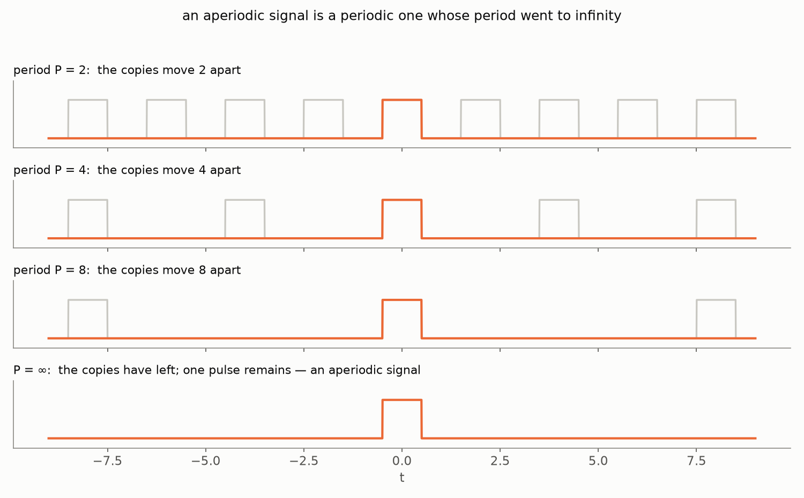
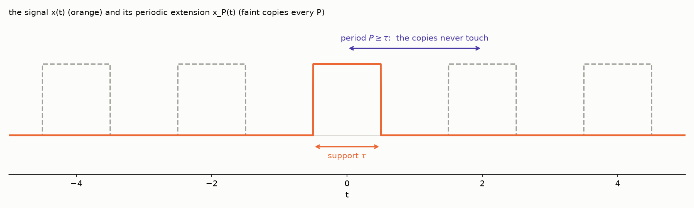
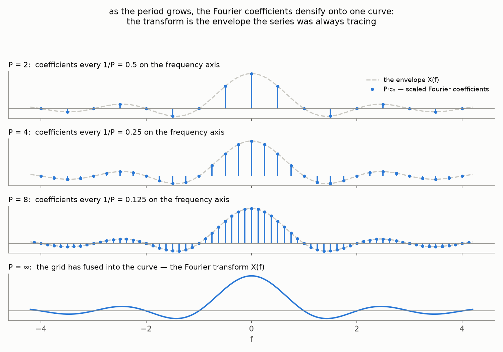
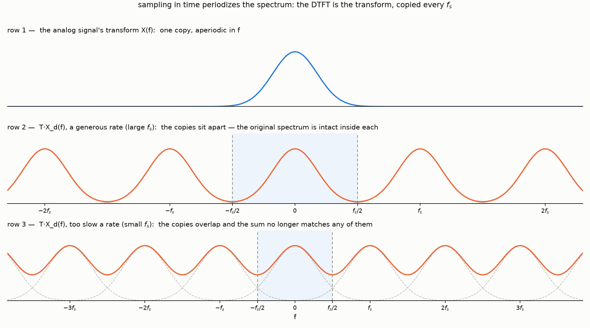
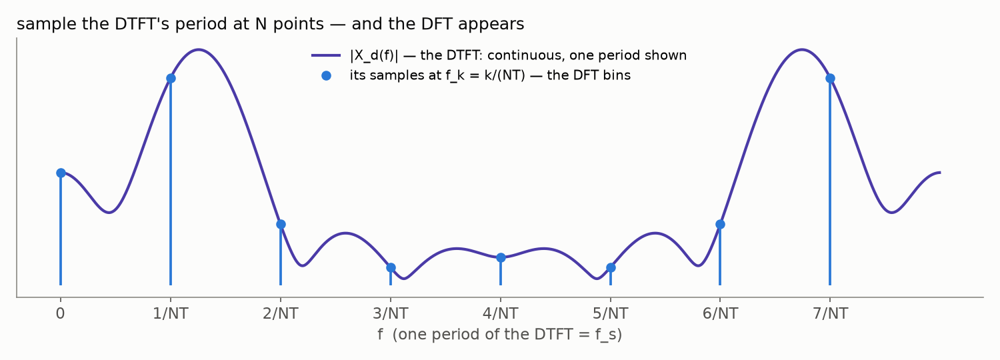
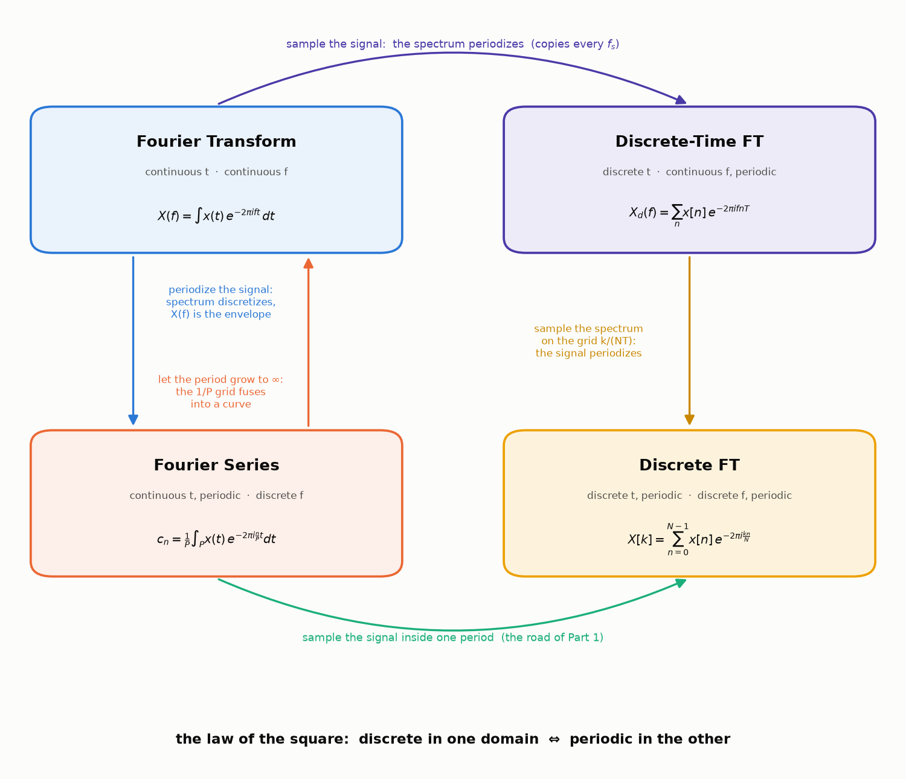

Back in [Part 1 of the spectrogram series](/posts/fourier-series-to-spectrogram-part-1/)
we promised that several *different* creatures answer to the name
"Fourier", showed a 2×2 table as a teaser, and walked its bottom row — from
the Fourier **series** to the **discrete** Fourier transform. This post is
the payoff of that teaser: we meet the remaining shades — the Fourier
**transform** and its **discrete-time** cousin — and, more importantly,
build *every bridge between the four*. None of the four is an axiom; each
is another one pushed through a limit, a sampling, or a periodization.

Two conventions carried over from the trilogy: frequencies live in hertz
(the exponentials are $e^{\pm 2 \pi i f t}$, no loose $\omega$'s), and all
the machinery for *discrete* signals — the delta function, the sifting
property, the comb — is the one built honestly in
[Part 1](/posts/fourier-series-to-spectrogram-part-1/#from-the-series-to-the-dft);
we will lean on it without re-deriving. And a calibration of rigor: most
steps today are honest, and where the classical fine print matters we will
say so and point to it — but at a few junctures (an approximation slipped
inside an infinite sum, a summation swapped with an integral) we will
still argue like physicists. Part 1 shows what making a single such swap
fully honest costs; doing it for every bridge would triple the post.

## The cast, in one paragraph each

**The Fourier series** (Part 1's workhorse): a periodic signal with period
$P$ is a weighted sum of harmonics — frequencies $\frac{n}{P}$, a discrete
grid with step $\frac{1}{P}$:

$$
x(t) = \sum_{n = -\infty}^{\infty} c_n\, e^{2 \pi i \frac{n}{P} t},
\qquad
c_n = \frac{1}{P} \int_{-P/2}^{P/2} x(t)\, e^{-2 \pi i \frac{n}{P} t}\, dt.
$$

Continuous periodic time, discrete frequency. The other three shades we
will *construct* — from this one.

## Bridge one: let the period go to infinity

The series serves periodic signals only. What about a signal that never
repeats — a single pulse, a spoken sentence, anything from the real world?
Call it a periodic signal whose period is *infinite*, and watch what
happens to the machinery as $P$ grows:

In the time domain the copies march off to infinity, leaving one pulse. In
the frequency domain something more interesting happens. Rewrite the
series, multiplying and dividing by $P$:

$$
x(t) = \sum_{n=-\infty}^{\infty} c_n\, e^{2 \pi i \frac{n}{P} t}
     = \sum_{n=-\infty}^{\infty} \left( c_n P \right) e^{2 \pi i f_n t} \cdot \frac{1}{P},
\qquad f_n = \frac{n}{P}.
$$

The combination $c_n P$ is an integral that no longer hides a $\frac{1}{P}$:

$$
c_n P = \int_{-P/2}^{P/2} x(t)\, e^{-2 \pi i f_n t}\, dt.
$$

As $P \to \infty$, the integration limits open up to the whole axis, and
$c_n P$ approaches the value of one fixed function at the point $f_n$ —
give it a name:

$$
X(f) = \int_{-\infty}^{\infty} x(t)\, e^{-2 \pi i f t}\, dt.
$$

Now look at the sum we are left with:

$$
x(t) \approx \sum_{n=-\infty}^{\infty} X(f_n)\, e^{2 \pi i f_n t} \cdot \frac{1}{P}
$$

This final sum is an *integral sum* — a Riemann sum, an old friend from
Part 1 — for the function $X(f)\, e^{2 \pi i f t}$ over the partition
$f_n$ of the frequency axis, whose norm is the difference of adjacent
points: $f_{n+1} - f_n = \frac{1}{P}$. As $P \to \infty$, the norm of the
partition goes to $0$, and the sum converges to the integral:

$$
x(t) = \int_{-\infty}^{\infty} X(f)\, e^{2 \pi i f t}\, df
$$

(understood as a symmetric limit of the integration bounds — the
[Cauchy principal value](https://en.wikipedia.org/wiki/Cauchy_principal_value);
more on this in a moment).

Meet the second shade. $X(f)$ is the **Fourier transform** of $x(t)$, and
the last formula — the **Fourier integral** — is its inversion: the signal
reassembled from a *continuum* of frequencies. Everything is as in the
series, with the sum over a discrete grid of harmonics matured into an
integral over all frequencies, and the coefficients $c_n$ matured into a
*density* $X(f)$ (per unit of frequency — that is what the extra $P$ was
doing).

Two remarks on honesty, because the two integrals are not equally
innocent. The *defining* integral for $X(f)$ is a fully honest one:
$\left| x(t)\, e^{-2 \pi i f t} \right| = |x(t)|$, so for an [absolutely
integrable](https://en.wikipedia.org/wiki/Absolutely_integrable_function)
signal it converges absolutely — no interpretation needed. The *inversion*
integral is the delicate character: $X$ itself need not be absolutely
integrable (our rectangular pulse's transform will turn out to be a sinc,
whose tails die like $\frac{1}{f}$ — too slowly), which is exactly why the
Fourier integral needed the principal-value reading above, and the
[inversion theorem](https://en.wikipedia.org/wiki/Fourier_inversion_theorem)
pins down exactly when it returns $x(t)$ — under far weaker assumptions
than our physicist's derivation used. The fine print lives in analysis
textbooks; [Zorich's *Mathematical Analysis
II*](https://matan.math.msu.su/media/uploads/2020/03/V.A.Zorich-Kniga-II-9-izdanie-Temp-Corr-3.pdf)
makes exactly this pair of remarks with the bar of rigor raised — the
principal-value definition and the absolute-convergence argument sit side
by side on p. 524 of the 9th Russian edition.

## Bridge two: the transform is the envelope of the series

Now walk the same bridge in the opposite direction — it reveals something
the limit hid. Take an *aperiodic* signal $x(t)$ of finite extent (finite
**support**, in the math vocabulary): zero outside
$\left[ -\frac{\tau}{2}, \frac{\tau}{2} \right]$. It has a Fourier
transform $X(f)$. Pick a period $P$ at least as large as the support,
$P \ge \tau$, and copy the signal every $P$: this gives the periodic
extension $x_P(t)$ — Part 1's gluing again — and the copies never overlap:

The extension is periodic, so it has a Fourier *series*; compute its
coefficients:

$$
c_n = \frac{1}{P} \int_{-P/2}^{P/2} x_P(t)\, e^{-2 \pi i \frac{n}{P} t}\, dt
    = \frac{1}{P} \int_{-\infty}^{\infty} x(t)\, e^{-2 \pi i \frac{n}{P} t}\, dt
$$

— inside one period, $x_P$ *is* $x$ (the other copies live outside), so the
finite integral quietly unfolds into the infinite one. But the right-hand
side is the Fourier transform of $x$, evaluated at $f_n = \frac{n}{P}$:

$$
c_n = \frac{1}{P}\, X\!\left( \frac{n}{P} \right).
$$

Read it as a picture: the Fourier coefficients of the periodized signal are
*samples of one continuous curve* — the transform $\frac{1}{P} X(f)$ is the
**envelope** of the discrete spectrum. Make the period longer, and the
samples pack tighter along the same envelope, until they fuse into it:

(The stems in the picture are drawn as $P \cdot c_n$ — the raw coefficients
themselves shrink like $\frac{1}{P}$ and would sink into the axis; the
*shape* is what survives, and the shape is $X(f)$.)

This bridge also plants the law that will organize everything below.
Periodizing the signal made its spectrum discrete — samples on the grid
$\frac{n}{P}$. **Periodic in time ⇔ discrete in frequency**, and the
period in one domain sets the grid step in the other: $P$ seconds of period
— $\frac{1}{P}$ hertz between harmonics. [Part 2 met both faces of this
law](/posts/fourier-series-to-spectrogram-part-2/) on what will become the
*bottom edge* of [our map](#the-square) — the road from the Fourier series
to the DFT,
where a single derivation periodizes the signal (and the spectrum comes
out discrete — the series hands over coefficients on a grid by its very
construction) and samples it (and the spectrum comes out periodic — [one
line: $c_{k+N} = c_k$](/posts/fourier-series-to-spectrogram-part-1/#only-n-distinct-coefficients)).
Both facts arrived by direct computation, before any general principle was
in sight. The bridge
we have just crossed
is the square's *left edge*, the same law between transform and series —
and by the end of this post it will run every road on the map.

## Bridge three: sample the signal — the DTFT

So far both shades live on continuous time. Enter the sampled world —
through the honest gate built in Part 1: a discrete signal is the analog
signal times the comb,
$x_d(t) = x(t) \cdot \text{Ш}_T(t) = \sum_n x(nT)\, \delta(t - nT)$.
This object has a perfectly good Fourier transform — compute it honestly,
step by step:

$$
\begin{aligned}
X_d(f) &= \int_{-\infty}^{\infty} x_d(t)\, e^{-2 \pi i f t}\, dt
        = \int_{-\infty}^{\infty} \left( \sum_{n=-\infty}^{\infty} x(t)\, \delta(t - nT) \right) e^{-2 \pi i f t}\, dt \\
       &= \sum_{n=-\infty}^{\infty} \int_{-\infty}^{\infty} x(t)\, \delta(t - nT)\, e^{-2 \pi i f t}\, dt \\
       &= \sum_{n=-\infty}^{\infty} x(nT)\, e^{-2 \pi i f n T}.
\end{aligned}
$$

Three moves. First, substitute the comb model. Second, swap the sum with
the integral — and note that this time the sum is *infinite*: in Part 1
the matching swap held by plain linearity of finitely many terms, while
here it is one of the physicist junctures flagged in the introduction.
Third, sifting: each delta samples everything under its integral — the
signal and the exponential alike — at its own grid instant $t = nT$.

<b>Can the second move be made rigorous?</b>

In two layers. For *honest
functions* in place of deltas, swapping an infinite sum with an integral
is licensed by the [Fubini–Tonelli
theorem](https://en.wikipedia.org/wiki/Fubini%27s_theorem) — a sum is an
integral over the counting measure, and the swap is legal whenever the
total absolute mass $\sum_n \int |f_n|$ is finite; in our setting that
becomes *absolute summability of the samples*, $\sum_n |x(nT)| \lt
\infty$, which also makes the resulting series converge absolutely and
uniformly in $f$. With deltas on stage, though, no classical theorem
applies — the clean framework is the [distribution
theory](https://en.wikipedia.org/wiki/Distribution_(mathematics)) that
Part 1's proof pointed to, where this whole computation is a *definition*
dressed as a calculation.

Before naming it, notice its defining feature. Shift $f$ by
$f_s = \frac{1}{T}$: each term picks up
$e^{-2 \pi i n} = 1$ — nothing changes. The spectrum of a sampled signal is
**periodic with period $f_s$**: one glance at the exponent, and the "signal
lives on a grid" card from Parts 1–2 plays itself. Set the notational
convention $T = 1$ (indices instead of seconds, square brackets as in
Part 1) and this sum is the third shade, the **discrete-time Fourier
transform**:

$$
X_d(f) = \sum_{n=-\infty}^{\infty} x[n]\, e^{-2 \pi i f n}
$$

— discrete time in, continuous (and periodic) frequency out. The mirror
image of the Fourier series, cell for cell: there, continuous periodic time
and discrete frequency; here, discrete time and continuous periodic
frequency.

### The copies: what sampling does to a spectrum

Periodicity is only half the story. The other half is *what exactly* one
period of $X_d$ contains — and here bridge two pays an unexpected
dividend. Consider the periodization of the original spectrum $X(f)$ along
the *frequency* axis, copies every $f_s$:

$$
Y(f) = \sum_{m=-\infty}^{\infty} X(f - m f_s).
$$

$Y$ is $f_s$-periodic, so it expands in a Fourier series *in the frequency
variable* — the harmonics are $e^{-2 \pi i f n T}$, indexed by time lags
$nT$. Its coefficients succumb to the same unfolding trick as in bridge
two (one period of a periodization = the whole line of the original):

$$
d_n = \frac{1}{f_s} \int_{-f_s/2}^{f_s/2} Y(f)\, e^{2 \pi i f n T}\, df
    = \frac{1}{f_s} \int_{-\infty}^{\infty} X(f)\, e^{2 \pi i f n T}\, df
    = \frac{1}{f_s}\, x(nT)
$$

— the last step is the Fourier integral, reassembling $x$ at the instant
$t = nT$. So the periodized spectrum is
$Y(f) = \sum_n \frac{x(nT)}{f_s} e^{-2 \pi i f n T} = T \cdot X_d(f)$, that
is:

$$
X_d(f) = \frac{1}{T} \sum_{m=-\infty}^{\infty} X(f - m f_s).
$$

**The DTFT is the original transform, copied every $f_s$ and stacked.**
Sampling in time periodizes the spectrum — the exact dual of bridge two,
proved *by* bridge two, run in the other domain. (Mathematicians know this
identity as the [Poisson summation
formula](https://en.wikipedia.org/wiki/Poisson_summation_formula); we got
it by crossing our own bridge twice.)

The picture holds a loaded gun. If the copies *don't* reach each other —
if $X(f)$ lives entirely below $\frac{f_s}{2}$ — then one period of the
DTFT contains an intact, undamaged copy of $X$: **nothing about the analog
signal was lost by sampling it.** Cut that copy out, run the Fourier
integral, and the continuous signal comes back — every value between the
samples included. That is precisely the [sampling theorem stated in
Part 2](/posts/fourier-series-to-spectrogram-part-2/#the-nyquist-frequency)
— and the middle row of the picture above *is* its proof, one post away
from being written out. If the copies do overlap (bottom row), they add up
where they collide, and no cutting recovers $X$ — aliasing, the theorem's
dark twin, again exactly as promised.

## Bridge four: sample the signal inside one period — the DFT

The fourth shade needs no new work at all: it is the road
[Part 1](/posts/fourier-series-to-spectrogram-part-1/#from-the-series-to-the-dft)
walked end to end. Take $N$ samples, periodize with period $NT$, feed the
comb into the Fourier *series*, let sifting collapse the integral:

$$
c_k = \frac{1}{NT} \sum_{n=0}^{N-1} x(nT)\, e^{-2 \pi i \frac{k n}{N}},
$$

$T$ cancels in the exponent, only $N$ coefficients are distinct, and
dropping the physical scale leaves the **discrete Fourier transform**
$X[k] = \sum_n x[n]\, e^{-2 \pi i k n / N}$ — discrete and periodic in both
domains, the fully quantized corner of the table.

## Bridge five: sample the spectrum — DTFT → DFT

One connection remains: the two discrete-time shades. The DTFT of a finite
recording ($x[n] = 0$ outside $0, \dots, N-1$) is a continuous periodic
curve; the DFT is $N$ numbers. Evaluate the DTFT on the grid
$f_k = \frac{k}{NT}$ — $N$ points per period — and compare:

$$
X_d\!\left( \frac{k}{NT} \right)
= \sum_{n=0}^{N-1} x(nT)\, e^{-2 \pi i \frac{k}{NT} n T}
= \sum_{n=0}^{N-1} x[n]\, e^{-2 \pi i \frac{k n}{N}} = X[k].
$$

**The DFT bins are samples of the DTFT** — no new transform, just $N$
readings of the continuous curve:

And the law completes its square. What did we pay for making the spectrum
discrete? Look back at bridge four: the price was *periodizing the
signal* — the glued copies. Sampling the spectrum periodizes the signal,
exactly as sampling the signal periodized the spectrum. Part 2 even drew
what that costs:
[the DFT's model of a signal repeats forever with the window's
period](/posts/fourier-series-to-spectrogram-part-2/#what-does-xk-measure)
— that repetition *is* the time-domain periodization that bridge five
smuggles in. (Bridges four and five agree to the letter:
$c_k = \frac{1}{NT} X_d(f_k)$ — the envelope relation of bridge two, one
floor down the table.)

## The map

Here is the whole square, with every road labeled:

One law runs every road: **discrete in one domain ⇔ periodic in the
other** — and quantitatively, a period of $A$ in one domain forces a grid
of step $\frac{1}{A}$ in the other. Sample a signal every $T$ seconds, and
its spectrum repeats every $\frac{1}{T}$ hertz. Periodize a signal every
$P$ seconds, and its spectrum collapses to the grid $\frac{n}{P}$. Do both
— which is what any computer holding $N$ samples has silently done — and
both domains end up discrete *and* periodic: the DFT, with its $N$-point
grids locked in the relation $\Delta f = \frac{1}{NT}$ that Part 2 spent a
whole section reading.

The square also says what comes next. The middle row of the copies picture
— separated copies, the original spectrum intact inside each — is the
entire proof of the theorem with three names, waiting to be written
carefully: what "band-limited" must mean, why the boundary case bites, how
the sinc reconstructs, and what the wagon wheels in old westerns have to do
with any of it. The theorem's post is next on this road.
