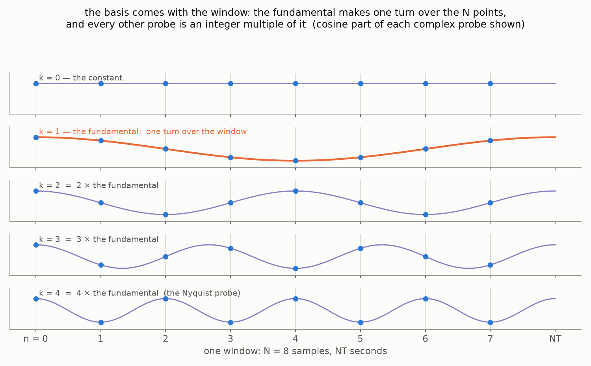
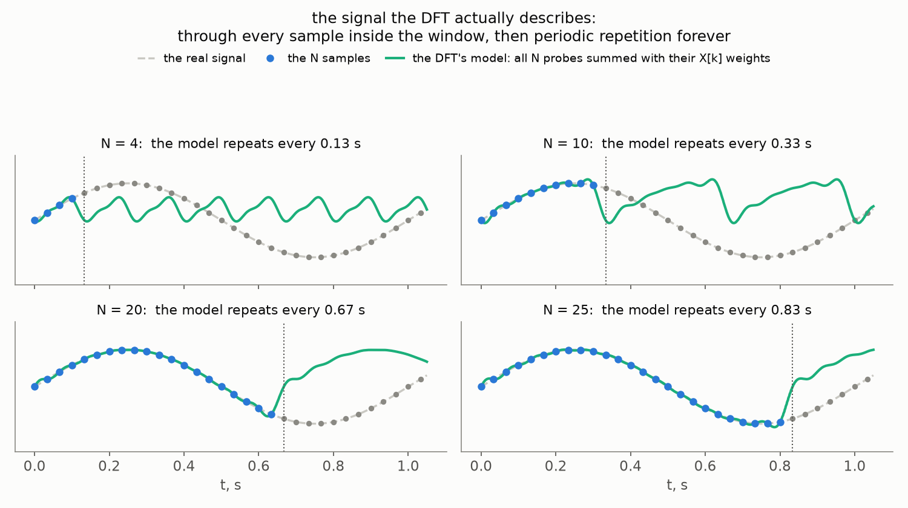
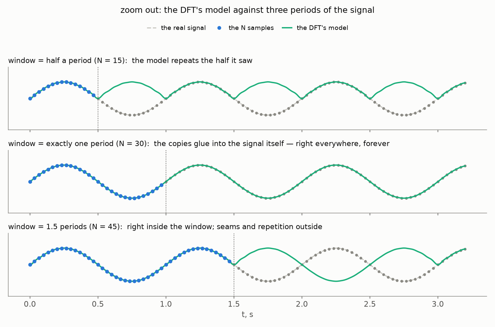
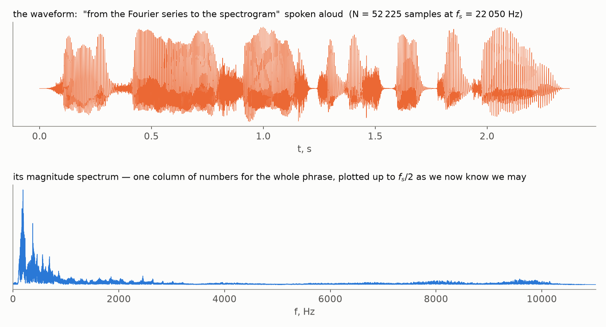

[Part 1](/posts/fourier-series-to-spectrogram-part-1/) ended with the machinery
built. The Discrete Fourier Transform takes the $N$ samples of a recording and
returns $N$ complex numbers:

$$
X[k] = \sum_{n=0}^{N-1} x[n]\, e^{-2 \pi i \frac{k n}{N}}, \qquad k = 0, 1, \dots, N-1.
$$

$N$ numbers in, $N$ numbers out — and every trace of physical time gone: the
formula sees only the two integers $k$ and $n$. That was a feature during the
derivation, but it leaves us unable to answer the simplest practical question.
Remember the hum? Back in Part 1, [arguing that the frequency view is worth
having](/posts/fourier-series-to-spectrogram-part-1/#why-the-waveform-is-not-enough),
we took a recording polluted by the 50 Hz buzz of the power line — hopeless
to fix in the time domain, where the hum is smeared over every sample — and
fixed it in the frequency domain, where the hum is a single column:
transform, erase that column, transform back, and the melody survives while
the buzz is gone. A fine trick — except that now, with the transform
actually in our hands, try to perform it. *Which* column? Which $k$ is
50 Hz? This part is about learning to read the DFT's output: matching
indices to physical frequencies, seeing what the resolution of that matching
costs, and discovering along the way why half of the output is a mirror
image of the other half.

## What does X[k] measure?

Look at the DFT formula through the lens of the inner product from Part 1's
sifting-property proof. There we needed it for *continuous* signals:
multiply pointwise, then integrate — the integral standing in for "add
everything up" over a continuum. For finite lists of samples the same
recipe is simpler still: multiply pointwise and literally add. That is the
ordinary dot product of vectors — the very case the notation was borrowed
from in the first place — plus one refinement for complex signals: the
second factor gets conjugated (that is what the overline over $w_k[n]$
denotes):

$$
X[k] = \sum_{n=0}^{N-1} x[n]\, \overline{w_k[n]} = \langle x, w_k \rangle,
\qquad
w_k[n] = e^{2 \pi i \frac{k n}{N}}.
$$

Each coefficient is the inner product of the signal with one **basis
oscillation** $w_k$ — a number that measures how much the signal *resembles*
that oscillation, exactly like a dot product measures how much one vector
leans along another. As $n$ runs through the $N$ samples, the exponent of
$w_k$ grows to $2 \pi i k$: the basis oscillation makes exactly $k$ full
turns across the recording — Part 1's ["only oscillations that fit a whole
number of times into the
period"](/posts/fourier-series-to-spectrogram-part-1/#the-fourier-series)
rule, wearing its discrete clothes. Here is the whole cast at once, drawn
over one window of $N = 8$ samples:

This picture is worth pausing on, because it shows what *dictates* the
basis: nothing but $N$ itself. Fix the window — $N$ samples, $NT$ seconds —
and the slowest nonzero probe is forced: one full turn over exactly those
samples, frequency $1/(NT)$. The rest of the vocabulary follows
automatically, because every other probe is an integer multiple of that
fundamental — two turns, three turns, up the ladder. Choose the window and
the basis comes with it; the DFT then offers its $N$ probe frequencies —
zero turns, one turn, two turns, … — and reports the signal's resemblance
to each.

(A detail worth a second look: in the picture, the curves run *past* the
last sample, all the way to $t = NT$. That is not sloppiness — the window
genuinely lasts $NT$ seconds: $N$ intervals of $T$ each, with a sample at
the start of every interval. The last sample therefore sits at
$n = N - 1$, while $t = NT$ is where the *next* period would begin — and a
whole-turn probe arrives there exactly as it started. That endpoint
belongs to the copy, not to this window; if we also sampled at $t = NT$,
we would be counting the same point twice.)

These $N$ oscillations deserve a name, because they are more than measuring
sticks: look back at the *inverse* DFT formula from Part 1 — it is
$x[n] = \frac{1}{N} \sum_k X[k]\, w_k[n]$, the signal reassembled as a
weighted sum of these very oscillations. So the set $w_0, \dots, w_{N-1}$
is everything the DFT can *say*: the forward transform measures how much of
each word the signal contains, the inverse composes the signal back out of
the words. We will call this set the DFT's **vocabulary** — $N$ words, and
nothing in between.

Here is what the probes look like in the flesh — the beginning of the
vocabulary, drawn over the same sampled signal for four different recording
lengths:

In every panel the bold orange curve is the $k = 1$ probe — **the lowest
oscillating frequency the basis has**; the fainter curves behind it are
$k = 2$ and $k = 3$, twice and three times faster. One full turn per
recording, *whatever the recording turns out to be* — and that is worth
staring at while $N$ is small. At $N = 4$ even the slowest word in the
vocabulary races through its full turn before the signal has done anything
at all: every probe the DFT owns is far too fast for this signal, and a good
description is simply not on offer. Only as the recording grows does the
vocabulary reach down to where the signal actually lives — by $N = 25$ the
lowest probe finally oscillates at almost the signal's own pace.

And what does the vocabulary *say*, once every word gets its weight? Sum
all $N$ probes with the coefficients the DFT assigns them — that is
exactly the inverse DFT — and draw the sum as a continuous curve. This is
the signal the DFT actually believes in:

Two things to see here. Inside the window, the green model passes through
every blue sample *exactly* — $N$ numbers in, $N$ numbers out, the books
balance as always.

(Why *exactly*, and not merely very closely? That has a beautiful
answer, but it deserves its own stretch of road — and gets one: the
[appendix at the end of the post](#appendix-the-probes-are-a-basis),
for whenever the linear-algebra mood strikes.)

Outside the window, the model does the only thing a sum of
whole-turn oscillations can do: **repeats**, with the window's own period.
The DFT never models your signal as it is — it models a periodic world
assembled from your window, Part 1's glued copies meeting us yet again. At
$N = 4$ that world has almost nothing to do with the real signal; by
$N = 25$ it is a faithful model of the window — and still a pure invention
everywhere else. (This picture was suggested by a friend of the blog —
thank you!)

Zoom out, and the same experiment shows *when the invention comes true*.
Everything depends on how the window relates to the signal's own period:

The middle panel is the special one. When the window holds **exactly one
period** of the signal (or any whole number of them), the glued copies
reproduce the signal — the model is correct not only inside the window but
*everywhere, forever*. That is the DFT at its happiest: the signal's
frequency coincides with one of the probes. In the other two panels the
window holds half a period and one and a half: the model still passes
through every sample it saw, but its periodic continuation has nothing to
do with the real signal — the top one never even goes negative, the bottom
one continues in counter-phase — and at every seam the curve kinks. Those
kinks have a price in the spectrum, and Part 3 charges it under the name
[spectral leakage](/posts/fourier-series-to-spectrogram-part-3/#the-price-of-cutting-spectral-leakage).

Turn the "whole turns" rule around, and it becomes a restriction important
enough to put in bold: **whole numbers of turns are all the DFT has.** Its
basis contains the constant ($k = 0$) and the oscillations that fit a whole
number of times into the recording — nothing else. A tone that completes,
say, two and a half turns over our $N$ samples is simply not in the
vocabulary: no single $X[k]$ is "its" coefficient. Real recordings contain
such tones all the time, of course, and the DFT must express them *somehow*
— smearing them across the whole-turn vocabulary it does have. The
consequences of that smearing (it goes by the name *spectral leakage*) will
matter a great deal when we build the spectrogram in Part 3; for now, keep
in mind that the DFT's world is quantized to whole turns.

> 💡 **The $k = 0$ probe** makes zero turns: $w_0[n] \equiv 1$, and
> $X[0] = \sum_n x[n]$ is just $N$ times the *average* of the signal. Audio
> engineers call it the **DC component** (from "direct current" — the
> electrical origin shows). For sound it is normally near zero: pressure
> oscillates around the atmospheric baseline, and the microphone measures
> only the deviation.

## From the index to hertz

So $X[k]$ measures the content of "$k$ turns per recording". To turn that
into hertz, bring back the physical time that the DFT so pointedly forgot.
The $n$-th sample was taken at $t = nT$, and the whole recording lasts $NT$
seconds — so "$k$ full turns per recording" is the physical frequency

$$
f_k = \frac{k}{NT} = k \frac{f_s}{N},
$$

where $f_s = 1/T$ is the sampling rate. The probe frequencies are not
arbitrary: they form a uniform grid with step

$$
\Delta f = \frac{f_s}{N} = \frac{1}{NT},
$$

called the **frequency resolution** — no probe exists between $f_k$ and
$f_{k+1}$, so the DFT simply cannot distinguish frequencies closer together
than $\Delta f$.

Now, a question worth pausing on. The sampling rate is not really ours to
choose — it is a property of the microphone and the ADC, fixed in hardware.
The one knob we do control is $N$: how many samples we feed the transform.
**What exactly does that knob turn?** Look again at the probe picture in the
previous section — it holds the answer.

The basis rides the *window*, not the clock: more samples at the same rate
means a longer recording, and the one turn of $w_1$ spreads over it. Write
$w_1$ out and walk it back from the index notation to physical time, exactly
the way we did for a general $k$:

$$
w_1[n] = e^{2 \pi i \frac{n}{N}} = e^{2 \pi i \frac{1}{NT} \cdot nT}
$$

— the right-hand form is a sinusoid of physical frequency $\frac{1}{NT}$,
caught at the moments $t = nT$. The $N$ sits in the denominator of the
frequency: lengthen the recording, and the slowest probe slows down with it
— $\Delta f = \frac{1}{NT}$ drops. And since every other probe sits at a
multiple of it, the whole frequency grid tightens:

That is what the knob turns. Look at the second formula for $\Delta f$
again: $NT$ is simply the *duration* of the recording, so

> $\Delta f = \dfrac{1}{\text{duration}}$ — **frequency resolution is one over the listening time.**

To tell two tones one hertz apart, you must listen for at least a second —
only then does the slower tone fall a full turn behind and the difference
become visible. There is no way around this trade, only a choice along it:
this very tension — resolution in frequency versus locality in time — will
return as the central design decision of the spectrogram in Part 3.

A worked example in unforgiving numbers: at $f_s = 8000$ Hz, taking
$N = 100$ samples (an eighth of a second) gives
$\Delta f = 8000 / 100 = 80$ Hz. That grid is too coarse to tell middle C
(262 Hz) from the B just below it (247 Hz): both land in bin $k = 3$. To
separate them you need $\Delta f$ around their 15 Hz gap — that is
$N \approx 530$ samples, a fifteenth of a second. Music transcription from
spectra is possible, but the resolution bill must be paid first. (A caveat
for the careful: $\Delta f$ equal to the gap is the bare *threshold* — at
that margin the two peaks only just stand apart, as the companion notebook
at the end of this post shows; comfortable separation wants a finer grid
still.)

## The spectrum, at last

We can now do properly what Part 1 could only preview: plot the magnitudes
$|X[k]|$ against their physical frequencies $f_k$. This picture is the
**(magnitude) spectrum** of the recording:

A pure sine shows up as a sharp spike at its frequency — **plus a curious
twin at the far end of the axis** (explained below, in [The
mirror](#the-mirror)) — and a mix of three sines as three spikes with the
right heights (and three twins), each component recoverable at a glance. This is the "hundreds
of numbers → three meaningful ones" compression promised at the very start
of Part 1 — delivered.

What about the other half of the complex number? Write $X[k]$ in polar
form — every complex number is a length times a direction:

$$
X[k] = |X[k]|\, e^{i \varphi_k}, \qquad \varphi_k = \arg X[k].
$$

The length $|X[k]|$ is the **magnitude** we have just been plotting; the
angle $\varphi_k$ is the **phase**, and it stores where in its cycle the
$k$-th oscillation starts — Part 1's $\phi_n$, one per harmonic. Much of speech
processing works with magnitudes alone: what a vowel sounds like, which note
was played, whether the hum is there — all of it lives in the magnitudes.
The phase becomes essential the moment you need to rebuild the *waveform* —
shifting every component back to its proper starting point — which is why
speech synthesis and enhancement systems must treat it with care while a
speech recognizer can throw it away.

## The mirror

Look at the spectra again: the single 4 Hz sine lights up its own bin *and*
a twin at 96 Hz, and in the three-sine mix the whole right half of the axis
mirrors the left. This is not an artifact of the example — it is a theorem
about every real-valued signal, and it takes four lines to prove. Compute
the coefficient at index $N - k$ (the overline here and below is **complex
conjugation**, $\overline{a + bi} = a - bi$ — the flip of the imaginary
part's sign):

$$
\begin{aligned}
X[N-k] &= \sum_{n=0}^{N-1} x[n]\, e^{-2 \pi i \frac{(N-k) n}{N}} \\
       &= \sum_{n=0}^{N-1} x[n]\, e^{-2 \pi i n}\, e^{2 \pi i \frac{k n}{N}} \\
       &= \sum_{n=0}^{N-1} x[n]\, e^{2 \pi i \frac{k n}{N}} \\
       &= \overline{\sum_{n=0}^{N-1} x[n]\, e^{-2 \pi i \frac{k n}{N}}} = \overline{X[k]}.
\end{aligned}
$$

One move per line. First, split the exponent: $\frac{N-k}{N} = 1 -
\frac{k}{N}$, so the exponential factors into $e^{-2 \pi i n} \cdot
e^{2 \pi i \frac{k n}{N}}$. Second, $e^{-2 \pi i n} = 1$ because $n$ is an
integer — the same "signal lives on a grid" card we played to prove
$c_{k+N} = c_k$ in Part 1. Third, recognize a conjugate: flipping the sign
of the exponent conjugates each exponential, and the samples $x[n]$ are
*real* — conjugation passes through them untouched — so the conjugation
bar slides over the entire sum, and the sum under the bar is exactly the
DFT formula for $X[k]$.

The second half of the spectrum is therefore the complex conjugate of the
first, read backwards — and conjugation does not change magnitudes:
$|X[N-k]| = |X[k]|$. Every spike below the middle has a twin above it, and
the magnitude spectrum of any real signal is symmetric about $k = N/2$.

We have met this mirror before. Part 1's exponential form split every real
oscillation into a forward- and a backward-rotating exponential, with
$c_{-n} = \overline{c_n}$ — and we promised the symmetry would resurface in
the DFT. Here it is: by the periodicity $c_{k+N} = c_k$ that we proved when
deriving the DFT, the coefficient $c_{-k}$ *is* $c_{N-k}$. The upper half of
the DFT output is precisely the negative-frequency half of the spectrum,
wrapped around by periodicity into the range $k = N/2, \dots, N-1$. The twin
spike at "96 Hz" is really the spike at $-4$ Hz, filed under an alias.

> 💡 **Do the books still balance?** If half of the output mirrors the other
> half, doesn't the DFT return only $N/2$ numbers' worth of information for
> $N$ numbers of input? Count the *real* degrees of freedom (say $N$ is
> even). $X[0]$ is a sum of real samples — real, one number. $X[N/2]$ pairs
> with itself in the mirror ($N - N/2 = N/2$), forcing
> $X[N/2] = \overline{X[N/2]}$ — real, one number. The remaining $N - 2$
> coefficients come in conjugate pairs, each pair carrying one independent
> complex number — two real ones. Total: $1 + 1 + \frac{N-2}{2} \cdot 2 = N$
> real numbers. Exactly the information content of $N$ real samples — the
> books balance to the cent, as they must for an invertible transform.

## The Nyquist frequency

The mirror axis itself deserves a name. The probe at the fold, $k = N/2$,
is the oscillation

$$
w_{N/2}[n] = e^{2 \pi i \frac{(N/2) n}{N}} = e^{\pi i n} = (-1)^n
$$

— the sequence $+1, -1, +1, -1, \dots$, flipping sign at every single
sample. No oscillation representable on the grid can flip faster: there is
nothing between the samples to flip *in*. Its physical frequency comes from
the bin-to-hertz formula $f_k = k \frac{f_s}{N}$ of the resolution section,
with $k = N/2$ plugged in:

$$
f_{N/2} = \frac{N}{2} \cdot \frac{f_s}{N} = \frac{f_s}{2},
$$

is the **Nyquist frequency** — the ceiling of what a given sampling rate can
represent, sitting always at exactly half of it. Draw this axis onto the
spectra from earlier, and the symmetry becomes something you can fold with
your eyes:

Everything above the ceiling and below $f_s$ is the mirror land we mapped in
the previous section — present in the numbers, but carrying nothing new for
a real signal. So here is the full geography of the DFT's frequency axis on
one picture:

The genuinely informative range runs from $0$ to $f_s/2$ — which finally
explains a number from Part 1: CD audio samples at 44.1 kHz because its
ceiling must clear the ~20 kHz limit of human hearing, with a little
engineering margin on top.

In fact, the ceiling is the visible edge of one of the most celebrated
results in all of signal processing — and we finally know enough to *state*
it properly:

> **[The sampling theorem](https://en.wikipedia.org/wiki/Nyquist%E2%80%93Shannon_sampling_theorem)**
> (Kotelnikov, 1933; independently Shannon, 1949; the frequency bears
> Nyquist's name — this theorem was discovered by everyone). *A continuous signal containing no frequencies higher than $f$
> Hz is **completely determined** by its samples taken $f_s = 2f$ times per
> second.*

Read the claim slowly, because it is startling. Between two neighboring
samples, a continuous signal could seemingly wiggle any way it pleases —
and the theorem says a band-limited one *cannot*: the samples pin down the
entire continuous curve, exactly, nothing lost. This is the license behind
everything we have done since Part 1 — the reason a list of numbers can
honestly stand in for a sound wave, provided the wave had nothing above
$f_s/2$ to begin with.

And if it did? The ceiling is a statement about what the *grid* can
represent — but the analog world does not consult our grid. Frequencies
above $f_s/2$ do not politely disappear at sampling; they fold back into
the visible range under false names — **aliasing**, the theorem's dark
twin. The proof of the theorem, the folded world of aliasing, and even the
fine print hiding in the statement above (sticklers: a sinusoid at exactly
$f$ needs care) are a story for later in this Fourier journey — the
theorem with three names (Kotelnikov, Shannon, Nyquist) will get a post of
its own, and by then the
machinery we keep building will have turned its proof into a single
picture. Consider it teased.

## Onward

We can now read a spectrum: find any frequency's bin, trust the left half,
ignore the mirror, and budget the resolution by the length of the recording.
So let us read a *real* one. Here is a phrase of live speech — the title of
this series, spoken aloud — and the magnitude spectrum of the entire
recording:

Notice the asymmetry in what the two pictures know. In the waveform you can
practically *count the words* — bursts of energy separated by silences —
but no frequencies are visible. The spectrum knows all the frequencies: the
tall peaks on the left are the voice and its harmonics. But it is *one*
column of numbers for the whole phrase — every phoneme's frequencies
stacked into the same bins, and *when* is gone entirely. A chord is a fine
thing to summarize with one spectrum; a sentence is not: "which frequencies
appear" is not the same as "which frequencies appear *when*". In
**[Part 3](/posts/fourier-series-to-spectrogram-part-3/)**
we make the Fourier view local — slide a window along the recording, pay
the resolution bill we just learned about at every stop, and stack the
results into the picture this series is named after: the spectrogram.

> Every computation of this part can be rerun and poked at: a [ready-made
> notebook](https://github.com/jen1995/jen1995.github.io/blob/main/notebooks/reading_the_dft.ipynb)
> lives in this blog's repository and [opens in
> Colab](https://colab.research.google.com/github/jen1995/jen1995.github.io/blob/main/notebooks/reading_the_dft.ipynb)
> in one click. It also covers the corner cases the post glossed over: the
> sine that vanishes at exactly the Nyquist frequency, what happens to the
> Nyquist *bin* when $N$ is odd, and the factor-of-2 bookkeeping of
> one-sided amplitude spectra (the same machinery scipy applies inside its
> one-sided routines).

## Appendix: the probes are a basis

Back in [What does X[k] measure?](#what-does-xk-measure), the green
model hit every sample dead on — and that was promised to be no
accident. This interlude pays the debt — a stretch of honest
linear algebra, ending with a reunion with an old classic.

First, write the model down. As a function of continuous time, the $k$-th
probe is $e^{2 \pi i \frac{k}{NT} t}$ — the $k$-th grid frequency — so the
weighted sum drawn in green is

$$
\tilde{x}(t) = \frac{1}{N} \sum_{k=0}^{N-1} X[k]\, e^{2 \pi i \frac{k}{NT} t}.
$$

Now put a sample instant $t = nT$ into it. The $T$ cancels in the
exponent, and

$$
\tilde{x}(nT) = \frac{1}{N} \sum_{k=0}^{N-1} X[k]\, e^{2 \pi i \frac{k n}{N}} = x[n]
$$

— the right-hand side is *literally* the inverse DFT formula from Part 1,
and its output is the original samples. So at the grid instants the model
has no freedom at all: it is contractually obliged to return $x[n]$.

That pushes the question one step deeper: why does the *inverse formula*
reproduce the samples exactly? To see it, switch to vector language — and
start slow. The inverse DFT is one equation *per sample* — write them all
out, one under another:

$$
\begin{aligned}
x[0] &= \tfrac{X[0]}{N}\, w_0[0] + \tfrac{X[1]}{N}\, w_1[0] + \dots + \tfrac{X[N-1]}{N}\, w_{N-1}[0] \\
x[1] &= \tfrac{X[0]}{N}\, w_0[1] + \tfrac{X[1]}{N}\, w_1[1] + \dots + \tfrac{X[N-1]}{N}\, w_{N-1}[1] \\
&\;\;\vdots \\
x[N-1] &= \tfrac{X[0]}{N}\, w_0[N-1] + \dots + \tfrac{X[N-1]}{N}\, w_{N-1}[N-1].
\end{aligned}
$$

Now read this system by *columns* instead of rows. Every column carries
one and the same scalar $\tfrac{X[k]}{N}$ — and the stack of numbers it
multiplies, $w_k[0], w_k[1], \dots, w_k[N-1]$, is the $k$-th probe written
out top to bottom. So the $N$ equations are really one equation between
columns:

$$
\begin{pmatrix} x[0] \\ x[1] \\ \vdots \\ x[N-1] \end{pmatrix}
= \frac{X[0]}{N} \begin{pmatrix} w_0[0] \\ w_0[1] \\ \vdots \\ w_0[N-1] \end{pmatrix} +
\dots +
\frac{X[N-1]}{N} \begin{pmatrix} w_{N-1}[0] \\ w_{N-1}[1] \\ \vdots \\ w_{N-1}[N-1] \end{pmatrix}.
$$

Name the columns — $\mathbf{x}$ on the left, $\mathbf{w}_k$ for the $k$-th
one on the right — and the whole system collapses into one line, with the
forward transform alongside it. The second formula is nothing new: it is
the inner-product form of the DFT from [the very first
section](#what-does-xk-measure), now wearing vector notation:

$$
\mathbf{x} = \sum_{k=0}^{N-1} \frac{X[k]}{N}\, \mathbf{w}_k,
\qquad
X[k] = \langle \mathbf{x}, \mathbf{w}_k \rangle
$$

So the claim to be proved now reads: measure the resemblances
$X[k] = \langle \mathbf{x}, \mathbf{w}_k \rangle$, use them as weights —
and the weighted probes reassemble $\mathbf{x}$ itself. One property of
the probes does all the work here: as vectors, they are **orthogonal** to
one another. Compute their inner product:

$$
\langle w_j, w_k \rangle = \sum_{n=0}^{N-1} e^{2 \pi i \frac{(j - k) n}{N}}.
$$

For $j = k$ every term is $1$ and the sum is $N$. For two *different*
probes it is a geometric series with ratio $q = e^{2 \pi i (j-k)/N}$ — a
ratio that is not $1$ itself, yet satisfies $q^N = 1$ — so the sum,
$\frac{q^N - 1}{q - 1}$, is exactly zero.

That settles everything. Orthogonal vectors are linearly independent, so
the $N$ probes form a genuine **basis** of the $N$-dimensional space of
sample lists — the word we have been using all along, now earned — and
every $\mathbf{x}$ is a weighted sum of probes in exactly one way. And
for an *orthogonal* basis, the weights are given by the textbook formula:
the inner product with the basis vector, divided by that vector's squared
length. That is precisely our pair of formulas — with squared length
$\langle \mathbf{w}_k, \mathbf{w}_k \rangle = N$, which is where the
$\frac{1}{N}$ of the inverse DFT has been hiding all along. (Part 1's
convention inset told you where that factor is *put*; this is why it
*exists*. And one step further, for the matrix-minded: stack the probes
as the columns of an $N \times N$ matrix $W$; orthogonality reads
$W^{*} W = N I$, so $W / \sqrt{N}$ is unitary — the DFT is, up to scale,
a rotation of $\mathbb{C}^N$.)

### One more name for the same matrix

Look at the entries of $W$ once more: $(W)_{nk} = w_k[n] = \omega^{nk}$
with $\omega = e^{2 \pi i / N}$, so the $n$-th row is
$1, \omega^n, \omega^{2n}, \dots$ — the successive powers of a single
number. A matrix whose rows are geometric progressions of their own
"nodes", $V_{jk} = z_j^{\,k}$, has a classical name: the
**[Vandermonde matrix](https://en.wikipedia.org/wiki/Vandermonde_matrix)**.
Written out in full, with one node per row:

$$
V = \begin{pmatrix}
1 & z_0 & z_0^2 & \cdots & z_0^{N-1} \\
1 & z_1 & z_1^2 & \cdots & z_1^{N-1} \\
\vdots & \vdots & \vdots & & \vdots \\
1 & z_{N-1} & z_{N-1}^2 & \cdots & z_{N-1}^{N-1}
\end{pmatrix}.
$$

It is the matrix of *[polynomial
interpolation](https://en.wikipedia.org/wiki/Polynomial_interpolation)* —
solving
$V \mathbf{c} = \mathbf{y}$ means finding a polynomial with coefficients
$c_k$ that passes through the points $(z_j, y_j)$ — and its famous
determinant,

$$
\det V = \prod_{0 \,\le\, i \,\lt\, j \,\le\, N-1} (z_j - z_i),
$$

says it is invertible exactly when all the nodes are distinct.

The DFT matrix, then, is *the* Vandermonde matrix with its nodes placed at
the $N$-th roots of unity, $z_j = \omega^j$ — watch the rows fill in with
powers of $\omega$:

$$
W = \begin{pmatrix}
1 & 1 & 1 & \cdots & 1 \\
1 & \omega & \omega^2 & \cdots & \omega^{N-1} \\
1 & \omega^2 & \omega^4 & \cdots & \omega^{2(N-1)} \\
\vdots & \vdots & \vdots & & \vdots \\
1 & \omega^{N-1} & \omega^{2(N-1)} & \cdots & \omega^{(N-1)^2}
\end{pmatrix}.
$$

Nodes as distinct, and as symmetric, as $N$ points can be — and that
special placement is what upgrades "invertible" to "unitary up to scale". Two consequences are worth savoring.

First, our sample-hitting model turns out to be a *polynomial
interpolation* problem, posed the most natural way. Here are $N$ points to
pass through: at the node $\omega^n$ — one root of unity per sample
instant — hang the height $x[n]$. Now look for the degree-$(N-1)$
polynomial $q(z) = c_0 + c_1 z + \dots + c_{N-1} z^{N-1}$ that passes
through all of them:

$$
q(\omega^n) = \sum_{k=0}^{N-1} c_k\, \omega^{k n} = x[n],
\qquad n = 0, \dots, N-1.
$$

Stare at this system of $N$ conditions: the matrix multiplying the unknown
coefficients has entries $\omega^{nk}$ — it is *exactly* our $W$. Finding
the polynomial through the samples means solving
$W \mathbf{c} = \mathbf{x}$. And we have already solved it: compare the
condition above with the inverse DFT,
$x[n] = \tfrac{1}{N} \sum_k X[k]\, \omega^{k n}$, and the coefficients can
be read off directly:

$$
c_k = \frac{X[k]}{N}.
$$

To interpolate through the samples, run a forward DFT — that is the entire
algorithm. (Interpolation normally costs solving a linear system; the
roots-of-unity nodes are so symmetric that the solution is one transform.)

And the interpolating polynomial is an old friend. Substitute
$z = e^{2 \pi i t / (NT)}$: as $t$ runs through the window, $z$ walks once
around the unit circle, visiting the node $\omega^n$ exactly at the sample
instant $t = nT$ — and $q(z)$ turns into $\tilde{x}(t)$, the green model
from the pictures. The curve that hit every sample *was* this
interpolating polynomial all along, traced along the circle. (The
dictionary also reads backwards: treat the samples as the *coefficients*
of a polynomial, and the forward DFT computes that polynomial's *values*
at the nodes — evaluation in one direction, interpolation in the other.)

Second, this coefficients-to-values dictionary, cheap in both directions,
is exactly how the FFT multiplies polynomials fast — convert both factors
to their values at the roots of unity, multiply the values pointwise,
convert the product back to coefficients — the trick at the heart of
big-integer arithmetic.
