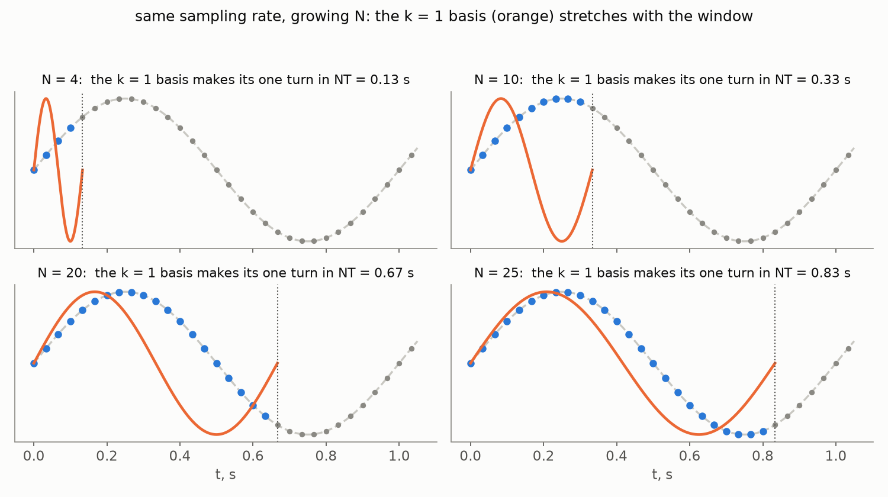
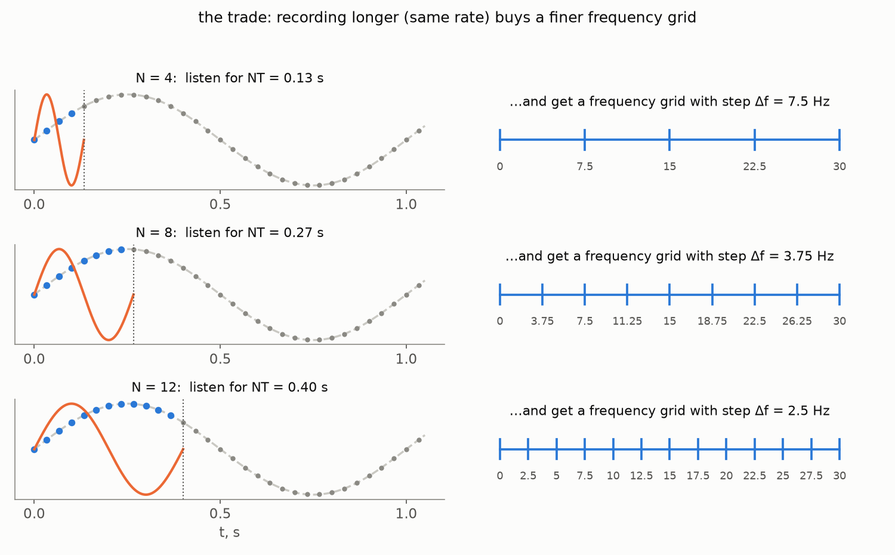
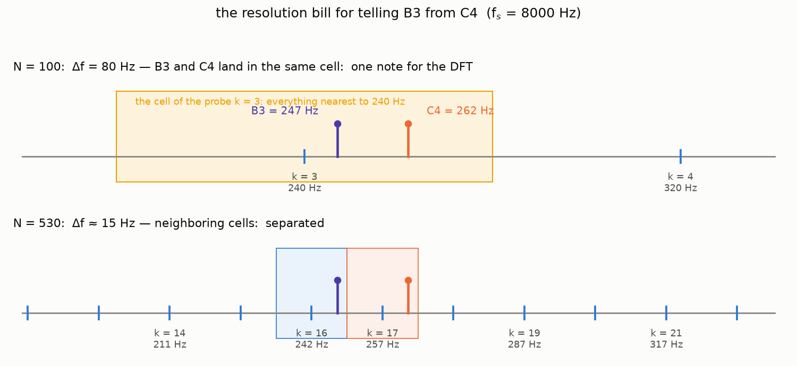
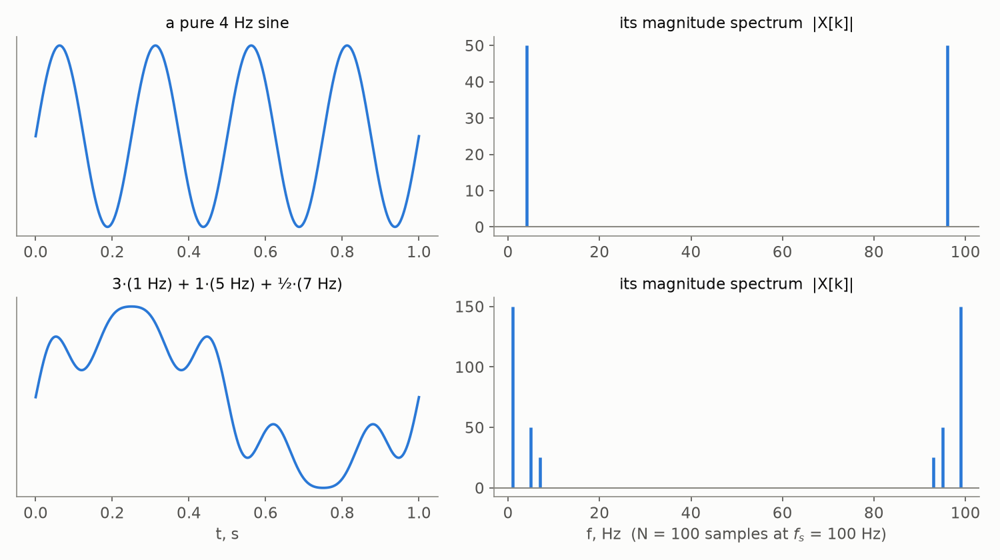
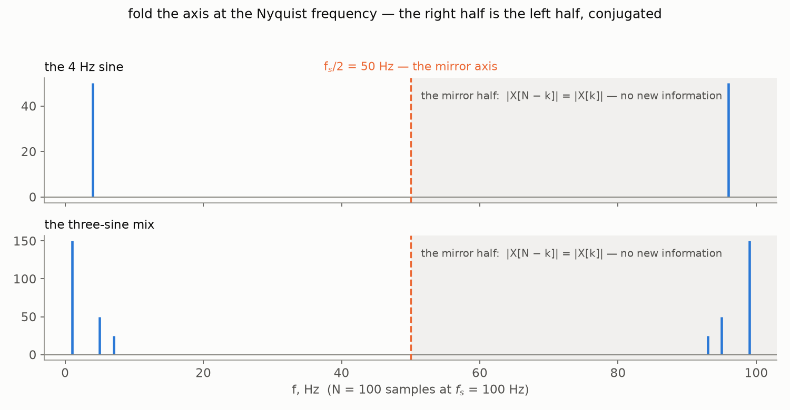
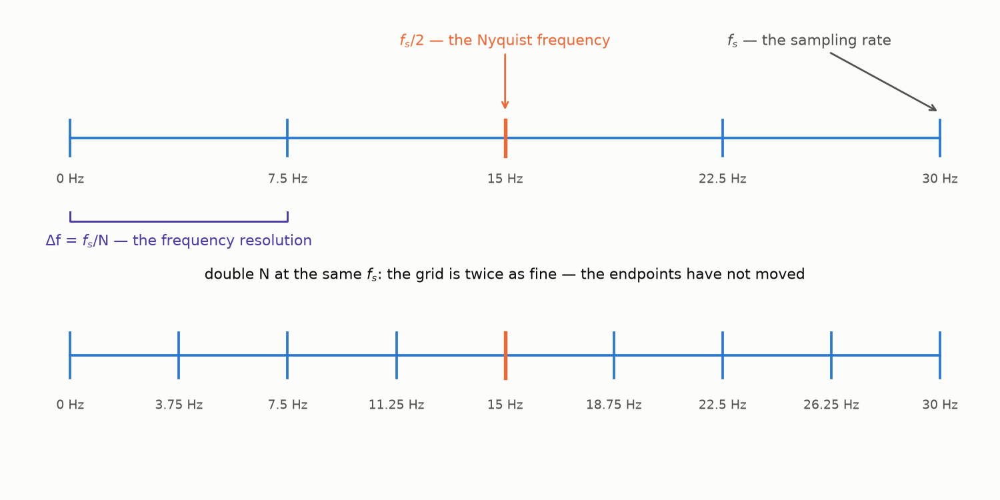

[Part 1](/posts/fourier-series-to-spectrogram-part-1/) ended with the machinery
built. The Discrete Fourier Transform takes the $N$ samples of a recording and
returns $N$ complex numbers:

$$
X[k] = \sum_{n=0}^{N-1} x[n]\, e^{-2 \pi i \frac{k n}{N}}, \qquad k = 0, 1, \dots, N-1.
$$

$N$ numbers in, $N$ numbers out — and every trace of physical time gone: the
formula sees only the two integers $k$ and $n$. That was a feature during the
derivation, but it leaves us unable to answer the simplest practical question.
Remember the hum? Back in Part 1, [arguing that the frequency view is worth
having](/posts/fourier-series-to-spectrogram-part-1/#why-the-waveform-is-not-enough),
we took a recording polluted by the 50 Hz buzz of the power line — hopeless
to fix in the time domain, where the hum is smeared over every sample — and
fixed it in the frequency domain, where the hum is a single column:
transform, erase that column, transform back, and the melody survives while
the buzz is gone. A fine trick — except that now, with the transform
actually in our hands, try to perform it. *Which* column? Which $k$ is
50 Hz? This part is about learning to read the DFT's output: matching
indices to physical frequencies, seeing what the resolution of that matching
costs, and discovering along the way why half of the output is a mirror
image of the other half.

## What does X[k] measure?

Look at the DFT formula through the lens of the inner product we introduced
while proving the sifting property in Part 1: multiply two signals pointwise,
sum up — with the sum over a continuum becoming an integral, and, for complex
signals, the second factor conjugated (that is what the overline over
$w_k[n]$ below denotes). The DFT sum is *exactly* that, in the
finite-dimensional case the notation came from:

$$
X[k] = \sum_{n=0}^{N-1} x[n]\, \overline{w_k[n]} = \langle x, w_k \rangle,
\qquad
w_k[n] = e^{2 \pi i \frac{k n}{N}}.
$$

Each coefficient is the inner product of the signal with one **basis
oscillation** $w_k$ — a number that measures how much the signal *resembles*
that oscillation, exactly like a dot product measures how much one vector
leans along another. As $n$ runs through the $N$ samples, the exponent of
$w_k$ grows to $2 \pi i k$: the basis oscillation makes exactly $k$ full
turns across the recording. This is Part 1's "whole number of oscillations
per period" rule wearing its discrete clothes: the DFT offers us $N$ probe
frequencies — zero turns, one turn, two turns, … — and reports the signal's
resemblance to each.

These $N$ oscillations deserve a name, because they are more than measuring
sticks: look back at the *inverse* DFT formula from Part 1 — it is
$x[n] = \frac{1}{N} \sum_k X[k]\, w_k[n]$, the signal reassembled as a
weighted sum of these very oscillations. So the set $w_0, \dots, w_{N-1}$
is everything the DFT can *say*: the forward transform measures how much of
each word the signal contains, the inverse composes the signal back out of
the words. We will call this set the DFT's **vocabulary** — $N$ words, and
nothing in between.

Here is what the probes look like in the flesh — the beginning of the
vocabulary, drawn over the same sampled signal for four different recording
lengths:

In every panel the bold orange curve is the $k = 1$ probe — **the lowest
oscillating frequency the basis has**; the fainter curves behind it are
$k = 2$ and $k = 3$, twice and three times faster. One full turn per
recording, *whatever the recording turns out to be* — and that is worth
staring at while $N$ is small. At $N = 4$ even the slowest word in the
vocabulary races through its full turn before the signal has done anything
at all: every probe the DFT owns is far too fast for this signal, and a good
description is simply not on offer. Only as the recording grows does the
vocabulary reach down to where the signal actually lives — by $N = 25$ the
lowest probe finally oscillates at almost the signal's own pace.

Turn the "whole turns" rule around, and it becomes a restriction important
enough to put in bold: **whole numbers of turns are all the DFT has.** Its
basis contains the constant ($k = 0$) and the oscillations that fit a whole
number of times into the recording — nothing else. A tone that completes,
say, two and a half turns over our $N$ samples is simply not in the
vocabulary: no single $X[k]$ is "its" coefficient. Real recordings contain
such tones all the time, of course, and the DFT must express them *somehow*
— smearing them across the whole-turn vocabulary it does have. The
consequences of that smearing (it goes by the name *spectral leakage*) will
matter a great deal when we build the spectrogram in Part 3; for now, keep
in mind that the DFT's world is quantized to whole turns.

> 💡 **The $k = 0$ probe** makes zero turns: $w_0[n] \equiv 1$, and
> $X[0] = \sum_n x[n]$ is just $N$ times the *average* of the signal. Audio
> engineers call it the **DC component** (from "direct current" — the
> electrical origin shows). For sound it is normally near zero: pressure
> oscillates around the atmospheric baseline, and the microphone measures
> only the deviation.

(For a lovely interactive treatment of these facts, see [chapter 5 of Brian
McFee's *Digital Signals Theory*](https://brianmcfee.net/dstbook-site/content/ch05-fourier/DFT.html).)

## From the index to hertz

So $X[k]$ measures the content of "$k$ turns per recording". To turn that
into hertz, bring back the physical time that the DFT so pointedly forgot.
The $n$-th sample was taken at $t = nT$, and the whole recording lasts $NT$
seconds — so "$k$ full turns per recording" is the physical frequency

$$
f_k = \frac{k}{NT} = k \frac{f_s}{N},
$$

where $f_s = 1/T$ is the sampling rate. The probe frequencies are not
arbitrary: they form a uniform grid with step

$$
\Delta f = \frac{f_s}{N} = \frac{1}{NT},
$$

called the **frequency resolution** — no probe exists between $f_k$ and
$f_{k+1}$, so the DFT simply cannot distinguish frequencies closer together
than $\Delta f$.

Now, a question worth pausing on. The sampling rate is not really ours to
choose — it is a property of the microphone and the ADC, fixed in hardware.
The one knob we do control is $N$: how many samples we feed the transform.
**What exactly does that knob turn?** Look again at the probe picture in the
previous section — it holds the answer.

The basis rides the *window*, not the clock: more samples at the same rate
means a longer recording, and the one turn of $w_1$ spreads over it. Write
$w_1$ out and walk it back from the index notation to physical time, exactly
the way we did for a general $k$:

$$
w_1[n] = e^{2 \pi i \frac{n}{N}} = e^{2 \pi i \frac{1}{NT} \cdot nT}
$$

— the right-hand form is a sinusoid of physical frequency $\frac{1}{NT}$,
caught at the moments $t = nT$. The $N$ sits in the denominator of the
frequency: lengthen the recording, and the slowest probe slows down with it
— $\Delta f = \frac{1}{NT}$ drops. And since every other probe sits at a
multiple of it, the whole frequency grid tightens:

That is what the knob turns. Look at the second formula for $\Delta f$
again: $NT$ is simply the *duration* of the recording, so

> $\Delta f = \dfrac{1}{\text{duration}}$ — **frequency resolution is one over the listening time.**

To tell two tones one hertz apart, you must listen for at least a second —
only then does the slower tone fall a full turn behind and the difference
become visible. There is no way around this trade, only a choice along it:
this very tension — resolution in frequency versus locality in time — will
return as the central design decision of the spectrogram in Part 3.

A worked example in unforgiving numbers: at $f_s = 8000$ Hz, taking
$N = 100$ samples (an eighth of a second) gives
$\Delta f = 8000 / 100 = 80$ Hz. That grid is too coarse to tell middle C
(262 Hz) from the B just below it (247 Hz): both land in bin $k = 3$. To
separate them you need $\Delta f$ around their 15 Hz gap — that is
$N \approx 530$ samples, a fifteenth of a second. Music transcription from
spectra is possible, but the resolution bill must be paid first.

## The spectrum, at last

We can now do properly what Part 1 could only preview: plot the magnitudes
$|X[k]|$ against their physical frequencies $f_k$. This picture is the
**(magnitude) spectrum** of the recording:

A pure sine shows up as a sharp spike at its frequency — **plus a curious
twin at the far end of the axis** (explained below, in [The
mirror](#the-mirror)) — and a mix of three sines as three spikes with the
right heights (and three twins), each component recoverable at a glance. This is the "hundreds
of numbers → three meaningful ones" compression promised at the very start
of Part 1 — delivered.

What about the other half of the complex number? Write $X[k]$ in polar
form — every complex number is a length times a direction:

$$
X[k] = |X[k]|\, e^{i \varphi_k}, \qquad \varphi_k = \arg X[k].
$$

The length $|X[k]|$ is the **magnitude** we have just been plotting; the
angle $\varphi_k$ is the **phase**, and it stores where in its cycle the
$k$-th oscillation starts — Part 1's $\phi_n$, one per harmonic. Much of speech
processing works with magnitudes alone: what a vowel sounds like, which note
was played, whether the hum is there — all of it lives in the magnitudes.
The phase becomes essential the moment you need to rebuild the *waveform* —
shifting every component back to its proper starting point — which is why
speech synthesis and enhancement systems must treat it with care while a
speech recognizer can throw it away.

## The mirror

Look at the spectra again: the single 4 Hz sine lights up its own bin *and*
a twin at 96 Hz, and in the three-sine mix the whole right half of the axis
mirrors the left. This is not an artifact of the example — it is a theorem
about every real-valued signal, and it takes four lines to prove. Compute
the coefficient at index $N - k$ (the overline here and below is **complex
conjugation**, $\overline{a + bi} = a - bi$ — the flip of the imaginary
part's sign):

$$
\begin{aligned}
X[N-k] &= \sum_{n=0}^{N-1} x[n]\, e^{-2 \pi i \frac{(N-k) n}{N}} \\
       &= \sum_{n=0}^{N-1} x[n]\, e^{-2 \pi i n}\, e^{2 \pi i \frac{k n}{N}} \\
       &= \sum_{n=0}^{N-1} x[n]\, e^{2 \pi i \frac{k n}{N}} \\
       &= \overline{\sum_{n=0}^{N-1} x[n]\, e^{-2 \pi i \frac{k n}{N}}} = \overline{X[k]}.
\end{aligned}
$$

One move per line. First, split the exponent: $\frac{N-k}{N} = 1 -
\frac{k}{N}$, so the exponential factors into $e^{-2 \pi i n} \cdot
e^{2 \pi i \frac{k n}{N}}$. Second, $e^{-2 \pi i n} = 1$ because $n$ is an
integer — the same "signal lives on a grid" card we played to prove
$c_{k+N} = c_k$ in Part 1. Third, recognize a conjugate: flipping the sign
of the exponent conjugates each exponential, and the samples $x[n]$ are
*real* — conjugation passes through them untouched — so the conjugation
bar slides over the entire sum, and the sum under the bar is exactly the
DFT formula for $X[k]$.

The second half of the spectrum is therefore the complex conjugate of the
first, read backwards — and conjugation does not change magnitudes:
$|X[N-k]| = |X[k]|$. Every spike below the middle has a twin above it, and
the magnitude spectrum of any real signal is symmetric about $k = N/2$.

We have met this mirror before. Part 1's exponential form split every real
oscillation into a forward- and a backward-rotating exponential, with
$c_{-n} = \overline{c_n}$ — and we promised the symmetry would resurface in
the DFT. Here it is: by the periodicity $c_{k+N} = c_k$ that we proved when
deriving the DFT, the coefficient $c_{-k}$ *is* $c_{N-k}$. The upper half of
the DFT output is precisely the negative-frequency half of the spectrum,
wrapped around by periodicity into the range $k = N/2, \dots, N-1$. The twin
spike at "96 Hz" is really the spike at $-4$ Hz, filed under an alias.

> 💡 **Do the books still balance?** If half of the output mirrors the other
> half, doesn't the DFT return only $N/2$ numbers' worth of information for
> $N$ numbers of input? Count the *real* degrees of freedom (say $N$ is
> even). $X[0]$ is a sum of real samples — real, one number. $X[N/2]$ pairs
> with itself in the mirror ($N - N/2 = N/2$), forcing
> $X[N/2] = \overline{X[N/2]}$ — real, one number. The remaining $N - 2$
> coefficients come in conjugate pairs, each pair carrying one independent
> complex number — two real ones. Total: $1 + 1 + \frac{N-2}{2} \cdot 2 = N$
> real numbers. Exactly the information content of $N$ real samples — the
> books balance to the cent, as they must for an invertible transform.

## The Nyquist frequency

The mirror axis itself deserves a name. The probe at the fold, $k = N/2$,
is the oscillation

$$
w_{N/2}[n] = e^{2 \pi i \frac{(N/2) n}{N}} = e^{\pi i n} = (-1)^n
$$

— the sequence $+1, -1, +1, -1, \dots$, flipping sign at every single
sample. No oscillation representable on the grid can flip faster: there is
nothing between the samples to flip *in*. Its physical frequency comes from
the bin-to-hertz formula $f_k = k \frac{f_s}{N}$ of the resolution section,
with $k = N/2$ plugged in:

$$
f_{N/2} = \frac{N}{2} \cdot \frac{f_s}{N} = \frac{f_s}{2},
$$

is the **Nyquist frequency** — the ceiling of what a given sampling rate can
represent, sitting always at exactly half of it. Draw this axis onto the
spectra from earlier, and the symmetry becomes something you can fold with
your eyes:

Everything above the ceiling and below $f_s$ is the mirror land we mapped in
the previous section — present in the numbers, but carrying nothing new for
a real signal. So here is the full geography of the DFT's frequency axis on
one picture:

The genuinely informative range runs from $0$ to $f_s/2$ — which finally
explains a number from Part 1: CD audio samples at 44.1 kHz because its
ceiling must clear the ~20 kHz limit of human hearing, with a little
engineering margin on top.

One question this part leaves deliberately open: the ceiling is a statement
about what the *grid* can represent — but the analog world does not consult
our grid. What happens if the sound contained frequencies above $f_s/2$
*before* sampling? They do not politely disappear; they fold back into the
visible range under false names. That story — **aliasing**, and the theorem
with three names that tells you exactly when you are safe from it — deserves
a post of its own.

## Onward

We can now read a spectrum: find any frequency's bin, trust the left half,
ignore the mirror, and budget the resolution by the length of the recording.
But notice what the DFT gives us: *one* spectrum for the *entire* signal.
A chord is a fine thing to summarize with one spectrum — a melody is not:
"which notes appear" is not the same as "which notes appear *when*". In
**Part 3** we make the Fourier view local — slide a window along the
recording, pay the resolution bill we just learned about at every stop, and
stack the results into the picture this series is named after: the
spectrogram.
