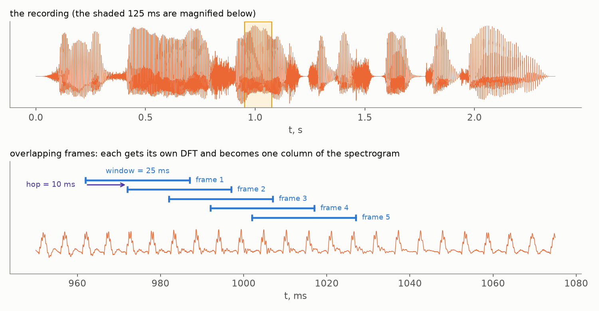
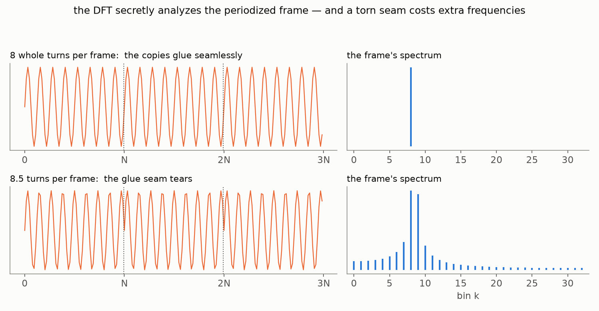
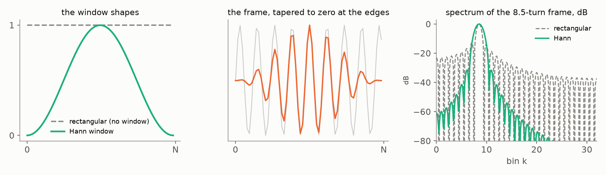
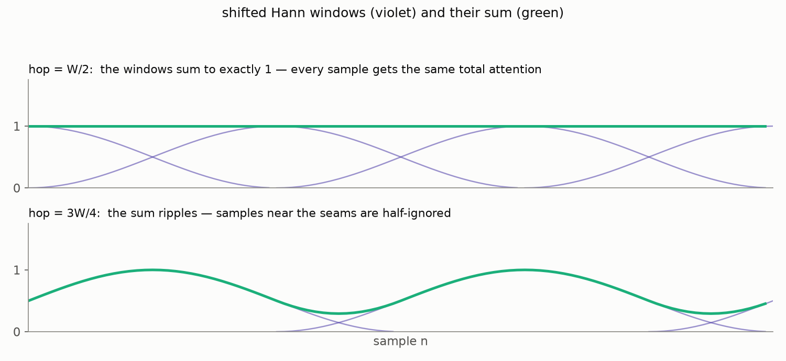
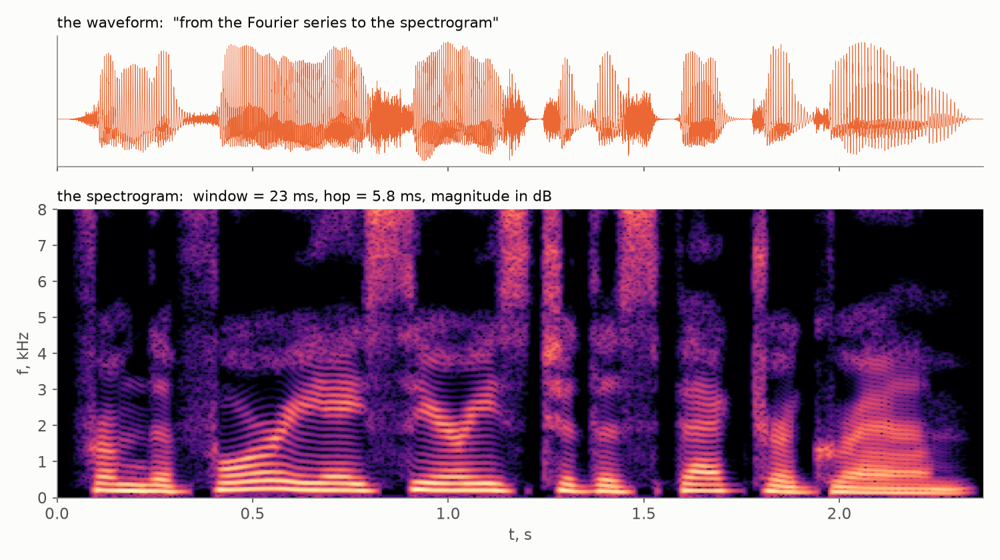
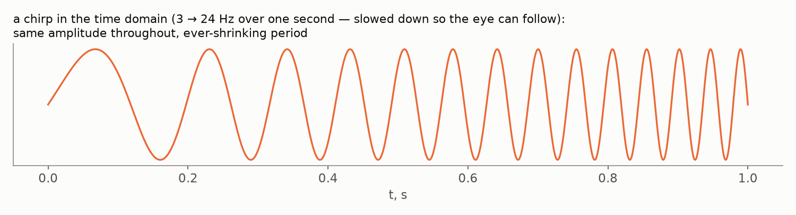
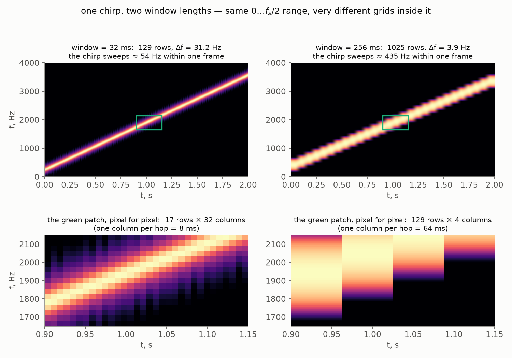
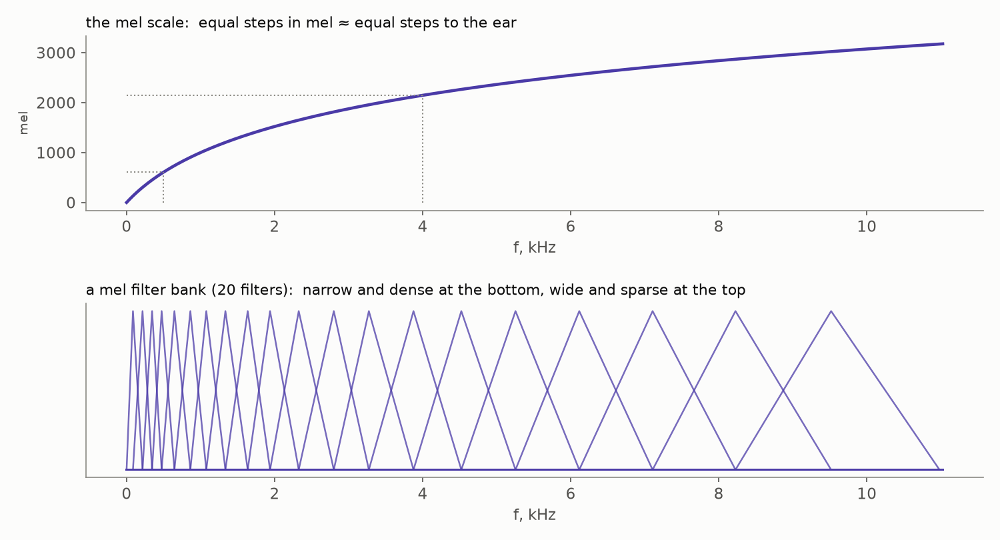
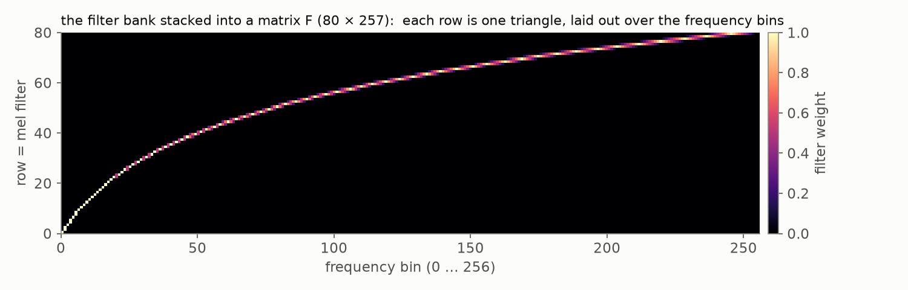
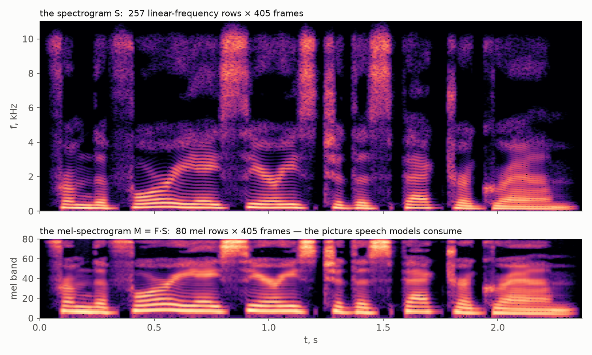

[Part 2](/posts/fourier-series-to-spectrogram-part-2/) ended on an
asymmetry. The waveform of a spoken phrase knows *when* — you can count the
words in it — but no frequencies. Its spectrum knows *what* — every
frequency of every phoneme — but stacked into one column of numbers with no
notion of time. A chord survives such a summary; a sentence does not. Speech
is **non-stationary**: its spectrum changes many times per second, and the
whole point of listening is to follow the changes.

This closing part builds the tool that keeps both answers at once. The plan
writes itself: if one spectrum for the whole recording is too coarse, take
*many* — cut the signal into short pieces and transform each piece
separately. Everything else in this post is the honest accounting for that
one idea: what the cutting costs (spectral leakage), how to soften the blow
(windows), what the assembled picture is (the spectrogram), which trade-off
it can never escape (time versus frequency), and one final compression pass
borrowed from your own ear (the mel scale).

## Cut the signal into frames

Slide a short **window** along the recording and take the DFT of each
position separately. Each windowed stretch is called an **(acoustic)
frame**, and two numbers govern the slicing: the **window length** $W$ —
how many samples each frame holds — and the **hop length** $H$ — how far
the window advances between frames. With $H \lt W$ the frames overlap, and
every sample gets seen by several of them. The overlap is not decoration:
sounds do not schedule themselves to fit our slicing, and an event that
falls on a frame boundary would otherwise be chopped in half — overlapping
frames guarantee that every moment is also seen *whole*, near the middle of
some frame. (A second, sneakier reason will surface when we meet window
functions in a couple of sections.)

Formally, this is the **[Short-Time Fourier
Transform](https://en.wikipedia.org/wiki/Short-time_Fourier_transform)**
(STFT): the DFT of Part 2, applied to the $m$-th frame,

$$
\mathrm{STFT}[m, k] = \sum_{n=0}^{W-1} x[m H + n]\; w[n]\; e^{-2 \pi i \frac{k n}{W}},
$$

Unpack the ingredients. $W$ and $H$ are the window and hop lengths from the
figure, both in samples; $x[mH + n]$ walks through the $m$-th frame — its
first sample sits $m$ hops from the start of the recording. Note the two
jobs $W$ does: it is the number of samples summed *and* the size of the DFT
in the exponent — each frame gets the full Part 2 treatment as if it were
an entire recording of length $W$. Finally, $w[n]$ is a **window function**
whose job we are about to discover — for now, imagine $w[n] \equiv 1$, a
plain rectangular cutout. The result is indexed by *two* integers: $k$
still means "which frequency", exactly as in Part 2, and the new index $m$
means "which moment". This is the whole idea;
the rest of the post is fine print. But in signal processing, as we have
learned twice already, the fine print is where the theorems live.

## The price of cutting: spectral leakage

Here is the debt from Part 2 coming due. Remember how the DFT was derived
in Part 1: we took $N$ samples and **glued copies of them end to end** —
the Fourier series demanded a periodic function, so we manufactured one.
That construction is still inside the machine: *the DFT of a frame is
honestly analyzing the infinite periodic signal made of glued copies of
that frame.*

Part 1 also showed what gluing demands: whatever happens on the frame must
join seamlessly to its own copy. A frequency that completes a whole number
of turns per frame arrives at the seam exactly where it started — its
copies glue smoothly, and the DFT gives it one clean bin. But our window
now lands wherever it lands: no real oscillation consults the frame
boundaries. A tone that completes, say, $8.5$ turns arrives at the seam
mid-swing — and the glued copies **tear**:

The DFT does not complain; it reports what it sees. And what it sees is a
signal with a *jump* at every seam — and jumps, as the square wave showed
us back in Part 1, take a whole choir of frequencies to build. So the
energy of one pure tone **leaks** across the spectrum: a tall pair of bins
where the tone roughly is, and a skirt of nonzero magnitudes everywhere
else. This is **spectral leakage** — Part 2's "not in the vocabulary"
effect, finally caught in the act. (You have already met it once: in the
Part 2 notebook, the strange *dip* between the two nearly-resolved notes
was the leakage skirts of two off-grid tones interfering.)

## Windows: taper, don't chop

The tear happens at the frame's edges — so treat the edges. Instead of
cutting the signal out with a rectangular cookie-cutter, multiply the frame
by a **[window function](https://en.wikipedia.org/wiki/Window_function)**
that rises smoothly from zero and falls smoothly back: whatever the signal
was doing, the *windowed* frame now starts and ends at zero, and the glued
copies meet without a jump. The standard first choice is the **Hann
window**,

$$
w[n] = \tfrac{1}{2} \left( 1 - \cos \tfrac{2 \pi n}{W - 1} \right).
$$

Look at the right panel (magnitudes in **dB** — decibels, a logarithmic
scale; we will justify it in a moment). The rectangular cut leaves a skirt
decaying so slowly that a strong tone can drown quiet neighbors three
octaves away; the Hann window pushes the skirt down by tens of dB. The
price, visible at the very top: the central peak becomes about *twice as
wide* — a windowed tone occupies two-ish bins even when perfectly on-grid.
Windowing trades a little blur near the true frequency for enormous
cleanliness far from it. (There is a whole zoo of windows — Hamming,
Blackman, Kaiser — each choosing this trade slightly differently; the Hann
window is the workhorse default in speech.)

And here is the promised second reason for overlapping frames: a windowed
frame is nearly *deaf at its own edges* — the taper multiplies the
edge samples by almost zero. If the frames merely touched ($H = W$), the
signal near every boundary would go essentially unheard. With enough
overlap, what one frame tapers away sits at full volume near the middle of
a neighboring frame — and the classic choice $H = W/2$ does something
almost magical: the shifted Hann windows sum to *exactly* one. No magic,
just a half-period shift flipping the sign of the cosine:

$$
\begin{aligned}
w[n] + w\!\left[n + \tfrac{W}{2}\right]
&= \tfrac{1}{2}\left(1 - \cos\tfrac{2\pi n}{W}\right) + \tfrac{1}{2}\left(1 + \cos\tfrac{2\pi n}{W}\right) \\
&= 1.
\end{aligned}
$$

Every sample gets exactly its fair share of attention — while at a lazier
hop the sum ripples, and the signal near the seams is systematically
underheard. (A technicality for the careful: exact constancy holds for the
*periodic* variant of the Hann window, with $W$ rather than $W - 1$ in the
denominator — a one-sample difference that matters only when you need to
reconstruct the signal from its frames.)

## The spectrogram

Now assemble. Compute the windowed DFT of frame $0$, frame $1$, frame $2$,
…; keep only the informative half of each spectrum (Part 2's mirror);
take magnitudes; stand each result upright as a column and line the columns
up in time order. The resulting matrix — frequency up the side, time along
the bottom, magnitude as brightness — is the **spectrogram**:

The same phrase as in Part 2 — but where the whole-recording spectrum
collapsed every syllable into one anonymous forest of peaks, the
spectrogram lays the sentence out like a musical score. Read it top to
bottom and left to right:

- **the bright horizontal striations** in the lower half are the harmonics
  of the voice — the Fourier series of Part 1, alive and visible, one row
  per harmonic; their spacing is the pitch of the speaker;
- **the tall unstructured columns** reaching high frequencies are the
  hissy consonants — "s", "f", "sh" — noise-like sounds with energy smeared
  across the spectrum;
- **the dark vertical gaps** are the silences between words: the *when*
  that Part 2's spectrum had lost is back on the horizontal axis.

Two familiar knobs decide the geometry of this picture, and both are Part 2
veterans. The **sampling rate** sets the ceiling: rows run from $0$ to
$f_s/2$, the Nyquist frequency — nothing above the ceiling exists on the
grid. The **window length** sets the resolution: each column is a
$W$-sample DFT, so its rows are spaced $\Delta f = f_s / W$ apart — the
number of rows *is* the window length (divided by two). And one new knob:
the **hop length** sets the frame rate of the movie — how many columns per
second of signal.

> 💡 **Why dB?** Spectrogram magnitudes are conventionally shown as
> $20 \log_{10}$ of the magnitude — **decibels**. Two reasons. First, the
> dynamic range: the loud harmonics and the quiet fricative hiss differ by
> factors of thousands; on a linear brightness scale everything but the
> harmonics would be black. Second, the ear: loudness perception is itself
> roughly logarithmic — the
> [Weber–Fechner law](https://en.wikipedia.org/wiki/Weber%E2%80%93Fechner_law):
> what the senses register is the *relative* change of a stimulus, not the
> absolute one — so equal steps in dB feel like equal steps of loudness.
> The picture is drawn the way it is heard.

> 💡 **Typical numbers for speech:** window $\approx 25$ ms, hop
> $\approx 10$ ms — a hundred columns per second, each with a
> $\Delta f = 40$ Hz grid. Why 25 ms? Short enough that speech barely
> changes within one frame (quasi-stationarity), long enough to resolve
> the harmonics of a typical voice. The next section is about why you
> cannot have both at once. And the third number, the sampling rate:
> consumer audio's 44.1 kHz exists precisely so that the ceiling
> [$f_s/2$ from Part 2](/posts/fourier-series-to-spectrogram-part-2/#the-nyquist-frequency)
> — here 22.05 kHz — clears the upper limit of the
> [human hearing range](https://en.wikipedia.org/wiki/Hearing_range),
> about 20 kHz. Speech systems, whose signal of interest ends far lower,
> often settle for 16 kHz: an 8 kHz ceiling covers the voice comfortably
> at a third of the samples.

## The trade-off you cannot escape

Part 2 [proved a hard law](/posts/fourier-series-to-spectrogram-part-2/#from-the-index-to-hertz):
the DFT's probe frequencies form a grid whose step is set by nothing but
the length of the recording,

$$
\Delta f = \frac{f_s}{N} = \frac{1}{NT} = \frac{1}{\text{duration}}
$$

— frequency resolution is one over the listening time. In the STFT the $N$
of that formula is the window length $W$: each column listens for $W$
samples — $W/f_s$ seconds — and no longer. So the law becomes a genuine
dilemma. A *short*
window pins events precisely in time but smears them in frequency; a
*long* window resolves frequencies finely but averages away the timing.
Watch the law act on a
**[chirp](https://en.wikipedia.org/wiki/Chirp)** — a tone whose frequency
climbs steadily (the name is honest: it is the sound of a bird call or a
slide whistle). In the time domain a chirp looks like this — constant
amplitude, ever-shrinking period:

Our actual test chirp climbs from $200$ to $3600$ Hz over two seconds —
thousands of oscillations, far too many to draw sample by sample; which is
precisely the kind of signal you need a spectrogram to *see*. Here it is
under two different window lengths:

First, note what the two pictures share and what they do not. The vertical
axis is the same on both: it runs from $0$ to $f_s/2$ — the [Nyquist
ceiling from Part 2](/posts/fourier-series-to-spectrogram-part-2/#the-nyquist-frequency),
the grid's edge that the Kotelnikov–Shannon–Nyquist sampling theorem is
about — and that *range* is fixed by the sampling rate alone. What differs is the grid packed inside
it: the left picture has $129$ rows spaced $31.2$ Hz apart, the right one
$1025$ rows spaced $3.9$ Hz apart — eight times finer, on paper. The bottom
row of the figure makes the grids visible: it re-plots the *same* green
patch — $500$ Hz by a quarter of a second — from each picture, pixel for
pixel. On the left the patch is spanned by $17$ chunky rows and $32$
columns; on the right, by $129$ fine rows but only *four* columns. The
long window's grid is finer along frequency and far coarser along time —
and every pixel of a spectrogram is exactly one (frame, bin) cell of the
STFT, so the pixels *are* the grid. (Where does the column count come
from? One column per hop, and we hop by a quarter of the window — $8$ ms
on the left, $64$ ms on the right. A smaller hop would draw more columns,
but they would be near-duplicates: neighboring frames share three quarters
of their samples. The honest time resolution is set by the window length
itself; the hop only chooses how densely you sample it.)

Now the arithmetic of what each column actually sees. The chirp climbs at
$(3600 - 200)/2 = 1700$ Hz per second. During one $32$ ms frame it sweeps
through $1700 \cdot 0.032 \approx 54$ Hz — a couple of bins of the left
grid: the frame is nearly a constant tone, and the line comes out about as
thin as $\Delta f$ allows. During one $256$ ms frame the chirp sweeps
through $1700 \cdot 0.256 \approx 435$ Hz — more than a *hundred* bins of
the right grid. And the column reports the
truth: the frame genuinely contained all of those frequencies, so the fine
grid faithfully resolves… a smear $435$ Hz wide. The sharper $\Delta f$
bought a worse picture. Here is the lesson: **$\Delta f$
measures the fineness of the frequency axis — not the thinness of what
lands on it.** A tone's image is one bin thin only when the tone's
frequency stays inside one bin — changes by less than $\Delta f$ — over
the whole window. Drift further, and the frame *genuinely contains* every
frequency the tone visited along the way: a band of them, which no grid,
however fine, can render thinner than it really is. Check this against the
numbers: the left window catches $54$ Hz of drift on a grid of $31$ Hz
bins — about two bins thick, nearly as thin as the axis allows; the right
window catches $435$ Hz of drift on $3.9$ Hz bins — a hundred-bin-wide
band, rendered in loving detail. This is also what *quasi-stationarity* —
the word from the typical-numbers inset — actually buys: if the signal's
frequencies barely move during one window, its image stays sharp. Speech
manages that within $25$ ms; a chirp, by definition, manages it at no
window length.

There is no window length that wins both ways — only a choice matched to
the signal. This is not an engineering shortcoming but mathematics: time
locality and frequency locality are fundamentally at odds (the same tension
that in quantum mechanics goes by the name *uncertainty principle* — a
story for another day). The speech-processing compromise from the previous
section — 25 ms — is simply where the trade sits comfortably for human
voices.

## The mel scale: compress like the ear does

The spectrogram is already a fine input for a machine. But it spends its
rows wastefully — from the *listener's* point of view. Your ear does not
weigh all frequencies equally: the
[cochlea](https://en.wikipedia.org/wiki/Cochlea) resolves low frequencies
finely and high frequencies coarsely. Neighboring keys at the bottom of a
piano differ by a couple of hertz and you hear the step clearly; at the top
of the keyboard the same one-semitone step is a couple of *hundred* hertz —
and sounds no bigger. Perceptually, frequency is closer to logarithmic than
linear.

The **[mel scale](https://en.wikipedia.org/wiki/Mel_scale)** (from
*melody*) is a practical approximation of that perception, fitted to
listening experiments:

$$
m = 2595 \, \log_{10}\!\left(1 + \frac{f}{700}\right).
$$

Equal steps in mel are meant to sound like equal steps of pitch — which
means the scale walks slowly through the low frequencies (where the ear
discriminates finely) and takes ever-larger strides up high:

To convert a spectrogram, build a **mel filter bank**: a few dozen
triangular filters, evenly spaced *in mel* — therefore narrow and dense at
low frequencies, wide and sparse at high ones (bottom panel above). Now
stack the triangles into a matrix $F$, **one filter per row**: each row is
one triangle from the picture above, written out as its weights over all
the frequency bins. With $80$ filters — the de-facto standard in speech
synthesis; recognition systems often get by with $40$ — over the $257$
frequency rows of our spectrogram, $F$ is an $80 \times 257$ matrix:

The whole conversion is then a single matrix multiplication. One column of
the spectrogram is a vector of $257$ magnitudes; multiplying by $F$ takes
$80$ weighted sums of it — one sum per filter, each collecting the bins
under its triangle. And multiplying $F$ by *all* the columns at once
handles the entire recording in one stroke:

$$
M = F \cdot S, \qquad (80 \times 257) \cdot (257 \times T) = 80 \times T,
$$

where $T$ is the number of frames. A logarithm on top — the same dB story
as before — and the result is the **mel-spectrogram**, every column
squeezed from $257$ linear-frequency numbers into $80$ perceptually spaced
ones:

Hundreds of linear-frequency rows become a few dozen mel bands, spending
their budget where the ear spends its attention — the harmonics-rich bottom
gets most of the rows, the hissy top is summarized coarsely. This picture —
compact, perceptually weighted, still laid out in time — is the actual
input of most speech recognition and synthesis models: when a paper says
"we feed the audio to the network", this matrix is almost always what is
being fed.

One last piece of accounting closes the story: what did the whole pipeline
buy, in raw numbers? For our recording:

| representation | shape | numbers total | the time axis |
|---|---|---|---|
| waveform | $52\,225$ samples | $52\,225$ | $22\,050$ values per second |
| spectrogram $S$ | $257 \times 405$ | $104\,085$ | $\approx 170$ columns per second |
| mel-spectrogram $M$ | $80 \times 405$ | $32\,400$ | $\approx 170$ columns per second |

Two honest surprises in this table. First, the spectrogram is *not* a
compression: overlapping frames see every sample about four times, so $S$
holds twice as many numbers as the waveform it came from. What changed is
the *organization*: the time axis became $128$ times coarser — one column
per hop instead of one value per sample — and in exchange each column
spells out explicitly what the samples only implied: which frequencies are
present at that moment. Second, the genuine shrinkage arrives only with the
mel step: $M$ is about $60\%$ of the raw waveform and less than a third of
$S$ — and
yet, as the pictures show, still perfectly legible: the harmonics, the
fricative bursts, the silences between words all survived. Fewer numbers,
arranged so that the structure shows — that, in one line, is what audio
feature extraction is for.

## The road, walked

This is where the series set out to arrive, so let us look back at the
whole road. A pressure wave shook a microphone, and an ADC turned the
voltage into $N$ numbers (Part 1). To do mathematics with those numbers we
built them an honest home — deltas, sifting, the comb — and the Fourier
series itself handed us the DFT (Part 1). We learned to read the DFT's
output: which bin is which hertz, why resolution is one over duration, why
half the spectrum is a mirror (Part 2). And today we made the Fourier view
local — frames, windows against the leakage, the spectrogram, and the mel
compression that matches the ear (Part 3). From air molecules to the input
tensor of a speech model, with no step taken on faith.

The journey of this series continues past the trilogy. The **Fourier
transform** proper — continuous time, continuous frequency, the one shade
we never defined — and the family bridges between all four shades are next.
Then the **theorem with three names** gets its promised proof (one picture,
as vowed in Part 2). And the finale reads the human voice itself: **F0,
pitch and the cepstrum**. The four shades await.

> Everything in this part runs in a [ready-made
> notebook](https://github.com/jen1995/jen1995.github.io/blob/main/notebooks/building_the_spectrogram.ipynb)
> that [opens in
> Colab](https://colab.research.google.com/github/jen1995/jen1995.github.io/blob/main/notebooks/building_the_spectrogram.ipynb)
> in one click: the STFT in three lines of numpy, leakage measured in
> percent, the Hann sum-to-one property verified to machine precision
> (periodic vs symmetric variant included), a spectrogram and a mel bank
> built from scratch — and, as the finale, the signal reassembled *exactly*
> from its complex STFT by overlap-add, with a note on why the
> magnitude-only spectrogram cannot be inverted so easily (that is what
> [vocoders](https://en.wikipedia.org/wiki/Vocoder) are for).
