Open any tutorial on speech processing and you will meet the spectrogram in the
first five minutes — usually with a hand-wave: "we apply the Fourier transform in
sliding windows". Open a math textbook, and you will find the Fourier series in
its full rigor — with no hint of why an ML engineer should care. The road between
these two points is almost never walked end to end: every explanation starts
somewhere in the middle. This post walks the whole road: from air pressure and a
guitar string, through sampling and quantization, through the Fourier series and
the DFT, to the spectrogram — the picture that speech models actually consume.

Along the way we will meet several *different* creatures that all answer to the
name "Fourier": the Fourier **series**, the Fourier **transform**, its
**discrete-time** cousin, and the **discrete** Fourier transform. They form a
tidy 2×2 family — and untangling their family relationships is a story of its
own, which gets a separate post (and more): for now, one picture as a teaser.

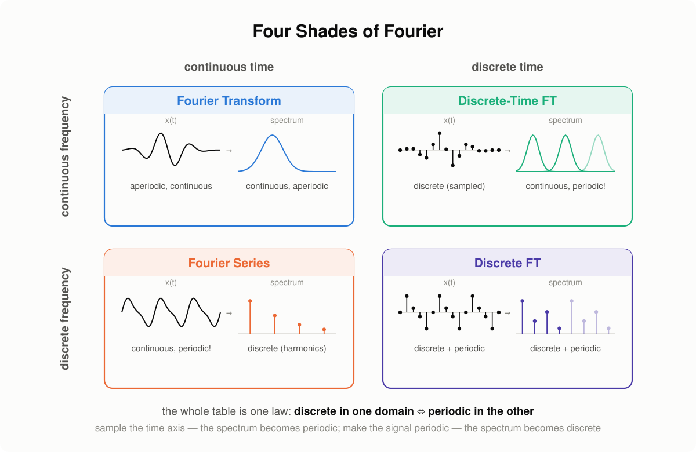

*(a teaser of the next post — in this one we walk the bottom row: from the Fourier series to the discrete Fourier transform)*

## What is sound

The air around us is filled with molecules. Pull a guitar string — it creates a
vibration that travels through them as alternating zones of compression and
rarefaction: a pressure wave. A microphone senses exactly this: variations of
pressure relative to the atmospheric baseline. Plot that pressure against time —
and you get the most honest picture of sound there is: the **waveform**.

> 💡 Sound is a *mechanical* wave — it needs a
> medium. In the vacuum of space there is nothing to compress, which is why we
> can see the Sun but cannot hear it.

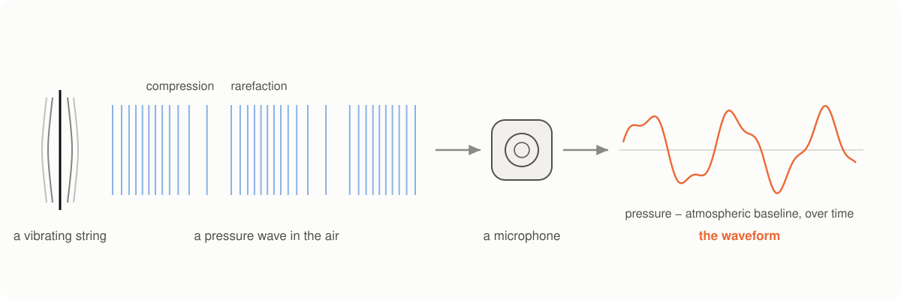

## Analog → digital

The microphone's output is an **analog** signal — and the word is more literal
than it sounds: the voltage on the microphone's wire is an *analogue* of the
air pressure, one physical quantity tracing the shape of another. Nothing has
been measured yet; the signal has merely changed its carrier — from pressure
to voltage — and is still continuous in time and in value.

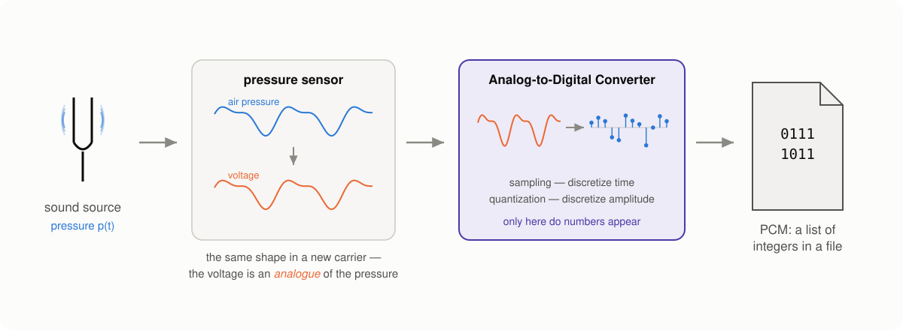

A computer, however, needs numbers, and the Analog-to-Digital Converter
produces them by discretizing along both axes:

- **sampling** — measure the signal at regular moments, $f_s$ times per second
  (time discretization);
- **quantization** — round each measurement to the nearest level of a fixed grid
  (amplitude discretization).

The result — a sequence of integers at a fixed rate — is **Pulse-Code
Modulation (PCM)**, the format inside every WAV file. Two numbers fully describe
the grid: the sampling rate (e.g. 44.1 kHz) and the bit depth (e.g. 16 bits).

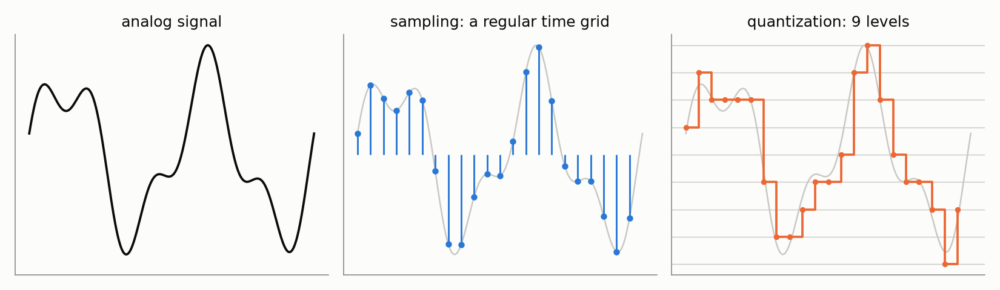

## Why the waveform is not enough

The waveform is honest but unhelpful. One second of CD-quality audio is 44,100
numbers — and no individual number tells you anything about what you hear. Is
this a male or a female voice? Which note is the guitar playing? Is there a
hum from the power line polluting the recording? Staring at pressure values
will not answer any of these questions.

Fourier's idea flips the axis. A complex signal can be decomposed into a sum of
simple oscillations — the way a chord can be decomposed into individual notes.
Instead of asking "what is the pressure at each moment of time?", we ask "how
much of each frequency does this signal contain?" The answer lives on the
frequency axis rather than the time axis, and it is called the **spectrum**.

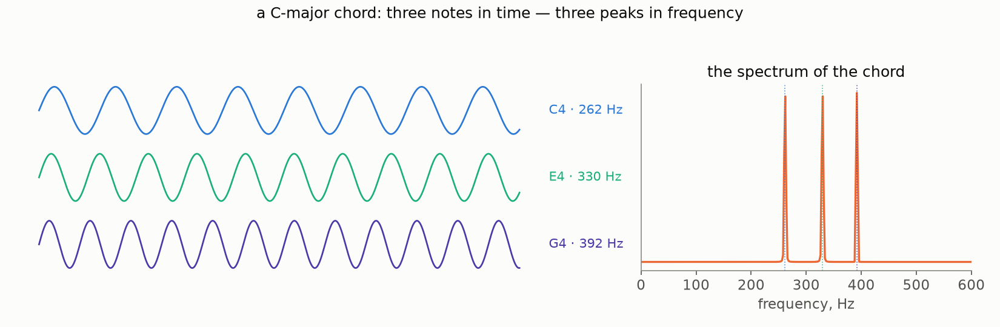

If decomposing sound into frequencies feels like an arbitrary idea, think of
a piano. Pressing a key produces an oscillation at a known frequency — the
keyboard is literally a frequency axis, laid out left to right. Playing music
is easy in this direction: choose which keys to press, how hard, and when —
frequencies in, melody out. Fourier analysis asks for the reverse: given only
the recorded sound, can we recover which keys were pressed and how hard? Most
of this post is the machinery that turns this "can we?" into "here is how".

Two things make this representation valuable in practice. First, it is
**compact**: a long sequence of time samples collapses into a handful of
meaningful frequency components. The wiggly curve below takes hundreds of
numbers to store — and just three frequency components to describe:

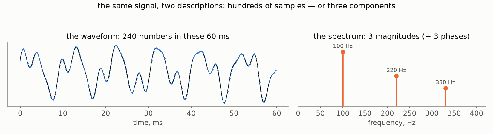

Second, it is **actionable**: frequencies can be inspected and *edited*. Say a
recording picked up the 50 Hz hum of the power line. In the time domain the hum
is smeared over every sample and there is nothing to grab; in the frequency
domain it is one column. Transform, erase that column, transform back — the
melody survives untouched, the hum is gone:

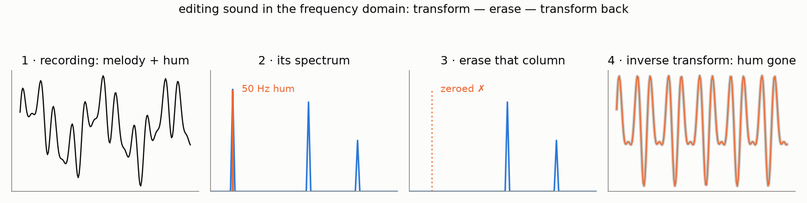

## The Fourier series

Let us make the "sum of simple oscillations" idea precise. We start with the
version that history started with, too: a **periodic** function.

Any periodic function $x(t)$ with period $P$ that is absolutely integrable over
$\left[-\frac{P}{2}, \frac{P}{2}\right]$ can be represented as a **[Fourier
series](https://en.wikipedia.org/wiki/Fourier_series)**:

$$
x(t) = a_0 + \sum_{n = 1}^\infty \left( a_n \cos\!\left( 2 \pi \frac{n}{P} t \right) + b_n \sin\!\left( 2 \pi \frac{n}{P} t \right) \right)
$$

with the coefficients

$$
a_0 = \frac{1}{P} \int_{-P/2}^{P/2} x(t)\, dt, \qquad
a_n = \frac{2}{P} \int_{-P/2}^{P/2} x(t) \cos\!\left(2 \pi \frac{n}{P} t \right) dt, \qquad
b_n = \frac{2}{P} \int_{-P/2}^{P/2} x(t) \sin\!\left(2 \pi \frac{n}{P} t \right) dt.
$$

The building blocks are sines and cosines whose frequencies are integer
multiples of $\frac{1}{P}$ — the **harmonics** of the base frequency. Nothing
else is allowed: **only oscillations that fit a whole number of times into
the period**. This restriction is easy to read past, and much of what follows
grows out of it — so let us stare at it once, properly. A periodic function
repeats: whatever happens on $[0, P]$ must glue seamlessly to its own copy on
$[P, 2P]$. A harmonic with a whole number of oscillations arrives at the seam
exactly where it started, so the copies join smoothly. An oscillation with a
fractional count arrives somewhere else — and the glued copies tear:

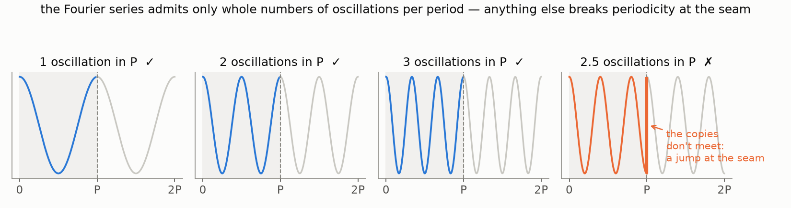

A pair $(a_n, b_n)$ at the same frequency is really one oscillation in
disguise. Using the cosine-of-difference formula, the pair collapses into a
single cosine with an amplitude and a shift:

$$
x(t) = a_0 + \sum_{n = 1}^\infty A_n \cos\!\left( 2 \pi \frac{n}{P} t - \phi_n\right),
\qquad
A_n = \sqrt{a_n^2 + b_n^2}, \quad \phi_n = \operatorname{atan2}(b_n, a_n).
$$

Here $A_n$ is the **magnitude** of the $n$-th harmonic, $\frac{n}{P}$ its
**frequency**, and $\phi_n$ its **phase**. This form is the one to keep in
mind: *a periodic signal is a recipe — this much of this frequency, shifted by
this much.*

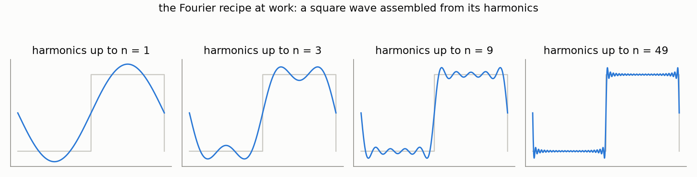

> 💡 **Why sinusoids, of all things?** Mathematics knows plenty of ways to
> decompose a function — why not, say, a [Taylor
> series](https://en.wikipedia.org/wiki/Taylor_series), with polynomials as the
> building blocks? Several reasons stack on top of each other. First, the shape
> of the data: sound is locally *quasi-periodic* — a guitar note, a vowel — and
> periodic building blocks describe such signals with a handful of
> coefficients, while a polynomial cannot even be periodic (it must run off to
> infinity) and needs ever more terms for every extra period. Second, and
> deeper: the physical world plays along. Put a speaker in one corner of a
> room, play a pure 440 Hz tone through it, and record with a microphone in
> the opposite corner. The walls reflect the sound, echoes pile on top of each
> other — yet the recording is still a 440 Hz tone: louder or quieter, shifted
> in time, but at the same frequency. The reason is one line of trigonometry:
> echoes are delayed, scaled copies, and [a sum of sinusoids of one frequency —
> whatever their amplitudes and shifts — is again a sinusoid of that
> frequency](https://en.wikipedia.org/wiki/List_of_trigonometric_identities#Linear_combinations).
>
> 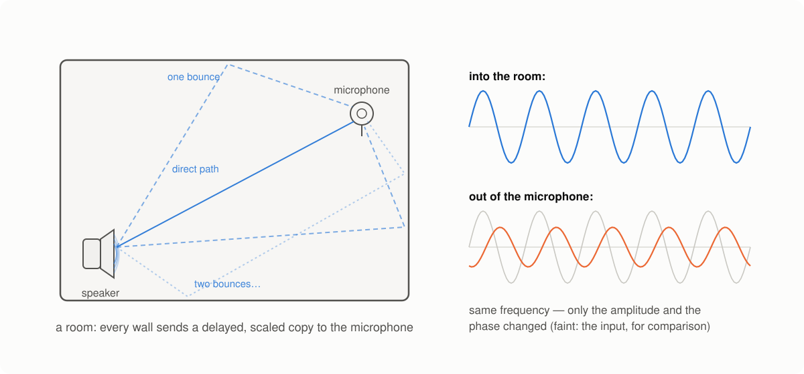
>
> (Can a room be an *anti-carpet* and make a frequency louder? It cannot add
> energy — but it can concentrate it: when the copies arrive in phase, they add
> up constructively. That is resonance, and it is exactly why your voice
> blossoms in a tiled bathroom — at the room's resonant frequencies, the
> echoes conspire in your favor.)
>
> The same holds for a vibrating string, a microphone membrane, an
> electronic filter: none of them can invent new frequencies. (A [distortion
> pedal](https://en.wikipedia.org/wiki/Distortion_(music)) *can* — precisely because it is not linear; that is what its "dirty"
> sound is made of.) That is *why* sound is built out of sinusoids in the first
> place, and the quasi-periodicity of the previous argument is not a lucky
> accident but physics. (Why this happens — and why it earns sinusoids the
> grand title of *eigenfunctions of linear time-invariant systems* — is a
> story of its own; for a very accessible account, see [chapter 5 of The
> Scientist and Engineer's Guide to DSP](https://www.dspguide.com/ch5.htm).) Third, stability. To compare fairly, fix the
> reference point — the moment you press "record" — and delay the signal past
> it by $\tau$. The Fourier description barely notices: delaying the
> signal turns each harmonic $A_n \cos(2\pi \frac{n}{P} t - \phi_n)$ into
> $A_n \cos(2\pi \frac{n}{P} (t - \tau) - \phi_n)$ — which is the same
> cosine with the same magnitude $A_n$, only its phase nudged to
> $\phi_n + 2\pi \frac{n}{P} \tau$. The Taylor description — the derivatives
> at the reference point — has no such luck: every new coefficient becomes a
> mixture of *all* the old higher-order ones. The cleanest example: $\sin t$
> and $\cos t$ are one signal shifted by a quarter period, yet [one has only
> odd-degree terms and the other only even-degree
> ones](https://en.wikipedia.org/wiki/Taylor_series#Trigonometric_functions). A note sounds the same
> whenever you play it, and the magnitude spectrum agrees; the Taylor
> coefficients do not. (It is the room argument again, in disguise: a time
> shift leaves every sinusoid being itself, just rotated — while it smears
> each monomial $t^k$ across all the degrees below it.)

### The exponential form

One more rewrite, and the notation becomes so compact that every later formula
in this series will use it. [Euler's formula](https://en.wikipedia.org/wiki/Euler%27s_formula),

$$
e^{i t} = \cos t + i \sin t
\quad\Longleftrightarrow\quad
\cos t = \tfrac{1}{2} \left(e^{it} + e^{-it} \right),
$$

lets us split every cosine into two complex exponentials — one rotating
"forward" and one "backward":

$$
\cos\!\left( 2 \pi \tfrac{n}{P} t - \phi_n \right) = \tfrac{1}{2} e^{-i \phi_n} e^{2 \pi i \frac{n}{P} t} + \tfrac{1}{2} e^{i \phi_n} e^{-2 \pi i \frac{n}{P} t}.
$$

Absorbing the magnitudes and phases into complex coefficients, the whole
series collapses into a single sum:

$$
x(t) = \sum_{n = -\infty}^\infty c_n e^{2 \pi i \frac{n}{P} t},
\qquad
c_n = \frac{1}{P} \int_{-P/2}^{P/2} x(t)\, e^{-2 \pi i \frac{n}{P} t}\, dt.
$$

The set of coefficients $\{c_n\}$ is called the **spectrum** of the signal —
the same word we met informally above, now with an exact meaning. Each $c_n$
is one complex number that stores both the magnitude and the phase of the
$n$-th harmonic: $|c_n| = A_n / 2$ and $\arg c_n = -\phi_n$ for $n \ge 1$.

> 💡 **Wait, negative frequencies?** The sum now runs over all integers $n$,
> including negative ones — that is the price of the compact notation: each
> real oscillation split into a forward- and a backward-rotating exponential.
> For a real-valued signal the two halves are not independent:
> $c_{-n} = \overline{c_n}$, so the negative-frequency half of the spectrum is
> a mirror image carrying no new information. Remember this — the same
> symmetry will resurface in the DFT and explain why half of its coefficients
> can be thrown away.

## From the series to the DFT

This is the part most explanations skip. Textbooks stop at the Fourier series
for nice continuous functions; engineering tutorials *start* from the DFT
formula, presented as an axiom. But the road between them is short, honest,
and worth walking — it explains where the formula comes from, and every
strange detail of the DFT (why exactly $N$ coefficients? why is the spectrum
periodic?) falls out of the derivation for free.

### Step 1: make the samples periodic

After the ADC, we hold $N$ numbers $x[0], x[1], \dots, x[N-1]$, measured every
$T$ seconds. The Fourier series has two complaints about this input. First, it
wants a *periodic* function — but our recording is time-limited. That one is
easy to appease: extend the recording periodically, gluing copies of it end to
end. The smallest period that works is $P = NT$ — the duration of the
recording itself.

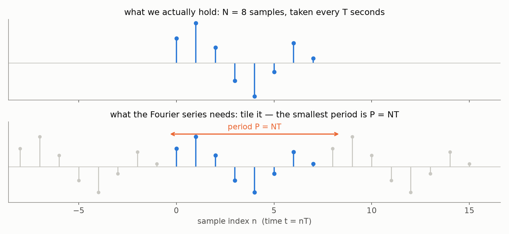

### Step 2: the naive attempt fails

The second complaint is more serious: the series wants a *function defined for
every $t$*, and we only have values at the grid points $t = nT$. The obvious
fix — define a function that equals $x[n]$ at the grid points and $0$
everywhere else — fails spectacularly. Plug it into the coefficient formula:

$$
c_k = \frac{1}{P} \int_{-P/2}^{P/2} x(t)\, e^{-2 \pi i \frac{k}{P} t}\, dt = 0
\quad \text{for every } k.
$$

The integral is an area, and a function that is nonzero only at $N$ isolated
points encloses no area at all — [the Riemann
integral](https://en.wikipedia.org/wiki/Riemann_integral) simply does not see
it. Every coefficient comes out zero; our signal has vanished. The lesson:
"a value at a point and zero elsewhere" is the wrong mathematical model of a
sample.

### Step 3: what a sample really is

Think about how a physical measurement works. No sensor reads the value *at*
the instant $t_0$ — a measurement takes some time $\tau$, and what we get is
the average over the measurement window:

$$
\hat{x}(t_0) = \frac{1}{\tau} \int_{t_0}^{t_0 + \tau} x(t)\, dt.
$$

Now make the equipment better: $\tau$ shrinks, and the averaging window
becomes a rectangle that is ever narrower and ever taller — width $\tau$,
height $\frac{1}{\tau}$, area always exactly $1$:

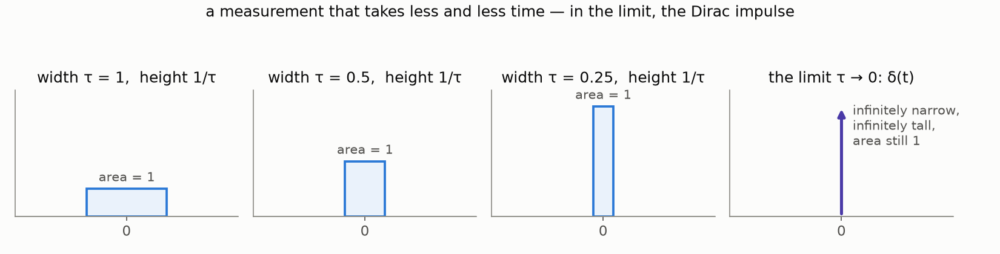

The limit of this process is the [**Dirac
impulse**](https://en.wikipedia.org/wiki/Dirac_delta_function) $\delta(t)$: an
"infinitely narrow, infinitely tall" spike of unit area. It is not a function
in the classical sense — it is *defined* by what it does inside an integral,
namely the **sifting property**:

$$
\int_{-\infty}^{\infty} f(t)\, \delta(t - t_0)\, dt = f(t_0).
$$

The delta reaches into the integral and plucks out the value of $f$ at one
point — exactly what "measuring at an instant" should mean. So the honest
model of our sampled recording is not "values and zeros" but a **comb of
impulses**, each carrying one sample as its weight:

$$
x_d(t) = \sum_{n=0}^{N-1} x[n]\, \delta(t - nT).
$$

This object *does* have nonzero integrals — each impulse contributes its
weight — and the Riemann-integral objection dissolves.

### Step 4: the integral collapses into a sum

Now feed the impulse comb (periodically extended, as in step 1) into the
Fourier coefficient formula and let the sifting property do the work. Over one
period, integrating against the comb just evaluates the exponential at the
grid points $t = nT$:

$$
c_k = \frac{1}{NT} \int_{\text{period}} x_d(t)\, e^{-2 \pi i \frac{k}{NT} t}\, dt
    = \frac{1}{NT} \sum_{n=0}^{N-1} x[n]\, e^{-2 \pi i \frac{k}{NT} \cdot nT}
    = \frac{1}{NT} \sum_{n=0}^{N-1} x[n]\, e^{-2 \pi i \frac{k n}{N}}.
$$

Look at what happened in the exponent: the sampling period $T$ **cancelled
out**. The basis functions no longer care about seconds — only about the two
integers $k$ and $n$. The continuous world has quietly left the stage.

### Step 5: only N distinct coefficients

The formula above is valid for any integer $k$ — but try shifting $k$ by $N$:

$$
e^{-2 \pi i \frac{(k+N) n}{N}} = e^{-2 \pi i \frac{k n}{N}} \underbrace{e^{-2 \pi i n}}_{=\,1} = e^{-2 \pi i \frac{k n}{N}},
$$

so $c_{k+N} = c_k$: the coefficients repeat with period $N$. Of the infinitely
many harmonics the Fourier series offered us, only $N$ are genuinely distinct.
$N$ numbers in, $N$ numbers out — the books balance. And notice what we have
just proved: *sampling in time made the spectrum periodic*. This is precisely
the law from the Four Shades table at the top of the post — not an analogy, a
theorem, and we walked into it bottom-up.

### The Discrete Fourier Transform

One last cosmetic step. Strip the physical scale away — drop the overall
$\frac{1}{NT}$ factor (a convention we will revisit in a second) and keep only
the indices. What remains is the **Discrete Fourier Transform**:

$$
X[k] = \sum_{n=0}^{N-1} x[n]\, e^{-2 \pi i \frac{k n}{N}}, \qquad k = 0, 1, \dots, N-1,
$$

and its inverse, which reassembles the samples from the spectrum:

$$
x[n] = \frac{1}{N} \sum_{k=0}^{N-1} X[k]\, e^{2 \pi i \frac{k n}{N}}, \qquad n = 0, 1, \dots, N-1.
$$

> 💡 **Where did the $\frac{1}{N}$ go?** Between the forward and the inverse
> transform, a total factor of $\frac{1}{N}$ must appear somewhere — but the
> two formulas only constrain the *product* of their scale factors. The common
> engineering convention puts all of it into the inverse (as above), because
> the forward transform is computed far more often; a symmetric convention
> with $\frac{1}{\sqrt{N}}$ on both sides also exists and makes the transform
> unitary. Libraries differ — always check before comparing numbers.

The pair is an exact, lossless round trip: $N$ complex coefficients fully
encode $N$ samples. And computing it is cheap: the naive sum costs $O(N^2)$
operations, but the [**Fast Fourier Transform**](https://en.wikipedia.org/wiki/Fast_Fourier_transform)
computes exactly the same $X[k]$ in $O(N \log N)$ — the algorithmic miracle
that makes everything downstream (including every spectrogram ever displayed)
practical. [This video](https://www.youtube.com/watch?v=nreiTseFZQ0) is a
beautiful walkthrough of the idea.

So here is the road we promised: a periodic extension, an honest model of
sampling, and the Fourier series *itself* handed us the DFT — no axioms
required. The machinery for "which piano keys were pressed?" is built.

## 🚧 Under construction

Coming next in this draft: properties of the DFT (frequency resolution,
symmetry, Nyquist) → STFT, windows and leakage → the spectrogram → the mel
scale. Roadmap and slide pointers: `drafts/fourier/post1_draft.md`.
