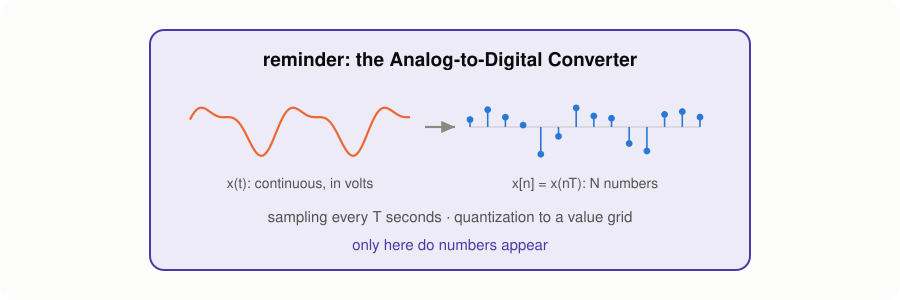
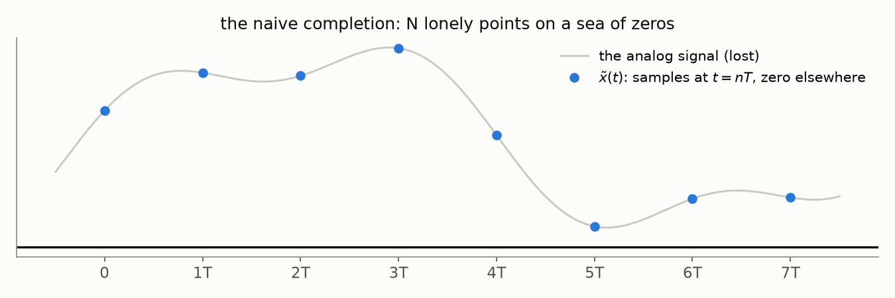
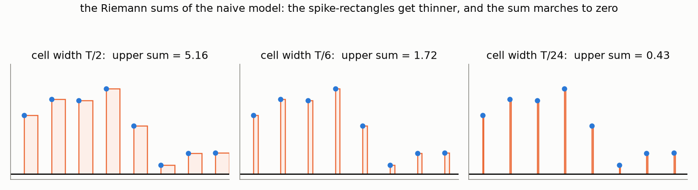
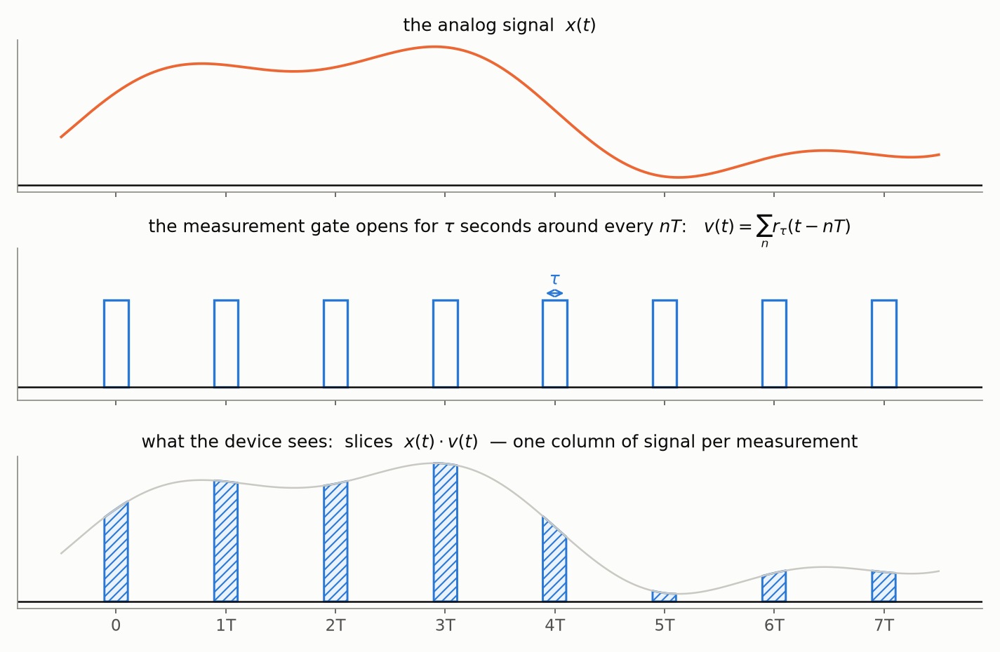
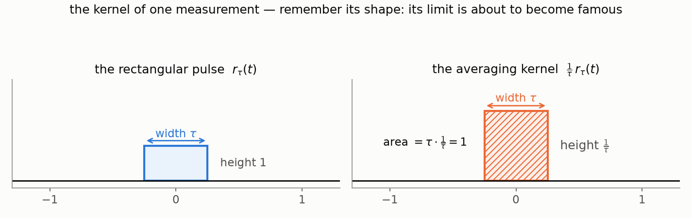
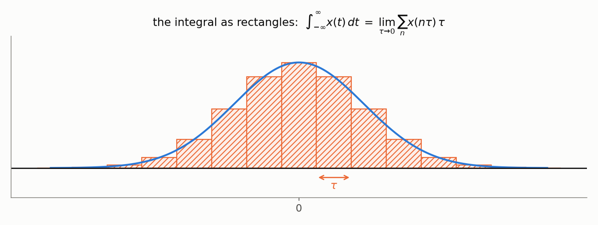

Open any tutorial on speech processing and you will meet the spectrogram in the
first five minutes — usually with a hand-wave: "we apply the Fourier transform in
sliding windows". Open a math textbook, and you will find the Fourier series in
its full rigor — with no hint of why an ML engineer should care. The road between
these two points is almost never walked end to end: every explanation starts
somewhere in the middle. This post walks the whole road: from air pressure and a
guitar string, through sampling and quantization, through the Fourier series and
the DFT, to the spectrogram — the picture that speech models actually consume.

Along the way we will meet several *different* creatures that all answer to the
name "Fourier": the Fourier **series**, the Fourier **transform**, its
**discrete-time** cousin, and the **discrete** Fourier transform. They form a
tidy 2×2 family — and untangling their family relationships is a story of its
own, which gets a separate post (and more): for now, one picture as a teaser.

*(a teaser of the next post — in this one we walk the bottom row: from the Fourier series to the discrete Fourier transform)*

## What is sound

The air around us is filled with molecules. Pull a guitar string — it creates a
vibration that travels through them as alternating zones of compression and
rarefaction: a pressure wave. A microphone senses exactly this: variations of
pressure relative to the atmospheric baseline. Plot that pressure against time —
and you get the most honest picture of sound there is: the **waveform**.

> 💡 Sound is a *mechanical* wave — it needs a
> medium. In the vacuum of space there is nothing to compress, which is why we
> can see the Sun but cannot hear it.

## Analog → digital

The microphone's output is an **analog** signal — and the word is more literal
than it sounds: the voltage on the microphone's wire is an *analogue* of the
air pressure, one physical quantity tracing the shape of another. Nothing has
been measured yet; the signal has merely changed its carrier — from pressure
to voltage — and is still continuous in time and in value.

A computer, however, needs numbers, and the **Analog-to-Digital Converter
(ADC)** produces them by discretizing along both axes:

- **sampling** — measure the signal at regular moments, $f_s$ times per second
  (time discretization);
- **quantization** — round each measurement to the nearest level of a fixed grid
  (amplitude discretization).

The result — a sequence of integers at a fixed rate — is **Pulse-Code
Modulation (PCM)**, the format inside every WAV file. Two numbers fully describe
the grid: the sampling rate (e.g. 44.1 kHz) and the bit depth (e.g. 16 bits).

## Why the waveform is not enough

The waveform is honest but unhelpful. One second of CD-quality audio is 44,100
numbers — and no individual number tells you anything about what you hear. Is
this a male or a female voice? Which note is the guitar playing? Is there a
hum from the power line polluting the recording? Staring at pressure values
will not answer any of these questions.

Fourier's idea flips the axis. A complex signal can be decomposed into a sum of
simple oscillations — the way a chord can be decomposed into individual notes.
Instead of asking "what is the pressure at each moment of time?", we ask "how
much of each frequency does this signal contain?" The answer lives on the
frequency axis rather than the time axis, and it is called the **spectrum**.

If decomposing sound into frequencies feels like an arbitrary idea, think of
a piano. Pressing a key produces an oscillation at a known frequency — the
keyboard is literally a frequency axis, laid out left to right. Playing music
is easy in this direction: choose which keys to press, how hard, and when —
frequencies in, melody out. Fourier analysis asks for the reverse: given only
the recorded sound, can we recover which keys were pressed and how hard? Most
of this post is the machinery that turns this "can we?" into "here is how".

Two things make this representation valuable in practice. First, it is
**compact**: a long sequence of time samples collapses into a handful of
meaningful frequency components. The wiggly curve below takes hundreds of
numbers to store — and just three frequency components to describe:

Second, it is **actionable**: frequencies can be inspected and *edited*. Say a
recording picked up the 50 Hz hum of the power line. In the time domain the hum
is smeared over every sample and there is nothing to grab; in the frequency
domain it is one column. Transform, erase that column, transform back — the
melody survives untouched, the hum is gone:

## The Fourier series

Let us make the "sum of simple oscillations" idea precise. We start with the
version that history started with, too: a **periodic** function.

Any periodic function $x(t)$ with period $P$ that is absolutely integrable over
$\left[-\frac{P}{2}, \frac{P}{2}\right]$ can be represented as a **[Fourier
series](https://en.wikipedia.org/wiki/Fourier_series)**:

$$
x(t) = a_0 + \sum_{n = 1}^\infty \left( a_n \cos\!\left( 2 \pi \frac{n}{P} t \right) + b_n \sin\!\left( 2 \pi \frac{n}{P} t \right) \right)
$$

with the coefficients

$$
a_0 = \frac{1}{P} \int_{-P/2}^{P/2} x(t)\, dt, \qquad
a_n = \frac{2}{P} \int_{-P/2}^{P/2} x(t) \cos\!\left(2 \pi \frac{n}{P} t \right) dt, \qquad
b_n = \frac{2}{P} \int_{-P/2}^{P/2} x(t) \sin\!\left(2 \pi \frac{n}{P} t \right) dt.
$$

The building blocks are sines and cosines whose frequencies are integer
multiples of $\frac{1}{P}$ — the **harmonics** of the base frequency. Nothing
else is allowed: **only oscillations that fit a whole number of times into
the period**. This restriction is easy to read past, and much of what follows
grows out of it — so let us stare at it once, properly. A periodic function
repeats: whatever happens on $[0, P]$ must glue seamlessly to its own copy on
$[P, 2P]$. A harmonic with a whole number of oscillations arrives at the seam
exactly where it started, so the copies join smoothly. An oscillation with a
fractional count arrives somewhere else — and the glued copies tear:

A pair $(a_n, b_n)$ at the same frequency is really one oscillation in
disguise. Using the cosine-of-difference formula, the pair collapses into a
single cosine with an amplitude and a shift:

$$
x(t) = a_0 + \sum_{n = 1}^\infty A_n \cos\!\left( 2 \pi \frac{n}{P} t - \phi_n\right),
\qquad
A_n = \sqrt{a_n^2 + b_n^2}, \quad \phi_n = \operatorname{atan2}(b_n, a_n).
$$

Here $A_n$ is the **magnitude** of the $n$-th harmonic, $\frac{n}{P}$ its
**frequency**, and $\phi_n$ its **phase**. This form is the one to keep in
mind: *a periodic signal is a recipe — this much of this frequency, shifted by
this much.*

> 💡 **Why sinusoids, of all things?** Mathematics knows plenty of ways to
> decompose a function — why not, say, a [Taylor
> series](https://en.wikipedia.org/wiki/Taylor_series), with polynomials as the
> building blocks? Several reasons stack on top of each other. First, the shape
> of the data: sound is locally *quasi-periodic* — a guitar note, a vowel — and
> periodic building blocks describe such signals with a handful of
> coefficients, while a polynomial cannot even be periodic (it must run off to
> infinity) and needs ever more terms for every extra period. Second, and
> deeper: the physical world plays along. Put a speaker in one corner of a
> room, play a pure 440 Hz tone through it, and record with a microphone in
> the opposite corner. The walls reflect the sound, echoes pile on top of each
> other — yet the recording is still a 440 Hz tone: louder or quieter, shifted
> in time, but at the same frequency. The reason is one line of trigonometry:
> echoes are delayed, scaled copies, and [a sum of sinusoids of one frequency —
> whatever their amplitudes and shifts — is again a sinusoid of that
> frequency](https://en.wikipedia.org/wiki/List_of_trigonometric_identities#Linear_combinations).
>
> 
>
> (Can a room be an *anti-carpet* and make a frequency louder? It cannot add
> energy — but it can concentrate it: when the copies arrive in phase, they add
> up constructively. That is resonance, and it is exactly why your voice
> blossoms in a tiled bathroom — at the room's resonant frequencies, the
> echoes conspire in your favor.)
>
> The same holds for a vibrating string, a microphone membrane, an
> electronic filter: none of them can invent new frequencies. (A [distortion
> pedal](https://en.wikipedia.org/wiki/Distortion_(music)) *can* — precisely because it is not linear; that is what its "dirty"
> sound is made of.) That is *why* sound is built out of sinusoids in the first
> place, and the quasi-periodicity of the previous argument is not a lucky
> accident but physics. (Why this happens — and why it earns sinusoids the
> grand title of *eigenfunctions of linear time-invariant systems* — is a
> story of its own; for a very accessible account, see [chapter 5 of The
> Scientist and Engineer's Guide to DSP](https://www.dspguide.com/ch5.htm).) Third, stability. To compare fairly, fix the
> reference point — the moment you press "record" — and delay the signal past
> it by $\tau$. The Fourier description barely notices: delaying the
> signal turns each harmonic $A_n \cos(2\pi \frac{n}{P} t - \phi_n)$ into
> $A_n \cos(2\pi \frac{n}{P} (t - \tau) - \phi_n)$ — which is the same
> cosine with the same magnitude $A_n$, only its phase nudged to
> $\phi_n + 2\pi \frac{n}{P} \tau$. The Taylor description — the derivatives
> at the reference point — has no such luck: every new coefficient becomes a
> mixture of *all* the old higher-order ones. The cleanest example: $\sin t$
> and $\cos t$ are one signal shifted by a quarter period, yet [one has only
> odd-degree terms and the other only even-degree
> ones](https://en.wikipedia.org/wiki/Taylor_series#Trigonometric_functions). A note sounds the same
> whenever you play it, and the magnitude spectrum agrees; the Taylor
> coefficients do not. (It is the room argument again, in disguise: a time
> shift leaves every sinusoid being itself, just rotated — while it smears
> each monomial $t^k$ across all the degrees below it.)

### The exponential form

One more rewrite, and the notation becomes so compact that every later formula
in this series will use it. [Euler's formula](https://en.wikipedia.org/wiki/Euler%27s_formula),

$$
e^{i t} = \cos t + i \sin t
\quad\Longleftrightarrow\quad
\cos t = \tfrac{1}{2} \left(e^{it} + e^{-it} \right),
$$

lets us split every cosine into two complex exponentials — one rotating
"forward" and one "backward":

$$
\cos\!\left( 2 \pi \tfrac{n}{P} t - \phi_n \right) = \tfrac{1}{2} e^{-i \phi_n} e^{2 \pi i \frac{n}{P} t} + \tfrac{1}{2} e^{i \phi_n} e^{-2 \pi i \frac{n}{P} t}.
$$

Absorbing the magnitudes and phases into complex coefficients, the whole
series collapses into a single sum:

$$
x(t) = \sum_{n = -\infty}^\infty c_n e^{2 \pi i \frac{n}{P} t},
\qquad
c_n = \frac{1}{P} \int_{-P/2}^{P/2} x(t)\, e^{-2 \pi i \frac{n}{P} t}\, dt.
$$

The set of coefficients $\{c_n\}$ is called the **spectrum** of the signal —
the same word we met informally above, now with an exact meaning. Each $c_n$
is one complex number that stores both the magnitude and the phase of the
$n$-th harmonic: $|c_n| = A_n / 2$ and $\arg c_n = -\phi_n$ for $n \ge 1$.

> 💡 **Wait, negative frequencies?** The sum now runs over all integers $n$,
> including negative ones — that is the price of the compact notation: each
> real oscillation split into a forward- and a backward-rotating exponential.
> For a real-valued signal the two halves are not independent:
> $c_{-n} = \overline{c_n}$, so the negative-frequency half of the spectrum is
> a mirror image carrying no new information. Remember this — the same
> symmetry will resurface in the DFT and explain why half of its coefficients
> can be thrown away.

## From the series to the DFT

This is the part most explanations skip. Textbooks stop at the Fourier series
for nice continuous functions; engineering tutorials *start* from the DFT
formula, presented as an axiom. But the road between them is short, honest,
and worth walking — and it starts where honesty demands: by asking what a
sampled signal even *is* as a mathematical object.

### An honest model of a discrete signal

Remember the Analog-to-Digital Converter from the digitization section, back
before all the mathematics? It is about to become the protagonist again:

This is what it left us with: $N$ numbers $x[0], \dots, x[N-1]$, measured
every $T$ seconds. **Can we recover a spectrum from these points?** A spectrum
means Fourier coefficients, and coefficients are integrals — so before
computing anything, we owe the integral a well-definedness check. For a
bounded function, the Riemann integral exists precisely when the function is
continuous *almost everywhere*: its discontinuities must form a set of measure
zero — this is [Lebesgue's integrability
criterion](https://en.wikipedia.org/wiki/Riemann_integral#Integrability).

Our samples are not yet a function of continuous time, so let us complete
them in the most straightforward way imaginable: keep the measured values at
the grid points, put zero everywhere else,

$$
\tilde{x}(t) =
\begin{cases}
x(nT), & t = nT, \quad n = 0, \dots, N-1, \\
0, & t \in [0, NT], \; t \neq nT.
\end{cases}
$$

Does $\tilde{x}$ pass the check? It is bounded; and it is discontinuous only
at the grid points — finitely many on one period, and still just countably
many after the periodic extension that the series insists on. A countable set
has measure zero — continuous almost everywhere, check. The coefficients are
well-defined, and we may integrate with a clear conscience:

$$
c_k = \frac{1}{P} \int_{0}^{P} \tilde{x}(t)\, e^{-2 \pi i \frac{k}{P} t}\, dt \equiv 0
\quad \text{for every } k.
$$

Every single coefficient is zero — our signal has vanished from the
mathematics. To see why, watch the Riemann sums converge: each spike gets
trapped in a rectangle of finite height and ever-shrinking width, so its
contribution — height times width — dies together with the mesh. Countably
many spikes stand against a continuum of zeros, and the zeros win:

The integral honestly reports that $\tilde{x}$ is almost everywhere
indistinguishable from the zero function. The verdict is not against Fourier;
it is against our model: "a value at a point and zero elsewhere" is the wrong
mathematical object for a sample.

**So what is a sample, really?** Think about how the measurement is actually
made. No instrument reads a value *at* an instant — a measurement takes some
time $\tau$: around every grid point $t = nT$ the device opens its gate, and
for $\tau$ seconds the signal pours in:

What single number should the device report for its window? It saw not one
value but a continuum of them — everything the signal did between
$nT - \tau/2$ and $nT + \tau/2$. The natural answer is the *average*. And
what is the average of a continuum of values? For a handful of numbers the
average is "add them up, divide by how many"; for a continuum, the sum
becomes an integral and the count becomes the length of the window:

$$
\hat{x}(nT) = \frac{1}{\tau} \int_{nT - \tau/2}^{nT + \tau/2} x(t)\, dt.
$$

It is useful to rewrite this average as an integral against a kernel. Let
$r_\tau(t)$ be the rectangular pulse of width $\tau$ and unit height centered
at zero:

With the scaled pulse as the kernel, the average becomes

$$
\hat{x}(nT) = \int_{-\infty}^{\infty} x(t)\, \tfrac{1}{\tau} r_\tau(t - nT)\, dt.
$$

The kernel $\frac{1}{\tau} r_\tau$ cuts a column of width $\tau$ out from
under the graph of $x$ and reports its area, divided by the width — the
average height of the graph inside the window. Remember this shape: it is
about to have a famous limit. For finite $\tau$ this is an
estimate with an error: the signal keeps changing inside the window.

Now improve the instrument. As $\tau$ shrinks, the kernel becomes a rectangle
ever narrower and ever taller — width $\tau$, height $\frac{1}{\tau}$, area
always exactly $1$ — and the estimate sharpens:

The limit of this process,

$$
\delta(t) = \lim_{\tau \to 0} \tfrac{1}{\tau} r_\tau(t),
$$

is the [**Dirac impulse**](https://en.wikipedia.org/wiki/Dirac_delta_function):
an "infinitely narrow, infinitely tall" spike of unit area. It is not a
function in the classical sense — it is *defined* by what it does inside an
integral, namely the **sifting property**, the $\tau \to 0$ limit of our
averaging:

$$
\int_{-\infty}^{\infty} x(t)\, \delta(t - t_0)\, dt = x(t_0)
$$

— and any integration limits that enclose $t_0$ work just as well, since the
spike carries all of its area at the single point $t_0$.

<b>Proof of the sifting property</b> (a physicist's proof: we swap limits and integrals without asking permission)

**Step 0: a notation.** For two real [square-integrable
signals](https://en.wikipedia.org/wiki/Square-integrable_function) (the space
$L^2$ — where the [Cauchy–Schwarz
inequality](https://en.wikipedia.org/wiki/Cauchy%E2%80%93Schwarz_inequality)
guarantees the integral below is finite), their **scalar (inner) product** is

$$
\langle f(t), g(t) \rangle = \int_{-\infty}^{\infty} f(t)\, g(t)\, dt
$$

— the continuous cousin of the [dot product of
vectors](https://en.wikipedia.org/wiki/Dot_product#Functions): multiply the
two signals pointwise, then add everything up (with the sum, as usual by now,
becoming an integral; complex signals conjugate the second factor). One
honest caveat in our physicist's spirit: the delta itself is famously *not*
square-integrable, so for it the angle brackets are a convenient notation for
the pairing the formula suggests — making that fully rigorous is the job of
[distribution theory](https://en.wikipedia.org/wiki/Distribution_(mathematics)).
In this notation, the sifting property reads
$\langle x(t), \delta(t - t_0) \rangle = x(t_0)$.

**Step 1: the spike at zero.** Substitute the definition of $\delta$ as the
limit of our rectangles and move the limit outside the integral:

$$
\begin{aligned}
\langle x(t), \delta(t) \rangle
&= \int_{-\infty}^{\infty} x(t)\, \delta(t)\, dt
= \int_{-\infty}^{\infty} x(t) \lim_{\tau \to 0} \tfrac{1}{\tau} r_\tau(t)\, dt \\
&= \lim_{\tau \to 0} \int_{-\infty}^{\infty} x(t)\, \tfrac{1}{\tau} r_\tau(t)\, dt.
\end{aligned}
$$

**Step 2: the integral as a Riemann sum.** Write the integral as the limit of
rectangle areas, choosing the mesh width to be the same $\tau$ as in the
pulse:

$$
\int_{-\infty}^{\infty} f(t)\, dt = \lim_{\tau \to 0} \sum_{n=-\infty}^{\infty} f(n\tau)\, \tau.
$$

Applying this to our integrand, the $\tau$ of the mesh cancels the
$\frac{1}{\tau}$ of the kernel:

$$
\langle x(t), \delta(t) \rangle
= \lim_{\tau \to 0} \sum_{n=-\infty}^{\infty} x(n\tau)\, \tfrac{1}{\tau} r_\tau(n\tau)\, \tau
= \lim_{\tau \to 0} \sum_{n=-\infty}^{\infty} x(n\tau)\, r_\tau(n\tau).
$$

**Step 3: one term survives.** The pulse $r_\tau$ is zero outside its window
of width $\tau$ around zero — so of all the grid points $n\tau$, only $n = 0$
lands inside. The infinite sum collapses to a single term:

$$
\langle x(t), \delta(t) \rangle
= \lim_{\tau \to 0} x(0) \underbrace{r_\tau(0)}_{=\,1} = x(0).
$$

**Step 4: the shifted spike.** For $\delta(t - t_0)$, change variables
$\xi = t - t_0$ (so $t = \xi + t_0$, $dt = d\xi$, and the infinite limits stay
infinite):

$$
\int_{-\infty}^{\infty} x(t)\, \delta(t - t_0)\, dt
= \int_{-\infty}^{\infty} x(\xi + t_0)\, \delta(\xi)\, d\xi
= x(t_0)
$$

by the case we just proved — the spike always reports the value of $x$ at the
point where it stands. $\blacksquare$

The perfect instrument, then, measures $x[n]$ by integrating $x$ against
$\delta(t - nT)$. Place one impulse at every grid point — the infinite train
of shifted deltas is called the **Dirac comb** (dsplib's «решетчатая
функция», the lattice function):

$$
\text{Ш}_T(t) = \sum_{n=-\infty}^{\infty} \delta(t - nT),
$$

and the honest model of a discrete signal is the analog signal multiplied by
the comb (we follow the construction from ru.dsplib.org,
[archived](https://web.archive.org/web/2026/https://ru.dsplib.org/content/discrete_introduction/discrete_introduction.html)):

$$
x_d(t) = x(t) \cdot \text{Ш}_T(t) = \sum_{n} x(t)\, \delta(t - nT).
$$

Note that nothing here is approximate anymore: the finite-$\tau$ estimate
$\hat{x}$ with its error stayed behind in the limit. This is the *exact*
mathematical model, the one the rest of the derivation stands on.

**Did it fix the integration?** Let us check — integrate $x_d$ in a small
neighborhood of a sampling point $t_0 = kT$, taking limits $kT \pm \tau$ with
$\tau \lt T$ so that exactly one tooth of the comb falls inside:

$$
\int_{kT - \tau}^{kT + \tau} x(t) \left( \sum_{n} \delta(t - nT) \right) dt
= \int_{kT - \tau}^{kT + \tau} x(t)\, \delta(t - kT)\, dt
= x(kT),
$$

where the first equality holds because all the deltas except $n = k$ sit
outside the integration limits. The integral no longer returns zero — it
returns the sample. The sampling points survive integration, which is exactly
what the naive model could not do.

> 💡 **Yes, that symbol is a Cyrillic letter.** The comb is traditionally
> denoted by Ш — "sha" — and Western literature adopted both the symbol and
> the name: the [*Shah function*](https://en.wikipedia.org/wiki/Dirac_comb).
> It is quite possibly the only Cyrillic letter in standard mathematical
> notation, chosen for the obvious reason: the letter looks like the comb.

> 💡 **A units check** (a detail dsplib is careful about, and most sources
> skip): $\delta(t)$ has dimension $1/\text{time}$ — its area over time is
> the dimensionless $1$. So if $x(t)$ is in volts, the model $x_d(t)$ is in
> volts *per second*: it is a **density**, not a value. The volts come back
> when you integrate — as we just saw. Keep this in mind whenever a stray $T$
> or $\frac{1}{T}$ appears in sampling formulas — it is usually this density
> speaking.

### Now bring in the series

The Fourier series has one more requirement: a *periodic* function. Our
recording is time-limited — so extend it, gluing copies of the $N$-sample
stretch end to end. The smallest period that works is $P = NT$, the duration
of the recording itself:

Feed the periodically extended comb into the Fourier coefficient formula and
let the sifting property do the work. Over one period, integrating against
the comb just evaluates the exponential at the grid points $t = nT$:

$$
c_k = \frac{1}{NT} \int_{\text{period}} x_d(t)\, e^{-2 \pi i \frac{k}{NT} t}\, dt
    = \frac{1}{NT} \sum_{n=0}^{N-1} x[n]\, e^{-2 \pi i \frac{k}{NT} \cdot nT}
    = \frac{1}{NT} \sum_{n=0}^{N-1} x[n]\, e^{-2 \pi i \frac{k n}{N}}.
$$

The dreaded integral has collapsed into a finite sum. And look at what
happened in the exponent: the sampling period $T$ **cancelled out**. The
basis functions no longer care about seconds — only about the two integers
$k$ and $n$. The continuous world has quietly left the stage.

### Only N distinct coefficients

The formula above is valid for any integer $k$ — but try shifting $k$ by $N$:

$$
e^{-2 \pi i \frac{(k+N) n}{N}} = e^{-2 \pi i \frac{k n}{N}} \underbrace{e^{-2 \pi i n}}_{=\,1} = e^{-2 \pi i \frac{k n}{N}},
$$

so $c_{k+N} = c_k$: the coefficients repeat with period $N$. Of the infinitely
many harmonics the Fourier series offered us, only $N$ are genuinely distinct.
$N$ numbers in, $N$ numbers out — the books balance. And notice what we have
just proved: *sampling in time made the spectrum periodic*. This is precisely
the law from the Four Shades table at the top of the post — not an analogy, a
theorem, and we walked into it bottom-up.

### The Discrete Fourier Transform

One last cosmetic step. Strip the physical scale away — drop the overall
$\frac{1}{NT}$ factor (a convention we will revisit in a second) and keep only
the indices. What remains is the **Discrete Fourier Transform**:

$$
X[k] = \sum_{n=0}^{N-1} x[n]\, e^{-2 \pi i \frac{k n}{N}}, \qquad k = 0, 1, \dots, N-1,
$$

and its inverse, which reassembles the samples from the spectrum:

$$
x[n] = \frac{1}{N} \sum_{k=0}^{N-1} X[k]\, e^{2 \pi i \frac{k n}{N}}, \qquad n = 0, 1, \dots, N-1.
$$

> 💡 **Where did the $\frac{1}{N}$ go?** Between the forward and the inverse
> transform, a total factor of $\frac{1}{N}$ must appear somewhere — but the
> two formulas only constrain the *product* of their scale factors. The common
> engineering convention puts all of it into the inverse (as above), because
> the forward transform is computed far more often; a symmetric convention
> with $\frac{1}{\sqrt{N}}$ on both sides also exists and makes the transform
> unitary. Libraries differ — always check before comparing numbers.

The pair is an exact, lossless round trip: $N$ complex coefficients fully
encode $N$ samples. And computing it is cheap: the naive sum costs $O(N^2)$
operations, but the [**Fast Fourier Transform**](https://en.wikipedia.org/wiki/Fast_Fourier_transform)
computes exactly the same $X[k]$ in $O(N \log N)$ — the algorithmic miracle
that makes everything downstream (including every spectrogram ever displayed)
practical. [This video](https://www.youtube.com/watch?v=nreiTseFZQ0) is a
beautiful walkthrough of the idea.

So here is the road we promised: an honest model of sampling, a periodic
extension, and the Fourier series *itself* handed us the DFT — no axioms
required. The machinery for "which piano keys were pressed?" is built.

## 🚧 Under construction

Coming next in this draft: properties of the DFT (frequency resolution,
symmetry, Nyquist) → STFT, windows and leakage → the spectrogram → the mel
scale. Roadmap and slide pointers: `drafts/fourier/post1_draft.md`.
