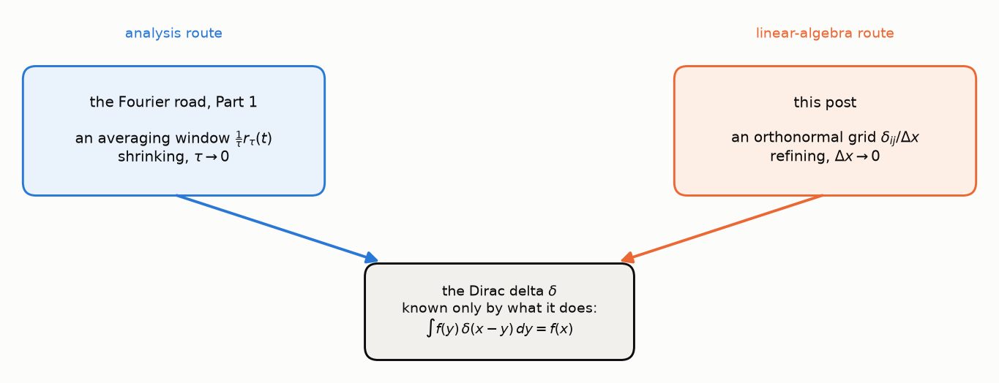
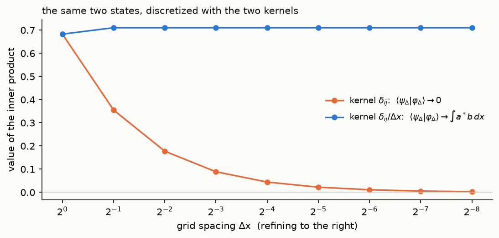
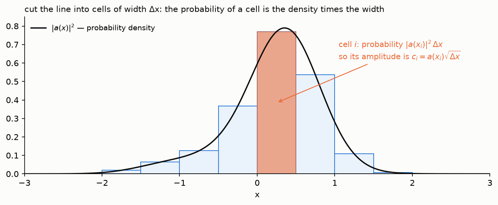
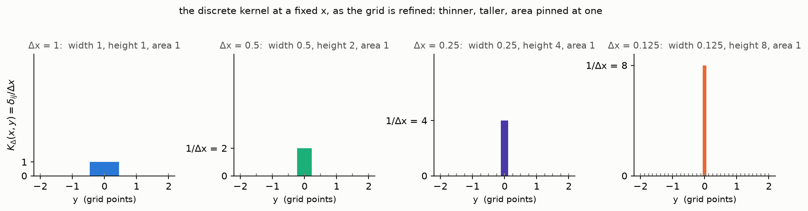

*A guest post by Ivan Petrov, edited together for the quantum road — the
first of, we hope, many.*

[Last time](/posts/states-are-vectors/#when-the-menu-is-infinite) the
quantum road reached the continuous menu. A particle on a line has a
position, every real number is a possible reading, and the state had
to be written as an integral over position kets:

$$
|\psi\rangle = \int \psi(x)\, |x\rangle\, dx.
$$

That line was written on credit twice over. What exactly is the ket
$|x\rangle$ — and what is $\langle x | y \rangle$, the inner product of
two of them? For a discrete orthonormal basis the answer was the
Kronecker delta, $\langle E_i | E_j \rangle = \delta_{ij}$. For the
continuous basis it *cannot* be, and finding out what replaces it is
this post's whole job. The answer is an old friend of this blog: the
**Dirac delta**, which the Fourier road's
[Part 1](/posts/fourier-series-to-spectrogram-part-1/#an-honest-model-of-a-discrete-signal)
built as the limit of a shrinking averaging window. Today it will
arrive by a completely different road — as the limit of an
orthonormal grid — and the two roads will meet at the same object.

The Dirac delta is usually handed to you as-is: a "function" that is
zero everywhere except at a single point, where it is infinitely
tall, and which somehow integrates to one. What actually defines it is
the **sifting property**,

$$
\int_{-\infty}^{\infty} f(y)\, \delta(x - y)\, dy = f(x),
$$

which says that integrating any function against $\delta(x - y)$
plucks out its value at $y = x$. Very useful — but where does such a
thing come from? We will derive it from the Kronecker delta, by
discretizing the continuous inner product and refusing to cheat at any
step.

## The Kronecker delta

In finite dimensions an orthonormal basis $\{ |E_i\rangle \}$ satisfies

$$
\langle E_i | E_j \rangle = \delta_{ij} = \begin{cases} 1 & i = j \\ 0 & i \neq j \end{cases}
$$

— the Kronecker delta of the last post. Expand two vectors,
$|\psi\rangle = \sum_i a_i |E_i\rangle$ and
$|\varphi\rangle = \sum_j b_j |E_j\rangle$, and the inner product
collapses:

$$
\langle \psi | \varphi \rangle = \sum_i \sum_j a_i^* \, b_j \, \langle E_i | E_j \rangle = \sum_i \sum_j a_i^* \, b_j \, \delta_{ij} = \sum_i a_i^* \, b_i.
$$

The $\delta_{ij}$ acts as a **diagonal selector**: it removes every
term of the double sum except those on the diagonal $i = j$.

Now move to the continuous setting — a particle on the real line, where
the "basis" is indexed by a continuous label $x \in \mathbb R$ rather
than an integer $i$. We would like an analogue of the Kronecker delta:
some object $\langle x | y \rangle$ that selects the diagonal $x = y$
inside an *integral* instead of a sum. The rest of the post shows that
this object is forced to be the Dirac delta $\delta(x - y)$, and says
precisely in what sense.

## The inner product of two continuous superpositions

Take two states written the way the last post wrote them,

$$
|\psi\rangle = \int a(x)\, |x\rangle\, dx, \qquad |\varphi\rangle = \int b(y)\, |y\rangle\, dy,
$$

where $|x\rangle$ is the "basis" ket labeled by the real number $x$
and $a, b$ are the wavefunctions (we write $a$ and $b$ rather than
$\psi$ and $\varphi$ to keep the two states apart). We assume $a$ and
$b$ continuous and integrable, $\int |a(x)|\, dx \lt \infty$, so that
every sum and integral below converges. The plan: compute
$\langle \psi | \varphi \rangle$ by discretizing each integral into a
Riemann sum, and take the limit at the very end.

But first: what is an integral of a *vector*? Rudin's *Principles of
Mathematical Analysis* (§6.23, see the references) defines it in the
simplest possible way — coordinate by coordinate. For
$\mathbf f = (f_1, \dots, f_k)$ with values in $\mathbb R^k$,

$$
\int_a^b \mathbf f\, dx := \left( \int_a^b f_1\, dx, \; \dots, \; \int_a^b f_k\, dx \right).
$$

The integral sums come along for free: a Riemann sum of a
vector-valued function is $\sum_i \mathbf f(x_i)\, \Delta x$ — a finite
linear combination of its *values*, hence itself a vector, whose
$j$-th coordinate is the ordinary numerical Riemann sum
$\sum_i f_j(x_i)\, \Delta x$ — and Rudin's integral is the limit of
these sums, coordinate by coordinate.

The definition needs coordinates, and for $\mathbb R^k$ they are
given: $k$ of them, along the standard axes. For our integrand
$a(x)\, |x\rangle$ this is exactly where the trouble starts. Which
coordinates? The natural axes are the position kets themselves, and
the coordinate of $|x\rangle$ along $|y\rangle$ is $\langle y | x \rangle$
— the very object this post is trying to find. Worse, there is one
axis per real number, so "$k$" is not a number at all. Hence the plan:
on a grid there are finitely many kets, we *declare* them to be the
coordinate axes, and the Riemann sums of the integrand — the
**discretized states** —

$$
|\psi_\Delta\rangle = \sum_i a(x_i)\, |x_i\rangle\, \Delta x, \qquad |\varphi_\Delta\rangle = \sum_j b(y_j)\, |y_j\rangle\, \Delta y
$$

are finite linear combinations of kets, so everything we do with them
is the finite-dimensional linear algebra of the last post. (Note which
side is one-dimensional: the *values* $a(x)\, |x\rangle$ are vectors,
but the variable of integration is a single real number, so $\Delta x$
is the length of a cell on the line.) Every limit
$\Delta x \to 0$ in this post will be a limit of *numbers* computed
from these finite sums, never a limit of kets.

Compute the inner product of the two finite sums. By linearity in the
second slot and anti-linearity in the first — the two properties from
the last post — the sums come out of the bracket and the scalars come
out of the slots, the first-slot ones conjugated:

$$
\begin{aligned}
\langle \psi_\Delta | \varphi_\Delta \rangle &= \Big\langle \sum_i a(x_i)\, |x_i\rangle\, \Delta x \;\Big|\; \sum_j b(y_j)\, |y_j\rangle\, \Delta y \Big\rangle \\
&= \sum_i \sum_j a(x_i)^* \, b(y_j)\, \langle x_i | y_j \rangle\, \Delta x\, \Delta y.
\end{aligned}
$$

The kets $|x_i\rangle$ and $|y_j\rangle$ have fused into a single
scalar, $\langle x_i | y_j \rangle$. Call it the **kernel** of the
double sum,

$$
K_\Delta(x_i, y_j) := \langle x_i | y_j \rangle,
$$

and the main question of the post is: what is the kernel?

## A dead end: the naive Kronecker guess

It is tempting to say the kernel is just the Kronecker delta,
$\langle x_i | y_j \rangle \overset{?}{=} \delta_{ij}$ — the grid
kets are orthonormal, as any decent basis should be. Let us see where
that leads. The $\delta_{ij}$ collapses the $j$-sum:

$$
\sum_i \sum_j a(x_i)^* \, b(y_j)\, \delta_{ij}\, \Delta x\, \Delta y = \sum_i a(x_i)^* \, b(x_i)\, \Delta x\, \Delta y.
$$

We are free to choose the grids, so take $\Delta y = \Delta x$:

$$
\sum_i a(x_i)^* \, b(x_i)\, \Delta x\, \Delta x = \left( \sum_i a(x_i)^* \, b(x_i)\, \Delta x \right) \cdot \Delta x.
$$

Two factors remain: a Riemann sum, and a leftover $\Delta x$. As
$\Delta x \to 0$ the Riemann sum approaches the finite number
$\int a(x)^* \, b(x)\, dx$ — but it is multiplied by that extra
$\Delta x$, which goes to zero. The whole expression converges to
zero:

$$
\left( \sum_i a(x_i)^* \, b(x_i)\, \Delta x \right) \cdot \Delta x \;\xrightarrow{\;\Delta x \to 0\;}\; 0.
$$

The naive guess is a dead end: with $\langle x_i | y_j \rangle = \delta_{ij}$,
*every* pair of states has inner product zero in the limit — including
a state with itself, so every state has length zero. Here is the same
dead end numerically, next to the fix we are about to find:

A fully rigorous Riemann sum

Above we treated $\sum_i a(x_i)^* \, b(x_i)\, \Delta x$ as a Riemann
sum over the whole line. Strictly, a Riemann sum lives on a *bounded*
interval: pick a finite window, partition it into cells, sample the
function in each cell. Let us redo the computation exactly that way,
with every step an explicit estimate.

Work on the window $[-A, A]$ split into $2N$ equal cells, so the
spacing is $\Delta x = A / N$ and the sample points are
$x_i = i \, \Delta x$ for $i = -N, \dots, N$. The kets are taken
genuinely orthonormal, $\langle x_i | x_j \rangle = \delta_{ij}$.
Since $a, b$ are continuous they are bounded on the window:
$|a(x)|, |b(x)| \leq M$ for some constant $M$. Each coefficient
carries one factor of the spacing,

$$
|\psi_\Delta\rangle = \frac{A}{N} \sum_{i=-N}^{N} a(x_i)\, |x_i\rangle, \qquad |\varphi_\Delta\rangle = \frac{A}{N} \sum_{j=-N}^{N} b(y_j)\, |y_j\rangle,
$$

and the inner product is

$$
\begin{aligned}
\langle \psi_\Delta | \varphi_\Delta \rangle &= \frac{A^2}{N^2} \sum_{i=-N}^{N} \sum_{j=-N}^{N} a(x_i)^* \, b(y_j)\, \delta_{ij} \\
&= \frac{A^2}{N^2} \sum_{i=-N}^{N} a(x_i)^* \, b(x_i) =: S_N.
\end{aligned}
$$

Bound $S_N$ term by term: each of the $2N + 1$ terms is at most $M^2$
in absolute value, so

$$
|S_N| \leq \frac{A^2}{N^2} \cdot (2N + 1) \cdot M^2 \;\xrightarrow{\; N \to \infty \;}\; 0.
$$

About $2N$ bounded terms against a $1/N^2$ prefactor: the sum goes to
zero. $\square$

## Normalizing the basis

The dead end is not a failure of the limit machinery. The limit worked
flawlessly and reported, correctly, that the state we built converges
to zero. We did not compute the right state wrongly — we
**discretized the wrong state**.

Which discrete state is the right one? The failed guess showed that
we do not actually know the inner products of the original kets:
assuming $\langle x_i | x_j \rangle = \delta_{ij}$ led to zero. So let
us build the state from a basis we *define* to be orthonormal, and let
the physics fix the coefficients. Introduce a new symbol: let
$|\hat x_i\rangle$ be the orthonormal **cell states**,
$\langle \hat x_i | \hat x_j \rangle = \delta_{ij}$, where
$|\hat x_i\rangle$ means "the particle is somewhere in cell $i$" — a
cell of width $\Delta x$ around $x_i$. Write the discretized state as

$$
|\psi_\Delta\rangle = \sum_i c_i\, |\hat x_i\rangle,
$$

so that, by the last post's Born rule, $|c_i|^2$ is the probability of
finding the particle in cell $i$. Now the physics: the squared
wavefunction $|a(x)|^2$ is a probability **density** — probability per
unit length — so the probability of landing in a cell of width
$\Delta x$ is the density times the width:

$$
|c_i|^2 = |a(x_i)|^2\, \Delta x \quad \Longrightarrow \quad c_i = a(x_i)\, \sqrt{\Delta x}.
$$

(This also diagnoses the dead end. The naive coefficients
$c_i = a(x_i)\, \Delta x$ correspond to cell probabilities
$|a(x_i)|^2\, \Delta x^2$, and the total probability
$\sum_i |a(x_i)|^2\, \Delta x^2 = \Delta x \sum_i |a(x_i)|^2\, \Delta x$
goes to zero with $\Delta x$: the naive state was not normalized, and
its norm was draining away with the grid.)

Now we can finally say what the $|x_i\rangle$ of the original Riemann
sum is. We have two expressions for the same discretized state: the
Riemann-sum notation $\sum_i a(x_i)\, |x_i\rangle\, \Delta x$ we
adopted at the start, with the normalization of $|x_i\rangle$ left
open, and the expansion $\sum_i a(x_i)\, \sqrt{\Delta x}\; |\hat x_i\rangle$
we just derived. Both run over the same cells, so for them to describe
the same state the terms must agree cell by cell:

$$
a(x_i)\, |x_i\rangle\, \Delta x = a(x_i)\, \sqrt{\Delta x}\; |\hat x_i\rangle \quad \Longrightarrow \quad |x_i\rangle = \frac{1}{\sqrt{\Delta x}}\, |\hat x_i\rangle.
$$

So $|x_i\rangle$ was never an independent object that got rescaled. It
is *determined* by this equation: the unique ket that makes the
Riemann-sum notation — and its limit $\int a(x)\, |x\rangle\, dx$ —
describe the correctly normalized state. With this identification the
kernel becomes

$$
\langle x_i | y_j \rangle = \frac{1}{\Delta x}\, \langle \hat x_i | \hat x_j \rangle = \frac{\delta_{ij}}{\Delta x},
$$

carrying a factor $1/\Delta x$ that cancels the leftover $\Delta x$ of
the dead end. This is the correctly normalized kernel:

$$
\boxed{\; \langle x_i | y_j \rangle = \frac{\delta_{ij}}{\Delta x} \;}
$$

One consequence deserves to be said out loud now, because the rest of
the road will keep meeting it. The norm of a grid ket is
$\lVert\, |x_i\rangle \,\rVert = 1 / \sqrt{\Delta x}$, and it
**diverges** as $\Delta x \to 0$. Whatever the limiting objects
$|x\rangle$ are, they are not unit vectors, not normalizable vectors,
not elements of the Hilbert space at all. That is why "basis" has been
in scare quotes since the first paragraph.

Does this contradict the last post, where the space of states was
declared a Hilbert space? No — and the distinction is worth stating
carefully, because it will recur. The space of states is still the
Hilbert space $L^2$ of square-integrable wavefunctions: every physical
state $|\psi\rangle$, every honest superposition, lives there. But
$|x\rangle$ is **not a state** — and, in particular, no state
$|\psi\rangle$ can be equal to a single $|x_0\rangle$. Suppose it
were: its wavefunction would be $\psi(x) = \langle x | x_0 \rangle = \delta(x - x_0)$,
and $\langle \psi | \psi \rangle = \int |\delta(x - x_0)|^2\, dx$ is
not even a divergent integral, it is an undefined expression — the
delta cannot be squared. What *can* be prepared is a state
concentrated *near* $x_0$: a narrow bump of width $\sigma$, say a
Gaussian, which is an honest element of $L^2$ for every $\sigma \gt 0$.
But as $\sigma \to 0$ these states converge to nothing in $L^2$ — the
normalized bumps have no limit in the norm — so "exactly at $x_0$" is
not a rare state but a nonexistent one, approachable to any precision
and never reached. This is a genuine difference from the discrete
menus of the first two posts, where every outcome had a state of its
own ($|u\rangle$, $|d\rangle$): for a continuous menu, a definite
outcome has no state, only approximations. Mathematically, then,
$|x\rangle$ is a *generalized vector*, an object of the same kind as the delta itself:
it exists only through what it does to honest states. The bra
$\langle x |$ is the functional "evaluate the wavefunction at $x$",
$\langle x | \psi \rangle = \psi(x)$, and this functional is *not* the
inner product with any element of $L^2$ — the last post's Riesz
theorem does not apply to it, because evaluation at a point is not a
bounded functional on $L^2$. So the "continuous basis" is a basis in a
generalized sense: every honest state has an expansion
$\int \psi(x)\, |x\rangle\, dx$ along it, while the "basis vectors"
themselves stand just outside the space. The rigorous home for this
arrangement is a *rigged Hilbert space* — a triple
$\Phi \subset \mathcal H \subset \Phi^*$ of nice test states, the
Hilbert space, and the generalized vectors, with $|x\rangle \in \Phi^*$
— which we name and do not build.

This is also the first appearance of a theme the road will return to:
position is a measurable quantity whose menu of outcomes is a
continuum, and such quantities have "eigenvectors" that live just
outside the space of states. (The functional-analysis name for a menu
of this kind is a *continuous spectrum*; the box, the tunnel and the
hydrogen atom will show all three kinds — discrete, continuous, and
mixed.)

## Taking the limit

Substitute the normalized kernel into the double sum:

$$
\langle \psi_\Delta | \varphi_\Delta \rangle = \sum_i \sum_j a(x_i)^* \, b(y_j)\, \frac{\delta_{ij}}{\Delta x}\, \Delta x\, \Delta y.
$$

There are two ways to take the limit, and the difference between them
is the whole subtlety of the Dirac delta.

**Option A.** Do the $j$-sum with $\delta_{ij}$ first, on the grid
$\Delta y = \Delta x$:

$$
\sum_i \sum_j a(x_i)^* \, b(y_j)\, \frac{\delta_{ij}}{\Delta x}\, \Delta x\, \Delta y = \sum_i a(x_i)^* \, b(x_i)\, \Delta x \;\xrightarrow{\;\Delta x \to 0\;}\; \int a(x)^* \, b(x)\, dx.
$$

The $1/\Delta x$ cancelled exactly one of the two spacings, leaving a
single honest Riemann sum. This is the inner product of $L^2$ from the
last post — recovered, this time, from the kets.

**Option B.** Keep the double structure and take the limit of the
whole double sum as a *number*:

$$
L := \lim_{\substack{\Delta x \to 0 \\ \Delta y = \Delta x}} \; \sum_i \sum_j a(x_i)^* \, b(y_j)\, \underbrace{\frac{\delta_{ij}}{\Delta x}}_{K_\Delta(x_i,\, y_j)}\, \Delta x\, \Delta y.
$$

This limit exists — it is the limit of the very same double sum, so it
equals $\int a(x)^* \, b(x)\, dx$. But the summand has exactly the
shape of a double Riemann sum with kernel $K_\Delta$, so we would
*like* to write $L$ as a double integral against some limiting kernel:

$$
L \overset{?}{=} \iint a(x)^* \, b(y)\, K(x, y)\, dx\, dy.
$$

Comparing with Option A, such a $K$ would have to satisfy

$$
\iint a(x)^* \, b(y)\, K(x, y)\, dx\, dy = \int a(x)^* \, b(x)\, dx,
$$

for all $a$ and $b$ — it would have to select the diagonal of a double
integral, exactly as $\delta_{ij}$ selects the diagonal of a double
sum. Whether any object $K$ does this, and what *kind* of object it
would have to be, is the rest of the post.

## The limiting kernel is not a function

Fix the index $i$ — so the spike's location $x_i$ is fixed; call it
$x$ — and look at $K_\Delta(x_i, y_j) = \delta_{ij} / \Delta x$ as a
function of $y_j$: it equals $1/\Delta x$ at $y_j = x_i$ and $0$ at
every other grid point. A single spike of **width** $\Delta x$ and
**height** $1/\Delta x$, hence of **area**

$$
\text{width} \times \text{height} = \Delta x \cdot \frac{1}{\Delta x} = 1.
$$

As $\Delta x \to 0$ the width shrinks to zero, the height diverges,
and the area stays pinned at one. This is exactly the picture people
draw for the Dirac delta.

So it is tempting to take the limit of $K_\Delta$ directly and call
the result $K(x, y)$. That does not work, and it is worth seeing why.
A pointwise limit would be a "function" that is $0$ everywhere except
at the single point $y = x$, where it is infinite. There is **no
ordinary function** like that: a function that is zero everywhere
except at one point has integral $0$, not $1$, because a single point
has no width and contributes no area. Taken literally, the spike is
not a legitimate function, and the naive pointwise limit does not
exist.

This is the key obstacle. The object we are reaching for is not a
function, so we cannot define $K(x, y)$ by its values. We fall back on
the definition from the introduction instead: the Dirac delta is
defined not by its values but by **what it does inside an integral** —
the sifting property. To identify $K$ with $\delta$ we will not take a
pointwise limit at all; we will show that $K$ *sifts*.

## Identifying the kernel: the sifting property, earned

The strategy: test the discrete kernel $K_\Delta$ against an arbitrary
continuous function $f$, evaluate as an honest finite sum, and take
the limit only at the end.

Fix a target point $x$ once and for all, and let $i$ be the index of
the grid cell containing $x$, so that $x_i$ is the grid point nearest
the target, $|x_i - x| \leq \Delta x$. The discrete analogue of
"integrating $f$ against $K$" is $f$ summed against $K_\Delta$ with
the spacing $\Delta y$; on our grid $\Delta y = \Delta x$, so the
$1/\Delta x$ and the $\Delta x$ cancel exactly, and the Kronecker
delta keeps only the $j = i$ term:

$$
\sum_j f(y_j)\, \frac{\delta_{ij}}{\Delta x}\, \Delta x = \sum_j f(y_j)\, \delta_{ij} = f(x_i).
$$

Now let $\Delta x \to 0$. The grid point $x_i$ is squeezed onto the
target, $|x_i - x| \leq \Delta x \to 0$, so by continuity of $f$ we
get $f(x_i) \to f(x)$:

$$
\lim_{\Delta x \to 0} \; \sum_j f(y_j)\, \frac{\delta_{ij}}{\Delta x}\, \Delta y = f(x).
$$

This holds for **every** continuous function $f$. It is exactly the
sifting property, stated in the only rigorous form available to us: as
a limit of numbers. We therefore *define* the notation
$\int f(y)\, K(x, y)\, dy$ to mean this limit, and with that reading

$$
\int f(y)\, K(x, y)\, dy = f(x) \qquad \text{for every continuous } f.
$$

An object satisfying the sifting property for all $f$ is, by
definition, the Dirac delta. We have therefore *earned* the
identification

$$
\boxed{\; K(x, y) = \delta(x - y) \;}
$$

and the spike features from before now follow as *consequences* of
sifting, not assumptions:

- **unit area** — set $f \equiv 1$, giving $\int \delta(x - y)\, dy = 1$;
- **concentration at $y = x$** — for any $f$ vanishing at $x$ the
  integral returns $f(x) = 0$, so $\delta$ feels nothing away from the
  diagonal.

This also closes Option B. Sifting in the $y$ variable collapses the
double integral into the single one,

$$
\iint a(x)^* \, b(y)\, \delta(x - y)\, dx\, dy = \int a(x)^* \, b(x)\, dx,
$$

which is exactly the condition we required of $K$. And it pays the
last post's second debt in the same breath: for the position kets,

$$
\langle x | y \rangle = \delta(x - y)
$$

— the continuous orthonormality relation, the thing that replaces
$\langle E_i | E_j \rangle = \delta_{ij}$ when the label of the basis
becomes a real number.

Note what we did **not** do: we never claimed the spikes converge as
functions. We tested against $f$, produced a limit of numbers, and
identified $K$ by its action. That is the only sense in which the
identification holds, and it has a name.

## Weak convergence

It is tempting to write

$$
\frac{\delta_{ij}}{\Delta x} \longrightarrow \delta(x - y),
$$

but read as an ordinary limit of functions this is wrong: the
pointwise limit of the spikes does not exist, and $\delta(x - y)$ is
not a function anyway. It is a **distribution** — an object defined
only by its action inside integrals. The correct statement is called
**weak convergence**: for every continuous function $f$, the *numbers*
$\sum_j f(y_j)\, \frac{\delta_{ij}}{\Delta x}\, \Delta y$ converge to
$f(x)$. That is the same tested sum, with the same conventions and the
same limit, as in the previous section. The arrow above is universally
used as shorthand for this statement, and now we know what it
abbreviates.

The same delta, the other way round — Part 1's road

The Fourier road's Part 1 met the delta as the limit of a shrinking
averaging window: a rectangle $\frac{1}{\tau} r_\tau(t)$ of width
$\tau$ and height $1/\tau$, area one, tested against a continuous
signal, with the sifting property proved by a mean-value argument as
$\tau \to 0$. Compare with today's spike: width $\Delta x$, height
$1/\Delta x$, area one, tested against a continuous $f$, sifting
proved by continuity as $\Delta x \to 0$. The two constructions are
the same construction with different motivation — one came from
*measuring* a signal through an instrument of finite resolution, the
other from *normalizing* a basis of finite resolution — and the same
fine print applies to both: the delta is not a function, and the
limits are weak. Analysis calls such families
[approximate identities](https://en.wikipedia.org/wiki/Mollifier);
the systematic theory of objects like $\delta$ is
[distribution theory](https://en.wikipedia.org/wiki/Distribution_(mathematics)),
which we name and do not rebuild.

## Summary

The Kronecker delta $\delta_{ij}$ and the Dirac delta $\delta(x - y)$
are one idea in two settings. The first selects the diagonal of a
double sum,

$$
\sum_i \sum_j a_i^* \, b_j\, \delta_{ij} = \sum_i a_i^* \, b_i;
$$

the second selects the diagonal of a double integral,

$$
\iint a(x)^* \, b(y)\, \delta(x - y)\, dx\, dy = \int a(x)^* \, b(x)\, dx.
$$

To get from the first to the second, the discrete kernel must be
rescaled by $1/\Delta x$, because that is the normalization a
continuous basis forces — the probability of a cell is a density times
a width, so the amplitude of a cell carries a square root of the
width — and the resulting spikes converge to $\delta(x - y)$ only in
the weak sense: not point by point, but through what they do to every
function they are integrated against. In short: the Dirac delta is
what the Kronecker delta becomes when a sum becomes an integral.

## Onward

Both debts of the last post are paid: $|x\rangle$ is the limit of the
normalized cell states, and $\langle x | y \rangle = \delta(x - y)$.
The road can now use the position basis with a clear conscience. Next
stop: measurable quantities finally get objects of their own —
observables as operators, eigenvalues as the menu of outcomes — and
the Born rule, taken on credit twice by now, is earned rather than
postulated.

## References

- G. Stefanucci, R. van Leeuwen. *Nonequilibrium Many-Body Theory of
  Quantum Systems*. Cambridge University Press, 2013 — chapter 1 makes
  the same passage from a discrete to a continuous basis, with the
  $1/\sqrt{\Delta x}$ normalization; and a
  [Physics Forums discussion](https://www.physicsforums.com/threads/going-from-kronecker-deltas-to-dirac-deltas.1064459/)
  of exactly that passage.
- N. Wheeler, [*Simplified production of Dirac delta function
  identities*](https://www.reed.edu/physics/faculty/wheeler/documents/Miscellaneous%20Math/Delta%20Functions/Simplified%20Dirac%20Delta.pdf)
  — the delta calculus, done by a physicist who minds the fine print.
- [*What exactly is Dirac's delta function?*](https://www.physicsforums.com/insights/what-exactly-is-diracs-delta-function/),
  a Physics Forums Insights article on the distributional definition.
- The same $1/\sqrt{\Delta x}$ trick in the wild, in four unrelated
  corners of physics:
  [Heisenberg–Langevin formalism for open circuit-QED systems](https://arxiv.org/abs/1711.05699)
  (appendix A.2),
  [exact asymptotic solutions to nonlinear Hawkes processes](https://arxiv.org/abs/2110.01523)
  (appendix A),
  [derivation of the four-wave kinetic equation in action-angle variables](https://arxiv.org/abs/1911.13057),
  and [discretized light-cone quantization](https://arxiv.org/abs/hep-ph/9910203).
- W. Rudin. *Principles of Mathematical Analysis*, 3rd ed. McGraw-Hill,
  1976 — §6.23, the coordinate-wise definition of the integral of a vector-valued function.
- This blog's own first meeting with the delta:
  [Part 1 of the Fourier road](/posts/fourier-series-to-spectrogram-part-1/#an-honest-model-of-a-discrete-signal).
