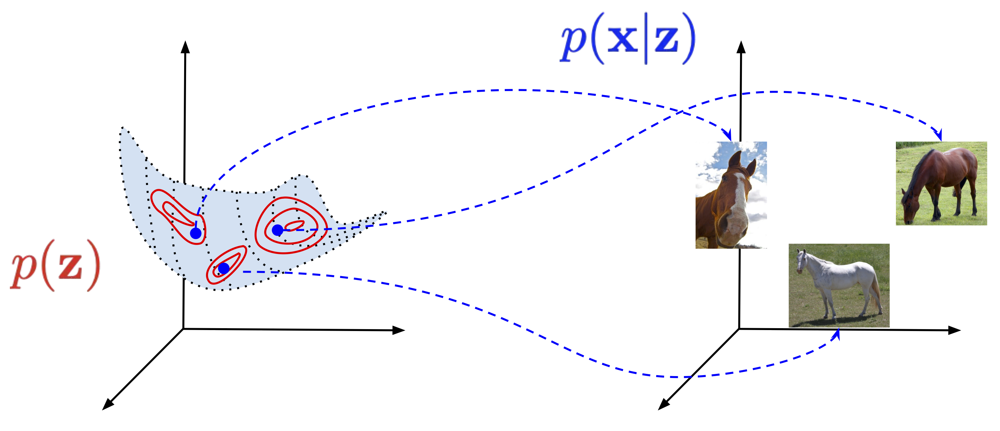

This is a temporary post that exercises every feature the upcoming translated posts rely on. If everything below looks right, the site is ready. **Delete this post before publishing real content.**

## Inline and display math

Inline: the state at step $k$ is computed as $s_k = f(s_{k-1}, x_k)$, with $x \in \R^d$.

Display math with a tag:

$$
p_\theta(x) = \int\limits_{Z^M} p_\theta(x \mid z)\, p_\theta(z)\, dz \to \max_{\theta \in \Theta} \tag{1}
$$

Aligned equations:

$$
\begin{aligned}
\log p_\theta(x) &= \E_{q_\phi(z \mid x)} \log p_\theta(x) \\
&= \mathcal{L}(\theta, \phi; x) + \KL\big(q_\phi(z \mid x) \,\|\, p_\theta(z \mid x)\big)
\end{aligned}
$$

## Table with math

| Layer | Complexity per layer | Sequential ops | Path length |
|---|---|---|---|
| Self-attention | $O(n^2 \cdot d)$ | $O(1)$ | $O(1)$ |
| RNN | $O(n \cdot d^2)$ | $O(n)$ | $O(n)$ |

## Callout and collapsible block

> 💡 **Why does path length matter?** The longer the path a gradient travels between two tokens, the more it decays along the way.

<details>
<summary>Example: mixture of Gaussians (click to expand)</summary>

Even with simple $p(z)$ and $p(x \mid z)$, the marginal $p(x) = \sum_k \lambda_k \, \mathcal{N}(x \mid \mu_k, \sigma_k^2)$ can be quite complex.

</details>

## Image from the page bundle



*Image source: [jmtomczak.github.io](https://jmtomczak.github.io/blog/4/4_VAE.html)*

## Code block

```python
import torch

def attention(Q, K, V):
    scores = Q @ K.transpose(-2, -1) / K.shape[-1] ** 0.5
    return scores.softmax(dim=-1) @ V
```
