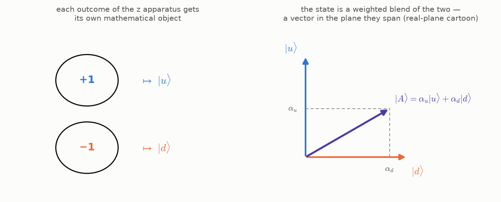
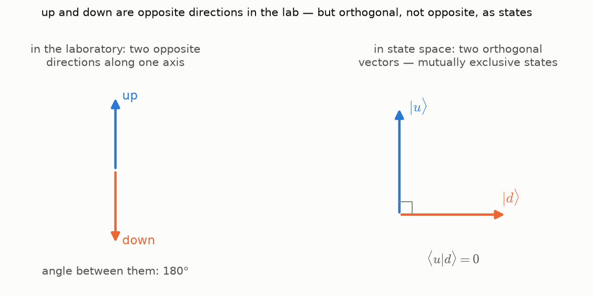
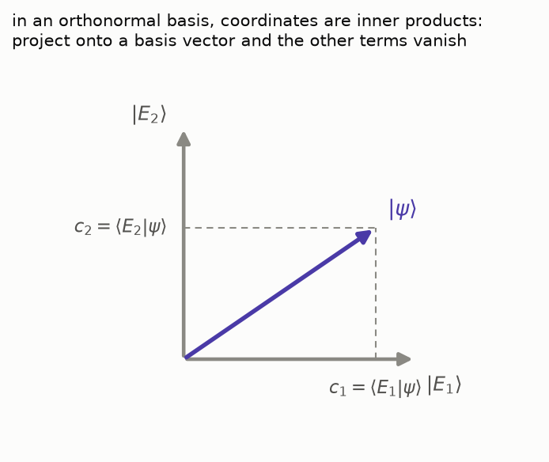

[Last time](/posts/the-apparatus-and-the-arrow/) we ran three
experiments and wrote down a wishlist over the wreckage of classical
measurement. Item 1 asked for a *state object* — one mathematical thing
per electron, carrying all possible outcomes with probabilities
attached. Item 2 asked for a way to *blend* definite outcomes into
states, with weights. Today we build both.

The strategy is borrowed from Susskind and Friedman (see the references
below), and it is the same strategy this blog used for the Fourier
road: build the machinery inside the smallest example that exhibits
everything, and only then say the general words. Our smallest example
is ready — the spin from the last post, a system with exactly two
outcomes per question. Every abstract move we make will be checkable
against experiments we have already run.

One honesty note before we start, in the spirit of this act's rigor
policy: everything in this post is proved for *finite-dimensional*
spaces. The infinite-dimensional analogues are true but harder; we
will flag each such point and put the references in collapsible cuts
rather than pretend the difficulties do not exist.

## From outcomes to objects

The apparatus pointed along $z$ can prepare exactly two states: the one
that answers $+1$ (we called it *up*) and the one that answers $-1$
(*down*). Let us give each of them a mathematical symbol:

$$
\text{up} \; \mapsto \; |u\rangle, \qquad \text{down} \; \mapsto \; |d\rangle.
$$

The half-bracket notation $|\cdot\rangle$ is Dirac's; an object written
this way is called a **ket**. For now a ket is just a label — the
content will come from the operations we allow.

And the operation we need is dictated by the wishlist. An electron
prepared along $z$ and asked along $x$ behaved like "half $+1$, half
$-1$" — the state must be able to *blend* definite outcomes with
weights. Mathematics has a structure whose entire job is weighted
blending: a *vector space*, where objects can be added and scaled. So
here is the design decision that this whole act rests on:

**States are vectors. A general state is a linear combination of
outcome states:**

$$
|A\rangle = \alpha_u \, |u\rangle + \alpha_d \, |d\rangle.
$$

Such a combination is called a **superposition** of $|u\rangle$ and
$|d\rangle$, and the weights $\alpha_u, \alpha_d$ will turn out to
carry the probabilities — in a way we will make exact below.

One more design decision hides in the fine print: the weights are
**complex numbers**. We cannot motivate that yet — no experiment of the
last post forces it — so we flag it as a debt: when we reach the qubit
post, the three experimental axes $z$, $x$, $y$ together will leave no
room for real weights. For now, take "complex" on credit and notice
only that nothing below becomes harder because of it.

The structure that everything below rests on is the **complex vector
space**. Informally: a set of objects (for us: kets) with two
operations. You can add any two kets and get a ket,

$$
|A\rangle + |B\rangle = |C\rangle,
$$

with addition commutative ($|A\rangle + |B\rangle = |B\rangle + |A\rangle$)
and associative
($\left( |A\rangle + |B\rangle \right) + |C\rangle = |A\rangle + \left( |B\rangle + |C\rangle \right)$),
with a zero vector ($|A\rangle + 0 = |A\rangle$) and
a negative for every vector ($|A\rangle + (-|A\rangle) = 0$). And you
can multiply a ket by any complex number $z$ and get a ket,
$z\,|A\rangle$, with multiplication distributing over both kinds of
addition:

$$
z \left( |A\rangle + |B\rangle \right) = z|A\rangle + z|B\rangle, \qquad (z + w)|A\rangle = z|A\rangle + w|A\rangle.
$$

That is the whole idea; the precise axiom list lives in the
[Wikipedia article on vector spaces](https://en.wikipedia.org/wiki/Vector_space#Definition_and_basic_properties).

A concrete model for our two-outcome space: columns of two complex
numbers,

$$
|A\rangle = \begin{pmatrix} \alpha_u \\ \alpha_d \end{pmatrix}, \qquad |u\rangle = \begin{pmatrix} 1 \\ 0 \end{pmatrix}, \qquad |d\rangle = \begin{pmatrix} 0 \\ 1 \end{pmatrix},
$$

added and scaled component by component. This space is called
$\mathbb C^2$.

The dimension of the space is a physical statement, and it splits
into two claims of very different weight. That the space is *at least*
two-dimensional is cheap: up and down are mutually exclusive
preparations, so neither ket can be a multiple of the other — no
choice of weight turns certainly-up into certainly-down. The real
content is the claim that the space is *at most* two-dimensional:
every state of the spin, prepared along **any** axis whatsoever, is
already some blend $\alpha_u |u\rangle + \alpha_d |d\rangle$ of these
two kets. That is not a consequence of "the window shows two values" —
a priori, the state prepared along $x$ could have needed a direction
of its own. It is the mathematical form of "there is no more to know":
a third dimension would be storage room for information that no
experiment of the last post ever revealed. Below, the claim faces its
first test — the right and left states will have to fit inside these
same two dimensions, and they will.

## The inner product

A vector space knows how to blend, but the wishlist also asked for
numbers — probabilities out of pairs of states. The tool that extracts
numbers from pairs of vectors is the **inner product**. For kets
$|\phi\rangle$ and $|\psi\rangle$ it is written

$$
\langle \phi | \psi \rangle \in \mathbb C
$$

(the full bracket; the notation will crack open into two halves in a
moment), and it is required to satisfy three axioms:

1. **Linearity in the second argument**: for any kets and any complex
   number $a$,
   $\langle \psi | \phi + \zeta \rangle = \langle \psi | \phi \rangle + \langle \psi | \zeta \rangle$
   and $\langle \psi | a\phi \rangle = a \langle \psi | \phi \rangle$.
2. **Hermitian symmetry**: swapping the arguments conjugates the
   result, $\langle \psi | \phi \rangle = \langle \phi | \psi \rangle^*$.
3. **Positive definiteness**: $\langle \psi | \psi \rangle \gt 0$ for
   every $|\psi\rangle \neq 0$.

Axioms 1 and 2 together force *anti*-linearity in the first argument:
pulling a scalar out of the left slot conjugates it,
$\langle a\psi | \phi \rangle = a^* \langle \psi | \phi \rangle$. This
asymmetry is not a nuisance but the whole point — it is what makes
axiom 3 possible, because $\langle \psi | \psi \rangle$ then comes out
real (by axiom 2 it equals its own conjugate) and can meaningfully be
called positive.

In the column model the inner product is the familiar dot product with
a conjugation on the left factor:

$$
\langle \phi | \psi \rangle = \phi_u^* \psi_u + \phi_d^* \psi_d.
$$

Two definitions ride along for free, both borrowed from ordinary
geometry:

- the **norm** (length) of a ket is
  $\lVert \psi \rVert = \sqrt{\langle \psi | \psi \rangle}$, legal
  because the number under the root is positive;
- two kets are **orthogonal** if $\langle \phi | \psi \rangle = 0$.

## What the geometry means physically

Here is where the mathematics clicks onto the experiments. Two
readings, both fixed by the last post.

**Orthogonal means mutually exclusive.** An electron prepared up is
*certainly* not down: measured along $z$ again, it never answers $-1$.
The states $|u\rangle$ and $|d\rangle$ are as distinct as states can
be, and the inner product encodes that as

$$
\langle u | d \rangle = 0.
$$

Careful, though — this is orthogonality *in state space*, not in the
laboratory. Up and down are opposite directions along one axis, at
$180°$ to each other in the lab; their state vectors sit at $90°$ in
state space. The two geometries are genuinely different spaces, and
confusing them is the classic beginner's trap. (The exact dictionary
between lab angles and state-space angles is the Bloch sphere, two
posts away — that is where the "squared and halved" cosine lives.)

**Normalized means total probability one.** The weights carry
probabilities: for a state $|A\rangle = \alpha_u |u\rangle + \alpha_d |d\rangle$,
the probability that a $z$ measurement answers $+1$ is

$$
P_u = \alpha_u^* \alpha_u = |\alpha_u|^2,
$$

and likewise $P_d = |\alpha_d|^2$. The weights themselves are called
**probability amplitudes** — they are not probabilities (they are
complex; they can cancel each other in a superposition, which is
exactly the freedom the act will spend later), but their squared
magnitudes are. For now this squared-magnitude rule is a *postulate*
we read off Susskind's presentation; one of the next posts will earn
it honestly — there is a beautiful argument that, given "weights carry
probabilities" at all, basis-invariance forces the square. Two
outcomes must exhaust all possibilities, so

$$
|\alpha_u|^2 + |\alpha_d|^2 = 1,
$$

which is precisely the statement $\langle A | A \rangle = 1$: physical
states are **unit vectors** in state space.

## The machinery earns its keep: right and left

Time to make the formalism pay rent. Can we find the state vectors for
*right* and *left* — the states the apparatus prepares when it lies
along $x$ — expressed in the $z$ basis? We know two experimental facts:

- prepared right and measured along $z$, the electron answers $+1$ or
  $-1$ with equal probability — so both amplitudes of $|r\rangle$ must
  have squared magnitude $\frac{1}{2}$;
- right and left are mutually exclusive (a right electron is certainly
  not left), so $\langle r | l \rangle = 0$.

The simplest vector satisfying the first fact:

$$
|r\rangle = \frac{1}{\sqrt 2} |u\rangle + \frac{1}{\sqrt 2} |d\rangle.
$$

For $|l\rangle$, the first fact allows any half-and-half combination,
but the second pins it down (up to the usual freedom — see the cut):

$$
|l\rangle = \frac{1}{\sqrt 2} |u\rangle - \frac{1}{\sqrt 2} |d\rangle.
$$

Check the exclusivity:
$\langle r | l \rangle = \frac{1}{2} \langle u | u \rangle - \frac{1}{2} \langle d | d \rangle = \frac{1}{2} - \frac{1}{2} = 0$.
Two states, each an equal-weight blend of up and down, and yet
perfectly distinguishable by an $x$ apparatus — the sign of a weight,
invisible to every $z$ measurement, is physical information. This is
the first quantum phenomenon that the vector formalism *predicted*
rather than recorded: nothing in the bare experiment log of the last
post said the two fifty-fifty states must differ by a sign.

The leftover freedom: global phase

The two facts do not fix $|l\rangle$ uniquely: any multiple
$e^{i\theta} |l\rangle$ satisfies them too, since a factor of unit
magnitude changes neither squared amplitudes nor orthogonality. The
same is true of every state vector. It will turn out that *no*
measurable quantity is sensitive to an overall factor $e^{i\theta}$ —
so states are really unit vectors *up to global phase*. We will count
the surviving parameters carefully in the qubit post, where this
redundancy is exactly what squeezes the four real numbers of
$\mathbb C^2$ down to the two angles of a sphere.

And the $y$ axis? Its two states $|i\rangle, |o\rangle$ (*in* and
*out*) must be fifty-fifty in the $z$ basis **and** fifty-fifty in the
$x$ basis **and** mutually exclusive. Try to satisfy all three with
real weights — it cannot be done, and that is the promised moment
where complex numbers stop being a convenience. We save the derivation
for the qubit post; it deserves the full stage.

## Bras, and why the bracket splits

The notation $\langle \phi | \psi \rangle$ looks like an object
$\langle \phi |$ acting on an object $|\psi\rangle$ — and it can be
read exactly that way. A **bra** $\langle \phi |$ is a *linear
functional*: a linear map that eats a ket and returns a complex
number,

$$
\langle \phi | : \; V \to \mathbb C, \qquad |\psi\rangle \mapsto \langle \phi | \psi \rangle.
$$

The set of all linear functionals on $V$ is itself a vector space,
called the **dual space** $V^*$. In the column model, functionals are
row vectors: a row times a column is a number, and every linear
recipe for "column in, number out" is of that shape.

Two spaces, then: kets live in $V$, bras live in $V^*$. What makes the
notation honest is that the spaces are twins, and the pairing is
perfect:

**Riesz's representation theorem.** *On a space with an inner product,
every linear functional $L$ is the inner product with some fixed
vector: there exists a unique $|\phi\rangle$ such that
$L(|\psi\rangle) = \langle \phi | \psi \rangle$ for all $|\psi\rangle$.*

So nothing is lost and nothing is gained in passing between a ket and
its bra: every $|\phi\rangle$ defines a functional
$\langle \phi |$, and every functional comes from exactly one ket.
The correspondence flips scalars to their conjugates — the bra of
$z |\phi\rangle$ is $z^* \langle \phi |$, inherited from the
anti-linear first slot of the inner product.

Proof of Riesz's theorem (finite-dimensional)

Let $L$ be a linear functional on an $n$-dimensional space with
orthonormal basis $|E_1\rangle, \dots, |E_n\rangle$. Every ket
decomposes as $|\psi\rangle = \sum_i c_i |E_i\rangle$, so by linearity

$$
L(|\psi\rangle) = \sum_i c_i \, L(|E_i\rangle).
$$

Define the candidate vector using the conjugates of those $n$ numbers:

$$
|\phi\rangle = \sum_i L(|E_i\rangle)^* \, |E_i\rangle.
$$

Then, using orthonormality and anti-linearity in the first slot,

$$
\langle \phi | \psi \rangle = \sum_i \left( L(|E_i\rangle)^* \right)^* c_i = \sum_i L(|E_i\rangle) \, c_i = L(|\psi\rangle),
$$

so $|\phi\rangle$ represents $L$. Uniqueness: if $|\phi'\rangle$ also
represents $L$, then $\langle \phi - \phi' | \psi \rangle = 0$ for
every $|\psi\rangle$; take $|\psi\rangle = |\phi\rangle - |\phi'\rangle$
and positive definiteness forces $|\phi\rangle = |\phi'\rangle$. (For
the infinite-dimensional version see the functional-analysis
references at the end — the statement survives, the proof needs
completeness.)

A worthwhile subtlety: when is the bra "the conjugate transpose"?

In the column model one often hears: the bra of a column is its
conjugate transpose row. True — **but only in an orthonormal basis.**
Riesz's theorem promises a representing vector; it does not promise
that the row of numbers written in *whatever* basis you have equals
that vector conjugated. Redo the proof above in a basis that is not
orthonormal and the cross terms $\langle E_i | E_j \rangle$ no longer
collapse, so the components of the representing vector pick up the
geometry of the basis. In this act we work in orthonormal bases
throughout, where the slogan is safe:

$$
|\psi\rangle = \begin{pmatrix} c_1 \\ \vdots \\ c_n \end{pmatrix} \quad \Longleftrightarrow \quad \langle \psi | = \begin{pmatrix} c_1^* & \cdots & c_n^* \end{pmatrix}.
$$

## Coordinates, and the identity resolved

An **orthonormal basis** of the state space is a family of kets
$\{ |E_i\rangle \}$ that spans the space and satisfies

$$
\langle E_i | E_j \rangle = \delta_{ij}
$$

— pairwise orthogonal, each of unit length, all in one Kronecker-delta
line. (Such a basis always exists: take any basis and run Gram–Schmidt
orthogonalization; see Panov's lectures in the references for the
finite-dimensional proof.) For the spin, $\{|u\rangle, |d\rangle\}$ is
one such basis — and so is $\{|r\rangle, |l\rangle\}$: *each
measurement axis donates its own orthonormal basis*, which is exactly
the "different questions split the same state into different blends"
of the wishlist.

Orthonormality is what makes coordinates effortless. Decompose
$|\psi\rangle = \sum_i c_i |E_i\rangle$ and hit both sides with a
basis bra:

$$
\langle E_k | \psi \rangle = \sum_i c_i \langle E_k | E_i \rangle = \sum_i c_i \, \delta_{ik} = c_k.
$$

Coordinates are inner products — the amplitudes of a state along a
basis are literally its projections onto the basis kets, which is why
$\alpha_u = \langle u | A \rangle$ in the spin example above.

Now substitute the coordinates back into the decomposition and watch
the notation do something elegant:

$$
|\psi\rangle = \sum_i \langle E_i | \psi \rangle \, |E_i\rangle = \sum_i |E_i\rangle \langle E_i | \psi \rangle = \left( \sum_i |E_i\rangle \langle E_i | \right) |\psi\rangle.
$$

The first move rewrites each term with the number
$\langle E_i | \psi \rangle$ *after* the ket (a number commutes with
everything); the second just regroups the brackets. The object in
parentheses eats an arbitrary $|\psi\rangle$ and returns the same
$|\psi\rangle$ — it is the identity operator:

$$
\hat I = \sum_i |E_i\rangle \langle E_i |.
$$

This **resolution of identity** is the single most-used identity of
the entire act: inserting $\hat I$ in this form between any bra and
any ket splits a quantum computation along a basis of our choosing.
We will spend it constantly.

## When the menu is infinite

Everything above was built in two dimensions, but the definitions
never used the number two. If a measurement offers countably many
outcomes — the hydrogen atom's energy menu $E_1, E_2, \dots$ from the
opening of the last post — the state is an infinite superposition:

$$
|\psi\rangle = \sum_{i=1}^{\infty} c_i \, |E_i\rangle.
$$

And if the measured quantity is *continuous* — the position $x$ of a
particle on a line — the sum has to become an integral over the
uncountable menu of outcomes:

$$
|\psi\rangle = \int \psi(x) \, |x\rangle \, dx.
$$

The weight function $\psi(x)$ — one complex amplitude per position —
is the celebrated **wavefunction**, and this single line is the bridge
between the linear algebra of this post and the calculus this blog's
Fourier road spent four posts on. But the line is written on credit
twice over: what exactly is the ket $|x\rangle$, and what is
$\langle x | y \rangle$ if not a Kronecker delta? Making those symbols
honest is the next post's whole job, and the answer is an old friend
of this blog — the Dirac delta.

Infinite sums also raise a genuinely new mathematical concern:
convergence. An infinite superposition of states had better *be* a
state — the limit must not fall out of the space. A vector space with
an inner product whose metric is complete (every Cauchy sequence of
vectors converges to a vector inside the space) is called a **Hilbert
space**, and that is the standing arena of quantum mechanics: the
state space of a quantum system is a Hilbert space $\mathcal H$. Our
$\mathbb C^2$ is one (trivially — finite-dimensional spaces are always
complete). The space of square-integrable wavefunctions, called
$L^2$, is the important infinite-dimensional one: its inner product is

$$
\langle f | g \rangle = \int f^*(x) \, g(x) \, dx,
$$

and the Fourier road has already walked its most famous orthonormal
basis — the harmonics $e_n = e^{inx}$ on a segment, with the Fourier
series as the decomposition $f = \sum_n \langle e_n | f \rangle \, e_n$
and the Fourier coefficients as the coordinates. Part 1's inner-product
view of the DFT was this exact picture, one Hilbert space earlier.

Fine print: completeness, separability, and where the proofs live

Completeness is the property that separates honest infinite
superpositions from wishful ones, and proving things about it is real
functional analysis. Three facts we will quietly rely on, with
pointers instead of proofs: every Hilbert space admits an orthonormal
basis (not necessarily countable); every vector decomposes into at
most countably many basis terms with coefficients
$\langle E_i | \psi \rangle$; and the Hilbert spaces of quantum
mechanics are *separable* — they admit countable orthonormal bases.
Proofs: Sergeev's functional analysis lectures, pp. 29–32, and
Yakovlev's *Functional spaces*, p. 96 for the general Riesz theorem
(links below).

## What we built

The wishlist, revisited:

1. **A state object** — a unit vector $|\psi\rangle$ in a Hilbert
   space. ✓
2. **A way to blend outcomes into states** — superposition with
   complex amplitudes; probabilities are squared magnitudes, subject
   to the promised derivation. ✓
3. **Questions as mathematical actors** — each axis donated a basis,
   but the *question itself* (spin along $\hat n$) still has no object
   of its own. That is the observables post, two stops ahead.
4. **Measurement as an operation on states** — same address.
5. **Geometry must enter** — the $y$-axis states have already
   whispered that complex numbers are unavoidable; the full dictionary
   between lab directions and state space is the Bloch sphere post.

## Onward

Next stop: the continuous basis, done honestly. The kets $|x\rangle$
of the wavefunction line need an orthogonality relation, and it cannot
be a Kronecker delta — the guest post that opens the door walks from
Kronecker's $\delta_{ij}$ to Dirac's $\delta(x-y)$ by an explicit
continuum limit, meeting the delta of the Fourier road's Part 1
coming the other way. After that: observables as operators, and the
Born rule earned rather than postulated.

## References

- Leonard Susskind, Art Friedman. *Quantum Mechanics: The Theoretical
  Minimum*. Basic Books, 2014 — lecture 1's vector-space interlude and
  lecture 2's representation of spin states are this post's spine;
  [free video course](https://theoreticalminimum.com/courses/quantum-mechanics/2012/winter).
- The [Quantum Sense](https://www.youtube.com/@quantumsensechannel)
  series, *Maths of Quantum Mechanics* — videos 2–4 and 6 cover kets,
  inner products, Hilbert spaces, and bras; the "outcome objects"
  motivation of this post follows its opening episodes.
- T. E. Panov, [lectures on linear algebra](http://higeom.math.msu.su/people/taras/teaching/panov-linalg.pdf)
  (in Russian) — Gram–Schmidt and the finite-dimensional dual-space
  machinery, with proofs.
- A. G. Sergeev, [lectures on functional analysis](https://mi-ras.ru/noc/13_14/2/sergeev/funkan.pdf)
  (in Russian) — orthonormal bases in Hilbert spaces, pp. 29–32.
- G. N. Yakovlev, [*Functional spaces*](https://web.archive.org/web/20220106220023/https://mipt.ru/education/chair/mathematics/upload/fe8/yakovlev_fs-arph0c00ija.pdf)
  (in Russian) — the Riesz representation theorem in full generality,
  p. 96.
- Grant Sanderson's (3Blue1Brown) videos on
  [vector spaces](https://youtu.be/TgKwz5Ikpc8) and
  [duality and the dot product](https://youtu.be/LyGKycYT2v0) — the
  best visual intuition for why functionals and vectors pair up.
