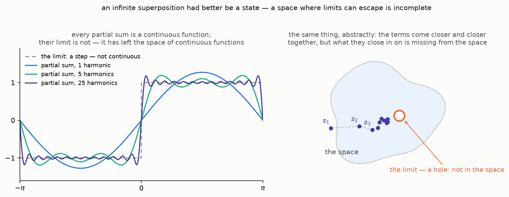

[Last time](/posts/the-apparatus-and-the-arrow/) we ran three
experiments and wrote down a wishlist over the wreckage of classical
measurement. Item 1 asked for a *state object* — one mathematical thing
per electron, carrying all possible outcomes with probabilities
attached. Item 2 asked for a way to *blend* definite outcomes into
states, with weights. Today we build both.

The strategy is borrowed from Susskind and Friedman (see the references
below), and it is the same strategy this blog used for the Fourier
road: build the machinery inside the smallest example that exhibits
everything, and only then say the general words. Our smallest example
is ready — the spin from the last post, a system with exactly two
outcomes per measurement. Every abstract move we make will be checkable
against experiments we have already run.

One honesty note before we start, in the spirit of this road's rigor
policy: everything in this post is proved for *finite-dimensional*
spaces. The infinite-dimensional analogues are true but harder; we
will flag each such point and put the references in collapsible cuts
rather than pretend the difficulties do not exist.

## From outcomes to objects

The apparatus pointed along $z$ can prepare exactly two states: the one
that answers $+1$ (we called it *up*) and the one that answers $-1$
(*down*). Let us give each of them a mathematical symbol:

$$
\text{up} \; \mapsto \; |u\rangle, \qquad \text{down} \; \mapsto \; |d\rangle.
$$

The half-bracket notation $|\cdot\rangle$ is Dirac's; an object written
this way is called a **ket**. For now a ket is just a label — the
content will come from the operations we allow.

And the operation we need is dictated by the wishlist. An electron
prepared along $z$ and asked along $x$ behaved like "half $+1$, half
$-1$" — the state must be able to *blend* definite outcomes with
weights. Mathematics has a structure whose entire job is weighted
blending: a *vector space*, where objects can be added and scaled. So
here is the design decision that this whole road rests on:

**States are vectors. A general state is a linear combination of
outcome states:**

$$
|A\rangle = \alpha_u \, |u\rangle + \alpha_d \, |d\rangle.
$$

Such a combination is called a **superposition** of $|u\rangle$ and
$|d\rangle$, and the weights $\alpha_u, \alpha_d$ will turn out to
carry the probabilities — in a way we will make exact below.

One more design decision hides in the fine print: the weights are
**complex numbers**. We cannot motivate that yet — no experiment of the
last post forces it — so we flag it as a debt: when we reach the qubit
post, the three experimental axes $z$, $x$, $y$ together will leave no
room for real weights. For now, take "complex" on credit and notice
only that nothing below becomes harder because of it.

The structure that everything below rests on is the **complex vector
space**. Informally: a set of objects (for us: kets) with two
operations. You can add any two kets and get a ket,

$$
|A\rangle + |B\rangle = |C\rangle,
$$

with addition commutative ($|A\rangle + |B\rangle = |B\rangle + |A\rangle$)
and associative
($\left( |A\rangle + |B\rangle \right) + |C\rangle = |A\rangle + \left( |B\rangle + |C\rangle \right)$),
with a zero vector ($|A\rangle + 0 = |A\rangle$) and
a negative for every vector ($|A\rangle + (-|A\rangle) = 0$). And you
can multiply a ket by any complex number $z$ and get a ket,
$z\,|A\rangle$, with multiplication distributing over both kinds of
addition:

$$
z \left( |A\rangle + |B\rangle \right) = z|A\rangle + z|B\rangle, \qquad (z + w)|A\rangle = z|A\rangle + w|A\rangle.
$$

That is the whole idea; the precise axiom list lives in the
[Wikipedia article on vector spaces](https://en.wikipedia.org/wiki/Vector_space#Definition_and_basic_properties).

A concrete model for our two-outcome space: columns of two complex
numbers,

$$
|A\rangle = \begin{pmatrix} \alpha_u \\ \alpha_d \end{pmatrix}, \qquad |u\rangle = \begin{pmatrix} 1 \\ 0 \end{pmatrix}, \qquad |d\rangle = \begin{pmatrix} 0 \\ 1 \end{pmatrix},
$$

added and scaled component by component. This space is called
$\mathbb C^2$, and we will refer to this concrete picture — kets as
columns of numbers — as the **column model**.

## The inner product

A vector space knows how to blend, but the wishlist also asked for
numbers — probabilities out of pairs of states. The tool that extracts
numbers from pairs of vectors is the **inner product**. For kets
$|\phi\rangle$ and $|\psi\rangle$ it is written

$$
\langle \phi | \psi \rangle \in \mathbb C
$$

(the full bracket; the notation will crack open into two halves in a
moment), and it is required to satisfy three axioms:

1. **Linearity in the second argument**: for any kets and any complex
   number $a$,
   $\langle \psi | \phi + \zeta \rangle = \langle \psi | \phi \rangle + \langle \psi | \zeta \rangle$
   and $\langle \psi | a\phi \rangle = a \langle \psi | \phi \rangle$.
2. **Hermitian symmetry**: swapping the arguments conjugates the
   result, $\langle \psi | \phi \rangle = \langle \phi | \psi \rangle^*$.
3. **Positive definiteness**: $\langle \psi | \psi \rangle \gt 0$ for
   every $|\psi\rangle \neq 0$.

Axioms 1 and 2 together force *anti*-linearity in the first argument:
pulling a scalar out of the left slot conjugates it,
$\langle a\psi | \phi \rangle = a^* \langle \psi | \phi \rangle$. This
asymmetry is not a nuisance but the whole point — it is what makes
axiom 3 possible: it guarantees that $\langle \psi | \psi \rangle$
is real and stays positive under scaling.

The two computations behind this claim

First, axiom 2 with both arguments equal reads

$$
\langle \psi | \psi \rangle = \langle \psi | \psi \rangle^*,
$$

and a complex number equal to its own conjugate is real — so calling
$\langle \psi | \psi \rangle$ positive is meaningful in the first
place. Second, scale the vector by any complex number $a$: the scalar
leaves the first slot conjugated and the second slot plain,

$$
\langle a\psi | a\psi \rangle = a^* a \, \langle \psi | \psi \rangle = |a|^2 \, \langle \psi | \psi \rangle,
$$

and $|a|^2$ is positive — scaling can never break positivity. Had the
product been linear in *both* slots instead, scaling by $a = i$ would
multiply $\langle \psi | \psi \rangle$ by $i^2 = -1$ and flip its
sign — so no positivity requirement could hold, and axiom 3 could not
even be stated.

Now that we have an inner product, let us agree that our basis kets
are **orthonormal** — each of unit length, and orthogonal to each
other. (Agreeing costs nothing: in finite dimensions any basis can be
turned into an orthonormal one by the
[Gram–Schmidt process](https://en.wikipedia.org/wiki/Gram%E2%80%93Schmidt_process);
the theorem with proof is on p. 54 of Panov's lectures — see the
references.) In formulas:

$$
\langle u | u \rangle = \langle d | d \rangle = 1, \qquad \langle u | d \rangle = \langle d | u \rangle = 0.
$$

Then in coordinate form the inner product of two arbitrary kets
equals

$$
\langle \phi | \psi \rangle = \phi_u^* \psi_u + \phi_d^* \psi_d.
$$

The derivation of the coordinate formula

Write both arguments in the basis,
$|\phi\rangle = \phi_u |u\rangle + \phi_d |d\rangle$ and
$|\psi\rangle = \psi_u |u\rangle + \psi_d |d\rangle$, and open the
bracket slot by slot. First the second slot, by linearity:

$$
\begin{aligned}
\langle \phi | \psi \rangle &= \langle \phi \,|\, \psi_u u + \psi_d d \rangle \\
&= \psi_u \langle \phi | u \rangle + \psi_d \langle \phi | d \rangle.
\end{aligned}
$$

Now each remaining bracket, by anti-linearity in the first slot —
remember that the scalars come out conjugated:

$$
\begin{aligned}
\langle \phi | u \rangle &= \langle \phi_u u + \phi_d d \,|\, u \rangle \\
&= \phi_u^* \langle u | u \rangle + \phi_d^* \langle d | u \rangle \\
&= \phi_u^* \cdot 1 + \phi_d^* \cdot 0 = \phi_u^*,
\end{aligned}
$$

where the cross term died by the declared orthogonality, and in the
same way $\langle \phi | d \rangle = \phi_d^*$. Substituting both back
into the first computation:

$$
\langle \phi | \psi \rangle = \phi_u^* \psi_u + \phi_d^* \psi_d. \quad \square
$$

The same computation with $n$ basis vectors instead of two gives the
general coordinate formula
$\langle \phi | \psi \rangle = \sum_i \phi_i^* \psi_i$ — valid, note,
only in an orthonormal basis: in a skewed basis the cross terms
survive and the formula grows correction terms.

Two definitions ride along for free, both borrowed from ordinary
geometry:

- the **norm** (length) of a ket is
  $\lVert \psi \rVert = \sqrt{\langle \psi | \psi \rangle}$, legal
  because the number under the root is positive;
- two kets are **orthogonal** if $\langle \phi | \psi \rangle = 0$.

## What the geometry means physically

Here is where the mathematics clicks onto the experiments. Two
readings, both fixed by the last post.

**Orthogonal means mutually exclusive.** An electron prepared up is
*certainly* not down: measured along $z$ again, it never answers $-1$.
The states $|u\rangle$ and $|d\rangle$ are as distinct as states can
be, and the inner product encodes that as

$$
\langle u | d \rangle = 0.
$$

Careful, though — this is orthogonality *in state space*, not in the
laboratory. Up and down are opposite directions along one axis, at
$180°$ to each other in the lab; their state vectors sit at $90°$ in
state space. The two geometries are genuinely different spaces, and
confusing them is the classic beginner's trap. (The exact dictionary
between lab angles and state-space angles is the Bloch sphere, two
posts away.)

**Normalized means total probability one.** Here we must borrow from
the future, and the loan is the largest of this post. *How exactly*
the weights encode probabilities is a genuinely deep question — deep
enough that a whole post of this road is reserved for it: there is a
beautiful argument that, once weights carry probabilities at all,
consistency across bases forces one specific formula and no other. For
today we take that formula on credit. For a state
$|A\rangle = \alpha_u |u\rangle + \alpha_d |d\rangle$, the probability
that a $z$ measurement answers $+1$ is

$$
P_u = \alpha_u^* \alpha_u = |\alpha_u|^2,
$$

and likewise $P_d = |\alpha_d|^2$. The weights themselves are called
**probability amplitudes** — they are not probabilities (they are
complex; they can cancel each other in a superposition, which is
exactly the freedom the road will spend later), but their squared
magnitudes are. Two outcomes must exhaust all possibilities, so

$$
|\alpha_u|^2 + |\alpha_d|^2 = 1,
$$

which is precisely the statement $\langle A | A \rangle = 1$: physical
states are **unit vectors** in state space.

## The machinery earns its keep: right and left

Time to make the formalism pay rent. Can we find the state vectors for
*right* and *left* — the states the apparatus prepares when it lies
along $x$ — expressed in the $z$ basis? We know two experimental facts:

- prepared right and measured along $z$, the electron answers $+1$ or
  $-1$ with equal probability — so both amplitudes of $|r\rangle$ must
  have squared magnitude $\frac{1}{2}$;
- right and left are mutually exclusive (a right electron is certainly
  not left), so $\langle r | l \rangle = 0$.

The simplest vector satisfying the first fact:

$$
|r\rangle = \frac{1}{\sqrt 2} |u\rangle + \frac{1}{\sqrt 2} |d\rangle.
$$

For $|l\rangle$, the first fact allows any half-and-half combination,
but the second pins it down (up to the usual freedom — see the cut):

$$
|l\rangle = \frac{1}{\sqrt 2} |u\rangle - \frac{1}{\sqrt 2} |d\rangle.
$$

Check the exclusivity:
$\langle r | l \rangle = \frac{1}{2} \langle u | u \rangle - \frac{1}{2} \langle d | d \rangle = \frac{1}{2} - \frac{1}{2} = 0$.
Two states, each an equal-weight blend of up and down, and yet
perfectly distinguishable by the apparatus with its arrow along $x$.

The leftover freedom: global phase

The two facts do not fix $|l\rangle$ uniquely: any multiple
$e^{i\theta} |l\rangle$ satisfies them too, since a factor of unit
magnitude changes neither squared amplitudes nor orthogonality. The
same is true of every state vector. It will turn out that *no*
measurable quantity is sensitive to an overall factor $e^{i\theta}$ —
so states are really unit vectors *up to global phase*. We will count
the surviving parameters carefully in the qubit post, where this
redundancy is exactly what squeezes the four real numbers of
$\mathbb C^2$ down to the two angles of a sphere.

And the $y$ axis? Its two states $|i\rangle, |o\rangle$ (*in* and
*out*) must be fifty-fifty in the $z$ basis **and** fifty-fifty in the
$x$ basis **and** mutually exclusive. Try to satisfy all three with
real weights — it cannot be done, and that is the promised moment
where complex numbers stop being a convenience. We save the derivation
for the qubit post; it deserves the full stage.

## Bras, and why the bracket splits

The inner product $\langle \phi | \psi \rangle$ can be looked at
from a new angle: not as a function of two vectors, but as one object,
$\langle \phi |$, *acting on* another, $|\psi\rangle$. Fix the left
argument and let the right one vary — what remains is a machine that
takes a ket and returns a number:

$$
\langle \phi | : \; V \to \mathbb C, \qquad |\psi\rangle \mapsto \langle \phi | \psi \rangle.
$$

This half-bracket $\langle \phi |$ is called a **bra** — and now
Dirac's play on words is complete: a bra $\langle \phi |$ and a ket
$|\psi\rangle$ together make a *bra-ket*, $\langle \phi | \psi \rangle$,
which is the bracket of our inner product.

What kind of machine is the bra? A general definition first. Let $V$
and $W$ be vector spaces over $\mathbb C$. A map $\mathcal A : V \to W$ is called
**linear** if it respects both operations of a vector space — for all
vectors $u, v \in V$ and every scalar $\lambda \in \mathbb C$,

$$
\mathcal A (u + v) = \mathcal A u + \mathcal A v, \qquad \mathcal A (\lambda v) = \lambda \, \mathcal A v.
$$

A linear map whose target space is the scalars themselves,
$L : V \to \mathbb C$, is called a **linear functional**: it eats a
vector and returns a number, linearly.

And that is exactly what a bra is. By axiom 1 the inner product is
linear in its second argument — so with the first argument fixed, the
machine $|\psi\rangle \mapsto \langle \phi | \psi \rangle$
respects sums and scalars: **a bra is a linear functional on the space
of kets.**

The set of all linear functionals on $V$ is itself a vector space,
called the **dual space** $V^*$. In the column model, functionals are
row vectors: a row times a column is a number,

$$
\begin{pmatrix} L_u & L_d \end{pmatrix} \begin{pmatrix} \psi_u \\ \psi_d \end{pmatrix} = L_u \psi_u + L_d \psi_d,
$$

and every linear recipe for "column in, number out" is of that shape —
feed the basis columns one by one into a functional $L$, and the
numbers $L_u = L(|u\rangle)$, $L_d = L(|d\rangle)$ it returns *are*
its row, since linearity determines everything else.

Two spaces, then: kets live in $V$, bras live in $V^*$. What makes the
notation honest is that the spaces are twins, and the pairing is
perfect:

**Riesz's representation theorem.** *On a space with an inner product,
every linear functional $L$ is the inner product with some fixed
vector: there exists a unique $|\phi\rangle$ such that
$L(|\psi\rangle) = \langle \phi | \psi \rangle$ for all $|\psi\rangle$.*

So nothing is lost and nothing is gained in passing between a ket and
its bra: every $|\phi\rangle$ defines a functional
$\langle \phi |$, and every functional comes from exactly one ket.
The correspondence flips scalars to their conjugates — the bra of
$z |\phi\rangle$ is $z^* \langle \phi |$, inherited from the
anti-linear first slot of the inner product.

Proof of Riesz's theorem (finite-dimensional)

Let $L$ be a linear functional on an $n$-dimensional space with
orthonormal basis $|E_1\rangle, \dots, |E_n\rangle$. Every ket
decomposes as $|\psi\rangle = \sum_i c_i |E_i\rangle$, so by linearity

$$
L(|\psi\rangle) = \sum_i c_i \, L(|E_i\rangle).
$$

Define the candidate vector using the conjugates of those $n$ numbers:

$$
|\phi\rangle = \sum_i L(|E_i\rangle)^* \, |E_i\rangle.
$$

Then, using orthonormality and anti-linearity in the first slot,

$$
\langle \phi | \psi \rangle = \sum_i \left( L(|E_i\rangle)^* \right)^* c_i = \sum_i L(|E_i\rangle) \, c_i = L(|\psi\rangle),
$$

so $|\phi\rangle$ represents $L$. Uniqueness: if $|\phi'\rangle$ also
represents $L$, then $\langle \phi - \phi' | \psi \rangle = 0$ for
every $|\psi\rangle$ — in particular for
$|\psi\rangle = |\phi\rangle - |\phi'\rangle$ itself:

$$
\langle \phi - \phi' \,|\, \phi - \phi' \rangle = 0 \quad \Longrightarrow \quad |\phi\rangle - |\phi'\rangle = 0
$$

by positive definiteness, i.e. $|\phi\rangle = |\phi'\rangle$.

(In infinite dimensions the statement survives, but the proof above
does not: the candidate vector becomes an infinite sum, and one must
know that the sum converges to an element *of the space*. That is
guaranteed by a property finite-dimensional spaces have for free and
infinite-dimensional ones must be required to have — we meet it below
as the defining property of a Hilbert space. For the general proof see
Yakovlev's *Functional spaces*, p. 96, in the references below.)

## Coordinates, and a formula for the identity operator

An **orthonormal basis** of the state space is a family of kets
$\{ |E_i\rangle \}$ that spans the space, with every two distinct
members orthogonal and every member of unit length. Both conditions
fit in one line with the help of the
[Kronecker delta](https://en.wikipedia.org/wiki/Kronecker_delta) — the
symbol $\delta_{ij}$ that equals $1$ when $i = j$ and $0$ otherwise:

$$
\langle E_i | E_j \rangle = \delta_{ij}.
$$

(In finite dimensions such a basis always exists — that was the
Gram–Schmidt remark above. The infinite-dimensional case is harder;
we return to it in the section on Hilbert spaces below.)
For the spin, $\{|u\rangle, |d\rangle\}$ is
one such basis — and so is $\{|r\rangle, |l\rangle\}$: *each
measurement axis donates its own orthonormal basis* — which is exactly
the wishlist's observation that different measurable quantities split
the same state into different blends.

Orthonormality is what makes coordinates effortless. Decompose
$|\psi\rangle = \sum_i c_i |E_i\rangle$ and hit both sides with a
basis bra:

$$
\langle E_k | \psi \rangle = \sum_i c_i \langle E_k | E_i \rangle = \sum_i c_i \, \delta_{ik} = c_k.
$$

Coordinates are inner products — the amplitudes of a state along a
basis are literally its projections onto the basis kets. For the spin
state $|A\rangle = \alpha_u |u\rangle + \alpha_d |d\rangle$ this
reads $\alpha_u = \langle u | A \rangle$ and
$\alpha_d = \langle d | A \rangle$.

Now substitute the coordinates back into the decomposition and watch
the notation do something elegant:

$$
|\psi\rangle = \sum_i \langle E_i | \psi \rangle \, |E_i\rangle = \sum_i |E_i\rangle \langle E_i | \psi \rangle = \left( \sum_i |E_i\rangle \langle E_i | \right) |\psi\rangle.
$$

The first move rewrites each term with the number
$\langle E_i | \psi \rangle$ *after* the ket (a number commutes with
everything); the second just regroups the brackets. The object in
parentheses eats an arbitrary $|\psi\rangle$ and returns the same
$|\psi\rangle$ — it is the identity operator:

$$
\hat I = \sum_i |E_i\rangle \langle E_i |.
$$

This **resolution of identity** is the single most-used identity of
the entire road: inserting $\hat I$ in this form between any bra and
any ket splits a quantum computation along a basis of our choosing.
We will spend it constantly.

What kind of object is $|E_i\rangle \langle E_i|$? A ket times a bra, in the column model

A ket next to a bra, with nothing between them, may look like a
misprint — we have only ever multiplied a bra *by* a ket. But the
column model makes the product perfectly concrete. A ket is a column
and a bra is a row; a row times a column is a $1 \times 1$ number (the
inner product), while a **column times a row** is an $n \times n$
matrix — the *outer product*. For the spin basis:

$$
|u\rangle \langle u| = \begin{pmatrix} 1 \\ 0 \end{pmatrix} \begin{pmatrix} 1 & 0 \end{pmatrix} = \begin{pmatrix} 1 & 0 \\ 0 & 0 \end{pmatrix}, \qquad |d\rangle \langle d| = \begin{pmatrix} 0 \\ 1 \end{pmatrix} \begin{pmatrix} 0 & 1 \end{pmatrix} = \begin{pmatrix} 0 & 0 \\ 0 & 1 \end{pmatrix}.
$$

Add the two and the identity matrix appears — that is the resolution
of identity, seen in coordinates:

$$
|u\rangle \langle u| + |d\rangle \langle d| = \begin{pmatrix} 1 & 0 \\ 0 & 1 \end{pmatrix} = \hat I.
$$

Each summand on its own is a **projector**: feed it a ket and it
returns the component of that ket along its basis direction,

$$
|E_i\rangle \langle E_i | \psi \rangle = c_i \, |E_i\rangle,
$$

read left to right — the bra eats $|\psi\rangle$ and returns the
number $c_i$, which then scales the ket $|E_i\rangle$. So whatever
ket goes in, what comes out is a multiple of the single vector
$|E_i\rangle$: the set of all possible outputs — the *image* of the
matrix — is the one-dimensional line through $|E_i\rangle$. The
[rank](https://en.wikipedia.org/wiki/Rank_(linear_algebra)) of a matrix
is precisely the dimension of its image, so this matrix has
**rank one**. In coordinates the same fact looks like this: the
columns of a matrix are the images of the basis vectors, so here every
column is a multiple of the column of $|E_i\rangle$ — for
$|u\rangle\langle u|$ above, the columns $(1, 0)^T$ and $(0, 0)^T$. In general, for any two kets, the outer product
$|\phi\rangle \langle \chi|$ is the rank-one matrix with entries
$\phi_i \, \chi_j^*$ — the column of $|\phi\rangle$ times the
conjugated row of $|\chi\rangle$.

## Any finite menu

Everything above was built in two dimensions, but the definitions
never used the number two. Suppose a measurement offers $n$ outcomes
instead of two — some quantity with a menu of $n$ values. Then:

- each outcome gets its own ket, $|E_1\rangle, \dots, |E_n\rangle$,
  and a general state is a superposition
  $|\psi\rangle = \sum_{i=1}^{n} c_i \, |E_i\rangle$ with complex
  amplitudes;
- the column model is $\mathbb C^n$ — columns of $n$ complex numbers —
  with the inner product
  $\langle \phi | \psi \rangle = \sum_{i=1}^{n} \phi_i^* \psi_i$
  once the basis is declared orthonormal, $\langle E_i | E_j \rangle = \delta_{ij}$;
- outcome kets are mutually orthogonal (distinct outcomes exclude each
  other), the amplitudes are the coordinates
  $c_i = \langle E_i | \psi \rangle$, and the probability of the
  $i$-th outcome is $|c_i|^2$, with $\sum_i |c_i|^2 = \langle \psi | \psi \rangle = 1$;
- bras are rows of $n$ entries, Riesz's theorem holds — its proof
  above was already written for a general $n$ — and the resolution of
  identity has $n$ terms, $\hat I = \sum_{i=1}^{n} |E_i\rangle \langle E_i|$.

Nothing changes but the size. Every finite-dimensional statement of
this post is a statement about $\mathbb C^n$ for some $n$; the spin
was simply the case $n = 2$.

## When the menu is infinite

Finite menus are settled. If a measurement offers countably many
outcomes — the bound-state energies of the hydrogen atom from the
opening of the last post, $E_1, E_2, \dots$, infinitely many of them
crowding together as they approach the ionization threshold (the
levels go as $E_n \propto -1/n^2$ — see the
[energy levels of hydrogen](https://en.wikipedia.org/wiki/Hydrogen_atom#Energy_levels)
on Wikipedia; we will compute them in the last post of the road) — the state is an
infinite superposition:

$$
|\psi\rangle = \sum_{i=1}^{\infty} c_i \, |E_i\rangle.
$$

And if the *menu itself* is a continuum — not a list of values,
countable or not, but a whole interval of the real line, every point
of which is a possible reading, as for the position $x$ of a particle
on a line — then there is nothing to index a sum by, and the sum has
to become an integral over the uncountable menu of outcomes:

$$
|\psi\rangle = \int \psi(x) \, |x\rangle \, dx.
$$

The weight function $\psi(x)$ — one complex amplitude per position —
is the celebrated **wavefunction**. Notice what this single line does:
the coordinates of a state in the position basis are no longer a
column of numbers but a *function* of $x$, so the vector language of
this post and the function language of this blog's Fourier road meet
here. Everything the Fourier road did to functions — integrate them,
transform them — will apply to states; the concrete payoff, that the
coordinates of a state in the momentum basis are the Fourier transform
of its coordinates in the position basis, belongs to the dynamics post
of this road. But the line is written on credit twice over: what exactly is the ket $|x\rangle$, and what is
$\langle x | y \rangle$ if not a Kronecker delta? Making those symbols
honest is the next post's whole job, and the answer is an old friend
of this blog — the Dirac delta.

Infinite sums also raise a genuinely new mathematical concern:
convergence. An infinite superposition of states had better *be* a
state — the limit must not fall out of the space. That this can
actually happen is worth seeing once. Take the space of *continuous*
functions on a segment and, inside it, the partial Fourier sums of a
square wave: every partial sum is continuous, the terms of the
sequence come closer and closer together, and yet what they converge
to is a step — a function with a jump, which is not in the space at
all. The sequence has a limit, but the space does not contain it.

A vector space with
an inner product whose metric is complete (every [Cauchy sequence](https://en.wikipedia.org/wiki/Cauchy_sequence) of
vectors converges to a vector inside the space) is called a **Hilbert
space**, and that is the standing arena of quantum mechanics: the
state space of a quantum system is a Hilbert space $\mathcal H$. Our
$\mathbb C^2$ is one — finite-dimensional spaces are always complete,
for a reason worth a short cut.

Why every finite-dimensional space is complete

Take an orthonormal basis and write vectors by their coordinates. For
any two vectors $v, w$ and any coordinate $i$,

$$
|c_i(v) - c_i(w)|^2 \leq \sum_j |c_j(v) - c_j(w)|^2 = \lVert v - w \rVert^2,
$$

a single coordinate never exceeds the whole norm. So if a sequence of
vectors $v_1, v_2, \dots$ is Cauchy, each of the $n$ numerical
sequences $c_i(v_1), c_i(v_2), \dots$ is Cauchy too — and a Cauchy
sequence of complex numbers converges, by the
[completeness of the real numbers](https://en.wikipedia.org/wiki/Completeness_of_the_real_numbers)
applied to real and imaginary parts. Call the limits $c_1, \dots, c_n$
and assemble the vector $v = \sum_i c_i |E_i\rangle$. It is the limit
of the sequence in the norm, because

$$
\lVert v_m - v \rVert^2 = \sum_{i=1}^{n} |c_i(v_m) - c_i|^2
$$

is a *finite* sum of terms that each tend to zero. That last word is
where infinite dimensions break the argument: with infinitely many
coordinates, convergence coordinate by coordinate no longer forces the
infinite sum of squares to converge, and completeness becomes a
property to be proved for each space separately — or required, as the
definition of a Hilbert space does.

The space of square-integrable wavefunctions, called
$L^2$, is the important infinite-dimensional one: its inner product is

$$
\langle f | g \rangle = \int f^*(x) \, g(x) \, dx,
$$

and the Fourier road has already walked its most famous orthonormal
basis: the harmonics $e_n = e^{inx}$ on a segment. In that basis the
decomposition of a function reads

$$
f = \sum_{n=-\infty}^{\infty} \langle e_n | f \rangle \, e_n,
$$

which is "coordinates are inner products" in the Hilbert space $L^2$ —
and it is the [Fourier series of Part 1](/posts/fourier-series-to-spectrogram-part-1/#the-fourier-series),
with the Fourier coefficients as the coordinates.
[Part 2's reading of the DFT](/posts/fourier-series-to-spectrogram-part-2/#what-does-xk-measure)
— each coefficient $X[k]$ is the inner product of the signal with one
basis oscillation — is the same statement in $\mathbb C^N$.

Completeness is what guarantees that an infinite superposition
converges to an element of the space. Beyond that guarantee, the
infinite-dimensional theory is real functional analysis, and this post
will not rebuild it. Three facts we will quietly rely on, with pointers
instead of proofs:

- every Hilbert space admits an orthonormal basis (not necessarily
  countable) — this is the infinite-dimensional answer to the
  Gram–Schmidt remark above;
- every vector decomposes into at most countably many basis terms, with
  coefficients $\langle E_i | \psi \rangle$ — "coordinates are inner
  products" survives;
- the Hilbert spaces of quantum mechanics are *separable*: they admit
  countable orthonormal bases.

Proofs: Sergeev's functional analysis lectures, pp. 29–32 (links in
the references).

## What we built

The wishlist, revisited:

1. **A state object** — a unit vector $|\psi\rangle$ in a Hilbert
   space. ✓
2. **A way to blend outcomes into states** — superposition with
   complex amplitudes; probabilities are squared magnitudes, subject
   to the promised derivation. ✓
3. **Measurable quantities as mathematical actors** — each axis donated
   a basis, but the *quantity itself* (spin along $\hat n$) still has no object
   of its own. That is the observables post, two stops ahead.
4. **Measurement as an operation on states** — same address.
5. **Geometry must enter** — the $y$-axis states have already
   whispered that complex numbers are unavoidable; the full dictionary
   between lab directions and state space is the Bloch sphere post.

## Onward

Next stop: the continuous basis, done honestly. The kets $|x\rangle$
of the wavefunction line need an orthogonality relation, and it cannot
be a Kronecker delta — the guest post that opens the door walks from
Kronecker's $\delta_{ij}$ to Dirac's $\delta(x-y)$ by an explicit
continuum limit, meeting the delta that [Part 1 of the Fourier
road](/posts/fourier-series-to-spectrogram-part-1/#an-honest-model-of-a-discrete-signal)
built coming the other way — as the limit of shrinking averaging
windows. After that: observables as operators, and the
Born rule earned rather than postulated.

## References

- Leonard Susskind, Art Friedman. *Quantum Mechanics: The Theoretical
  Minimum*. Basic Books, 2014 — lecture 1's vector-space interlude and
  lecture 2's representation of spin states are this post's spine;
  [free video course](https://theoreticalminimum.com/courses/quantum-mechanics/2012/winter).
- The [Quantum Sense](https://www.youtube.com/@quantumsensechannel)
  series, *Maths of Quantum Mechanics* — videos 2–4 and 6 cover kets,
  inner products, Hilbert spaces, and bras; the "outcome objects"
  motivation of this post follows its opening episodes.
- T. E. Panov, [lectures on linear algebra](http://higeom.math.msu.su/people/taras/teaching/panov-linalg.pdf)
  (in Russian) — Gram–Schmidt and the finite-dimensional dual-space
  machinery, with proofs.
- A. G. Sergeev, [lectures on functional analysis](https://mi-ras.ru/noc/13_14/2/sergeev/funkan.pdf)
  (in Russian) — orthonormal bases in Hilbert spaces, pp. 29–32.
- G. N. Yakovlev, [*Functional spaces*](https://web.archive.org/web/20220106220023/https://mipt.ru/education/chair/mathematics/upload/fe8/yakovlev_fs-arph0c00ija.pdf)
  (in Russian) — the Riesz representation theorem in full generality,
  p. 96.
- Grant Sanderson's (3Blue1Brown) videos on
  [vector spaces](https://youtu.be/TgKwz5Ikpc8) and
  [duality and the dot product](https://youtu.be/LyGKycYT2v0) — the
  best visual intuition for why functionals and vectors pair up.
