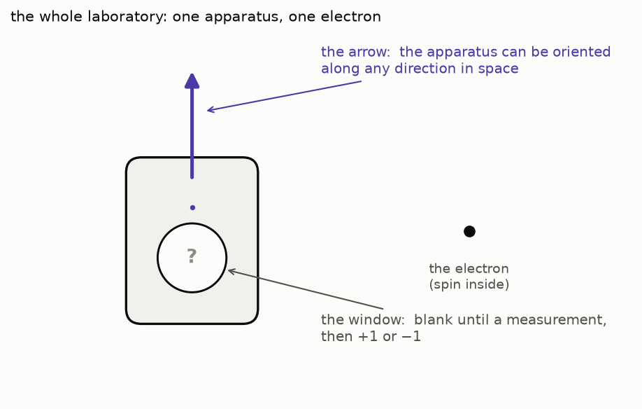
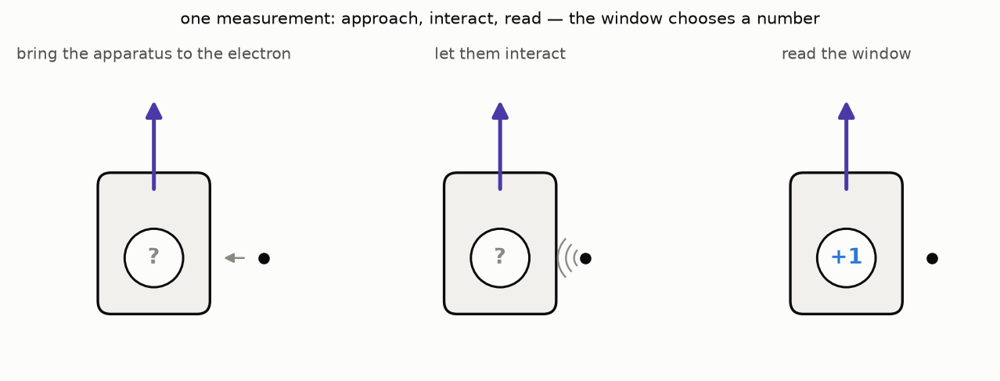
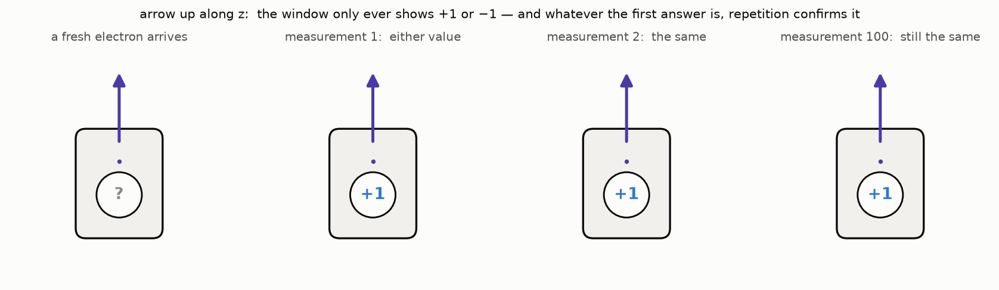
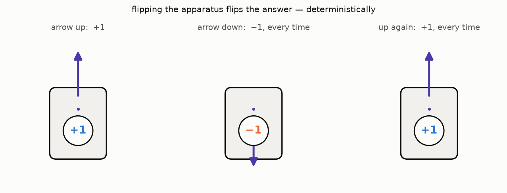
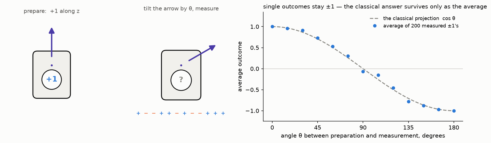

The Fourier road of this blog [ended with a
promise](/posts/the-theorem-with-three-names/#onward): see you in the
quantum world. Welcome — this post opens act three.

The plan of the act is deliberately modest. We will not build the whole
cathedral of quantum mechanics axiom by axiom. We will assemble a small
set of principles — deeply, with proofs — and then spend them on four
classic problems: a particle trapped in a box, quantum tunneling, the
harmonic oscillator, and the orbitals of the hydrogen atom. Every
station of the road will come with a notebook to play with, because
these concepts *want* to be poked at.

But principles come later. Today there is no mathematics at all — only
an experiment. The story of this post — the apparatus, the arrow, the
stubborn ±1 — is retold from chapter 1 of Susskind and Friedman's
*Quantum Mechanics: The Theoretical Minimum* (see the references
below), which we warmly recommend reading in the original. One black
box, one arrow, one window, and
exactly one formula, which is a cosine. By the end of the post the
classical picture of measurement will be quietly, irreparably broken —
and the wreckage will tell us precisely what kind of mathematics we
need to build next.

## The apparatus

Here is the whole laboratory. We have a quantum system — say, a single
electron, of which we care about one property called its
[**spin**](https://en.wikipedia.org/wiki/Spin_(physics)). Physically,
spin is an *intrinsic* form of angular momentum, carried by the
electron the way it carries its charge and its mass — and it makes the
electron behave as a tiny magnet. The name comes from the early picture of a charged ball
spinning about its axis; do not actually picture that — the picture is
historical, and it misleads (for one thing, a point particle has no
axis to spin about). For our story one thing matters: spin is a
*measurable* property of the electron — and everything else about it we
will learn the honest way, from the experiments below.

Our only access to the spin is a measuring device: the apparatus
$\mathcal A$, a black box with two features on the outside:

- an **arrow** painted on its side — the apparatus can be carried
  around and oriented so the arrow points along any direction in space;
- a **window** that is blank until a measurement happens, and then
  shows a number.

(The real-world setup behind this box is the
[Stern–Gerlach experiment](https://en.wikipedia.org/wiki/Stern%E2%80%93Gerlach_experiment);
we keep the box closed on purpose.)

Bring the apparatus close to the electron, let it interact, and read
the window. That single act is what we will call a **measurement** —
the central notion of everything that follows.

## Experiment one: the window shows ±1 — and repetition confirms

Point the arrow up, along the $z$ axis, and measure. The window shows
$+1$. Or $-1$. It never shows $0.3$, never $0.99$, never anything but
those two values — no matter how the electron was produced, no matter
how carefully we prepare the setup.

Now measure the *same* electron again, without touching anything in
between. The window shows the same value as before. And again the third
time, and the hundredth: whatever the first answer was, every following
measurement along the same arrow repeats it.

This looks reassuringly classical. The electron seems to *have* a
value, and the apparatus seems to *read* it. Two clouds are already on
the horizon, though: the value is always one of exactly two, and the
first reading of a fresh electron seems to come out either way.

## Experiment two: flipping the apparatus negates the answer

Take an electron that just measured $+1$ with the arrow up. Turn the
apparatus upside down — the arrow now points along $-z$ — and measure
again. The window shows $-1$, every time. Flip back: $+1$ again.
Deterministically.

This suggests a tidy classical model: the spin is some vector
$\vec \sigma$ attached to the electron, and the apparatus reports the
projection of that vector onto its own arrow. Arrow along the vector:
$+1$; arrow against it: $-1$. So far the model survives — both readings
are projections of the same up-pointing vector.

## Experiment three: turning the arrow

If the projection model is right, it makes a sharp prediction. Prepare
an electron that reads $+1$ with the arrow up — so, classically, its
vector $\vec \sigma$ points up. Now lay the apparatus on its side: the
arrow points along $x$, at $90°$ to the vector. The projection of an
up-pointing unit vector onto a horizontal axis is $0$, so the window
should read $0$.

It reads $+1$. Or $-1$. Never $0$ — the window has exactly two values
it is willing to show, and turning the apparatus does not change that.

But run the experiment many times — each round: prepare $+1$ along $z$,
turn the apparatus to $x$, measure — and record the answers. The
sequence is random, half $+1$ and half $-1$, and its *average* tends to
$0$: exactly the number the classical model promised, delivered in a
way the classical model never imagined.

The general version: prepare $+1$ along the direction $\hat m$, then
measure with the arrow along another direction $\hat n$, at angle
$\theta$ to the first. Classically the window should show the
projection, $\cos \theta$. What actually happens: the window shows
$\pm 1$ at random — and the average over many rounds tends to

$$
\langle \sigma \rangle = \cos \theta.
$$

The classical answer is not wrong — it is the *expectation* of the
quantum answer. Determinism survives only in the average.

## What exactly broke

It is worth saying carefully which classical beliefs these three
experiments destroy, because the mathematics we build next will be
shaped by the wreckage.

**The menu of outcomes is fixed and discrete.** However we orient the
apparatus, the window offers the same two values, $+1$ and $-1$. A
continuous quantity — a projection, smoothly shrinking as the angle
grows — is simply not what a measurement returns. (This is the same
surprise the hydrogen atom serves: its electron radiates energy in a
discrete menu of portions, each appearing with some probability — we
will meet that menu again in the final post of the act.)

**A measurement is not a reading; it is a preparation.** After the
first measurement along a new axis, the outcome repeats along that axis
— but the electron has *lost* its previous certainty: measure along the
old axis again and the answer is random once more. The apparatus does
not reveal a pre-existing value; it *forces* the system into one of its
two answers, and the system stays there until some other axis is
measured. In classical mechanics a measurement is a glance; here it is
a grab.

**The value–state bookkeeping dies.** Classical mechanics identifies
the state of a system with the list of its measured values: record
$(x, v)$ and you *are* holding the state. Here that identification is
impossible — the electron that reads $+1$ along $z$ does not *have* a
value along $x$; it has only a coin it will flip when asked. Whatever
the "state" of a quantum system is, it is not a list of answers. It is
something that *generates* answers, with probabilities, and is changed
by the very act of asking.

## The wishlist

So the mathematics we need must supply, at minimum:

1. **A state object** $\psi$ — one mathematical thing per electron,
   carrying all possible outcomes of every measurement at once, with a
   probability attached to each.
2. **A way to combine outcomes into states.** The electron prepared
   along $z$ and asked along $x$ behaves like "half $+1$, half $-1$" —
   the state must be able to *blend* the definite outcomes, with
   weights.
3. **Measurable quantities as actors, not numbers.** "Spin along
   $\hat n$" is not a number attached to the electron; it is a
   *question*, with its own menu of answers, and different questions
   ($\hat n$ versus $\hat m$) split the same state into different
   blends. Each question deserves a mathematical object of its own.
4. **Measurement as an operation on states.** Asking changes the state
   — the formalism must say into what, and with which probability.
5. **Geometry must enter.** The one number the experiments handed us,
   $\cos \theta = \langle \hat m, \hat n \rangle$, is an inner product
   of directions in ordinary space. The arrow's *position in space*
   decides the statistics — so the state object must talk to
   three-dimensional geometry, while somehow holding two-valued
   answers.

There is a branch of mathematics whose native speech is "combine
objects with weights" and "extract numbers from pairs of objects":
linear algebra — vectors, bases, inner products. The next post opens
that toolbox and makes item 1 and item 2 precise: states will be
vectors, and blends will be *superpositions*. The cosine of item 5 will
have to wait a little longer — it will fall out, squared and halved, on
the surface of a sphere.

## Onward

The road of the act, so the map is on the table from day one: states as
vectors → the continuous basis and an old friend, the Dirac delta → 
observables and where probabilities really come from → the qubit and
the Bloch sphere, where today's apparatus gets its geometry back →
dynamics and the Schrödinger equation, where the Fourier road pays its
promised dividend — and then the four problems: the box, the tunnel,
the oscillator, the hydrogen atom whose discrete menu started the whole
story.

## References

- Leonard Susskind, Art Friedman. *Quantum Mechanics: The Theoretical
  Minimum*. Basic Books, 2014 — chapter 1 is the source of this post's
  experiment, and the book grew out of Susskind's Stanford course,
  [freely available in video](https://theoreticalminimum.com/courses/quantum-mechanics/2012/winter)
  at [theoreticalminimum.com](https://theoreticalminimum.com/).
- The [Quantum Sense](https://www.youtube.com/@quantumsensechannel)
  video series, *Maths of Quantum Mechanics* — the backbone of the
  mathematical posts to come; this post touches its opening question
  (why classical physics fails for the hydrogen atom).
