This post collects two old debts. Back in
[Part 2 of the spectrogram series](/posts/fourier-series-to-spectrogram-part-2/#the-nyquist-frequency)
we *stated* the sampling theorem — a discrete recording, taken fast
enough, loses nothing at all about a continuous signal — and promised the
proof for later. Then
[Four Shades of Fourier](/posts/four-shades-of-fourier/#the-copies-what-sampling-does-to-a-spectrum)
built the machinery and even drew the proof without saying so: row 2 of
the copies picture, the one where the spectral copies sit apart with the
original intact inside each, *is* the theorem — waiting to be read out
loud. Today we read it: what "band-limited" must mean, why the sampling
rate needs a *strict* inequality, how a train of sinc functions rebuilds
every value between the samples — and what wagon wheels in old westerns
have to do with any of it.

Here is today's journey on [the map of Four
Shades](/posts/four-shades-of-fourier/#the-square). Of all the roads on
it we are crossing the dashed one, in bold below — *backwards* along
bridge three, from the sampled world to the analog one, paying the toll
written on it:

## What "band-limited" must mean

A signal is **band-limited** if its spectrum lives inside a finite
window: there is a band edge $B$ with

$$
X(f) = 0 \quad \text{for all } |f| \ge B.
$$

In pictures this is row 1 of the copies figure below: the whole
transform is a single hump that dies out completely before the edges of
the picture — $X$ is identically zero outside a finite stretch of the
frequency axis. Read physically: the signal contains no oscillation
faster than $B$ hertz; above that frequency there is simply nothing to
represent.

Two honest remarks before we lean on this definition. First, strictly
band-limited signals are idealizations: Four Shades
[proved](/posts/four-shades-of-fourier/#do-the-roads-run-back) that a
nonzero signal cannot be band-limited and time-limited at once, and every
real recording ends — so no signal in practice satisfies the definition
exactly. Second, engineering makes the definition true *by force*: before
an ADC ever sees the signal, an analog **anti-aliasing filter** cuts away
everything above a chosen band edge. For sound this costs nothing
audible — the [ear gives up near
$20$ kHz](https://en.wikipedia.org/wiki/Hearing_range) anyway, so a
filter parked just above that discards only what no listener could
miss. (Hold that thought;
it returns when we ask why CDs run at $44.1$ kHz.)

## The theorem, stated

**Theorem.** Let $x$ be band-limited with band edge $B$, and sample it
every $T$ seconds — a sampling rate of $f_s = \frac{1}{T}$. If

$$
f_s > 2B,
$$

then the samples $x(nT)$ determine the continuous signal *completely*:
every value between the samples can be rebuilt, exactly, by the explicit
formula $(\star)$ below.

Both landmarks of [Part 2](/posts/fourier-series-to-spectrogram-part-2/#the-nyquist-frequency)
reappear here with names attached: $2B$ — twice the band — is the
**Nyquist rate**: sample faster than it, and the signal is exactly
recoverable from the samples; sample at it or slower, and recovery is no
longer guaranteed. From the sampler's point of view, $\frac{f_s}{2}$ is
the **Nyquist frequency**: the ceiling below which a signal's spectrum
must stay for a rate of $f_s$ to recover the signal. Note the inequality
is *strict*: $f_s = 2B$ exactly is not enough, and a section below shows
the counterexample where the boundary case fails.

## The proof we already drew

Start from the identity that [bridge three of Four
Shades](/posts/four-shades-of-fourier/#the-copies-what-sampling-does-to-a-spectrum)
derived: sampling a signal every $T$ periodizes its spectrum,

$$
X_d(f) = \frac{1}{T} \sum_{m=-\infty}^{\infty} X(f - m f_s).
$$

Here $X(f)$ is the Fourier transform of the analog signal $x(t)$;
$T$ is the sampling step and $f_s = \frac{1}{T}$ the sampling rate;
$X_d(f) = \sum_n x(nT)\, e^{-2 \pi i f n T}$ is the DTFT — the spectrum
computed from the samples alone; and each integer $m$ contributes one
term $X(f - m f_s)$, a *copy* of the original spectrum slid $m$ grid
steps along the frequency axis (the picture is [the copies figure of
Four Shades](/posts/four-shades-of-fourier/#the-copies-what-sampling-does-to-a-spectrum);
today we need **row 2** of it):

Now put the two hypotheses side by side. Each copy occupies
$(-B, B)$ around its own center; the centers sit $f_s$ apart; and
$f_s > 2B$ means the spacing exceeds the width. So the copies *cannot
touch* — between consecutive copies there is a strip of silence, and the
central period $\left( -\frac{f_s}{2}, \frac{f_s}{2} \right)$ contains
exactly one thing: the original $X(f)$, intact. That is row 2 of the
picture above, and that one bright row already contains the whole theorem:
**nothing about the analog signal was lost**, because its entire
transform sits undamaged inside the spectrum of the sampled one.

It remains to cut the copy out and turn it back into the signal.
Multiply $X_d$ by the rectangular cutter

$$
H(f) = \begin{cases} T, & |f| \le \frac{f_s}{2}, \\ 0, & \text{otherwise} \end{cases} \;=\; T \cdot I_{[-f_s/2,\, f_s/2]}(f)
$$

— $T$ times the indicator of the central period ($I_A$ equals $1$ on
the set $A$ and $0$ elsewhere); the factor is $T$ rather than $1$ so as
to cancel the $\frac{1}{T}$ the copies formula carries:

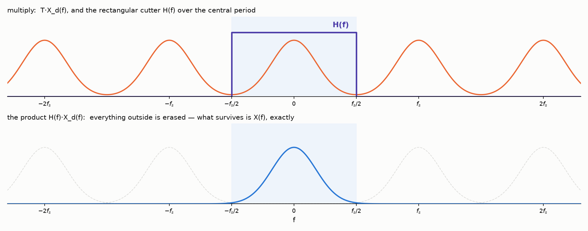

Everything outside the rectangle is erased, and the central copy
survives untouched:

$$
\begin{aligned}
H(f)\, X_d(f) &= T \cdot I_{[-f_s/2,\, f_s/2]}(f) \cdot \frac{1}{T} \sum_{m=-\infty}^{\infty} X(f - m f_s) \\
&= I_{[-f_s/2,\, f_s/2]}(f) \sum_{m=-\infty}^{\infty} X(f - m f_s) \;=\; X(f).
\end{aligned}
$$

Now the Fourier integral rebuilds the signal from it:

$$
\begin{aligned}
x(t) &= \int_{-\infty}^{\infty} X(f)\, e^{2 \pi i f t}\, df
      = \int_{-f_s/2}^{f_s/2} T\, X_d(f)\, e^{2 \pi i f t}\, df \\
     &= \sum_{n=-\infty}^{\infty} x(nT) \int_{-f_s/2}^{f_s/2} T\, e^{2 \pi i f (t - nT)}\, df
\end{aligned}
$$

— in the last step we substituted the DTFT sum
$X_d(f) = \sum_n x(nT)\, e^{-2 \pi i f n T}$ and swapped the sum with the
integral (the by-now-familiar juncture: honest for absolutely summable
samples, by the same Weierstrass argument as in Four Shades). The
remaining integral is an old friend: it is the [rectangle-to-sinc
computation from bridge two of Four
Shades](/posts/four-shades-of-fourier/#bridge-two-fourier-transform--fourier-series),
run with the roles of time and frequency swapped. Writing $\tau = t - nT$:

$$
\begin{aligned}
\int_{-f_s/2}^{f_s/2} T\, e^{2 \pi i f \tau}\, df
 &= T\, \frac{e^{\pi i f_s \tau} - e^{-\pi i f_s \tau}}{2 \pi i \tau}
  = T\, \frac{\sin(\pi f_s \tau)}{\pi \tau} \\
 &= \frac{\sin(\pi f_s \tau)}{\pi f_s \tau}
  = \operatorname{sinc}(f_s \tau),
\end{aligned}
$$

the [sinc](https://en.wikipedia.org/wiki/Sinc_function) again — this time
in the *time* domain, one bump per sample:

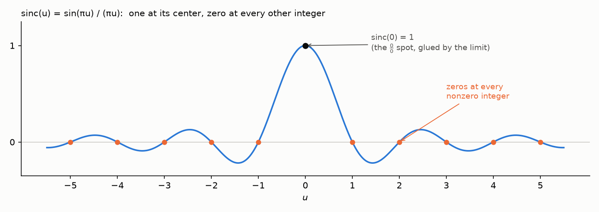

Put the pieces together:

$$
x(t) = \sum_{n=-\infty}^{\infty} x(nT)\,
\operatorname{sinc}\!\left( \frac{t - nT}{T} \right).
\tag{$\star$}
$$

This is the
[Whittaker–Shannon interpolation formula](https://en.wikipedia.org/wiki/Whittaker%E2%80%93Shannon_interpolation_formula),
and it deserves a slow read. Each sample $x(nT)$ launches its own sinc,
centered at its own instant $nT$ and scaled to its own height. At the
instant $t = mT$ the formula returns exactly $x(mT)$ — the $m$-th sinc
equals $1$ at its center (at that one point its formula reads
$\frac{0}{0}$, and the value $1$ is the classic limit
$\frac{\sin u}{u} \to 1$ — the black dot in the picture above) while
every other sinc is passing through one of its zeros, so no neighbor
interferes:

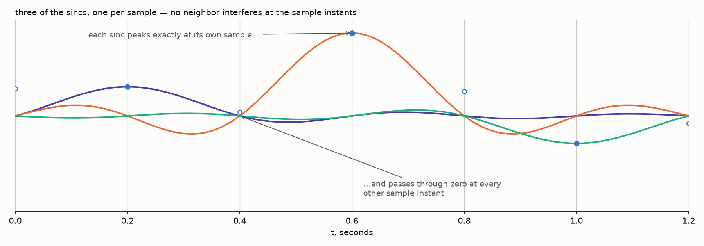
 *Between* the instants, all the
sincs speak at once, and their sum fills in the continuous curve — the
values the recording never measured, restored by the theorem. This is
the third interpolation of our series, kin to two we have already met —
[Part 2's green
model](/posts/fourier-series-to-spectrogram-part-2/#what-does-xk-measure)
threading every sample, and the Dirichlet reconstruction of [Four
Shades' return roads](/posts/four-shades-of-fourier/#do-the-roads-run-back).
Those two lived in periodic worlds with finitely many samples per
period; the sinc train is their full-line sibling — infinitely many
samples, no period, the entire time axis rebuilt.

And here is the formula at work on a concrete signal — three sinusoids
with band edge $B = 2$ Hz, sampled at $f_s = 5$ Hz, comfortably above
the Nyquist rate $2B = 4$ Hz:

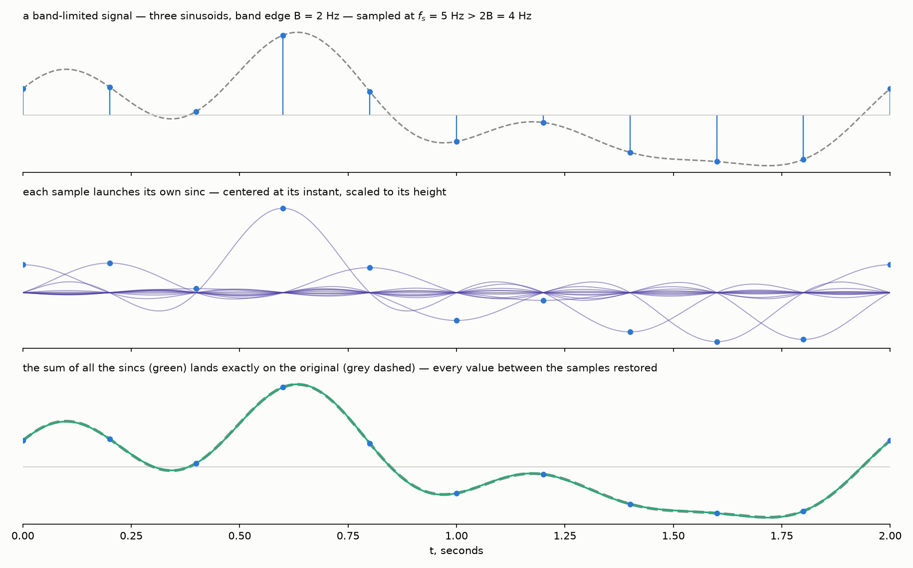

The middle row is the slow read made visible: one scaled sinc per
sample, peaking at its own sample and silent at all the others. The
bottom row is the theorem itself: the sum of the sincs lands exactly on
the original — the green curve covers the grey dashed one entirely,
every value between the samples included.

## The boundary case bites

Why must the inequality be strict? Sample at the Nyquist rate *exactly*,
$f_s = 2B$, and aim the sampler at the worst inhabitant of the band — a
sine sitting right at the edge, $x(t) = \sin(2 \pi B t)$. The samples
land at $t = \frac{n}{2B}$:

$$
x\!\left( \frac{n}{2B} \right) = \sin(\pi n) = 0
\qquad \text{for every integer } n.
$$

Every sample is zero — the sine is measured precisely at its zero
crossings:

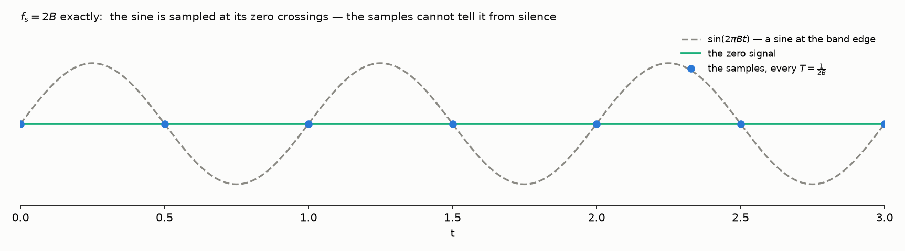

The recording is empty, indistinguishable from a recording of silence.
Two different signals — the edge sine and the zero signal — pass through
the same samples, so *no* formula, $(\star)$ or any other, can promise
to restore "the" original: the information was lost at the sampling
stage, before any reconstruction began.

The copies picture says the same thing in the frequency domain. At
$f_s = 2B$ the neighboring copies do not overlap — but they *touch*: the
edge of each copy lands exactly on the edge of the next. Our sine lives
entirely on that shared edge, and its spectral spikes cancel against
their mirror twins from the neighboring copy — the spectrum of the
samples comes out identically zero, which is the frequency-domain face
of the empty recording. Touching is already too much; hence the strict
inequality.

## Aliasing, or the wheels that spin backwards

Start from an identity that holds at *any* sampling rate: at the
sample instants $t = nT$,

$$
e^{2 \pi i (f - f_s)\, n T} = e^{2 \pi i f n T} \cdot e^{-2 \pi i n}
= e^{2 \pi i f n T},
$$

so the frequencies $f$, $f \pm f_s$, $f \pm 2 f_s, \dots$ produce
*identical* samples — sampling always confuses each such family of
frequencies. The copies formula states the very same fact on the
frequency axis: $X_d$ stacks the shifted copies $X(f - m f_s)$ on top
of one another precisely because, to the samples, all the frequencies
of one family are indistinguishable. The theorem's hypothesis is what keeps
the confusion harmless: exactly one member of every family fits inside
the window $\left( -\frac{f_s}{2}, \frac{f_s}{2} \right)$. One
always exists — subtract from any frequency the nearest multiple of
$f_s$, and the remainder is at most $\frac{f_s}{2}$ away from zero —
and two never fit at once, because distinct members sit at least $f_s$
apart while the window is only $f_s$ wide. For a signal band-limited
below $\frac{f_s}{2}$ the in-window member is the true one — so picking the in-window candidate, which is all a reconstruction
can ever do, picks correctly. Both halves of that story fit in one
picture:

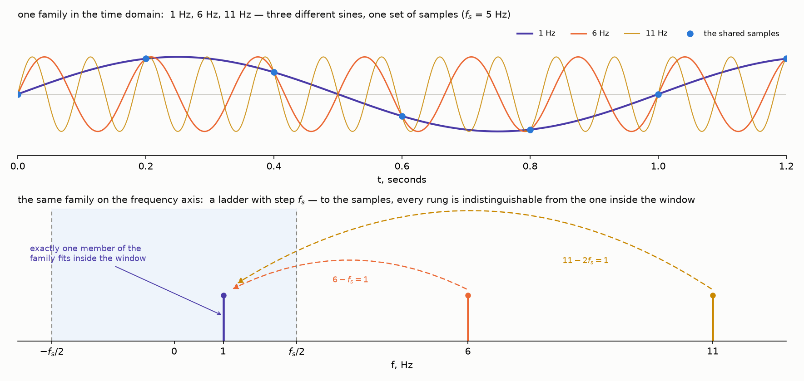

Now break the hypothesis: sample *slower*
than the Nyquist rate, so that the copies overlap — row 3 of the copies
picture, back on stage with today's villain at full strength:

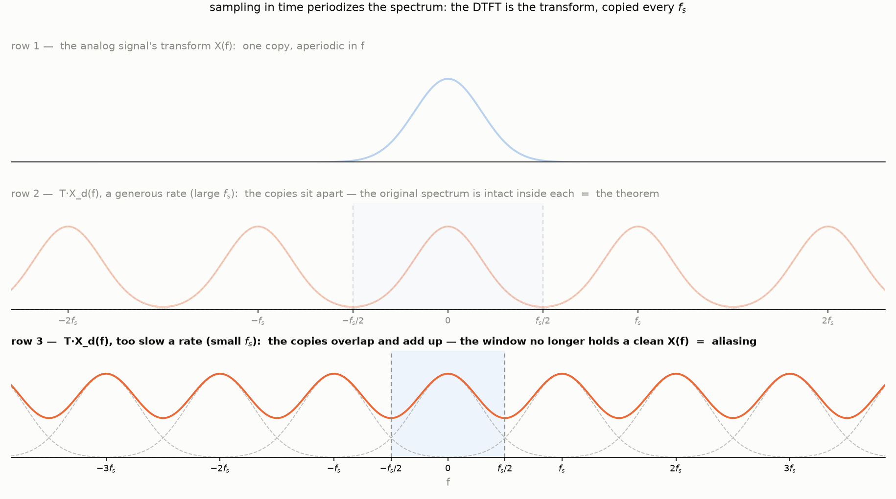

The true frequency is pushed *outside* the window, and the
family member left inside is an impostor. Concretely: sample the $6$ Hz
member of the family above at $f_s = 5$ Hz. The tone sits above
$\frac{f_s}{2} = 2.5$ Hz, its in-window family member is
$6 - 5 = 1$ Hz — and, as the family picture already showed, the samples
of the $6$ Hz sine are exactly the samples of the $1$ Hz sine:

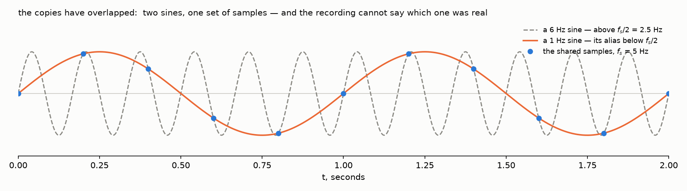

The recording cannot say which candidate was real, so a $6$ Hz tone
goes in and a $1$ Hz impostor comes out. The impostor has a
name — an [**alias**](https://en.wikipedia.org/wiki/Aliasing) — and the
phenomenon is not exotic: you have watched it in every western. Film
runs at $24$ frames per second — a sampler at $24$ Hz pointed at a
stagecoach wheel. A wheel with $k$ spokes looks the same after
$\frac{1}{k}$ of a turn, so the camera effectively watches a periodic
pattern whose frequency is $k$ times the rotation rate — far above
$12$ Hz for any wheel at speed. The pattern aliases. Spokes advancing
slightly *less* than one full spoke-step per frame land, in every new
frame, a little *behind* the previous frame's spoke positions — and the
eye reads a slow rotation backwards. Exactly one step per frame, and
the wheel stands still under a galloping coach:

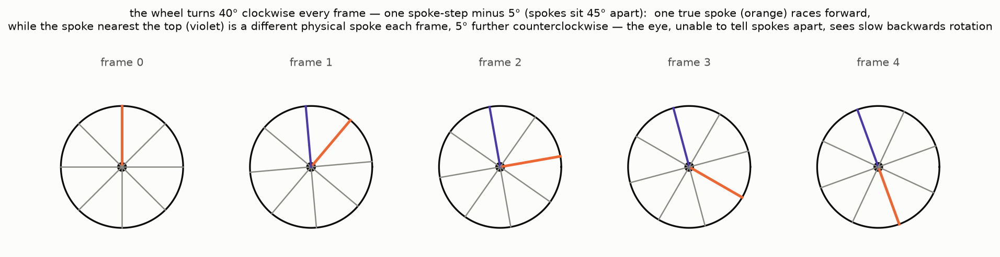

That is the
[wagon-wheel effect](https://en.wikipedia.org/wiki/Wagon-wheel_effect),
and its kin are everywhere: a fan under a
[strobe light](https://en.wikipedia.org/wiki/Stroboscopic_effect), the
frozen propellers in phone videos of airplanes.

The dictionary between the wheel and the theorem is short. Film is
sampling: one frame — one sample, so let us measure frequencies *per
frame*; then the sampling rate is $f_s = 1$ by definition, and the
window $\left( -\frac{f_s}{2}, \frac{f_s}{2} \right)$ is
$\left( -\frac{1}{2}, \frac{1}{2} \right)$. The signal is the spoke
*pattern*, and its natural unit is the spoke-step: *one pattern-period
= one spoke-step = $45°$*. In the frames above the wheel turns $40°$
per frame, so the true frequency is
$f_0 = \frac{40}{45} = \frac{8}{9}$ of a period per frame — outside
the window: the hypothesis $f_0 \lt \frac{1}{2}$ is broken. (It is
broken for any real wheel at speed — spokes sweep past far more often
than twelve times a second, half of film's $24$.) The window converts
into the shaded sector, $\pm \frac{45°}{2} = \pm 22.5°$; the
in-window family member, $\frac{8}{9} - 1 = -\frac{1}{9}$ of a
period, is $-5°$ per frame — the slow backwards drift, this time
computed rather than observed. (For a rotating pattern a negative
frequency simply means turning the other way.)

And here is what an honest frame rate looks like. Give the film eight
times the frames, so the wheel turns only $5°$ per true frame — safely
inside the window — and the illusion evaporates:

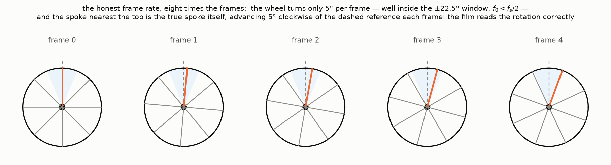

Eight times is comfort, not necessity: *any* rate that keeps the turn
per frame under half a spoke-step — any $f_s > 2 f_0$ — is honest.
Here is a barely sufficient one, $20°$ per frame, just under the
threshold. The jumps are large, but from each frame to the next every
spoke still lands *closer to its own previous position than to its
neighbor's* — and that is the real criterion: the eye pairs each spoke
with the nearest spoke of the previous frame, and sampling is honest
exactly when this pairing is the true one:

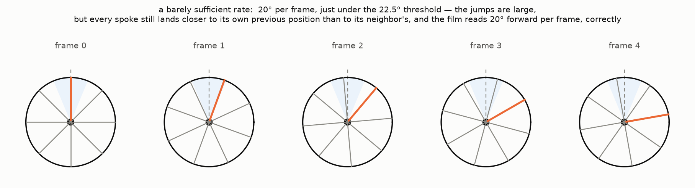

Push to the threshold itself — exactly half a spoke-step per frame,
$f_0 = \frac{1}{2}$ — and the pairing becomes a coin toss: each spoke
lands exactly halfway between two old positions, the pattern merely
alternates, and forwards is indistinguishable from backwards — the
wheel-world twin of the edge sine sampled at its zero crossings:

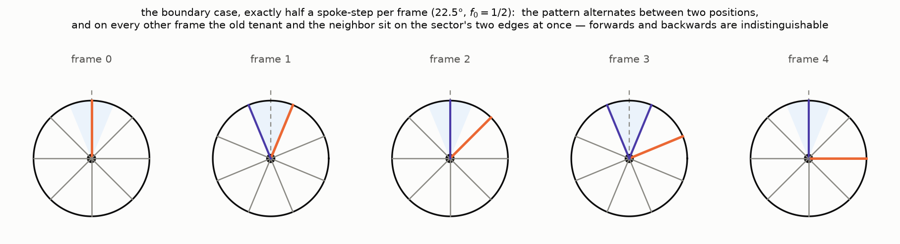

Past the threshold the pairing goes wrong — that is our first strip,
$40°$ per frame read as $5°$ backwards. And one speed deserves its own
portrait — the illusion's fixed point. At
exactly one full spoke-step per frame every spoke lands precisely on
its neighbor's old position — every frame is identical, and the film
sees a standing wheel under a galloping coach, the alias at frequency
zero. A shade slower and the wheel crawls backwards; a shade faster,
forwards: the whole cycle repeats every spoke-step:

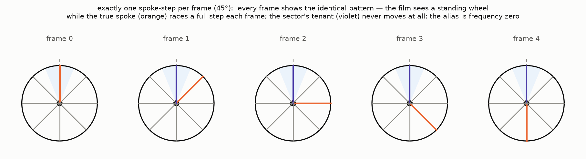

The threat of aliasing also explains a famous number. Human hearing ends near
$20$ kHz, so audio needs $f_s > 40$ kHz — and CDs run at
[$44.1$ kHz](https://en.wikipedia.org/wiki/44,100_Hz). The extra
$4.1$ kHz is working room for the anti-aliasing filter: an analog
low-pass cannot cut off instantly, so it passes everything up to
$20$ kHz and fades to silence across the $20$–$22.05$ kHz gap — and
whatever survives in that gap is harmless, being both inaudible and
below $\frac{f_s}{2}$. (Why $44100$ and not a round
$44000$? A relic: early digital audio was stored on video recorders,
and $44100$ samples per second is what fits as three samples per line
on both TV standards of the era.)

## Three names, four people

The theorem's name depends on where you learned it, and every version
is defensible. [Harry
Nyquist](https://en.wikipedia.org/wiki/Harry_Nyquist) (1928) studied
telegraphy and showed that a channel of band $B$ carries at most $2B$
independent pulses per second — the critical *rate* is rightly his,
though he never stated the reconstruction theorem. [E. T.
Whittaker](https://en.wikipedia.org/wiki/E._T._Whittaker) (1915) had
already built the sinc series $(\star)$ as pure interpolation
mathematics, with no signals in sight. [Vladimir
Kotelnikov](https://en.wikipedia.org/wiki/Vladimir_Kotelnikov) (1933)
was the first to state and prove the sampling theorem as an engineering
fact — in a Soviet radio-engineering conference paper that the West did
not read for decades. And [Claude
Shannon](https://en.wikipedia.org/wiki/Claude_Shannon) (1949) proved it
again as a foundation stone of information theory, and it entered the
world's textbooks under his name. So the Russian literature says
*Kotelnikov's theorem*, the Western says
[*Nyquist–Shannon*](https://en.wikipedia.org/wiki/Nyquist%E2%80%93Shannon_sampling_theorem),
mathematicians remember Whittaker's *cardinal series* — three names,
four people, one road across the map.

## Onward

With this post the Fourier road of the blog closes its loop. The
trilogy built the discrete world from sound up; Four Shades drew the
map and its law; today the dashed road home is paved — samples back to
the analog signal, toll checked at the gate. The debts are settled.

The blog's next journey is quantum mechanics — a change of subject on
the surface, and secretly a continuation. In quantum mechanics a
particle's position and momentum descriptions are a *Fourier pair* — the momentum wavefunction is the
Fourier transform of the position one — and the uncertainty principle
is [Part 3's time–frequency
trade-off](/posts/fourier-series-to-spectrogram-part-3/#the-trade-off-you-cannot-escape)
wearing a lab coat: a signal cannot be narrow in time and in frequency
at once, and a particle cannot be sharp in position and in momentum at
once — for exactly the same mathematical reason. The map stays open;
the roads keep going. See you in the quantum world.
