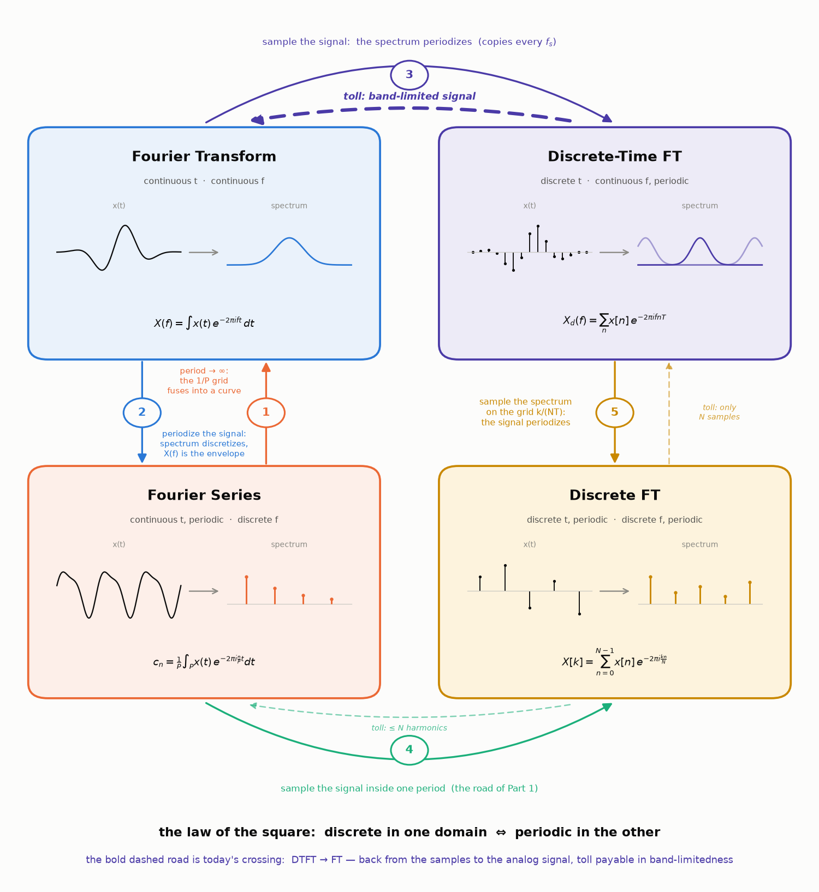
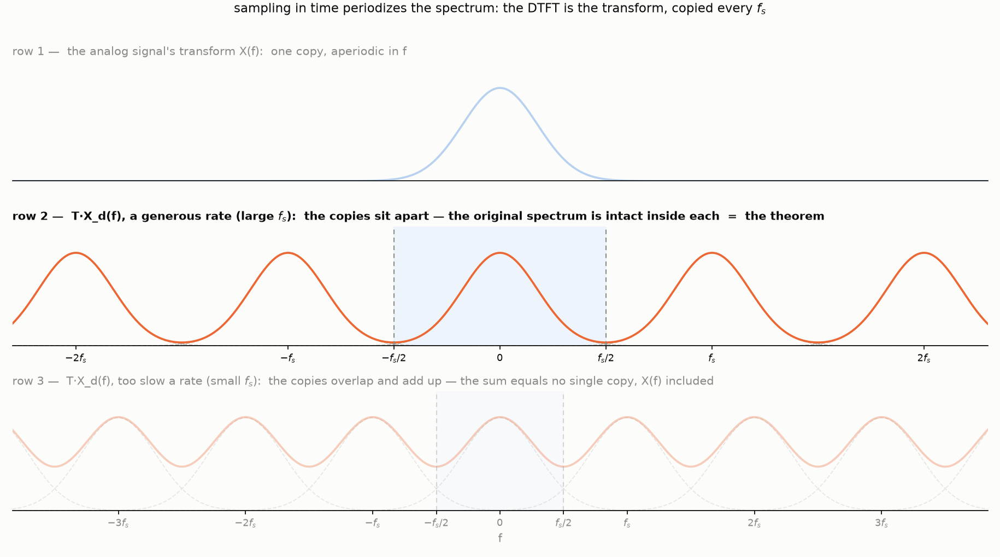

This post collects two old debts. Back in
[Part 2 of the spectrogram series](/posts/fourier-series-to-spectrogram-part-2/#the-nyquist-frequency)
we *stated* the sampling theorem — a discrete recording, taken fast
enough, loses nothing at all about a continuous signal — and promised the
proof for later. Then
[Four Shades of Fourier](/posts/four-shades-of-fourier/#the-copies-what-sampling-does-to-a-spectrum)
built the machinery and even drew the proof without saying so: row 2 of
the copies picture, the one where the spectral copies sit apart with the
original intact inside each, *is* the theorem — waiting to be read out
loud. Today we read it: what "band-limited" must mean, why the sampling
rate needs a *strict* inequality, how a train of sinc functions rebuilds
every value between the samples — and what wagon wheels in old westerns
have to do with any of it.

Here is today's journey on [the map of Four
Shades](/posts/four-shades-of-fourier/#the-square). Of all the roads on
it we are crossing the dashed one, in bold below — *backwards* along
bridge three, from the sampled world to the analog one, paying the toll
written on it:

## What "band-limited" must mean

A signal is **band-limited** if its spectrum lives inside a finite
window: there is a band edge $B$ with

$$
X(f) = 0 \quad \text{for all } |f| \ge B.
$$

In pictures this is row 1 of the copies figure below: the whole
transform is a single hump that dies out completely before the edges of
the picture — $X$ is identically zero outside a finite stretch of the
frequency axis. Read physically: the signal contains no oscillation
faster than $B$ hertz; above that frequency there is simply nothing to
represent.

Two honest remarks before we lean on this definition. First, strictly
band-limited signals are idealizations: Four Shades
[proved](/posts/four-shades-of-fourier/#do-the-roads-run-back) that a
nonzero signal cannot be band-limited and time-limited at once, and every
real recording ends — so no signal in practice satisfies the definition
exactly. Second, engineering makes the definition true *by force*: before
an ADC ever sees the signal, an analog **anti-aliasing filter** cuts away
everything above a chosen band edge. For sound this costs nothing
audible — the [ear gives up near
$20$ kHz](https://en.wikipedia.org/wiki/Hearing_range) anyway, so a
filter parked just above that discards only what no listener could
miss. (Hold that thought;
it returns when we ask why CDs run at $44.1$ kHz.)

## The theorem, stated

**Theorem.** Let $x$ be band-limited with band edge $B$, and sample it
every $T$ seconds — a sampling rate of $f_s = \frac{1}{T}$. If

$$
f_s > 2B,
$$

then the samples $x(nT)$ determine the continuous signal *completely*:
every value between the samples can be rebuilt, exactly, by the explicit
formula $(\star)$ below.

Both landmarks of [Part 2](/posts/fourier-series-to-spectrogram-part-2/#the-nyquist-frequency)
reappear here with names attached: $2B$ — twice the band — is the
**Nyquist rate**: sample faster than it, and the signal is exactly
recoverable from the samples; sample at it or slower, and recovery is no
longer guaranteed. From the sampler's point of view, $\frac{f_s}{2}$ is
the **Nyquist frequency**: the ceiling below which a signal's spectrum
must stay for a rate of $f_s$ to recover the signal. Note the inequality
is *strict*: $f_s = 2B$ exactly is not enough, and a section below shows
the counterexample where the boundary case fails.

## The proof we already drew

Start from the identity that [bridge three of Four
Shades](/posts/four-shades-of-fourier/#the-copies-what-sampling-does-to-a-spectrum)
derived: sampling a signal every $T$ periodizes its spectrum,

$$
X_d(f) = \frac{1}{T} \sum_{m=-\infty}^{\infty} X(f - m f_s).
$$

Here $X(f)$ is the Fourier transform of the analog signal $x(t)$;
$T$ is the sampling step and $f_s = \frac{1}{T}$ the sampling rate;
$X_d(f) = \sum_n x(nT)\, e^{-2 \pi i f n T}$ is the DTFT — the spectrum
computed from the samples alone; and each integer $m$ contributes one
term $X(f - m f_s)$, a *copy* of the original spectrum slid $m$ grid
steps along the frequency axis (the picture is [the copies figure of
Four Shades](/posts/four-shades-of-fourier/#the-copies-what-sampling-does-to-a-spectrum);
today we need **row 2** of it):

Now put the two hypotheses side by side. Each copy occupies
$(-B, B)$ around its own center; the centers sit $f_s$ apart; and
$f_s > 2B$ means the spacing exceeds the width. So the copies *cannot
touch* — between consecutive copies there is a strip of silence, and the
central period $\left( -\frac{f_s}{2}, \frac{f_s}{2} \right)$ contains
exactly one thing: the original $X(f)$, intact. That is row 2 of the
picture above, and that one bright row already contains the whole theorem:
**nothing about the analog signal was lost**, because its entire
transform sits undamaged inside the spectrum of the sampled one.

It remains to cut the copy out and cash it in. Multiply $X_d$ by the
rectangular cutter

$$
H(f) = \begin{cases} T, & |f| \lt \frac{f_s}{2}, \\ 0, & \text{otherwise} \end{cases}
$$

— zero outside the central period, and $T$ (not $1$) inside, to cancel
the $\frac{1}{T}$ the copies formula carries. Then $H(f)\, X_d(f) = X(f)$
*exactly*, and the Fourier integral of bridge one rebuilds the signal
from it:

$$
\begin{aligned}
x(t) &= \int_{-\infty}^{\infty} X(f)\, e^{2 \pi i f t}\, df
      = \int_{-f_s/2}^{f_s/2} T\, X_d(f)\, e^{2 \pi i f t}\, df \\
     &= \sum_{n=-\infty}^{\infty} x(nT) \int_{-f_s/2}^{f_s/2} T\, e^{2 \pi i f (t - nT)}\, df
\end{aligned}
$$

— in the last step we substituted the DTFT sum
$X_d(f) = \sum_n x(nT)\, e^{-2 \pi i f n T}$ and swapped the sum with the
integral (the by-now-familiar juncture: honest for absolutely summable
samples, by the same Weierstrass argument as in Four Shades). The
remaining integral is an old friend: it is bridge two's
rectangle-to-sinc computation, run with the roles of time and frequency
swapped. Writing $\tau = t - nT$:

$$
\begin{aligned}
\int_{-f_s/2}^{f_s/2} T\, e^{2 \pi i f \tau}\, df
 &= T\, \frac{e^{\pi i f_s \tau} - e^{-\pi i f_s \tau}}{2 \pi i \tau}
  = T\, \frac{\sin(\pi f_s \tau)}{\pi \tau} \\
 &= \frac{\sin(\pi f_s \tau)}{\pi f_s \tau}
  = \operatorname{sinc}(f_s \tau),
\end{aligned}
$$

the [sinc](https://en.wikipedia.org/wiki/Sinc_function) again — this time
in the *time* domain, one bump per sample. Put the pieces together:

$$
x(t) = \sum_{n=-\infty}^{\infty} x(nT)\,
\operatorname{sinc}\!\left( \frac{t - nT}{T} \right).
\tag{$\star$}
$$

This is the
[Whittaker–Shannon interpolation formula](https://en.wikipedia.org/wiki/Whittaker%E2%80%93Shannon_interpolation_formula),
and it deserves a slow read. Each sample $x(nT)$ launches its own sinc,
centered at its own instant $nT$ and scaled to its own height. At the
instant $t = mT$ the formula returns exactly $x(mT)$ — the $m$-th sinc
equals $1$ at its center while every other sinc is passing through one
of its zeros, so no neighbor interferes. *Between* the instants, all the
sincs speak at once, and their sum fills in the continuous curve — the
values the recording never measured, restored by the theorem. This is
the continuous twin of the two interpolations we have already met: [Part
2's green model](/posts/fourier-series-to-spectrogram-part-2/#what-does-xk-measure)
threading every sample, and the Dirichlet reconstruction of [Four
Shades' return roads](/posts/four-shades-of-fourier/#do-the-roads-run-back).

## The boundary case bites

*(to come: a sine at exactly $f_s/2$, sampled in its zero crossings)*

## Aliasing, or the wheels that spin backwards

*(to come: overlapping copies, two sinusoids through the same samples,
the wagon-wheel effect, why CDs run at 44.1 kHz)*

## Three names, four people

*(to come: Whittaker 1915, Kotelnikov 1933, Shannon 1949, and Nyquist's
rate)*

## Onward

*(to come: the Fourier road pauses here; tease the next journey —
quantum mechanics, where the position–momentum pair is a Fourier pair
and the uncertainty principle is Part 3's time–frequency trade-off in a
lab coat)*
