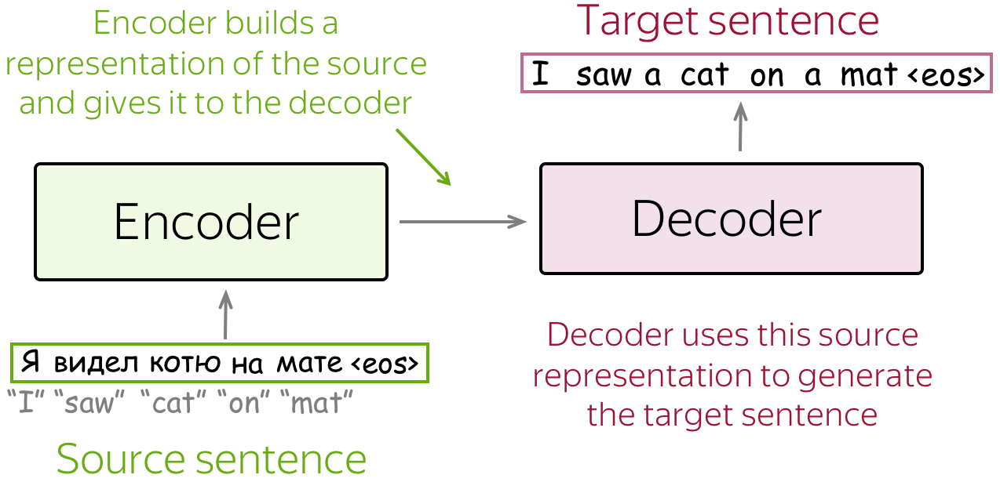
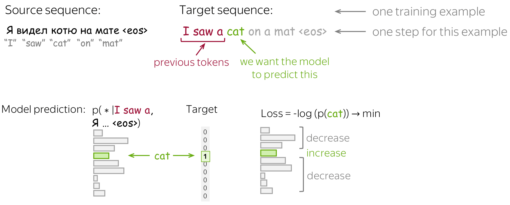
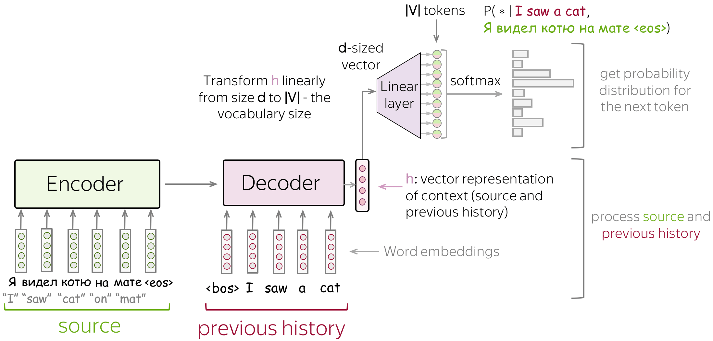
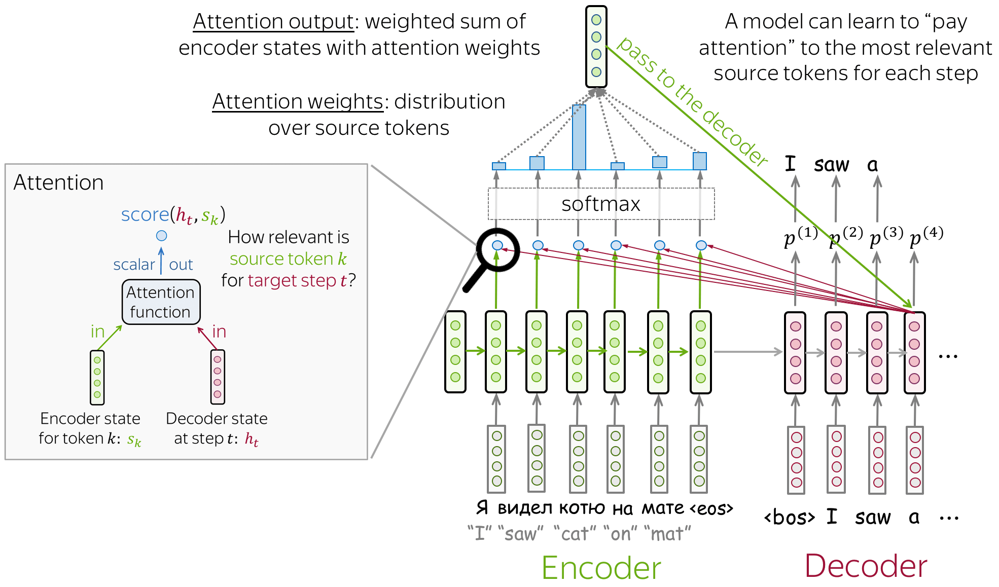

Natural language processing spans many different tasks: text classification (say, spam vs. not spam), sentiment analysis, entity extraction, question answering, summarization, text generation and others. Among them, **machine translation** stands apart.

Translation was the area where a broad audience first noticed a dramatic jump in quality: systems suddenly learned to translate coherent texts so well that the output often needed only light editing — and sometimes almost none. But, more importantly, it quickly became clear that the ideas and methods born in translation actually solve a much more general problem: transforming one message into another while preserving its meaning. In this form, "translation" generalizes far beyond natural languages — to summarization (text → text), code generation (text → code), code explanation (code → text), and even multimodal transformations (text → image, text → audio, image → image, and so on).

Much of this breakthrough is tied to the **Transformer** architecture ([Vaswani et al., 2017](https://papers.nips.cc/paper/7181-attention-is-all-you-need.pdf)), which made training on large amounts of data substantially more efficient and gave models a new level of expressiveness. Yet the Transformer did not appear out of nowhere: it builds on several key ideas, which we will briefly recall in this introduction — the sequence-to-sequence paradigm, language models, and the attention mechanism, in its classical formulation usually associated with the work of Bahdanau and co-authors ([Bahdanau et al., 2014](https://arxiv.org/abs/1409.0473)).

## Formal setup (Sequence to Sequence)

Formally, the translation task can be described as follows: we have an input sequence $x=(x_1,\dots,x_m)$ and an output sequence $y=(y_1,\dots,y_n)$ (their lengths may differ). We want to find the translation $y$ that is most probable given the input $x$:

$$
y^* = \arg\max_y\, p(y\mid x).
$$

One standard way to model such tasks is the **encoder-decoder** architecture. It has two main parts:

- the **encoder** reads the source sequence and builds its internal representation;
- the **decoder** uses this representation to generate the target sequence.

For example, if the source sentence is «Я видел кота на мате», the encoder transforms it into a vector representation capturing the "overall meaning" of the input sentence, and the decoder generates the translation from this representation: "I saw a cat on a mat".

*Image source: [lena-voita.github.io](https://lena-voita.github.io/nlp_course/seq2seq_and_attention.html)*

We will see different models below, but they all rely on the same general scheme: first encode the input, then decode the output from this representation.

## Language models

A language model is a function that can estimate how "plausible" a string of text is:

- the input of a language model is $x_1,\dots,x_n$ — the tokens of a sequence of length $n$,
- the output is $p(x_1,\dots,x_n)$ — the probability of the **whole** sequence among all possible sequences of length $n$.

Estimating the probability of an entire sentence directly — as a single indivisible object — is very hard: there are too many possible sentences, and for most of them we will never have enough observations. So, instead of treating a sentence as one "atomic" unit, let us decompose its probability into probabilities of smaller fragments.

For example, take the sentence "I saw a cat on a mat" and read it word by word. At each step we estimate the probability of the next token given all the context seen so far. Previous computations are not wasted: when a new word arrives, we simply refine the probability of the whole sequence by multiplying it by the probability of the new token given the already-known prefix.

$$
\begin{aligned}
p(\text{I saw a cat})
&= p(\text{I}) \cdot p(\text{saw}\mid\text{I}) \cdot p(\text{a}\mid\text{I saw}) \\
&\quad \cdot p(\text{cat}\mid\text{I saw a}).
\end{aligned}
$$

Formally, this is just the chain rule from probability theory:

$$
\begin{aligned}
p(x_1,\dots,x_n)
&= p(x_1)\,p(x_2\mid x_1)\,p(x_3\mid x_1,x_2)\,\dots\,p(x_n\mid x_1,\dots,x_{n-1}).
\end{aligned}
$$

That is,

$$
p(x_1,\dots,x_n)=\prod_{t=1}^{n} p(x_t\mid x_1,\dots,x_{t-1}).
$$

One usually introduces the shorthand $x_{\lt t}= (x_1,\dots,x_{t-1})$ and writes compactly:

$$
p(x_1,\dots,x_n)=\prod_{t=1}^{n} p(x_t\mid x_{\lt t}).
$$

Once we have a language model, we can use it to generate text. This is done one token at a time: at each step the model predicts the probability distribution of the next token given the preceding context, and we then pick or sample a token from this distribution.

#### Training and the cross-entropy loss

Neural language models are trained to predict the probability distribution of the next token given the preceding context. Initially the model predicts a uniform distribution over all tokens, but during training it learns to assign more and more probability to the correct next token.

Formally, let $y_1, \dots, y_n$ be a training sequence of tokens. Then at step $t$ the model predicts the distribution

$$
p^{(t)} = p(* \mid y_1, \dots, y_{t-1}).
$$

The target distribution at this step is $p^* = \mathrm{one\text{-}hot}(y_t)$: we want the model to assign probability 1 to the correct token $y_t$ and probability 0 to all other tokens.

At this point we may notice that what we are looking at is nothing other than a classification problem: the classes are the different tokens, and the target class is the correct token at the current step. The standard loss function for such a problem is **cross-entropy**. For the target distribution $p^*$ and the predicted distribution $p$ it is written as:

$$
\mathrm{Loss}(p^*, p) = -p^* \log(p) = -\sum_{i=1}^{|V|} p_i^* \log(p_i).
$$

Here $|V|$ is the vocabulary size, i.e. the number of possible tokens over which the model spreads its probability.

Since only one component $p_i^*$ of the one-hot distribution is nonzero — the one corresponding to the correct token $y_t$ — the expression simplifies:

$$
\mathrm{Loss}(p^*, p) = -\log(p_{y_t}) = -\log p(y_t \mid y_{\lt t}).
$$

That is, at each step we minimize the negative log-probability of the correct next token. The higher the probability the model assigns to the correct token, the lower the loss.

*Image source: [lena-voita.github.io](https://lena-voita.github.io/nlp_course/seq2seq_and_attention.html)*

For the whole sequence, the loss is obtained by summing over all steps:

$$
\mathcal{L} = -\sum_{t=1}^{n} \log p(y_t \mid y_{\lt t}).
$$

This is exactly the quantity that is usually minimized when training a language model.

#### Conditional language models

In the section on language models we learned to estimate the **unconditional** probability $p(y)$ of a token sequence $y=(y_1, y_2, \dots, y_n)$. The step from such language models to sequence-to-sequence models amounts to replacing the unconditional probability $p(y)$ with $p(y \mid x)$: the probability of the output sequence $y$ given the source sequence $x$.

This is why sequence-to-sequence tasks can be viewed as **conditional language modeling** (*CLM*). Such models work almost like ordinary language models, but additionally receive information about the source $x$.

For an ordinary language model:

$$
P(y_1, y_2, \dots, y_n) = \prod_{t=1}^{n} p(y_t \mid y_{\lt t}).
$$

For a conditional language model:

$$
P(y_1, y_2, \dots, y_n \mid x) = \prod_{t=1}^{n} p(y_t \mid y_{\lt t}, x).
$$

Here $x$ is the condition — the source information the model relies on during generation.

Importantly, conditional language modeling is not only a way to solve sequence-to-sequence tasks. In a more general sense, $x$ does not have to be a sequence of tokens at all. For example, in image captioning, $x$ is an image and $y$ is a text description of that image.

Since the only difference from ordinary language models is the presence of the source $x$, modeling and training are organized very similarly. At a high level, training and generation look like this:

- feed the network the source and the already-generated tokens of the target sequence;
- obtain a vector representation of the context — both the source and the previous target history;
- from this representation, predict the probability distribution of the next token.

*Image source: [lena-voita.github.io](https://lena-voita.github.io/nlp_course/seq2seq_and_attention.html)*

## Bahdanau attention

Before turning to the mechanism itself, let us take a closer look at the encoder-decoder architecture described at the beginning. It has a bottleneck: the entire meaning of the input sentence — however long it may be — has to be packed into a **single fixed-size vector**. While sentences are short, this is tolerable, but the longer the input, the more information is lost in the compression. Worse still, the decoder sees the same frozen representation at every step, although intuitively it needs different parts of the input at different moments: when generating the word "cat", it would like to look at «кота» rather than at the whole sentence.

This is the problem solved by the attention mechanism, proposed in the paper [Neural Machine Translation by Jointly Learning to Align and Translate](https://arxiv.org/abs/1409.0473) (Bahdanau et al., 2014). The core idea is to let the model "focus" on different parts of the input sequence at different decoding steps.

*Image source: [lena-voita.github.io](https://lena-voita.github.io/nlp_course/seq2seq_and_attention.html)*

At each decoder step, the attention mechanism:

- receives the decoder state $h_t$ and all encoder states $s_1, s_2, \dots, s_m$;
- computes attention scores.

  For each encoder state $s_k$, the attention mechanism estimates its "relevance" to the current decoder state $h_t$. Formally, this is done by an attention function, which takes one decoder state and one encoder state and returns a scalar value $\mathrm{score}(h_t, s_k)$;

- computes the attention weights: a probability distribution over the input tokens — that is, a softmax of the attention scores;
- computes the output: a weighted sum of the encoder states with the attention weights.

Now, at each step, the decoder receives not one compressed representation of the whole input, but its own context, tailored to the current step. The bottleneck is gone: the input length is no longer limited by the capacity of a single vector.

## What's next: from attention to the Transformer

Let us look back at the path we have taken. We started with the encoder-decoder architecture and saw its bottleneck — the entire input is squeezed into a single vector. Attention removed this bottleneck: the decoder itself chooses where to look at each step.

But one problem has not gone anywhere. Both the encoder and the decoder are still recurrent networks: the state $s_k$ cannot be computed until $s_{k-1}$ is ready. A sentence of $n$ tokens means $n$ sequential steps that cannot be parallelized. Yet modern GPUs are remarkably good at executing huge matrix operations in parallel — while an RNN forces them to idle, processing tokens strictly one at a time.

Now let us look at attention from this angle. The scores $\mathrm{score}(h_t, s_k)$ for different $k$ do not depend on each other — they can all be computed at once. What does that look like concretely? For definiteness, take the simplest variant of the score — the dot product $\mathrm{score}(h_t, s_k) = h_t^\top s_k$ (in Bahdanau's work the score is a small neural network, but the idea is the same). Stack all encoder states into a matrix $S$ of size $m \times d$, one row per token — then all $m$ scores for the current decoder step are obtained by a single matrix-vector product: $S h_t$. Moreover, if all decoder states are known at once — stack them too, into a matrix $H$ of size $n \times d$ — then the entire score table, $n \times m$ numbers, is computed by a single matrix product $H S^\top$. Remember this construction: in the Transformer it will become the main character under the name $QK^\top$. Admittedly, as long as the decoder is an RNN, the states $h_t$ are still born one at a time, and the full power of this trick remains untapped. But attention itself requires no sequential computation.

Hence a daring thought: if attention is so good — maybe throw out the RNN entirely and keep *only* attention? That is exactly what the authors called the paper that started the Transformer: "Attention Is All You Need". How it works, what has to be added to the architecture once recurrence is removed, and why it changed the entire field — in the next part.
