## Part 0 — Introduction: seq2seq, language models, attention


Natural language processing spans many different tasks: text classification (say, spam vs. not spam), sentiment analysis, entity extraction, question answering, summarization, text generation and others. Among them, **machine translation** stands apart.

Translation was the area where a broad audience first noticed a dramatic jump in quality: systems suddenly learned to translate coherent texts so well that the output often needed only light editing — and sometimes almost none. But, more importantly, it quickly became clear that the ideas and methods born in translation actually solve a much more general problem: transforming one message into another while preserving its meaning. In this form, "translation" generalizes far beyond natural languages — to summarization (text → text), code generation (text → code), code explanation (code → text), and even multimodal transformations (text → image, text → audio, image → image, and so on).

Much of this breakthrough is tied to the **Transformer** architecture ([Vaswani et al., 2017](https://papers.nips.cc/paper/7181-attention-is-all-you-need.pdf)), which made training on large amounts of data substantially more efficient and gave models a new level of expressiveness. Yet the Transformer did not appear out of nowhere: it builds on several key ideas, which we will briefly recall in this introduction — the sequence-to-sequence paradigm, language models, and the attention mechanism, in its classical formulation usually associated with the work of Bahdanau and co-authors ([Bahdanau et al., 2014](https://arxiv.org/abs/1409.0473)).

### Formal setup (Sequence to Sequence)

Formally, the translation task can be described as follows: we have an input sequence $x=(x_1,\dots,x_m)$ and an output sequence $y=(y_1,\dots,y_n)$ (their lengths may differ). We want to find the translation $y$ that is most probable given the input $x$:

$$
y^* = \arg\max_y\, p(y\mid x).
$$

One standard way to model such tasks is the **encoder-decoder** architecture. It has two main parts:

- the **encoder** reads the source sequence and builds its internal representation;
- the **decoder** uses this representation to generate the target sequence.

For example, if the source sentence is «Я видел кота на мате», the encoder transforms it into a vector representation capturing the "overall meaning" of the input sentence, and the decoder generates the translation from this representation: "I saw a cat on a mat".

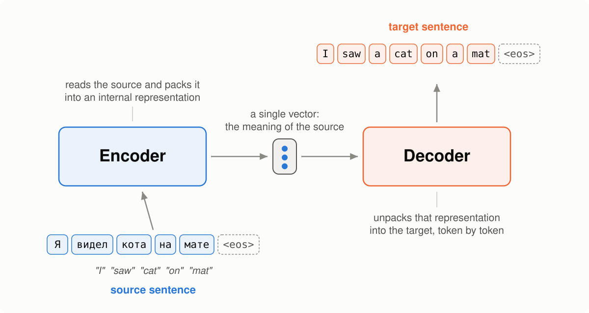

*Diagram after [Lena Voita's NLP Course](https://lena-voita.github.io/nlp_course/seq2seq_and_attention.html)*

We will see different models below, but they all rely on the same general scheme: first encode the input, then decode the output from this representation.

### Language models

A language model is a function that can estimate how "plausible" a string of text is:

- the input of a language model is $x_1,\dots,x_n$ — the tokens of a sequence of length $n$,
- the output is $p(x_1,\dots,x_n)$ — the probability of the **whole** sequence among all possible sequences of length $n$.

Estimating the probability of an entire sentence directly — as a single indivisible object — is very hard: there are too many possible sentences, and for most of them we will never have enough observations. So, instead of treating a sentence as one "atomic" unit, let us decompose its probability into probabilities of smaller fragments.

For example, take the sentence "I saw a cat on a mat" and read it word by word. At each step we estimate the probability of the next token given all the context seen so far. Previous computations are not wasted: when a new word arrives, we simply refine the probability of the whole sequence by multiplying it by the probability of the new token given the already-known prefix.

$$
\begin{aligned}
p(\text{I saw a cat})
&= p(\text{I}) \cdot p(\text{saw}\mid\text{I}) \cdot p(\text{a}\mid\text{I saw}) \\
&\quad \cdot p(\text{cat}\mid\text{I saw a}).
\end{aligned}
$$

Formally, this is just the chain rule from probability theory:

$$
\begin{aligned}
p(x_1,\dots,x_n)
&= p(x_1)\,p(x_2\mid x_1)\,p(x_3\mid x_1,x_2)\,\dots\,p(x_n\mid x_1,\dots,x_{n-1}).
\end{aligned}
$$

That is,

$$
p(x_1,\dots,x_n)=\prod_{t=1}^{n} p(x_t\mid x_1,\dots,x_{t-1}).
$$

One usually introduces the shorthand $x_{\lt t}= (x_1,\dots,x_{t-1})$ and writes compactly:

$$
p(x_1,\dots,x_n)=\prod_{t=1}^{n} p(x_t\mid x_{\lt t}).
$$

Once we have a language model, we can use it to generate text. This is done one token at a time: at each step the model predicts the probability distribution of the next token given the preceding context, and we then pick or sample a token from this distribution.

#### Training and the cross-entropy loss

Neural language models are trained to predict the probability distribution of the next token given the preceding context. Initially the model predicts a uniform distribution over all tokens, but during training it learns to assign more and more probability to the correct next token.

Formally, let $y_1, \dots, y_n$ be a training sequence of tokens. Then at step $t$ the model predicts the distribution

$$
p^{(t)} = p(* \mid y_1, \dots, y_{t-1}).
$$

The target distribution at this step is $p^* = \mathrm{one\text{-}hot}(y_t)$: we want the model to assign probability 1 to the correct token $y_t$ and probability 0 to all other tokens.

At this point we may notice that what we are looking at is nothing other than a classification problem: the classes are the different tokens, and the target class is the correct token at the current step. The standard loss function for such a problem is **cross-entropy**. For the target distribution $p^*$ and the predicted distribution $p$ it is written as:

$$
\mathrm{Loss}(p^*, p) = -p^* \log(p) = -\sum_{i=1}^{|V|} p_i^* \log(p_i).
$$

Here $|V|$ is the vocabulary size, i.e. the number of possible tokens over which the model spreads its probability.

Since only one component $p_i^*$ of the one-hot distribution is nonzero — the one corresponding to the correct token $y_t$ — the expression simplifies:

$$
\mathrm{Loss}(p^*, p) = -\log(p_{y_t}) = -\log p(y_t \mid y_{\lt t}).
$$

That is, at each step we minimize the negative log-probability of the correct next token. The higher the probability the model assigns to the correct token, the lower the loss.

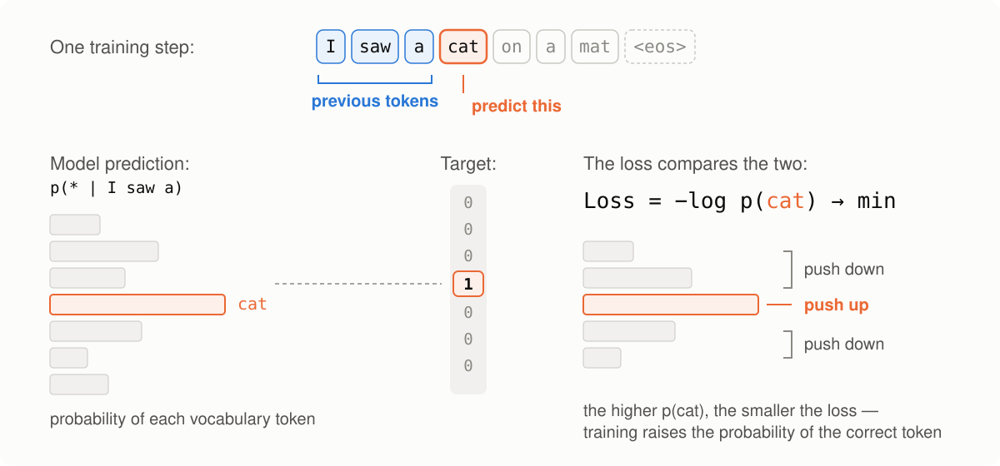

*Diagram after [Lena Voita's NLP Course](https://lena-voita.github.io/nlp_course/seq2seq_and_attention.html)*

For the whole sequence, the loss is obtained by summing over all steps:

$$
\mathcal{L} = -\sum_{t=1}^{n} \log p(y_t \mid y_{\lt t}).
$$

This is exactly the quantity that is usually minimized when training a language model.

#### Conditional language models

In the section on language models we learned to estimate the **unconditional** probability $p(y)$ of a token sequence $y=(y_1, y_2, \dots, y_n)$. The step from such language models to sequence-to-sequence models amounts to replacing the unconditional probability $p(y)$ with $p(y \mid x)$: the probability of the output sequence $y$ given the source sequence $x$.

This is why sequence-to-sequence tasks can be viewed as **conditional language modeling** (*CLM*). Such models work almost like ordinary language models, but additionally receive information about the source $x$.

For an ordinary language model:

$$
P(y_1, y_2, \dots, y_n) = \prod_{t=1}^{n} p(y_t \mid y_{\lt t}).
$$

For a conditional language model:

$$
P(y_1, y_2, \dots, y_n \mid x) = \prod_{t=1}^{n} p(y_t \mid y_{\lt t}, x).
$$

Here $x$ is the condition — the source information the model relies on during generation.

Importantly, conditional language modeling is not only a way to solve sequence-to-sequence tasks. In a more general sense, $x$ does not have to be a sequence of tokens at all. For example, in image captioning, $x$ is an image and $y$ is a text description of that image.

Since the only difference from ordinary language models is the presence of the source $x$, modeling and training are organized very similarly. At a high level, training and generation look like this:

- feed the network the source and the already-generated tokens of the target sequence;
- obtain a vector representation of the context — both the source and the previous target history;
- from this representation, predict the probability distribution of the next token.

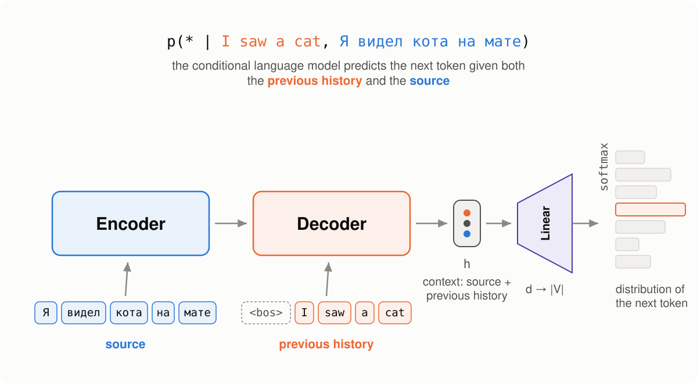

*Diagram after [Lena Voita's NLP Course](https://lena-voita.github.io/nlp_course/seq2seq_and_attention.html)*

### Bahdanau attention

Before turning to the mechanism itself, let us take a closer look at the encoder-decoder architecture described at the beginning. It has a bottleneck: the entire meaning of the input sentence — however long it may be — has to be packed into a **single fixed-size vector**. While sentences are short, this is tolerable, but the longer the input, the more information is lost in the compression. Worse still, the decoder sees the same frozen representation at every step, although intuitively it needs different parts of the input at different moments: when generating the word "cat", it would like to look at «кота» rather than at the whole sentence.

This is the problem solved by the attention mechanism, proposed in the paper [Neural Machine Translation by Jointly Learning to Align and Translate](https://arxiv.org/abs/1409.0473) (Bahdanau et al., 2014). The core idea is to let the model "focus" on different parts of the input sequence at different decoding steps.

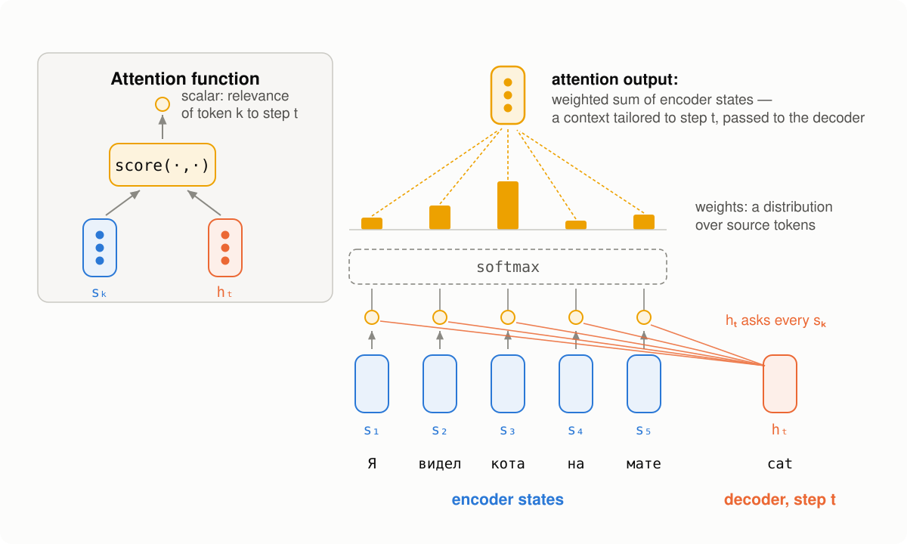

*Diagram after [Lena Voita's NLP Course](https://lena-voita.github.io/nlp_course/seq2seq_and_attention.html)*

At each decoder step, the attention mechanism:

- receives the decoder state $h_t$ and all encoder states $s_1, s_2, \dots, s_m$;
- computes attention scores.

  For each encoder state $s_k$, the attention mechanism estimates its "relevance" to the current decoder state $h_t$. Formally, this is done by an attention function, which takes one decoder state and one encoder state and returns a scalar value $\mathrm{score}(h_t, s_k)$;

- computes the attention weights: a probability distribution over the input tokens — that is, a softmax of the attention scores;
- computes the output: a weighted sum of the encoder states with the attention weights.

Now, at each step, the decoder receives not one compressed representation of the whole input, but its own context, tailored to the current step. The bottleneck is gone: the input length is no longer limited by the capacity of a single vector.

### What's next: from attention to the Transformer

Let us look back at the path we have taken. We started with the encoder-decoder architecture and saw its bottleneck — the entire input is squeezed into a single vector. Attention removed this bottleneck: the decoder itself chooses where to look at each step.

But one problem has not gone anywhere. Both the encoder and the decoder are still recurrent networks: the state $s_k$ cannot be computed until $s_{k-1}$ is ready. A sentence of $n$ tokens means $n$ sequential steps that cannot be parallelized. Yet modern GPUs are remarkably good at executing huge matrix operations in parallel — while an RNN forces them to idle, processing tokens strictly one at a time.

Now let us look at attention from this angle. The scores $\mathrm{score}(h_t, s_k)$ for different $k$ do not depend on each other — they can all be computed at once. What does that look like concretely? For definiteness, take the simplest variant of the score — the dot product $\mathrm{score}(h_t, s_k) = h_t^\top s_k$ (in Bahdanau's work the score is a small neural network, but the idea is the same). Stack all encoder states into a matrix $S$ of size $m \times d$, one row per token — then all $m$ scores for the current decoder step are obtained by a single matrix-vector product: $S h_t$. Moreover, if all decoder states are known at once — stack them too, into a matrix $H$ of size $n \times d$ — then the entire score table, $n \times m$ numbers, is computed by a single matrix product $H S^\top$. Remember this construction: in the Transformer it will become the main character under the name $QK^\top$. Admittedly, as long as the decoder is an RNN, the states $h_t$ are still born one at a time, and the full power of this trick remains untapped. But attention itself requires no sequential computation.

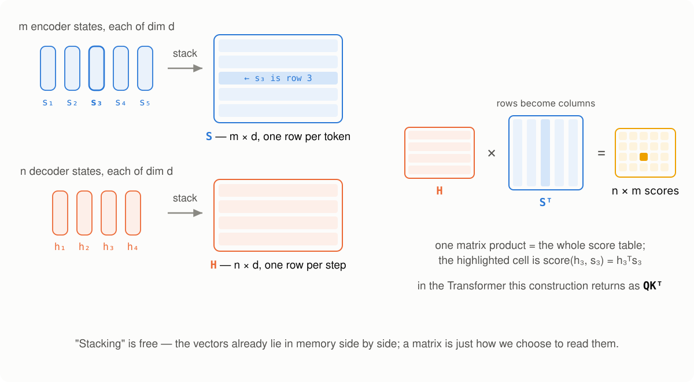

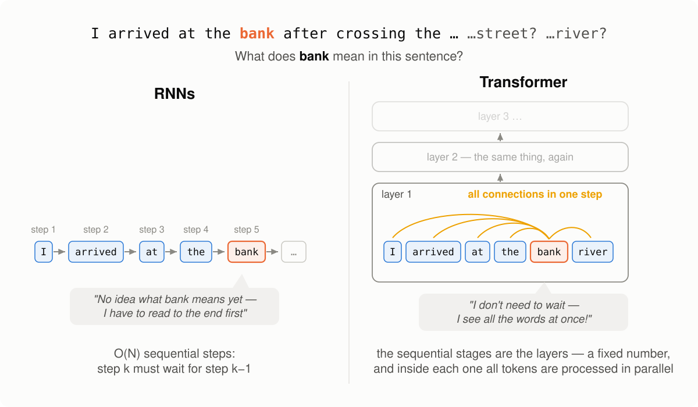

*Diagram after [Lena Voita's NLP Course](https://lena-voita.github.io/nlp_course/seq2seq_and_attention.html)*

A caveat on the word "steps": a Transformer stage — one layer — does *more* raw arithmetic than an RNN step, and that amount grows with the sentence length. What stays constant is the number of stages that must run *one after another*: within a layer no score waits for any other score, everything is computed in parallel, and the number of layers does not depend on the sentence length. FLOPs and sequential steps are different currencies — Part 1 makes this precise.

Hence a daring thought: if attention is so good — maybe throw out the RNN entirely and keep *only* attention? That is exactly what the authors called the paper that started the Transformer: "Attention Is All You Need". How it works, what has to be added to the architecture once recurrence is removed, and why it changed the entire field — that is what the rest of this post is about.

## Part 1 — Why the Transformer at all

Part 0 left off at an unsolved problem. The attention mechanism removed the bottleneck: the decoder is no longer forced to reconstruct the entire meaning of the input from a single vector. But both the encoder and the decoder remained recurrent networks, and recurrence has a price of its own. In this part we will figure out what that price is — and why the authors of "Attention Is All You Need" concluded that the RNN can be dropped altogether.

### Two problems of RNNs

An RNN processes a sequence strictly one token at a time. The state at step $k$ is computed from the previous state and the current input:

$$
s_k = f(s_{k-1}, x_k).
$$

Both problems grow out of this formula.

**Problem 1: $O(n)$ sequential steps.** Until $s_{k-1}$ is ready, we cannot start computing $s_k$. A sentence of $n$ tokens means $n$ computations that are forced to run one after another. GPUs are built exactly the other way around: thousands of cores tuned for large matrix operations, where everything is computed at once. Each RNN step is a small computation that, on top of that, waits for the previous one; the cores sit idle. We can parallelize across examples in a batch — but not across positions within a sequence. When training on millions of sentence pairs, this becomes the main brake.

**Problem 2: the long path between distant tokens.** For the model to learn a dependency between tokens at positions $i$ and $j$, the signal (and, during training, the gradient) has to travel $|i-j|$ steps of recurrence. At every step it gets multiplied by yet another Jacobian — and over dozens of steps it manages to vanish or explode. LSTMs and GRUs alleviate this disease but do not cure it: the path still has length $O(n)$.

> 💡 **Why does path length matter?** Take the sentence: "The cat, which had already eaten five fish and still looked hungry, **was sitting** on the mat." The number of the verb "was" is determined by the word "cat" — with a dozen and a half tokens in between. The longer the path a signal must travel from one word to another, the harder it is to learn such a dependency: the useful gradient gets diluted along the way.

### Attention has already solved half of it

Notice: the attention from Part 0 is precisely a solution to problem 2, at least half of one. The decoder gets direct access to *any* encoder state in a single step: the path from "cat" to «кота» has length $O(1)$, no matter how many tokens separate them.

But attention was an *add-on* to the RNN: recurrent networks still sit in both the encoder and the decoder. Problem 1 has not gone anywhere, and within the encoder distant tokens still communicate through a long chain of states.

And here the authors of the paper asked a question that seems obvious in retrospect but was audacious at the time: if attention transfers information so well — maybe the RNN is not needed at all? Maybe attention is all we need? That is exactly what they called the paper: ["Attention Is All You Need"](https://papers.nips.cc/paper/7181-attention-is-all-you-need.pdf) (Vaswani et al., 2017).

### Self-attention: every token looks at everyone

Suppose we removed the RNN. But the attention from Part 0 operated *on top of* encoder states built by an RNN. If there is no RNN, where do context-aware token representations come from?

The answer is **self-attention**: the same attention mechanism applied to a sequence *with itself* — and it is exactly what replaces recurrence. Previously, contextual token representations were built by an RNN passing information along a chain of states; now every token gathers information from all tokens of the same sequence directly (including itself), weighting them by relevance. The word "sitting" can directly ask: "who is the subject here?" — and receive a large weight on the token "cat".


*Animation after [Lena Voita's NLP Course](https://lena-voita.github.io/nlp_course/seq2seq_and_attention.html)*

Recall the matrix trick from the end of Part 0: all scores were computed by a single product $H S^\top$, where $H$ holds the decoder states and $S$ the encoder states. In self-attention both matrices are one and the same sequence $X$ of size $n \times d$: the everyone-with-everyone score table is, roughly speaking, $X X^\top$. One matrix multiplication — and all $n^2$ scores are ready. Nobody waits for anybody: the representations of all tokens are updated simultaneously.

What this gives us with respect to the two problems:

- **sequential steps — $O(1)$:** there is no chain inside a layer; the number of layers in the model is fixed and does not depend on $n$;
- **path between any two tokens — $O(1)$:** a single self-attention layer connects any pair directly.

These advantages come at a price, and we pay it twice. First, the attention table has size $n \times n$ — the complexity became quadratic in the sequence length (we will return to this more than once). Second, a weighted sum does not depend on the order of its summands: shuffle the tokens — and self-attention will output the same vectors, only permuted. The RNN knew the token order "for free", by construction; self-attention does not see the order at all, and it will have to be brought back into the model by a separate mechanism — positional encoding, which we will discuss in Part 2.

Two closing remarks. First, the classical attention from Part 0 does not disappear: in the Transformer it survives under the name **cross-attention** — the decoder, as in Bahdanau's model, looks at the encoder, only the scheme is slightly generalized. The mechanism is the same in both cases; the only difference is who asks and whom: in cross-attention the decoder queries the encoder, in self-attention the sequence queries itself. Second, on naming: the attention variant where scores are computed via dot products — with additional scaling — is called **scaled dot-product attention**; what exactly gets scaled and why we actually need three different projections of the input ($Q$, $K$, $V$) will be sorted out in Part 2.

### A back-of-the-envelope count: self-attention vs RNN

Let us compare, honestly, one self-attention layer with one RNN layer. A full FLOPs count of all blocks comes in Part 2; here — an order-of-magnitude estimate.

**A self-attention layer.** There are $n^2$ token pairs, the score of each pair is a dot product of vectors of dimension $d$, i.e. $d$ multiplications. Total $O(n^2 \cdot d)$. The weighted summation of values costs the same. All of it is a couple of large matrix multiplications: $O(1)$ sequential operations.

**An RNN layer.** There are $n$ steps, and at each step a state of dimension $d$ is multiplied by a $d \times d$ matrix: $O(d^2)$ per step. Total $O(n \cdot d^2)$, and all $n$ steps are strictly sequential.

| Layer | Complexity per layer | Sequential operations | Path length between tokens |
|---|---|---|---|
| Self-attention | $O(n^2 \cdot d)$ | $O(1)$ | $O(1)$ |
| RNN | $O(n \cdot d^2)$ | $O(n)$ | $O(n)$ |

Look closely at the first column: self-attention is quadratic in the sequence length $n$, while the RNN is quadratic in the model dimension $d$. An amusing consequence: at a typical $d = 512$ and an ordinary sentence length ($n$ of a few dozen tokens), self-attention is actually *cheaper* in raw FLOPs.

> 💡 **So where is the win, if not in FLOPs?** In the second and third columns. FLOPs can be multiplied away with GPU cores, but sequential steps cannot: no hardware purchase can beat the law "first $s_{k-1}$, then $s_k$". Self-attention turns sequence processing into a few large matrix multiplications — exactly what a GPU does best. Plus the $O(1)$ path between any tokens: long-range dependencies are learned without the gradient decaying along the way.

### The architecture from a bird's-eye view

So, here is what the authors assembled the model from, once left without an RNN.

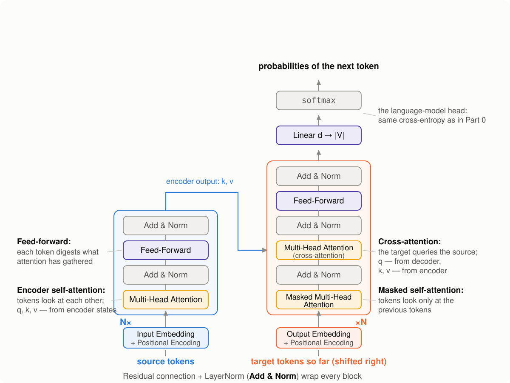

*After Figure 1 of [Vaswani et al., 2017](https://papers.nips.cc/paper/7181-attention-is-all-you-need.pdf) and [Lena Voita's NLP Course](https://lena-voita.github.io/nlp_course/seq2seq_and_attention.html)*

- **Embeddings + positional encoding.** Tokens are turned into vectors of dimension $d$, and information about position is mixed in — that very fix for self-attention's blindness to order.
- **The encoder** is a stack of $N$ identical layers (in the paper $N = 6$). Each layer: self-attention (tokens exchange information) + a small fully connected network FFN (each token is processed independently), plus a few auxiliary mechanisms that stabilize the training of a deep stack of layers — we will cover those separately in Part 2.
- **The decoder** is also $N$ layers, but each has three blocks: self-attention over the already-generated tokens (with a mask — no peeking into the future), cross-attention over the encoder output (the direct heir of Bahdanau's attention from Part 0), and the same FFN.
- **The output layer:** a linear projection $d \to |V|$ and a softmax — the probability distribution of the next token. Everything here is exactly as in the language models of Part 0: the same cross-entropy, the same principle of generating one token at a time.

Nothing recurrent: every block is either attention or a per-token operation, and everything is computed with matrix multiplications over the whole sequence at once.

This is the plan for the next part: we will go through the list bottom-up and assemble every block with our own hands — intuition, formula, PyTorch code, a numpy reference and an honest FLOPs count. We will start with embeddings and positional encoding, and the central place will be taken by scaled dot-product attention.

## Part 2 — The building blocks, with code

In Part 1 we looked at the architecture from a bird's-eye view. Now let us come down to earth and assemble every block by hand. The format for every building block is the same: intuition → formula → PyTorch code → a reference implementation in pure numpy for cross-checking → an honest complexity count for that block.

> All the code of this part can be run without assembling it cell by cell: a [ready-made notebook](https://github.com/jen1995/jen1995.github.io/blob/main/notebooks/transformer_blocks.ipynb) lives in this blog's repository and [opens in Colab](https://colab.research.google.com/github/jen1995/jen1995.github.io/blob/main/notebooks/transformer_blocks.ipynb) in one click; no GPU needed.

Why a numpy reference? PyTorch modules are convenient, but they hide the details behind library calls. Implementing the same computations "by hand" in numpy leaves no room for misunderstanding: if two independent pieces of code produce the same numbers, we really do understand what happens inside. We will check every block via `np.allclose`.

Notation for the whole series: $n$ — sequence length, $d$ — model dimension, $h$ — number of attention heads, $d_{ff}$ — inner dimension of the FFN, $|V|$ — vocabulary size.

One thing we leave out of scope: tokenization. We assume the text has already been turned into a sequence of integer token ids — how exactly text is cut into tokens (usually with the BPE algorithm) is well described, for example, in [Lena Voita's course chapter](https://lena-voita.github.io/nlp_course/seq2seq_and_attention.html) and in [Sennrich et al., 2016](https://arxiv.org/abs/1508.07909).

Set up the environment:

```python
import numpy as np
import torch
import torch.nn as nn
import torch.nn.functional as F

torch.manual_seed(0)
np.random.seed(0)

n, d, h, d_ff, vocab_size = 6, 16, 4, 64, 100  # toy sizes for the checks
```

### Tokens → embeddings

**Intuition.** The model cannot work with token ids directly — it needs vectors. The embedding table is simply a matrix $E$ of size $|V| \times d$: one row per vocabulary token. "Turning a token into a vector" means taking the row of the matrix with that token's id.

**Formula.** For a sequence of ids $t_1, \dots, t_n$:

$$
X = (E_{t_1}, \dots, E_{t_n}) \in \mathbb{R}^{n \times d}.
$$

**Code.** In PyTorch this is `nn.Embedding`, in numpy — plain indexing:

```python
emb = nn.Embedding(vocab_size, d)
token_ids = torch.randint(0, vocab_size, (n,))

x_torch = emb(token_ids)                            # (n, d)

E = emb.weight.detach().numpy()                     # (|V|, d)
x_np = E[token_ids.numpy()]                         # the same operation by hand

assert np.allclose(x_torch.detach().numpy(), x_np)
print("embeddings: ok", x_torch.shape)
```

**Complexity.** No multiplications: $n$ lookups into the table's rows, an $n \times d$ matrix as output — that is, $O(n \cdot d)$ in the size of the result. The main cost of embeddings is not compute but parameters: $|V| \cdot d$ numbers, a noticeable share of the model when the vocabulary is large.

A small detail from the original paper: before entering the model, the embeddings are multiplied by $\sqrt{d}$ — so that their scale is not drowned out by the positional encoding we are about to add to them. We will account for this when assembling the full model in Part 3.

### Positional encoding

**Intuition.** In Part 1 we established: self-attention does not see token order — a weighted sum does not care in what order its summands come. For language this is a catastrophe ("the cat ate the mouse" and "the mouse ate the cat" are different events), so position information must be put back into the model explicitly. The original paper's solution: add to each token's embedding a vector that depends only on the token's *position* in the sequence.

**Formula.** The positional vector for position $pos$ is composed of sines and cosines of different frequencies:

$$
PE_{(pos,\, 2i)} = \sin\!\left(\frac{pos}{10000^{2i/d}}\right), \qquad
PE_{(pos,\, 2i+1)} = \cos\!\left(\frac{pos}{10000^{2i/d}}\right),
$$

where $i$ runs over pairs of coordinates. Each coordinate pair is its own "clock hand": the first pairs rotate fast (change from token to token), the last ones — very slowly. A set of $d/2$ such hands encodes the position unambiguously, just as a clock with a second, minute and hour hand encodes the time.

**Code.**

```python
def positional_encoding(n, d):
    pos = torch.arange(n).unsqueeze(1)               # (n, 1)
    i = torch.arange(0, d, 2)                        # (d/2,)
    angles = pos / 10000 ** (i / d)                  # (n, d/2)
    pe = torch.zeros(n, d)
    pe[:, 0::2] = torch.sin(angles)
    pe[:, 1::2] = torch.cos(angles)
    return pe

def positional_encoding_np(n, d):
    pos = np.arange(n)[:, None]
    i = np.arange(0, d, 2)
    angles = pos / 10000 ** (i / d)
    pe = np.zeros((n, d))
    pe[:, 0::2] = np.sin(angles)
    pe[:, 1::2] = np.cos(angles)
    return pe

pe = positional_encoding(n, d)
assert np.allclose(pe.numpy(), positional_encoding_np(n, d), atol=1e-6)
print("positional encoding: ok", pe.shape)
```

It is worth seeing this matrix with your own eyes once:

```python
import matplotlib.pyplot as plt

pe_big = positional_encoding(100, 128)
plt.figure(figsize=(8, 4))
plt.imshow(pe_big.numpy(), aspect="auto", cmap="RdBu")
plt.xlabel("vector coordinate")
plt.ylabel("token position")
plt.colorbar(label="value")
plt.title("Positional encoding: fast frequencies on the left, slow on the right")
plt.tight_layout()
plt.show()
```

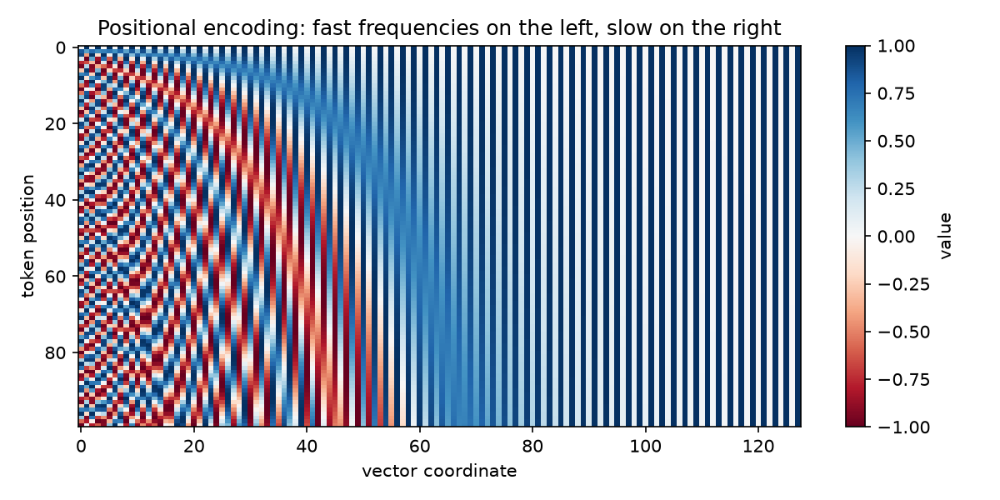

Each column is one coordinate of the vector, each row is a position in the sequence. The left coordinates oscillate fast and distinguish neighboring tokens; the right ones change slowly and encode the "coarse scale" of the position.

**Complexity.** Adding a positional vector to each of the $n$ vectors of size $d$ — $O(n \cdot d)$. The positional vectors themselves are not trained and are computed once.

### Scaled dot-product attention

The central block of the whole architecture.

**Intuition.** In Part 0, attention worked like this: there is a query (the decoder state), there is a set of candidates (the encoder states); we compute each candidate's relevance to the query and take a weighted sum. Let us generalize this into three roles a vector can play:

- **query** $q$ — "what I am looking for";
- **key** $k$ — "by what feature I can be found";
- **value** $v$ — "what I will hand over if I am chosen".

The analogy is a library search: the query is compared against the catalog cards (keys), and based on the comparison a mixture of books (values) is returned. Importantly, the "card" and the "book" are different objects: a token can be *found* by one feature and *hand over* entirely different information.

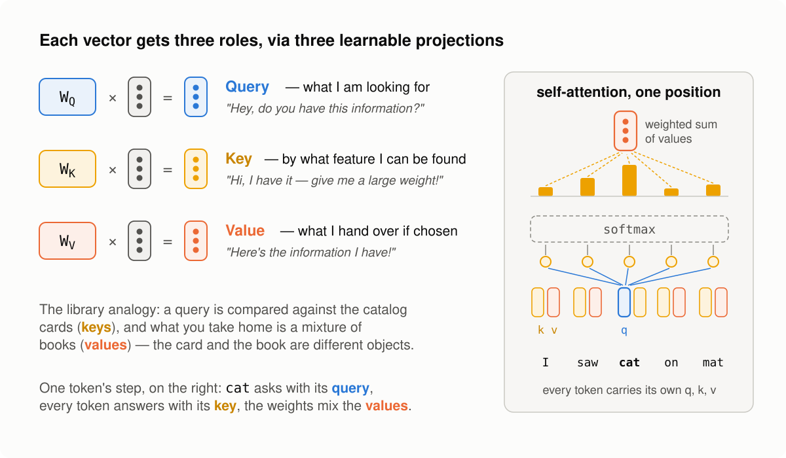

*Diagram after [Lena Voita's NLP Course](https://lena-voita.github.io/nlp_course/seq2seq_and_attention.html)*

In the diagram, each vector receives its three roles through three matrices $W^Q$, $W^K$, $W^V$ — these learnable projections will appear a bit below, in multi-head attention; the attention operation itself, which we are about to write, takes ready-made $Q$, $K$, $V$.

**Formula.** We stack the queries, keys and values into matrices $Q$ ($n_q \times d_k$), $K$, $V$ ($n_k \times d_k$ and $n_k \times d_v$):

$$
\mathrm{Attention}(Q, K, V) = \mathrm{softmax}\!\left(\frac{QK^\top}{\sqrt{d_k}}\right)V.
$$

Here $QK^\top$ is the score table "every query against every key", familiar from Parts 0–1; the softmax turns each row into a distribution of weights, and the multiplication by $V$ takes weighted sums of the values.

> 💡 **Why $\sqrt{d_k}$, and not $d_k$ or nothing?** The dot product of two random vectors with $d_k$ independent components of zero mean and unit variance has variance $d_k$ ([a careful derivation via the variance of a product of independent variables](https://ai.stackexchange.com/questions/21237/why-does-this-multiplication-of-q-and-k-have-a-variance-of-d-k-in-scaled)) — that is, the typical spread of the scores grows as $\sqrt{d_k}$. One might think the softmax cares not about scale but only about the relative magnitudes of the scores. Let us write out the formula and check: for a score vector $s = (s_1, \dots, s_n)$, the weight of the $i$-th element is
>
> $$p_i = \mathrm{softmax}(s)_i = \frac{e^{s_i}}{\sum_{k=1}^{n} e^{s_k}}.$$
>
> For a *shift* the intuition is correct: add a constant $c$ to all scores — the numerator and every term of the denominator get multiplied by $e^c$, the common factor cancels, the weights do not change. But *multiplying* the scores by a constant does not cancel: it stretches the differences between scores, which is what the softmax genuinely depends on — dividing $p_i$ by $p_j$, we see $p_i / p_j = e^{s_i - s_j}$. Variance $d_k$ means the typical difference between two scores is of order $\sqrt{d_k}$ in absolute value; at $d_k = 512$ that is tens, and already a logit difference of 20 gives a weight ratio of $e^{20} \approx 5 \cdot 10^8$. The sign of the difference does not matter. To see this, divide the numerator and denominator of the largest score's weight $s_{\max}$ by $e^{s_{\max}}$:
>
> $$p_{\max} = \frac{e^{s_{\max}}}{\sum_{k} e^{s_k}} = \frac{1}{1 + \sum_{k \neq \max} e^{s_k - s_{\max}}}.$$
>
> All the exponents $s_k - s_{\max}$ are negative, and if they are on the order of tens in absolute value, every term in the denominator is $\sim e^{-20} \approx 2 \cdot 10^{-9}$ — that is, $p_{\max} \approx 1$: the largest score takes almost all the weight. And there always is a largest one. That is the problem: at the start the weights are random, so attention "locks onto" a *random* token, and the gradients through the rest are practically zero — training can hardly fix an unlucky choice. Dividing by $\sqrt{d_k}$ returns the differences to a scale of order one. And why not divide by $d_k$? Then typical differences shrink to $1/\sqrt{d_k}$. The exponential is no longer scary on small arguments — it is linear there, $e^x \approx 1 + x$ — so the weight ratios are $p_i/p_j \approx 1 \pm 1/\sqrt{d_k}$: at $d_k = 512$ all weights are almost equal, differing by mere percents. The softmax becomes almost uniform, and attention does not choose — it just averages all the values. Note that this failure is milder than the previous one: the gradients here are alive, but the model would have to learn projections with larger norms, pulling the differences back to a scale of one against the imposed division. Dividing by $\sqrt{d_k}$ is the golden mean: differences of order 1, a softmax that is selective but not locked, and trainable in both directions. Let us check the variance experimentally:
>
> ```python
> d_ks = 2 ** np.arange(2, 13)                     # 4 ... 4096
> var_raw, var_scaled = [], []
> for d_k in d_ks:
>     q = np.random.randn(2000, d_k)
>     k = np.random.randn(2000, d_k)
>     scores = (q * k).sum(axis=1)
>     var_raw.append(scores.var())
>     var_scaled.append((scores / np.sqrt(d_k)).var())
>
> plt.figure(figsize=(7, 3.5))
> plt.loglog(d_ks, d_ks, "--", color="gray", label="theory: $\\mathrm{var} = d_k$")
> plt.loglog(d_ks, var_raw, "o-", label="var($q \\cdot k$)")
> plt.loglog(d_ks, var_scaled, "s-", label="var($q \\cdot k \\,/\\, \\sqrt{d_k}$)")
> plt.xlabel("$d_k$")
> plt.ylabel("score variance")
> plt.grid(alpha=0.3)
> plt.legend()
> plt.tight_layout()
> plt.show()
> ```
>
> 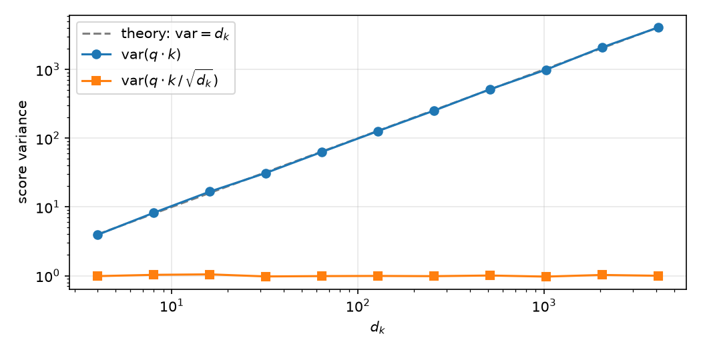
>
> The variance of the "raw" scores falls exactly on the line $\mathrm{var} = d_k$; the scaled ones stay around 1 at any dimension.

**Code.** The operation itself is four lines:

```python
def scaled_dot_product_attention(q, k, v, mask=None):
    scores = q @ k.transpose(-2, -1) / q.shape[-1] ** 0.5   # (..., n_q, n_k)
    if mask is not None:
        scores = scores.masked_fill(~mask, float("-inf"))
    weights = F.softmax(scores, dim=-1)                     # (..., n_q, n_k)
    return weights @ v, weights
```

**Numpy reference.** We write the softmax ourselves (subtracting the maximum for numerical stability):

```python
def softmax_np(x, axis=-1):
    x = x - x.max(axis=axis, keepdims=True)
    e = np.exp(x)
    return e / e.sum(axis=axis, keepdims=True)

def attention_np(q, k, v, mask=None):
    scores = q @ np.swapaxes(k, -2, -1) / np.sqrt(q.shape[-1])
    if mask is not None:
        scores = np.where(mask, scores, -np.inf)
    weights = softmax_np(scores)
    return weights @ v, weights

q, k, v = torch.randn(n, d), torch.randn(n, d), torch.randn(n, d)
out_torch, w_torch = scaled_dot_product_attention(q, k, v)
out_np, w_np = attention_np(q.numpy(), k.numpy(), v.numpy())

assert np.allclose(out_torch.numpy(), out_np, atol=1e-6)
assert np.allclose(w_torch.numpy(), w_np, atol=1e-6)
print("scaled dot-product attention: ok", out_torch.shape)
```

**Complexity** (with $n_q = n_k = n$, $d_k = d_v = d$):

- $QK^\top$: multiplying $(n \times d)$ by $(d \times n)$ — $O(n^2 \cdot d)$;
- softmax: $n$ elements in each of $n$ rows — $O(n^2)$;
- the weighted sum $\mathrm{weights} \cdot V$: $(n \times n)$ by $(n \times d)$ — $O(n^2 \cdot d)$.

Total $O(n^2 \cdot d)$ — that very quadraticity in sequence length from Part 1. Note: this block has *zero* parameters — all the learnable weights appear one level up, in multi-head attention.

### Multi-head attention

**Intuition.** One attention — one "view" of the sequence: one weight table per pair of tokens. But tokens are related in several ways at once: syntactically, semantically, by coreference ("he" → "the cat"). The idea of multi-head: run $h$ small attentions in parallel, each in its own subspace of dimension $d/h$ — and let each head learn its own type of relations.


*Animation after [Lena Voita's NLP Course](https://lena-voita.github.io/nlp_course/seq2seq_and_attention.html)*

**Formula.** The input $X$ ($n \times d$) first passes through three learnable linear projections:

$$
Q = XW^Q, \quad K = XW^K, \quad V = XW^V, \qquad W^Q, W^K, W^V \in \mathbb{R}^{d \times d}.
$$

Then $Q, K, V$ are *sliced* along the coordinates into $h$ heads of size $n \times d/h$; each head computes ordinary scaled dot-product attention (with the scale $\sqrt{d/h}$ — the head's dimension!), the results are glued back into $n \times d$ and pass through the output projection $W^O \in \mathbb{R}^{d \times d}$:

$$
\mathrm{head}_i = \mathrm{Attention}(Q_i, K_i, V_i), \qquad
\mathrm{MultiHead}(X) = \mathrm{Concat}(\mathrm{head}_1, \dots, \mathrm{head}_h)\,W^O.
$$

And here, by the way, is the answer promised in Part 1 to why we need three different projections: they are what creates the query/key/value roles — without them a token would be forced to "search" and "be found" with one and the same vector.

> 💡 **Why do we divide by $\sqrt{d/h}$ in the softmax, and not by $\sqrt{d}$?** Because the dot products are computed *inside a head*, between vectors of dimension $d/h$ — so the score variance also grows as $d/h$, and that is what we must normalize by. The general principle: divide by the square root of the dimension of the vectors actually being multiplied.

**Code.**

```python
class MultiHeadAttention(nn.Module):
    def __init__(self, d, h):
        super().__init__()
        assert d % h == 0
        self.d, self.h, self.d_head = d, h, d // h
        self.w_q = nn.Linear(d, d, bias=False)
        self.w_k = nn.Linear(d, d, bias=False)
        self.w_v = nn.Linear(d, d, bias=False)
        self.w_o = nn.Linear(d, d, bias=False)

    def split_heads(self, x):          # (n, d) -> (h, n, d/h)
        n = x.shape[0]
        return x.view(n, self.h, self.d_head).transpose(0, 1)

    def forward(self, x_q, x_k, x_v, mask=None):
        q = self.split_heads(self.w_q(x_q))
        k = self.split_heads(self.w_k(x_k))
        v = self.split_heads(self.w_v(x_v))
        out, weights = scaled_dot_product_attention(q, k, v, mask)
        n = out.shape[1]
        concat = out.transpose(0, 1).reshape(n, self.d)   # glue the heads
        return self.w_o(concat), weights
```

For self-attention all three inputs are the same sequence: `mha(x, x, x)`. For the cross-attention of Part 1, the queries will come from the decoder, and the keys and values from the encoder: `mha(dec, enc, enc)` — the code is one and the same.

> 💡 **Slicing into heads is free.** `view` and `transpose` in PyTorch (like `reshape` in numpy) do not copy or move numbers — they only change the tensor's *metadata*: shapes and memory strides. "Sliced into $h$ heads and glued back" sounds like work, but in fact it is a reinterpretation of the same memory.

**Numpy reference.** We take the weights from the PyTorch module and repeat all the steps by hand (`nn.Linear` stores its matrix transposed, hence the `.T`):

```python
def multi_head_attention_np(x, w_q, w_k, w_v, w_o, h):
    n, d = x.shape
    d_head = d // h

    def split(m):                       # (n, d) -> (h, n, d/h)
        return m.reshape(n, h, d_head).transpose(1, 0, 2)

    q, k, v = split(x @ w_q), split(x @ w_k), split(x @ w_v)
    out, _ = attention_np(q, k, v)
    concat = out.transpose(1, 0, 2).reshape(n, d)
    return concat @ w_o

mha = MultiHeadAttention(d, h)
x = torch.randn(n, d)
out_torch, _ = mha(x, x, x)

weights_np = [m.weight.detach().numpy().T for m in (mha.w_q, mha.w_k, mha.w_v, mha.w_o)]
out_np = multi_head_attention_np(x.numpy(), *weights_np, h)

assert np.allclose(out_torch.detach().numpy(), out_np, atol=1e-6)
print("multi-head attention: ok", out_torch.shape)
```

**Complexity, line by line.** Let us walk down the forward pass:

| Step | Operation | Complexity |
|---|---|---|
| Projections $XW^Q, XW^K, XW^V$ | $(n \times d) \cdot (d \times d)$, three times | $O(n \cdot d^2)$ |
| Slicing into heads | metadata | $O(1)$* |
| $Q_i K_i^\top$ per head | $(n \times d/h) \cdot (d/h \times n)$ | $O(n^2 \cdot d/h)$ |
| …over all $h$ heads | | $O(n^2 \cdot d)$ |
| softmax per head | $n \times n$ elements | $O(n^2)$, over all heads $O(n^2 \cdot h)$ |
| $\mathrm{weights}_i \cdot V_i$ over all heads | | $O(n^2 \cdot d)$ |
| Gluing the heads | metadata + an $n \times d$ copy | $O(n \cdot d)$ |
| Output projection $W^O$ | $(n \times d) \cdot (d \times d)$ | $O(n \cdot d^2)$ |

\* — when physically contiguous memory is required (as before `reshape` after `transpose`), the copy costs $O(n \cdot d)$; it does not affect the total.

**Total: $O(n^2 \cdot d + n \cdot d^2)$.** The first term is the attention itself (quadratic in length), the second is the projections (quadratic in model dimension). Which one dominates depends on the ratio of $n$ and $d$; a detailed bottleneck analysis comes in the summary in Part 3. Note: slicing into $h$ heads does *not change* the total complexity compared to one big head — the work is the same, just divided into independent chunks.

### Masks

Attention as we wrote it allows every token to look at all tokens. That is not always permissible — in the architecture overview in Part 1 we already mentioned that self-attention in the decoder works with a mask that forbids peeking into the future. Masks will start working for real in Part 3, when we assemble the decoder and the training — but the mechanics of the prohibitions belong to the attention block itself (the `mask` parameter is already in our implementation), so let us sort it out here, and at assembly time apply a ready-made part with one line.

A mask is a boolean matrix where `True` = "may look". To forbidden positions we assign the score $-\infty$ *before* the softmax: after exponentiation they turn into an honest zero weight, and the distribution over the allowed positions stays valid (sums to 1).

There are two masks in the Transformer:

**The padding mask.** Sequences in a batch have different lengths, and the short ones are padded with the special token `<pad>` up to a common length. Looking at `<pad>` is pointless — it is not text but packing material.

**The causal mask (decoder).** The decoder is trained to predict the next token, and the token at position $t$ has no right to see positions $> t$ — otherwise the prediction task turns into peeking at the answer. The mask is lower-triangular:

```python
def causal_mask(n):
    return torch.tril(torch.ones(n, n, dtype=torch.bool))
```

Let us draw it for a familiar sentence:

```python
from matplotlib.colors import ListedColormap

tokens = ["I", "saw", "a", "cat", "on", "a", "mat"]
m = causal_mask(len(tokens)).int().numpy()

plt.figure(figsize=(5, 4.5))
plt.imshow(m, cmap=ListedColormap(["#f0f0f0", "#aec7e8"]))
plt.xticks(range(len(tokens)), tokens, rotation=45)
plt.yticks(range(len(tokens)), tokens)
plt.xlabel("who is looked at (keys)")
plt.ylabel("who is looking (queries)")
for i in range(len(tokens)):
    for j in range(len(tokens)):
        plt.text(j, i, "✓" if m[i, j] else "✗", ha="center", va="center")
plt.title("Causal mask: only the prefix is visible")
plt.tight_layout()
plt.show()
```

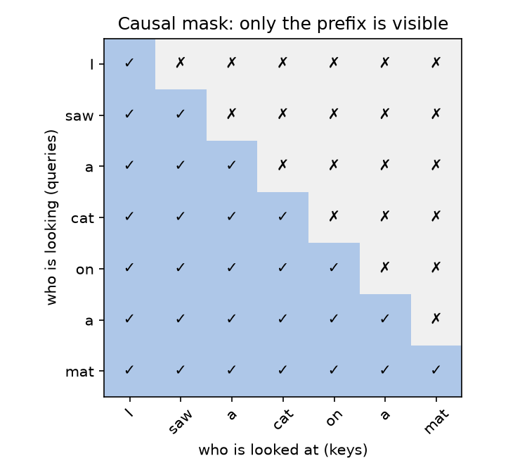

A row is the "observer" token, a column is the token it wants to look at. The token "cat" sees itself and everything before it, but not "on", "a" or "mat": at generation time those tokens do not exist yet, and training must proceed under the same conditions.

Let us check that the mask really works: the weights above the diagonal must become zeros.

```python
q, k, v = torch.randn(n, d), torch.randn(n, d), torch.randn(n, d)
_, w_masked = scaled_dot_product_attention(q, k, v, mask=causal_mask(n))

assert np.allclose(np.triu(w_masked.numpy(), k=1), 0.0)          # zeros above the diagonal
assert np.allclose(w_masked.numpy().sum(axis=-1), 1.0, atol=1e-6) # rows are distributions
print("causal mask: ok")
```

**Complexity.** Applying the mask is an elementwise operation on the score table: $O(n^2)$.

### Feed-forward network (FFN)

**Intuition.** Attention is responsible for the *exchange* of information between tokens, but by itself it is an almost linear operation (the only nonlinearity is the softmax over the weights). The FFN is the "digestion" of what was gathered: two linear layers with a nonlinearity in between, applied to each token *independently*. There is no interaction between positions here — all the communication has already happened in attention.

**Formula.**

$$
\mathrm{FFN}(x) = \mathrm{ReLU}(xW_1 + b_1)\,W_2 + b_2,
\qquad W_1 \in \mathbb{R}^{d \times d_{ff}},\; W_2 \in \mathbb{R}^{d_{ff} \times d}.
$$

Note: there is no nonlinearity after the second layer. In the original, $d_{ff} = 4d$ — the network first "expands" the representation fourfold, then compresses it back.

**Code.**

```python
class FeedForward(nn.Module):
    def __init__(self, d, d_ff):
        super().__init__()
        self.lin1 = nn.Linear(d, d_ff)
        self.lin2 = nn.Linear(d_ff, d)

    def forward(self, x):
        return self.lin2(F.relu(self.lin1(x)))

def feed_forward_np(x, w1, b1, w2, b2):
    return np.maximum(x @ w1 + b1, 0.0) @ w2 + b2

ffn = FeedForward(d, d_ff)
x = torch.randn(n, d)
out_torch = ffn(x)

out_np = feed_forward_np(
    x.numpy(),
    ffn.lin1.weight.detach().numpy().T, ffn.lin1.bias.detach().numpy(),
    ffn.lin2.weight.detach().numpy().T, ffn.lin2.bias.detach().numpy(),
)

assert np.allclose(out_torch.detach().numpy(), out_np, atol=1e-6)
print("FFN: ok", out_torch.shape)
```

**Complexity.** First layer: $(n \times d) \cdot (d \times d_{ff})$ — $O(n \cdot d \cdot d_{ff})$, plus ReLU $O(n \cdot d_{ff})$. Second layer — again $O(n \cdot d \cdot d_{ff})$. Total $O(n \cdot d \cdot d_{ff})$; at $d_{ff} = 4d$ this is $O(n \cdot d^2)$ with a constant of 8 — in FLOPs the FFN is usually *more expensive* than the attention projections.

### Add & Norm

**Intuition.** These are those "auxiliary mechanisms" from the overview in Part 1 — they do not process information, they help a deep stack of layers train at all. There are two of them, and they are applied around every block (attention or FFN):

- **The residual connection:** the block's output is *added* to its input, $x + \mathrm{Block}(x)$. The block learns not a "new representation from scratch" but a *correction* to the current one; and the gradient gains a short bypass through all the layers — the same short-path logic as with attention, only along the depth.
- **LayerNorm:** each vector is normalized over its own $d$ coordinates — subtract the mean, divide by the standard deviation, then apply a learnable scale $\gamma$ and shift $\beta$. The normalization is per token: for an $n \times d$ input, $n$ independent normalizations are performed; every token has its own mean and variance, and tokens do not interact through LayerNorm in any way. This keeps the scale of activations stable from layer to layer.

**Formula.**

$$
\mathrm{AddNorm}(x) = \mathrm{LayerNorm}(x + \mathrm{Block}(x)), \qquad
\mathrm{LayerNorm}(z) = \gamma \odot \frac{z - \mu(z)}{\sqrt{\sigma^2(z) + \varepsilon}} + \beta.
$$

**Code.**

```python
class AddNorm(nn.Module):
    def __init__(self, d):
        super().__init__()
        self.norm = nn.LayerNorm(d)

    def forward(self, x, block_out):
        return self.norm(x + block_out)

def add_norm_np(x, block_out, gamma, beta, eps=1e-5):
    z = x + block_out
    mu = z.mean(axis=-1, keepdims=True)
    var = z.var(axis=-1, keepdims=True)
    return gamma * (z - mu) / np.sqrt(var + eps) + beta

add_norm = AddNorm(d)
x, sub = torch.randn(n, d), torch.randn(n, d)
out_torch = add_norm(x, sub)

out_np = add_norm_np(
    x.numpy(), sub.numpy(),
    add_norm.norm.weight.detach().numpy(), add_norm.norm.bias.detach().numpy(),
)

assert np.allclose(out_torch.detach().numpy(), out_np, atol=1e-5)
print("Add & Norm: ok", out_torch.shape)
```

**Complexity.** Everything is elementwise or a reduction over $d$: $O(n \cdot d)$ — free compared to attention and the FFN.

> 💡 **Pre-LN vs post-LN.** We described the variant from the original paper: normalization *after* the residual sum (post-LN). Modern models more often put the LayerNorm *before* the block (pre-LN): $x + \mathrm{Block}(\mathrm{LayerNorm}(x))$ — deep pre-LN models train noticeably more stably and do not require a careful learning-rate warmup; a systematic comparison of the two variants is in [Xiong et al., 2020](https://arxiv.org/abs/2002.04745). For our toy transformer the difference is not fundamental, and we stay faithful to the original.

> 💡 **Why LayerNorm and not BatchNorm?** First, the difference itself. Take the input tensor $(b, n, d)$: $b$ examples, $n$ positions, $d$ coordinates per token vector. **LayerNorm** averages over a *single* axis — the coordinates: each vector, i.e. the representation of one token, is normalized on its own. That is $b \cdot n$ independent normalizations with $d$ summands in each; tokens do not interact, and the batch plays no role at all. **BatchNorm** averages over the *two remaining* axes at once — examples and positions: for the $j$-th coordinate it computes one shared mean and variance over all $b \cdot n$ tokens of the batch (one statistic per coordinate — not a separate one per example!). That is $d$ normalizations with $b \cdot n$ summands in each, and through them every token depends on its random batch neighbors. Both conventions are easy to verify against [dniku/dl-norms](https://github.com/dniku/dl-norms) — minimal from-scratch implementations of the norm layers, tested to match PyTorch's: BatchNorm averages over "all dims except C", while LayerNorm averages over the trailing `normalized_shape` dims — for the transformer input that is `(d,)`, i.e. all dims *except batch and position*, and it is precisely the "except position" part that makes it per-token.
>
> 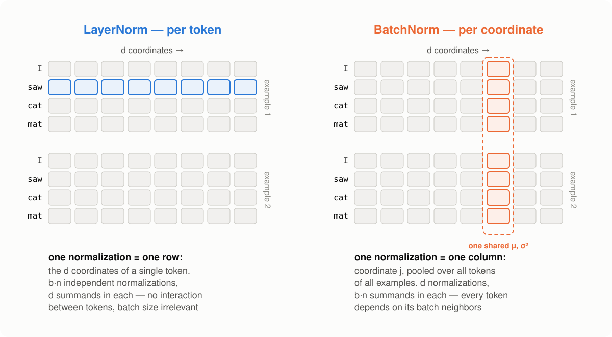
>
> Now, why is BatchNorm a poor fit here? The dependence on batch neighbors has a well-known cost, not specific to text at all: at inference the batch statistics are replaced by running averages accumulated during training, so the behavior at training and at inference slightly diverges. Computer vision lives with this cost successfully: there the statistics are stable from batch to batch, and the batch noise even helps as regularization. With sequences it is worse. Lengths differ — and although padding is easy to filter out of the statistics, the number of real tokens still jumps from batch to batch; moreover, the activation distributions depend heavily on which tokens landed in the batch — rare words produce outliers. As a result, batch statistics in a transformer are so noisy that the running averages become a poor estimate, and the train/inference mismatch starts to genuinely hurt quality — this is exactly what is shown experimentally in [Shen et al., 2020](https://arxiv.org/abs/2003.07845). Finally, in autoregressive generation the batch may consist of one example and one new token — there is simply nothing to compute statistics from. LayerNorm is free of all this because it is per-token: identical at training and inference, at any sequence length and any batch size.
>
> There is one more variant on the axis menu, sitting between the two: a single normalization over the whole sequence — all $n \cdot d$ numbers of one example. Note that the arguments above do not touch it: it has no batch statistics, hence no running averages and no train/inference mismatch. It fails for reasons of its own. First, its statistics would include future tokens — for the decoder that is an answer leak bypassing the causal mask, and during generation the statistics (and the representations of already-generated tokens) would change with every new token. Second, it does not solve the actual problem: the scale is evened out only *on average over the sentence*, while an individual outlier token with a huge norm remains an outlier — whereas it is precisely individual vectors that saturate the softmax in attention. Per-token normalization fixes each vector individually and opens no extra channels of interaction between tokens.

### Recap: all the blocks and their complexity

All the building blocks are ready and checked against the reference. A complexity summary:

| Block | Complexity | Parameters |
|---|---|---|
| Embeddings | $O(n \cdot d)$ (lookup) | $\lvert V \rvert \cdot d$ |
| Positional encoding | $O(n \cdot d)$ | — |
| Multi-head attention | $O(n^2 \cdot d + n \cdot d^2)$ | $4d^2$ |
| Masks | $O(n^2)$ | — |
| FFN | $O(n \cdot d \cdot d_{ff})$ | $2 d \cdot d_{ff} + d_{ff} + d$ |
| Add & Norm | $O(n \cdot d)$ | $2d$ |

In the next part we will assemble an encoder layer and a decoder layer out of these blocks, stack them into a full model, train it, and count what it all costs — in FLOPs and, no less importantly, in memory.

## Part 3 — Assembly, training, inference

The building blocks of Part 2 are ready and checked against the references. In this part we will assemble a full model out of them, train it on a toy task (for real, on a CPU, in a couple of minutes), learn to generate answers — and pay off the main debt of the series: count the complexity of the Transformer as a whole, including memory and inference.

> All the code of this part — including the training — can be run end to end: a [ready-made notebook](https://github.com/jen1995/jen1995.github.io/blob/main/notebooks/transformer_training.ipynb) lives in this blog's repository and [opens in Colab](https://colab.research.google.com/github/jen1995/jen1995.github.io/blob/main/notebooks/transformer_training.ipynb) in one click; no GPU needed.

### The blocks of Part 2 — now with batches

In Part 2 we worked with a single sequence for clarity: the input had shape $(n, d)$. For training we need to process a pack of examples at once, so all tensors gain a batch dimension: $(b, n, d)$. The good news: almost nothing needs to change — all the operations are written with `@` and work with any number of leading dimensions; only `split_heads` has changed.

```python
import numpy as np
import torch
import torch.nn as nn
import torch.nn.functional as F

torch.manual_seed(0)
np.random.seed(0)

def scaled_dot_product_attention(q, k, v, mask=None):
    scores = q @ k.transpose(-2, -1) / q.shape[-1] ** 0.5
    if mask is not None:
        scores = scores.masked_fill(~mask, float("-inf"))
    weights = F.softmax(scores, dim=-1)
    return weights @ v, weights

class MultiHeadAttention(nn.Module):
    def __init__(self, d, h):
        super().__init__()
        assert d % h == 0
        self.d, self.h, self.d_head = d, h, d // h
        self.w_q = nn.Linear(d, d, bias=False)
        self.w_k = nn.Linear(d, d, bias=False)
        self.w_v = nn.Linear(d, d, bias=False)
        self.w_o = nn.Linear(d, d, bias=False)

    def split_heads(self, x):                  # (b, n, d) -> (b, h, n, d/h)
        b, n, _ = x.shape
        return x.view(b, n, self.h, self.d_head).transpose(1, 2)

    def forward(self, x_q, x_k, x_v, mask=None):
        q = self.split_heads(self.w_q(x_q))
        k = self.split_heads(self.w_k(x_k))
        v = self.split_heads(self.w_v(x_v))
        out, _ = scaled_dot_product_attention(q, k, v, mask)
        b, _, n, _ = out.shape
        return self.w_o(out.transpose(1, 2).reshape(b, n, self.d))

class FeedForward(nn.Module):
    def __init__(self, d, d_ff):
        super().__init__()
        self.lin1 = nn.Linear(d, d_ff)
        self.lin2 = nn.Linear(d_ff, d)

    def forward(self, x):
        return self.lin2(F.relu(self.lin1(x)))

def positional_encoding(n, d):
    pos = torch.arange(n).unsqueeze(1)
    i = torch.arange(0, d, 2)
    angles = pos / 10000 ** (i / d)
    pe = torch.zeros(n, d)
    pe[:, 0::2] = torch.sin(angles)
    pe[:, 1::2] = torch.cos(angles)
    return pe

def causal_mask(n):
    return torch.tril(torch.ones(n, n, dtype=torch.bool))
```

A mask of shape $(n, n)$ is automatically broadcast over all batches and heads of the score tensor $(b, h, n, n)$ — another place where PyTorch's numpy conventions save code.

### The encoder layer

The recipe from the overview in Part 1: self-attention (tokens exchange information), then the FFN (each token digests what was gathered), and each of the two blocks is wrapped in a residual connection with LayerNorm.

```python
class EncoderLayer(nn.Module):
    def __init__(self, d, h, d_ff):
        super().__init__()
        self.attn = MultiHeadAttention(d, h)
        self.ffn = FeedForward(d, d_ff)
        self.norm1 = nn.LayerNorm(d)
        self.norm2 = nn.LayerNorm(d)

    def forward(self, x, mask=None):
        x = self.norm1(x + self.attn(x, x, x, mask))
        x = self.norm2(x + self.ffn(x))
        return x
```

Let us check the whole layer against a numpy reference assembled from the verified parts of Part 2 (repeated here once more, unchanged):

```python
def softmax_np(x, axis=-1):
    x = x - x.max(axis=axis, keepdims=True)
    e = np.exp(x)
    return e / e.sum(axis=axis, keepdims=True)

def attention_np(q, k, v, mask=None):
    scores = q @ np.swapaxes(k, -2, -1) / np.sqrt(q.shape[-1])
    if mask is not None:
        scores = np.where(mask, scores, -np.inf)
    weights = softmax_np(scores)
    return weights @ v, weights

def multi_head_attention_np(x, w_q, w_k, w_v, w_o, h):
    n, d = x.shape
    d_head = d // h

    def split(m):
        return m.reshape(n, h, d_head).transpose(1, 0, 2)

    q, k, v = split(x @ w_q), split(x @ w_k), split(x @ w_v)
    out, _ = attention_np(q, k, v)
    concat = out.transpose(1, 0, 2).reshape(n, d)
    return concat @ w_o

def feed_forward_np(x, w1, b1, w2, b2):
    return np.maximum(x @ w1 + b1, 0.0) @ w2 + b2

def add_norm_np(x, block_out, gamma, beta, eps=1e-5):
    z = x + block_out
    mu = z.mean(axis=-1, keepdims=True)
    var = z.var(axis=-1, keepdims=True)
    return gamma * (z - mu) / np.sqrt(var + eps) + beta

def encoder_layer_np(x, layer, h):
    p = lambda t: t.detach().numpy()
    a = layer.attn
    attn = multi_head_attention_np(x, p(a.w_q.weight).T, p(a.w_k.weight).T,
                                   p(a.w_v.weight).T, p(a.w_o.weight).T, h)
    x = add_norm_np(x, attn, p(layer.norm1.weight), p(layer.norm1.bias))
    ffn = feed_forward_np(x, p(layer.ffn.lin1.weight).T, p(layer.ffn.lin1.bias),
                          p(layer.ffn.lin2.weight).T, p(layer.ffn.lin2.bias))
    return add_norm_np(x, ffn, p(layer.norm2.weight), p(layer.norm2.bias))

d, h, d_ff, n = 64, 4, 256, 10
layer = EncoderLayer(d, h, d_ff)
x = torch.randn(1, n, d)

assert np.allclose(layer(x).detach().numpy()[0],
                   encoder_layer_np(x[0].numpy(), layer, h), atol=1e-5)
print("encoder layer: ok")
```

**Layer complexity.** Attention $O(n^2 \cdot d + n \cdot d^2)$ + FFN $O(n \cdot d \cdot d_{ff})$ + Add & Norm $O(n \cdot d)$. At the standard $d_{ff} = 4d$ the whole thing remains $O(n^2 \cdot d + n \cdot d^2)$ — the attention formula absorbs the rest.

### The decoder layer

The decoder layer has three blocks, and all three are familiar:

1. **masked self-attention** — the target-sequence tokens look at their own prefix (the causal mask from Part 2);
2. **cross-attention** — the heir of Bahdanau's attention from Part 0: queries from the decoder, keys and values from the encoder. The same `MultiHeadAttention` class, just different inputs;
3. **FFN** — unchanged.

```python
class DecoderLayer(nn.Module):
    def __init__(self, d, h, d_ff):
        super().__init__()
        self.self_attn = MultiHeadAttention(d, h)
        self.cross_attn = MultiHeadAttention(d, h)
        self.ffn = FeedForward(d, d_ff)
        self.norm1 = nn.LayerNorm(d)
        self.norm2 = nn.LayerNorm(d)
        self.norm3 = nn.LayerNorm(d)

    def forward(self, y, enc_out, mask):
        y = self.norm1(y + self.self_attn(y, y, y, mask))
        y = self.norm2(y + self.cross_attn(y, enc_out, enc_out))
        y = self.norm3(y + self.ffn(y))
        return y
```

The cross-check is organized just like for the encoder — all the parts have already been verified, so we omit the reference code. The complexity is the same up to a constant: cross-attention adds another $O(n^2 \cdot d + n \cdot d^2)$ (more precisely $O(n_{tgt} \cdot n_{src} \cdot d + \dots)$ — the score table is now "target × source").

### The full model

We assemble everything according to the scheme from Part 1 — here it is again as a reminder:


*After Figure 1 of [Vaswani et al., 2017](https://papers.nips.cc/paper/7181-attention-is-all-you-need.pdf) and [Lena Voita's NLP Course](https://lena-voita.github.io/nlp_course/seq2seq_and_attention.html)*

Embeddings (multiplied by $\sqrt{d}$ — that debt from Part 2) + positional encoding, a stack of encoder layers, a stack of decoder layers, an output projection into the vocabulary size — we now have code for every element of the scheme.

```python
class Transformer(nn.Module):
    def __init__(self, vocab_size, d, h, d_ff, n_layers, max_len=512):
        super().__init__()
        self.d = d
        self.emb_src = nn.Embedding(vocab_size, d)
        self.emb_tgt = nn.Embedding(vocab_size, d)
        self.register_buffer("pe", positional_encoding(max_len, d))
        self.enc_layers = nn.ModuleList(EncoderLayer(d, h, d_ff) for _ in range(n_layers))
        self.dec_layers = nn.ModuleList(DecoderLayer(d, h, d_ff) for _ in range(n_layers))
        self.out_proj = nn.Linear(d, vocab_size)

    def encode(self, src):
        x = self.emb_src(src) * self.d ** 0.5 + self.pe[: src.shape[1]]
        for layer in self.enc_layers:
            x = layer(x)
        return x

    def decode(self, tgt, enc_out):
        mask = causal_mask(tgt.shape[1])
        y = self.emb_tgt(tgt) * self.d ** 0.5 + self.pe[: tgt.shape[1]]
        for layer in self.dec_layers:
            y = layer(y, enc_out, mask)
        return self.out_proj(y)

    def forward(self, src, tgt):
        return self.decode(tgt, self.encode(src))
```

**The output layer** deserves a separate look at its complexity: the projection $(n \times d) \cdot (d \times |V|)$ costs $O(n \cdot d \cdot |V|)$. This is an often underestimated expense item. A quick estimate for machine translation: $|V| = 32{,}000$, $d = 512$. The output projection is $d \cdot |V| \approx 16.4$ million multiplications per token. And one layer (attention + FFN with $d_{ff} = 4d$) is roughly $10 d^2 + 2nd \approx 2.7$ million per token at $n = 50$; six layers — about 16 million. That is, the output projection costs roughly as much as **all six encoder layers put together**.

### How many parameters?

Let us count by the formulas and check against the fact:

- embeddings: $2 \lvert V \rvert d$ (source and target);
- an encoder layer: $4d^2$ (MHA) + $2 d \cdot d_{ff} + d_{ff} + d$ (FFN with bias) + $2 \cdot 2d$ (two LayerNorms);
- a decoder layer: $8d^2$ (two MHAs) + FFN + $3 \cdot 2d$;
- the output projection: $d\lvert V \rvert + \lvert V \rvert$.

```python
vocab_size, n_layers = 11, 2
model = Transformer(vocab_size, d, h, d_ff, n_layers)

ffn_p = 2 * d * d_ff + d_ff + d
enc_p = 4 * d * d + ffn_p + 2 * 2 * d
dec_p = 8 * d * d + ffn_p + 3 * 2 * d
formula = 2 * vocab_size * d + n_layers * (enc_p + dec_p) + d * vocab_size + vocab_size

fact = sum(p.numel() for p in model.parameters())
assert formula == fact
print(f"parameters: {fact:,}")
```

Note: positional encoding is absent from the list — it is not trained (we put it into `register_buffer`, not into `nn.Parameter`).

### Training: string reversal

To check whether our assembly "comes alive", we do not need a big dataset. Let us take a task that has everything a seq2seq model needs — an input, an output, a dependency of every output token on the input — but trains in minutes on a CPU: **reversing a sequence of symbols**. Input "3 7 1 5" → output "5 1 7 3". We reserve token 0 for `<bos>` (begin of sequence — the decoder starts generation from it).

```python
seq_len, n_symbols = 10, 10   # vocabulary: 0 = <bos>, 1..10 — "letters"

def make_batch(batch_size):
    src = torch.randint(1, n_symbols + 1, (batch_size, seq_len))
    tgt = src.flip(1)
    bos = torch.zeros(batch_size, 1, dtype=torch.long)
    dec_in = torch.cat([bos, tgt[:, :-1]], dim=1)   # decoder input shifted by 1
    return src, dec_in, tgt
```

The main idea of the training is visible right here in the code — **teacher forcing**. The decoder learns to predict the $t$-th token from a prefix of the *correct* tokens $y_{\lt t}$ (not from its own past predictions): we feed the target shifted one position to the right (with `<bos>` at the front) as input, and require the unshifted target as the prediction. Thanks to the causal mask, all positions are trained simultaneously, in one pass — that very parallelization over the sequence for which the whole thing was started in Part 1.

The loss function is the cross-entropy from Part 0, applied at every position:

```python
model = Transformer(vocab_size=n_symbols + 1, d=64, h=4, d_ff=256, n_layers=2)
opt = torch.optim.Adam(model.parameters(), lr=5e-4)

losses = []
for step in range(2000):
    src, dec_in, tgt = make_batch(128)
    logits = model(src, dec_in)                       # (b, n, |V|)
    loss = F.cross_entropy(logits.reshape(-1, logits.shape[-1]), tgt.reshape(-1))
    opt.zero_grad()
    loss.backward()
    opt.step()
    losses.append(loss.item())

print(f"loss: {losses[0]:.3f} → {losses[-1]:.4f}")
```

```python
import matplotlib.pyplot as plt

plt.figure(figsize=(7, 3.5))
plt.semilogy(losses)
plt.xlabel("training step")
plt.ylabel("cross-entropy (log scale)")
plt.title("Training on the string reversal task")
plt.grid(alpha=0.3)
plt.tight_layout()
plt.show()
```

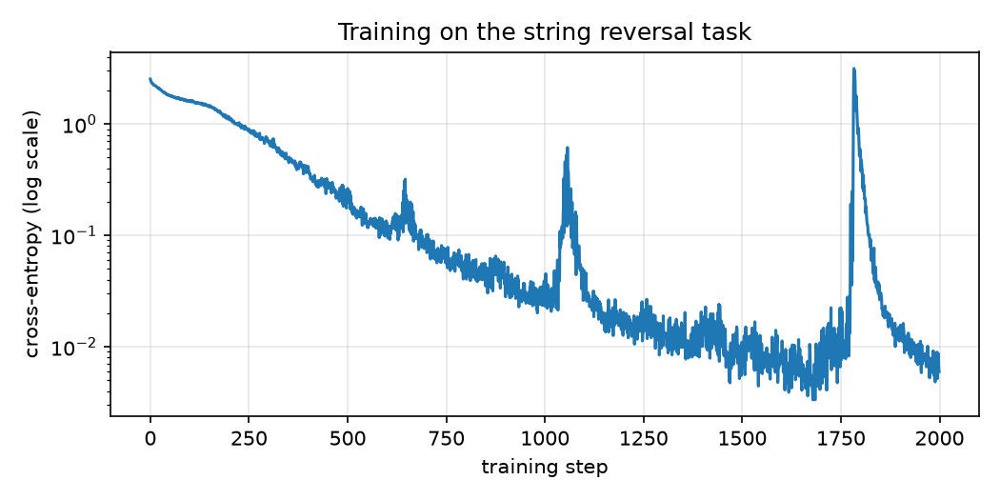

The rare spikes on the curve are not a bug: with Adam on small models, occasional gradient outliers happen, after which the loss returns to its trajectory within dozens of steps. In large models such spikes are fought with learning-rate warmup and gradient clipping; for our toy task it is enough that training recovers on its own.

In the original paper, **label smoothing** is added to the cross-entropy (the one-hot target distribution is slightly smeared over the vocabulary, $\varepsilon = 0.1$) — a regularization useful on real data; our task does not need it.

### Inference: generation token by token

The trained model predicts the next token — but how do we get a whole sequence? The same way the language model generated in Part 0: one token at a time. We start with `<bos>`, predict the first token, append it to the decoder input, predict the second — and so on. The simplest strategy is **greedy decoding**: at every step take the most probable token.

```python
@torch.no_grad()
def greedy_decode(model, src, out_len):
    enc_out = model.encode(src)                       # encode the source once
    ys = torch.zeros(src.shape[0], 1, dtype=torch.long)   # <bos>
    for _ in range(out_len):
        logits = model.decode(ys, enc_out)
        next_tok = logits[:, -1].argmax(-1, keepdim=True)
        ys = torch.cat([ys, next_tok], dim=1)
    return ys[:, 1:]

src, _, tgt = make_batch(1000)
pred = greedy_decode(model, src, seq_len)
exact = (pred == tgt).all(dim=1).float().mean()
print(f"accuracy (exact match): {exact:.1%}")
```

```text
accuracy (exact match): 99.5%
```

Let us look at the predictions with our own eyes. Numeric tokens are a convention; let us display symbols 1–10 as latin letters a–j, so the reversal is literally visible:

```python
def to_str(tokens):
    return "".join(chr(ord("a") + t - 1) for t in tokens.tolist())

for i in range(5):
    ok = "✓" if (pred[i] == tgt[i]).all() else "✗"
    print(f"{to_str(src[i])} → {to_str(pred[i])}  {ok}")

wrong = (pred != tgt).any(dim=1).nonzero().flatten()
if len(wrong) > 0:
    i = wrong[0]
    print(f"\nerror example: {to_str(src[i])} → {to_str(pred[i])}")
    print(f"correct:       {' ' * (seq_len + 3)}{to_str(tgt[i])}")
```

```text
gjcfhghhfg → gfhhghfcjg  ✓
hgfcacbgah → hagbcacfgh  ✓
gehbahfgja → ajgfhabheg  ✓
ieidhjgfag → gafgjhdiei  ✓
jjbbifcije → ejicfibbjj  ✓

error example: bhchhicehh → hhecihhcbh
correct:                    hhecihhchb
```

The character of the rare errors is telling in itself: they happen on strings with many repeats of the same symbol (five "h"s in the example above). This is no coincidence: identical tokens have identical embeddings, and attention can distinguish them only by the positional component — that very positional encoding from Part 2. Copying in reverse order is, at its core, pure positional work, and it is what fails first.

Greedy is not the only strategy. A greedy choice is irreversible: one mistake at the beginning ruins the whole tail, even if the model "knew" a better option. **Beam search** softens this: at every step not one but $k$ best prefixes are kept (by total log-likelihood), and the final answer is chosen among $k$ complete hypotheses. In translation, typical $k = 4\text{–}8$ give a noticeable quality boost; for our toy task, where the model is confident in every token, greedy is enough.

### Memory at training time: the hidden cost of quadraticity

We have been counting FLOPs all series long, but training has a second currency — **memory**. For the backward pass we must store the activations of all intermediate layers: gradients are computed by the chain rule from the output back to the input, and every layer needs its forward-pass inputs for that.

The hungriest activation is the attention weight table: $n \times n$ for **every head of every layer**. A quick estimate for a modest-by-today's-standards config:

```python
n, h_, N_ = 4096, 8, 12       # context length, heads, layers
attn_bytes = N_ * h_ * n * n * 4        # float32
print(f"attention matrices: {attn_bytes / 2**30:.1f} GiB per example")
```

```text
attention matrices: 6.0 GiB per example
```

Six gigabytes — just for the attention tables, just for one example in the batch, and we have not yet counted the FFN activations or the gradients with the optimizer state. The FLOPs, meanwhile, are perfectly manageable — it is memory we hit first: it grows as $O(N \cdot h \cdot n^2)$, and doubling the context length quadruples the bill. That is why long context has historically been a memory problem, not an arithmetic one.

> 💡 Modern attention implementations (e.g. FlashAttention) do not materialize the $n \times n$ table in full: the scores are computed in blocks and immediately folded into the output, and on the backward pass the missing parts are recomputed. The quadraticity of FLOPs stays; the quadraticity of memory goes away. This is beyond our series, but it is useful to know that "quadratic memory" is not a verdict.

### KV-cache: do not recompute the past

Let us look closely at our `greedy_decode`. At step $t$ we call `model.decode` on the **entire** prefix of $t$ tokens: we recompute Q, K, V for tokens that have not changed, and rebuild the $t \times t$ attention table. The cost of step $t$ is $O(t^2 \cdot d)$, and of the whole generation of $T$ tokens — $O(T^3 \cdot d)$. Wasteful: from step to step, exactly one token in the prefix changes.

The key observation: for its attention, the new token needs its own query $q_t$ — and the keys and values of **all the previous** tokens, which we already computed at past steps. So they can be cached: we store the accumulated $K$ and $V$ (a pair per layer), at each step compute the projections only for the one new token and append them to the cache. That is the **KV-cache**. The cost of step $t$ drops to $O(t \cdot d)$: one query against $t$ keys. The whole generation of $T$ tokens gets cheaper from $\sum_t O(t^2 d) = O(T^3 \cdot d)$ to $\sum_t O(t \cdot d) = O(T^2 \cdot d)$ — an order of $T$ better; the quadraticity remains (the last token still looks at all its predecessors), but the cubic wastefulness is gone.

Let us verify, at the level of a single attention layer, that incremental generation with a cache gives exactly the same result as full recomputation with a causal mask:

```python
mha = MultiHeadAttention(d, h)
x = torch.randn(1, 20, d)

with torch.no_grad():
    full = mha(x, x, x, causal_mask(20))          # full recomputation

    k_cache, v_cache, outs = None, None, []
    for t in range(x.shape[1]):
        x_t = x[:, t : t + 1]                     # only the new token
        q = mha.split_heads(mha.w_q(x_t))
        k_new = mha.split_heads(mha.w_k(x_t))
        v_new = mha.split_heads(mha.w_v(x_t))
        k_cache = k_new if k_cache is None else torch.cat([k_cache, k_new], dim=2)
        v_cache = v_new if v_cache is None else torch.cat([v_cache, v_new], dim=2)
        out, _ = scaled_dot_product_attention(q, k_cache, v_cache)
        outs.append(mha.w_o(out.transpose(1, 2).reshape(1, 1, mha.d)))
    incremental = torch.cat(outs, dim=1)

assert torch.allclose(full, incremental, atol=1e-5)
print("KV-cache: matches full recomputation")
```

Notice: the causal mask was not needed in the incremental variant. The cache **is** the past — the new token physically cannot look into the future, because the future keys do not exist yet. The mask is only needed during training, when all positions are computed simultaneously.

We pay for the speedup with memory: the cache holds $2 \cdot N \cdot t \cdot d$ numbers and grows linearly with the generation length — in long dialogues with large models it is precisely the KV-cache that occupies a notable share of GPU memory. This trade — recomputation for storage — is an engineering classic, and in Part 2 we already saw its mirror image: FlashAttention trades storage for recomputation.

### 📦 Transformer complexity: the whole series in one place

The promised summary — all the answers in one place.

**Formulas by block** (derived in Part 2):

| Block | Complexity |
|---|---|
| Embeddings | $O(n \cdot d)$ |
| Positional encoding | $O(n \cdot d)$ |
| Multi-head attention | $O(n^2 \cdot d + n \cdot d^2)$ |
| FFN | $O(n \cdot d \cdot d_{ff})$, at $d_{ff}=4d$ — $O(n \cdot d^2)$ |
| Add & Norm | $O(n \cdot d)$ |
| Output projection | $O(n \cdot d \cdot \lvert V \rvert)$ |

**Total for a model of $N$ layers:**

$$
\underbrace{O\big(N \cdot (n^2 d + n d^2)\big)}_{\text{layers}} \;+\; \underbrace{O(n \cdot d \cdot |V|)}_{\text{output}}.
$$

**Comparison with the RNN** (derived in Part 1):

| | FLOPs per layer | Sequential operations | Path between tokens |
|---|---|---|---|
| Self-attention | $O(n^2 \cdot d)$ | $O(1)$ | $O(1)$ |
| RNN | $O(n \cdot d^2)$ | $O(n)$ | $O(n)$ |

The Transformer's win is not in FLOPs (there may even be more of them) but in the two right columns: parallelism and short paths for the gradient.

**Where is the bottleneck?** Look at $O(n^2 d + n d^2)$ and compare $n$ with $d$:

- $n \gg d$ (long contexts): $n^2 d$ dominates — attention. Hence the whole industry of "cheap" attention.
- $n \approx d$: both terms are $O(n^3)$, no single bottleneck.
- $n \ll d$ (typical translation: $n \sim 50$, $d = 512\text{–}1024$): $n d^2$ dominates — **the linear projections and the FFN**, not attention at all. This is worth spelling out because it contradicts a popular myth: on short sequences the quadraticity of attention is practically invisible; the bulk of the FLOPs goes into ordinary matrix multiplications.

**"Complexity" is three different questions:**

1. **Training FLOPs:** the forward pass is $O(N(n^2 d + n d^2) + n d |V|)$ per example; the backward is roughly twice the forward; in total, training costs about three forwards.
2. **Training memory:** the activations for the backward pass, the worst being the attention tables $O(N \cdot h \cdot n^2)$. Quadratic memory hits the hardware sooner than quadratic FLOPs.
3. **Inference cost:** naive generation — $O(t^2 d)$ per token; with a KV-cache — $O(t \cdot d)$ per token at the price of a cache of size $O(N \cdot t \cdot d)$, growing with the length of the dialogue.

### Series finale

We have walked the whole path: from seq2seq and language models (Part 0), through the motivation of "why throw out the RNN" (Part 1) and the hand-assembly of every block with numpy checks (Part 2) — to a working model that trained, generates, and fits the formulas we derived (Part 3). The Transformer has stopped being a black box: it is a dozen small parts, each of which fits into 10–20 lines of code and one complexity formula.

Where to go next if you want to dig deeper: BPE tokenization, decoder-only architectures (GPT), efficient attention (FlashAttention and relatives), quantization, and everything that makes inference cheap. But those are other stories.

---

**Acknowledgments.** The diagrams and animations in this series are redrawn after the wonderful illustrations in Lena Voita's magical [NLP Course For You](https://lena-voita.github.io/) — a course that inspired much of this series in the first place. If after these posts you want a broader and deeper dive into NLP, that is the place to go. Thank you, Lena! 💛
