> This post is an English translation of my chapter on VAE from the [Machine Learning Handbook](https://education.yandex.ru/handbook/ml) by Yandex School of Data Analysis (originally in Russian). The text follows the latest revised version of the chapter; the figures are the original English-language versions.

## Introduction

There is a fairly broad area of machine learning devoted to training *generative models*. Their goal is to learn the distribution from which the objects of the training set could have been sampled.

Once trained, a generative model can sample new objects from the learned distribution — objects that do not belong to the original data. Most often this is associated with generating new images: from pictures of handwritten digits to face swapping in videos.

The model this post is about is called the variational autoencoder, or VAE. It belongs to the family of generative models. Here is a quick roadmap of what lies ahead.

* The sections "Problem setup" and "Training a VAE" describe how a VAE is built and trained in its classical form. These two sections are enough to get a general understanding of VAE.

* The section "Key papers" is not required for a first understanding, but may be interesting to those who want to learn about the foundational works that grew out of the VAE idea.

## Problem setup

Imagine that we need to draw a horse. How would we go about it?

We would probably first sketch the overall silhouette of the horse, its size and pose, and then start adding details: the mane, the tail, the hooves, picking a coat color, and so on. It seems that while learning to draw, we learn to identify a basic set of **factors** that matter most for generating a new image — overall silhouette, size, color and the like — and during drawing we simply plug in particular **values** of those factors.

At the same time, identical combinations of the same factors can lead to different pictures — after all, you most likely cannot draw something exactly the same way twice.

Let us try to formalize the process described above. Suppose we have a dataset $D$ living in a high-dimensional space of raw data $X^N$ — the objects we wish to generate — and a lower-dimensional space $Z^M$ of **hidden (latent) variables**, which encode the hidden factors in the data. The generative process then consists of two consecutive stages (see the picture below):

1. Sample $z\in{Z^M}$ from the distribution $p(z)$

2. Sample $x\in{X^N}$ from the distribution $p(x\mid z)$


*[Image source](https://jmtomczak.github.io/blog/4/4_VAE.html)*

That is, thinking in terms of drawing pictures of horses, we first mentally sample some $z$ (size, shape, color), then fill in all the necessary details — that is, we sample from the distribution $p(x\mid z)$ — and in the end we hope that the result will resemble a horse.

Thus, building a generative model in our case means being able to sample, via the two-stage process described above, objects that are close to the objects of the training set $D$.

More formally, we would like our model to maximize the likelihood $p(x)$ of the elements of the training set $D$ under the described generation procedure:

$$p(x)=\int_{Z^M}{p(x\mid z)p(z)dz}\to{\max}
$$

Assume that the joint distribution $p(x,z)$ is parameterized by some parameter $\theta\in{\Theta}$ and is expressed by a function continuous in $\theta$ for every fixed $x$ and $z$:

$$p_{\theta}(x,z)=p(x,z\mid\theta)\in{C(\Theta)}
$$

Then

$$p_{\theta}(x,z)=p_{\theta}(x\mid z)p_{\theta}(z),
$$

and we can write down the following optimization problem:

$$p_{\theta}(x)=\int_{Z^M}{p_{\theta}(x\mid{z})p_{\theta}(z)dz}\to\max_{\theta\in\Theta}\tag{1}
$$

Solving it, we obtain our generative model.

**Remark 1.** After the analogy with learning to draw, one might mistakenly conclude that latent variables always carry some nicely interpretable meaning. In practice this does not have to be the case: the latent variables we end up finding may or may not have a simple interpretation. The explanations above were primarily meant to illustrate the notion of "latent variables."

**Remark 2.** It might seem that $p(x)$ is somehow already known to us, and then it is unclear why we need all these complications with latent variables and integrals. Indeed, we can actually build a [statistical estimate](https://en.wikipedia.org/wiki/Density_estimation) $\hat{p}(x)$ from the data $D$ and even try to generate new data with such models (as done, for example, [here](https://scikit-learn.org/stable/modules/density.html)). But statistical methods come with various limitations, the most serious of which appears to be the curse of dimensionality: the more dimensions your data has, the more diverse examples you need to build an adequate estimate $\hat{p}(x)$. We will talk about the curse of dimensionality in a bit more detail later.

**Remark 3.** Another natural question: why introduce latent variables at all, model the joint distribution $p(x,z)$, and define the target distribution $p(x)$ as the marginalization of $p(x,z)$ over $z$? Why should this approach work in the first place? The answer is that even with relatively simple expressions for $p(z)$ and $p(x \mid z)$, one can describe a rather complex distribution $p(x)$ — which is illustrated quite vividly in the example below.

<details>
<summary><b>Example: mixture of Gaussians</b></summary>

Imagine you have a table with a finite number of rows, where the $k$-th row contains two numbers — the mean $\mu_k$ and the variance $\sigma_k^2$ of a normal distribution. Suppose a discrete distribution $p(z)$ is defined over the row indices of this table, such that:

$$p(z=k) = \lambda_k
$$

Say we sampled an index $k$, took the distribution parameters from the corresponding row, and sampled an object $x$ with those parameters. The distribution from which $x$ was obtained equals:

$$p(x \mid z=k) = \mathcal{N}(\mu_k, \sigma_k^2)
$$

The distribution $p(x)$ is obtained by marginalizing the joint distribution $p(x,z)$ over $z$:

$$p(x) = \sum_{k=1}^K p(x,z=k) = \sum_{k=1}^K p(x \mid z=k) p(z=k) = \sum_{k=1}^K \lambda_k \mathcal{N}(\mu_k, \sigma_k^2)
$$

It turns out that $p(x)$ is described by a mixture of Gaussians and has a more complex form than $p(z)$ and $p(x \mid z)$:

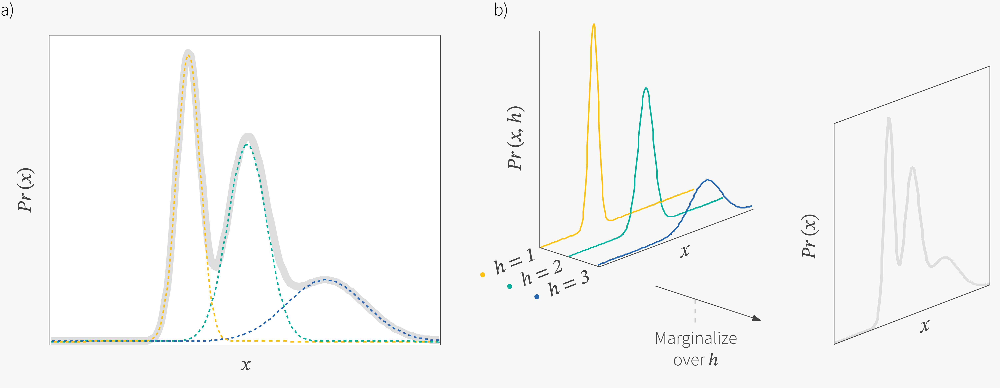

*[Image source](https://www.borealisai.com/en/blog/tutorial-5-variational-auto-encoders/)*

Clearly, the more Gaussians in our sum, the more complex the shape of $p(x)$ can be. So, with simple $p(z)$ and $p(x \mid z)$, we can model complex multimodal distributions. Now imagine that the prior distribution $p(z)$ takes not discrete but continuous values. Consider, for example, the following case:

$$p(z) = \mathcal{N}(0,1)
$$

$$p(x \mid z) = \mathcal{N}(\mu(z), \sigma^2(z))
$$

The distribution $p(x)$, analogously to the discrete-prior case, is obtained by integrating $p(x,z)$ over $z$ and is, in a sense, an "infinite" mixture of Gaussians:

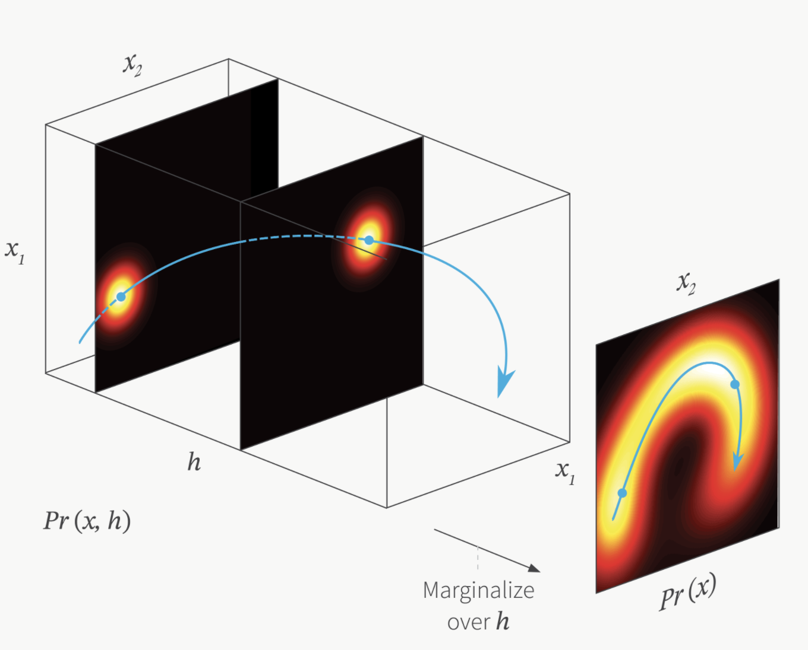

*[Image source](https://www.borealisai.com/en/blog/tutorial-5-variational-auto-encoders/)*

That settles it. In the next section we continue with the optimization problem we started discussing above — stay tuned!

</details>

## Training a VAE

Before trying to solve optimization problem $(1)$, let us think about how we could even compute such an integral. The first thing that comes to mind is to approximate it with the Monte Carlo method:

$$p_\theta(x) = \int\limits_{Z^M} p_\theta(x \mid z) p_\theta(z) dz = \mathbb{E}_{z \sim p_\theta(z)} [p_\theta(x \mid z)] \approx \frac{1}{K} \sum_k p_\theta(x \mid z_k),
$$

where in the last step we use samples $z_k \sim p_\theta(z)$. However, if $z \in Z^M$ and $M$ is large enough, we run into the *curse of dimensionality* — the number of samples needed to cover $Z^M$ well grows exponentially with $M$:

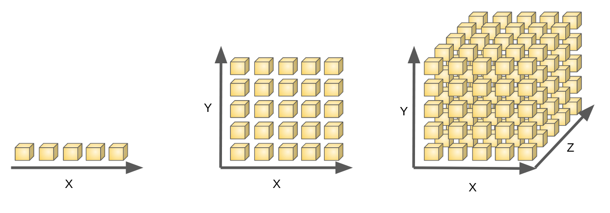

*[Image source](https://medium.com/diogo-menezes-borges/give-me-the-antidote-for-the-curse-of-dimensionality-b14bce4bf4d2)*

Is there a way to somehow reduce the number of samples needed to compute $(1)$? As it happens, it is often the case that far from all possible $z$ map into elements of $D$, and the contribution of most $z$ to the estimate of $p_\theta(x \mid z)$ is practically zero. This suggests that for each $x$ we could benefit from knowing the distribution $q(z \mid x)$ of those $z$ that are preimages of $x$. We may assume that the distribution $q$ is parameterized by some family of parameters $\Phi$:

$$q(z \mid x) = q_\phi(z \mid x), \quad \phi \in \Phi
$$

Knowing the distribution $q_\phi(z \mid x)$, we could sample only from it rather than from the whole $p_\theta(z)$, and if the distribution $q$ turns out to be good enough, the number of required samples will drop significantly.

We will discuss how to build $q_\phi$ later. For now, note that the processes of sampling from the distributions $q_\phi(z \mid x)$ and $p_\theta(x \mid z)$ are mutually inverse: the first maps dataset elements into a subset of the latent space $Z^M$, i.e. acts as an *encoder*, while the second maps latent variables into a subset of $X^N$, i.e. acts as a *decoder*:

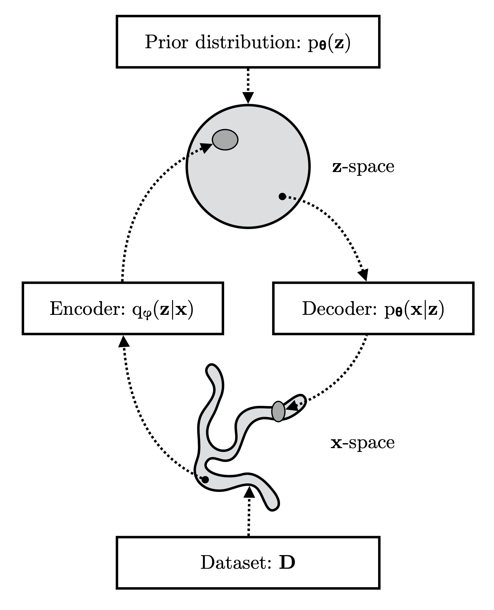

*[Image source](https://pure.uva.nl/ws/files/17891313/Thesis.pdf)*

Since both of these distributions will take part in training the VAE, an analogy arises between VAE and [autoencoder models](https://en.wikipedia.org/wiki/Autoencoder), which have a similar structure.

### Deriving the loss function

We now have everything ready to write down the general form of the loss function for training a variational autoencoder. Recall that we train the model by maximizing the likelihood $p_\theta(x)$ with respect to $\theta$. For convenience, we switch to the log-likelihood:

$$\log p_\theta(x) = \log \int_{Z^M} p_\theta(x \mid z) p_\theta(z) dz \to \max_{\theta \in \Theta}
$$

Optimizing this expression directly is hard because of the curse of dimensionality discussed in the previous section. To defeat it, we would like to replace sampling from the prior distribution $p_\theta(z)$ with sampling from $q_\phi(z \mid x)$, which requires a certain trick. For any $q_\phi(z \mid x)$ that is nonzero for all $z \in Z^M$, we can write out the following chain of equalities:

$$\log p_\theta(x) = \mathbb{E}_{q_\phi(z \mid x)} [\log p_\theta(x)] = 
$$

$$= \mathbb{E}_{q_\phi(z \mid x)} \left[ \log \left( \frac{p_\theta(x,z)}{p_\theta(z \mid x)} \right) \right] =
$$

$$= \mathbb{E}_{q_\phi(z \mid x)} \left[ \log \left( \frac{p_\theta(x,z)}{q_\phi(z \mid x)} \frac{q_\phi(z \mid x)}{p_\theta(z \mid x)} \right) \right] =
$$

$$= \underbrace{\mathbb{E}_{q_\phi(z \mid x)} \left[ \log \left( \frac{p_\theta(x,z)}{q_\phi(z \mid x)} \right) \right]}_{\mathcal{L}_{\theta,\phi}(x) \text{ (ELBO)}} + \underbrace{\mathbb{E}_{q_\phi(z \mid x)} \left[ \log \left( \frac{q_\phi(z \mid x)}{p_\theta(z \mid x)} \right) \right]}_{D_{KL}(q_\phi(z \mid x) \| p_\theta(z \mid x))}
$$

The second term in the last equality is the $KL$ divergence between $q_\phi(z \mid x)$ and $p_\theta(z \mid x)$, which, as is well known, is nonnegative:

$$D_{KL}(q_\phi(z \mid x) \| p_\theta(z \mid x)) \ge 0
$$

And the first term is the **evidence lower bound (ELBO)**:

$$\mathcal{L}_{\theta,\phi}(x) = \mathbb{E}_{q_\phi(z \mid x)} [\log p_\theta(x,z) - \log q_\phi(z \mid x)] =
$$

$$= \underbrace{\mathbb{E}_{q_\phi(z \mid x)} [\log p_\theta(x \mid z)]}_{\text{reconstruction loss}} - \underbrace{D_{KL}(q_\phi(z \mid x) \| p_\theta(z))}_{\text{regularization term}}
$$

The first term in the last step is called the **reconstruction loss**, since it measures how well the decoder reconstructs the object $x$ from its latent representation $z$. The second one plays the role of a regularization term and pushes the distribution produced by the encoder to be closer to the prior distribution.

Since the $KL$ divergence is nonnegative, the ELBO is a lower bound on the log-likelihood of the data:

$$\mathcal{L}_{\theta,\phi}(x) = \log p_\theta(x) - D_{KL}(q_\phi(z \mid x) \| p_\theta(z \mid x)) \le \log p_\theta(x)
$$

Let us take a closer look at the equalities we have written down.

* The function $\mathcal{L}_{\theta,\phi}$ can be optimized by gradient descent (SGD), once we choose a convenient form for $p_\theta(x \mid z)$, $q_\phi(z \mid x)$ and $p_\theta(z)$. By maximizing $\mathcal{L}_{\theta,\phi}$, we increase $\log p_\theta(x)$, thereby improving our generative model. We will discuss ELBO optimization with SGD in detail in the next section.

* By maximizing $\mathcal{L}_{\theta,\phi}$, we simultaneously minimize $D_{KL}(q_\phi(z \mid x) \| p_\theta(z \mid x))$. The distribution $p_\theta(z \mid x)$ estimates which $z$ the object $x$ could have been generated from, and it is not known to us in advance. But if we pick a sufficiently large model for $q_\phi(z \mid x)$, then during optimization $q_\phi(z \mid x)$ can get very close to $p_\theta(z \mid x)$, and then we will be directly optimizing $\log p_\theta(x)$. As a pleasant bonus, to estimate the distribution of preimages of $x$ we can use $q_\phi(z \mid x)$ instead of the intractable $p_\theta(z \mid x)$. That is, $q_\phi$, which we introduced in the derivation as an arbitrary distribution, will indeed play the role of the model's encoder.

<details>
<summary><b>An alternative derivation of the ELBO</b></summary>

In the reasoning above, introducing $q_\phi(z \mid x)$ might have seemed rather formal. So here we present another approach to deriving the expression for the ELBO, which may feel more natural. It consists of successively applying a technique called [importance sampling](https://artowen.su.domains/mc/Ch-var-is.pdf) and Jensen's inequality.

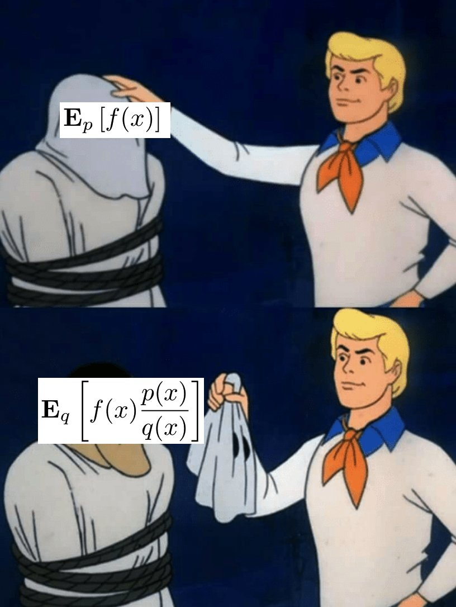

*[Image source](https://twitter.com/sam_power_825/status/1420445539091587094?s=21)*

In many practical problems, a situation arises where we want to compute $\mu = \mathbb{E}[f(X)]$, but $f(x)$ is close to zero outside some region $A$, while the probability of landing in this important region is very small: $P(X \in A) \approx 0$.

The set $A$ may either have too small a measure, or sit in the tail of the distribution of the random variable $X$. Ordinary Monte Carlo sampling may generate almost no examples that fall into the set $A$. Problems of this kind are quite common in high-energy physics, Bayesian inference, forecasting of natural hazards, and many other areas.

A rather intuitive solution is to try to artificially increase the share of important examples among all the rest. This can be done by using a distribution that gives more weight to examples from the important region. Hence the name of the method — **importance sampling**.

So, suppose our task is to compute the expectation $\mu = \mathbb{E}_p[f(x)] = \int_{\mathcal{D}} f(x) p(x) dx$, where

* $p$ is a probability density on the set $\mathcal{D} \in \mathbb{R}^d$,

* $f$ is some integrable function.

Let $q$ be a probability density function, defined and positive on $\mathcal{D}$, that allows us to sample examples from some narrow subset of interest. Our task is to switch from sampling from $p$ to sampling from $q$ when estimating $\mu$. Since the mean $\mathbb{E}_q[f(x)]$ is, generally speaking, not equal to $\mu$, we write the following:

$$\mu = \mathbb{E}_p[f(x)] = \int_{\mathcal{D}} f(x) p(x) dx = \int_{\mathcal{D}} \frac{f(x)p(x)}{q(x)} q(x) dx = \mathbb{E}_q \left[ \frac{f(x)p(x)}{q(x)} \right]
$$

The original density $p$ is called the nominal distribution, and the density $q$ the importance distribution. The likelihood ratio $\frac{p(x)}{q(x)}$ compensates for the bias introduced when switching from $p$ to $q$.

Let us also recall the statement of Jensen's inequality for random variables: if $\xi$ is a random variable with finite expectation and $g(x)$ is a convex function, then:

$$\mathbb{E}[g(\xi)] \ge g(\mathbb{E}[\xi])
$$

Now back to the original problem. Again, for any $q_\phi(z \mid x)$ that is nonzero for all $z \in Z^M$, we can write:

$$\log p_\theta(x) = \log \int_{Z^M} p_\theta(x \mid z) p_\theta(z) dz =
$$

$$= \log \mathbb{E}_{p_\theta(z)} [p_\theta(x \mid z)] =
$$

$$= \log \mathbb{E}_{q_\phi(z \mid x)} \left[ \frac{p_\theta(x \mid z) p_\theta(z)}{q_\phi(z \mid x)} \right] \ge
$$

$$\ge \mathbb{E}_{q_\phi(z \mid x)} \log \left[ \frac{p_\theta(x \mid z) p_\theta(z)}{q_\phi(z \mid x)} \right] =
$$

$$= \mathbb{E}_{q_\phi(z \mid x)} \log [p_\theta(x \mid z)] - \mathbb{E}_{q_\phi(z \mid x)} \log \left[ \frac{q_\phi(z \mid x)}{p_\theta(z)} \right] =
$$

$$= \mathbb{E}_{q_\phi(z \mid x)} \log [p_\theta(x \mid z)] - D_{KL}(q_\phi(z \mid x) \| p_\theta(z))
$$

As a result of these manipulations we have, as you can see, once again obtained the expression for the ELBO. In the third step we applied importance sampling, and in the fourth — Jensen's inequality for $g(x)=\log(x)$ (note that for the concave $\log$ the inequality flips).

The downside of this approach is that, unlike the previous method, it does not let us write out an explicit formula for the gap between $\log p_\theta(x)$ and the ELBO:

$$\log p_\theta(x) - \text{ELBO} = D_{KL}(q_\phi(z \mid x) \| p_\theta(z \mid x))
$$

On the other hand, this derivation follows naturally from more general methods, without requiring artificial tricks.

</details>

### Training a VAE with gradient descent

An important property of the ELBO is that it can be optimized by gradient descent with respect to the parameters $\phi$ and $\theta$. If the objects of the dataset $D$ are independent and identically distributed, then $\mathcal{L}_{\theta,\phi}(\mathcal{D})$ is written as a sum (or mean) of the values $\mathcal{L}_{\theta,\phi}(x)$ over the objects $x \in D$:

$$\mathcal{L}_{\theta,\phi}(\mathcal{D}) = \sum_{x \in \mathcal{D}} \mathcal{L}_{\theta,\phi}(x)
$$

The values $\mathcal{L}_{\theta,\phi}(x)$ and their gradients $\nabla \mathcal{L}_{\theta,\phi}(x)$ cannot be computed exactly in the general case, but we can obtain unbiased estimates of them, which will let us use stochastic gradient descent.

An estimate for the gradient with respect to the parameters $\theta$ is easy to get:

$$\nabla_\theta \mathcal{L}_{\theta,\phi}(x) = \nabla_\theta \mathbb{E}_{q_\phi(z \mid x)} [\log p_\theta(x,z) - \log q_\phi(z \mid x)] =
$$

$$= \mathbb{E}_{q_\phi(z \mid x)} [\nabla_\theta (\log p_\theta(x,z) - \log q_\phi(z \mid x))] =
$$

$$= \mathbb{E}_{q_\phi(z \mid x)} [\nabla_\theta \log p_\theta(x,z)] \approx
$$

$$\approx \frac{1}{K} \sum_k \nabla_\theta \log p_\theta(x, z_k),
$$

where in the last line $z_k \sim q_\phi(z \mid x)$. However, an estimate for the gradient with respect to the parameters $\phi$ is harder to obtain, because they also take part in the sampling:

$$\nabla_\phi \mathcal{L}_{\theta,\phi}(x) = \nabla_\phi \mathbb{E}_{q_\phi(z \mid x)} [\log p_\theta(x,z) - \log q_\phi(z \mid x)] \neq
$$

$$\neq \mathbb{E}_{q_\phi(z \mid x)} [\nabla_\phi (\log p_\theta(x,z) - \log q_\phi(z \mid x))]
$$

In the general case this problem is unsolvable. However, some distributions admit the **reparameterization trick**: representing the variable $z$ as an invertible differentiable function of random noise, the parameters $\phi$, and the variable $x \in D$:

$$z = g(\varepsilon, \phi, x)
$$

Here the distribution $\varepsilon \sim p_\varepsilon$ does not depend on $\phi$ or $x$. For example, let $\varepsilon \sim \mathcal{N}(0, I)$. Then $g$ can have the following form:

$$z = g(\varepsilon, \phi, x) = \mu_\phi(x) + \varepsilon \cdot \sigma_\phi(x) \sim \mathcal{N}(\mu_\phi(x), \sigma_\phi^2(x))
$$

After this substitution we can obtain an estimate of the gradient with respect to $\phi$:

$$\nabla_\phi \mathcal{L}_{\theta,\phi}(x) = \nabla_\phi \mathbb{E}_{q_\phi(z \mid x)} [\log p_\theta(x,z) - \log q_\phi(z \mid x)] =
$$

$$= \nabla_\phi \mathbb{E}_{p_\varepsilon} [\log p_\theta(x, g(\varepsilon, \phi, x)) - \log q_\phi(g(\varepsilon, \phi, x) \mid x)] =
$$

$$= \mathbb{E}_{p_\varepsilon} [\nabla_\phi (\log p_\theta(x, g(\varepsilon, \phi, x)) - \log q_\phi(g(\varepsilon, \phi, x) \mid x))] \approx
$$

$$\approx \frac{1}{K} \sum_k \nabla_\phi (\log p_\theta(x, g(\varepsilon_k, \phi, x)) - \log q_\phi(g(\varepsilon_k, \phi, x) \mid x)),
$$

where in the last line $\varepsilon_k \sim p_\varepsilon$. The reparameterization trick is well illustrated by the following picture:

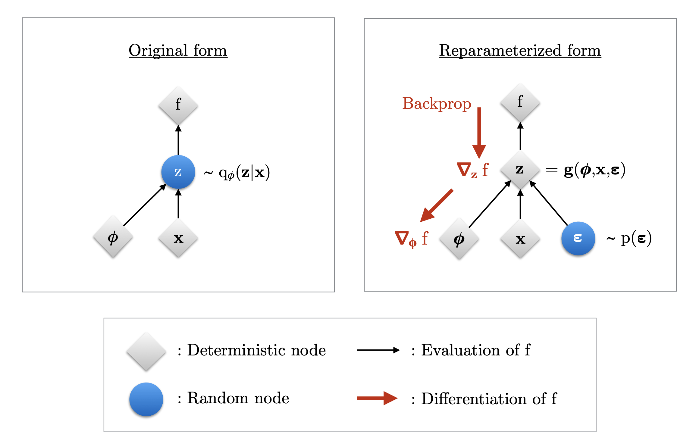

*[Image source](https://pure.uva.nl/ws/files/17891313/Thesis.pdf)*

Here $f$ is the loss function. The values of $f$ are the same in both diagrams, but in the left one the gradients with respect to $\phi$ cannot be computed, since we cannot differentiate through the random variable $z$.

In the right diagram, however, the source of randomness moves into the input data thanks to reparameterization, and the gradients are computed with respect to deterministic variables. We thus arrive at a setup typical for optimization with SGD: there we approximate the gradient of the loss function over random batches of input data, and here the role of random batches is played jointly by batches of the variables $x$ and of the random variables $\varepsilon$.

Besides the normal distribution, there are quite a few examples of distributions that admit reparameterization. They can be found [in the VAE paper](https://arxiv.org/pdf/1312.6114.pdf), in the section "The reparameterization trick". Most VAE implementations, however, use the normal distribution.

In the end, the rough algorithm for training a VAE looks like this:

```python
dataset = np.array(...)
epsilon = RandomDistribution(...)

# Encoder q_phi(z|x) — a neural network with parameters phi
encoder = Encoder()

# Decoder p_theta(x|z) — a neural network with parameters theta
decoder = Decoder()

for step in range(max_steps):
     # Sample a batch of input data and of random noise
     batch_x = sample_batch(dataset)
     batch_noise = sample_batch(epsilon)

     # Compute the parameters of q(z | x) with the encoder
     latent_distribution_parameters = encoder(batch_x)

     # Apply reparameterization (sample from q(z | x))
     z = reparameterize(latent_distribution_parameters, batch_noise)

     # The decoder outputs the parameters of the output distribution
     output_distribution_parameters = decoder(z)

     # Compute the ELBO and update the model parameters
     L = -ELBO(
        latent_distribution_parameters, 
        output_distribution_parameters, 
        batch_x
     )
     L.backward()
```

It is worth emphasizing that the decoder outputs precisely the parameters of the output distribution, not a particular sample from it. For example, if you model output images with a normal distribution $\mathcal{N}(\mu(z), \sigma^2(z))$, the decoder will predict some $\hat{\mu}(z)$ and $\hat{\sigma}(z)$, which, together with the parameters of the latent distribution (the encoder's output), are fed into the ELBO.

To generate an actual picture at inference time, you either honestly sample from $\mathcal{N}(\hat{\mu}(z), \hat{\sigma}^2(z))$, or, as is often done, simply take the mean $\hat{\mu}(z)$ as the output image. In general, the exact way inference is carried out depends on the type of the output distribution used.

### Choosing the distributions

It is time to give examples of concrete $p_\theta(x \mid z)$, $q_\phi(z \mid x)$ and $p_\theta(z)$ with which a VAE can be built. To begin with, assume that $p_\theta(z)$ can be set to the standard normal distribution:

$$p_\theta(z) = \mathcal{N}(0, I)
$$

Note that in this case the prior distribution of $z$ has no dependence on the parameters $\theta$.

The distribution $p_\theta(x \mid z)$ depends on the distribution your data comes from. If your data has a continuous distribution, then $p_\theta(x \mid z)$ can be set, for example, to a Gaussian:

$$p_\theta(x \mid z) = \mathcal{N}(f_\theta(z), \sigma^2)
$$

The mean vector in this example is given by a function $f$ of the variables $\theta$ and $z$, and the covariance matrix is a constant diagonal matrix. The function $f$ can be defined by a neural network with parameters $\theta$. If desired, the covariance matrix can also be given by some function rather than restricted to constant matrices. If your data is discrete, a categorical distribution may be suitable:

$$p_\theta(x \mid z) = \operatorname{Categorical}(f_\theta(z)),
$$

in which the probability vector $f_\theta(z) = (p_1, \dots, p_n)$ is the network output after applying $\text{softmax}$. If you have binary data, you can use a Bernoulli distribution:

$$p_\theta(x \mid z) = \operatorname{Bernoulli}(f_\theta(z)),
$$

where $f_\theta(z) = p$ is the neural network output after applying a sigmoid.

The distribution $q_\phi(z \mid x)$ can in principle be anything, but in the simplest case it is a Gaussian with a diagonal covariance matrix:

$$q_\phi(z \mid x) = \mathcal{N}(\mu_\phi(x), \sigma_\phi^2(x))
$$

Such a distribution, in particular, admits the reparameterization trick discussed above. If we choose $z$ to be two-dimensional, the distributions defined by $q$ can be nicely visualized:

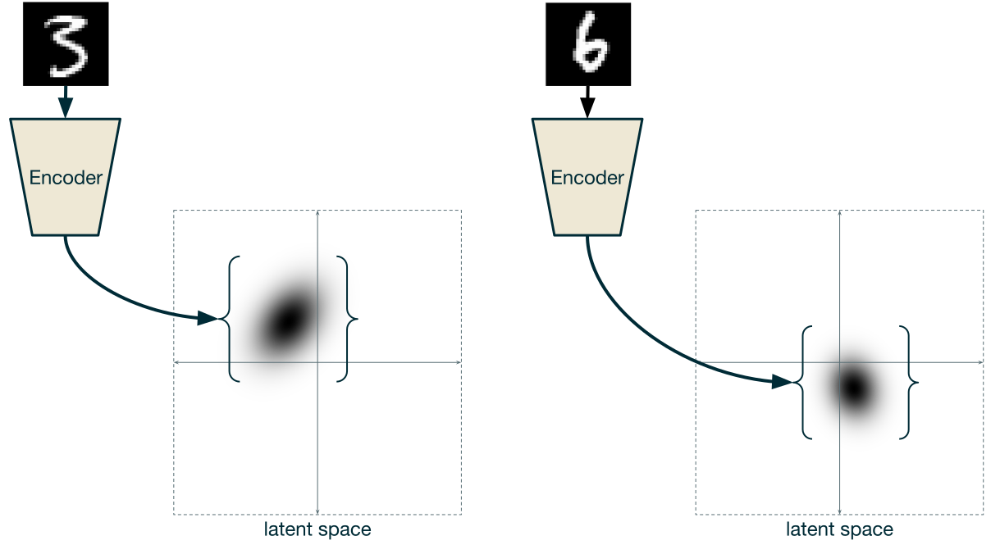

*[Image source](https://ijdykeman.github.io/ml/2016/12/21/cvae.html)*

Now recall how the ELBO is defined:

$$\mathcal{L}_{\theta,\phi}(x) = \mathbb{E}_{q_\phi(z \mid x)} [\log p_\theta(x \mid z)] - D_{KL}(q_\phi(z \mid x) \| p_\theta(z))
$$

Let us compute it for the distributions given above.

We start with $D_{KL}(q_\phi(z \mid x) \| p_\theta(z))$. The $KL$ divergence between the distributions $\mathcal{N}(\mu, \Sigma)$ and $\mathcal{N}(0, I)$ equals:

$$D_{KL}(\mathcal{N}(\mu, \Sigma) \| \mathcal{N}(0, I)) = \frac{1}{2} (\mu^T \mu + \operatorname{tr} \Sigma - M - \log(\det \Sigma)),
$$

where $M$ is the dimension of these distributions. A derivation of this relation can be found [here](https://mr-easy.github.io/2020-04-16-kl-divergence-between-2-gaussian-distributions/). In our case $\mu_\phi(x) = (\mu_1, \dots, \mu_M)$, $\sigma_\phi^2(x) = \operatorname{diag}(\sigma_1^2, \dots, \sigma_M^2)$ and

$$D_{KL}(q_\phi(z \mid x) \| p_\theta(z)) = D_{KL}(\mathcal{N}(\mu_\phi(x), \sigma_\phi^2(x)) \| \mathcal{N}(0, I)) =
$$

$$= \frac{1}{2} \sum_{j=1}^M (\sigma_j^2 + \mu_j^2 - 1 - \ln \sigma_j^2)
$$

Then the ELBO is computed as:

$$\mathcal{L}_{\theta,\phi}(x) = \mathbb{E}_{q_\phi(z \mid x)} [\log p_\theta(x \mid z)] - D_{KL}(q_\phi(z \mid x) \| p_\theta(z)) =
$$

$$= \mathbb{E}_{\mathcal{N}(\mu_\phi(x), \sigma_\phi^2(x))} [\log p_\theta(x \mid z)] - \frac{1}{2} \sum_{j=1}^M (\sigma_j^2 + \mu_j^2 - 1 - \ln \sigma_j^2) \approx
$$

$$\approx \frac{1}{K} \sum_{k=1}^K \log p_\theta(x \mid z_k) + \frac{1}{2} \sum_{j=1}^M (1 + \ln \sigma_j^2 - \mu_j^2 - \sigma_j^2),
$$

where $z_k \sim \mathcal{N}(\mu_\phi(x), \sigma_\phi^2(x))$. As mentioned in [the paper](https://arxiv.org/pdf/1312.6114.pdf) by the authors of VAE, in section 2.3, the number of samples $K$ can be set to one, provided the batch size is large enough (e.g. 100).

If you choose a Bernoulli $p_\theta(x \mid z)$, then

$$\log p_\theta(x \mid z) = \sum_{j=1}^D \log p_\theta(x_j \mid z) = \sum_{j=1}^D \log \operatorname{Bernoulli}(x_j, p_j) =
$$

$$= \sum_{j=1}^D x_j \log p_j + (1 - x_j) \log (1 - p_j)
$$

If a Gaussian $\mathcal{N}(f_\theta(z), \sigma^2)$, then

$$\log p_\theta(x \mid z) = \sum_{j=1}^D \log p_\theta(x_j \mid z) = \sum_{j=1}^D \log \left( \frac{1}{\sqrt{2\pi\sigma^2}} \exp \left( -\frac{(x_j - f_{\theta,j}(z))^2}{2\sigma^2} \right) \right) =
$$

$$= -\frac{D}{2} \log 2\pi - D \log \sigma - \frac{1}{2\sigma^2} \sum_{j=1}^D (x_j - f_{\theta,j}(z))^2
$$

An example implementation of training and using a VAE on the MNIST dataset can be found [in Keras](https://blog.keras.io/building-autoencoders-in-keras.html) and [in PyTorch](https://github.com/pytorch/examples/blob/master/vae/main.py).

### Inference with a trained model

Once we have trained a VAE, we can generate new samples simply by feeding $z \sim \mathcal{N}(0, I)$ into the decoder:

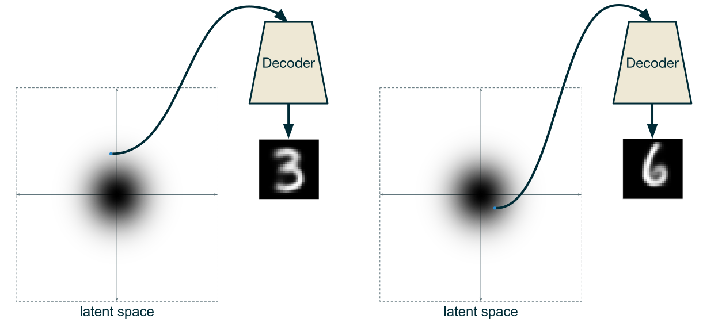

*[Image source](https://ijdykeman.github.io/ml/2016/12/21/cvae.html)*

The encoder is not needed for generating new samples. However, we may want to estimate $p(x) = \int p(x \mid z) p(z) dz$ for $x$ from a test set, to understand how likely the model is to generate $x$. To estimate the integral we need to sample some number of $z$, and if we take samples from $z \sim \mathcal{N}(0, I)$, the estimate may converge poorly. But we can again use the ELBO as a lower bound on $\log p(x)$ and estimate it instead, sampling from the distribution $q_\phi(z \mid x)$. Such an estimate converges faster and gives a rough idea of how well the model handles a particular example $x$.

It is also interesting to look at how the codes of the training examples are distributed in the latent space. This is what the distribution of latent codes of MNIST digits may look like for a trained VAE with a two-dimensional latent space:

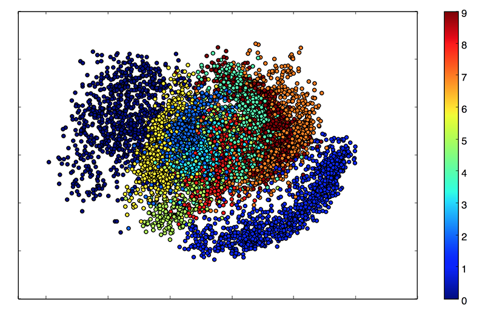

*[Image source](https://blog.keras.io/building-autoencoders-in-keras.html)*

Different types of digits are shown in different colors (the correspondence between digits and colors is shown on the scale at the side). One can see that the model distinguishes zeros and ones best of all, and eights and threes worst of all. It is worth noting, of course, that the latent space was chosen to be two-dimensional for visualization purposes; with a higher dimension the model could learn to distinguish the digits better.

For a two-dimensional latent space there is another interesting way to visualize the structure of the manifold learned by the VAE. One can take a uniform grid on the unit square and map it into the latent space by applying the inverse CDF of the normal distribution.

<details>
<summary><b>Why this works</b></summary>

The nodes of a uniform grid $u_{ij}$ can, to some approximation, be treated as samples from a uniform distribution: $u_{ij} \sim \text{Uniform}([0,1])$. Therefore the samples $\Phi^{-1}(u_{ij})$ approximately follow the normal distribution:

$$\mathbb P(\Phi^{-1}(u_{ij}) \le t) = \mathbb P(u_{ij} \le \Phi(t)) = \Phi(t)
$$

</details>

The resulting samples can be fed into the decoder to see which pictures correspond to the grid nodes:

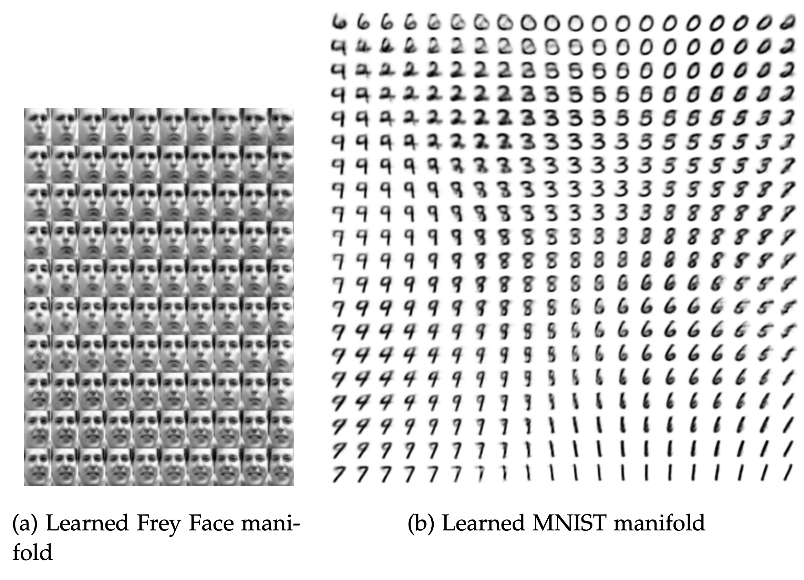

*Left: the learned Frey Face manifold; right: the learned MNIST manifold. [Image source](https://pure.uva.nl/ws/files/17891313/Thesis.pdf)*

Shown here are examples generated for the Frey Face and MNIST datasets (both available [here](https://cs.nyu.edu/~roweis/data.html)). This visualization lets us see the smooth transition of latent codes of some objects into the codes of others, as well as the relative arrangement of the latent codes.

For MNIST we again see, in particular, that the model has placed the codes of zeros and ones far apart, while the codes of threes and eights are very close. It is also fun to observe the smooth transition from sixes to zeros and from sevens to ones. For Frey Face, the happy faces sit far from the sad ones, and along the main diagonal of the square one can trace a gradual transition from a serious face to a smiling one.

It is also interesting to look at how the quality of the generated digits changes depending on the dimension of the latent space (the pictures show random samples from the model):

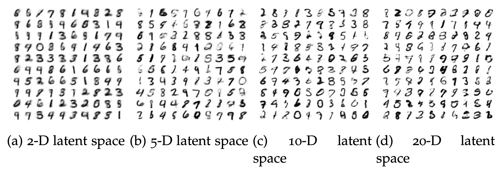

*Latent space dimension, left to right: 2, 5, 10, 20. [Image source](https://pure.uva.nl/ws/files/17891313/Thesis.pdf)*

A noticeable transition is visible between dimensions 2 and 5; further increase of the dimension has almost no significant effect.

### Conditional VAE (CVAE)

Sometimes we may want to generate not just an arbitrary object from the dataset, but one belonging to a particular group or class. Earlier we wrote out an equation for $\log p_\theta(x)$:

$$\log p_\theta(x) = \mathbb{E}_{q_\phi(z \mid x)} [\log p_\theta(x \mid z)] - D_{KL}(q_\phi(z \mid x) \| p_\theta(z)) + D_{KL}(q_\phi(z \mid x) \| p_\theta(z \mid x))
$$

We can make all the distributions participating in this equation conditional on a variable $y$:

$$\log p_\theta(x \mid y) = \mathbb{E}_{q_\phi(z \mid x, y)} [\log p_\theta(x \mid z, y)] - D_{KL}(q_\phi(z \mid x, y) \| p_\theta(z \mid y)) + D_{KL}(q_\phi(z \mid x, y) \| p_\theta(z \mid x, y))
$$

The variable $y$ can be the label of the object $x$, or an entirely arbitrary tensor characterizing $x$ in some way. Instead of a single $p_\theta(z)$ shared by all $x$ in the training set, there is now a separate prior distribution $p_\theta(z \mid y)$ for each value of $y$.

The variable $y$ can take both discrete and continuous values. It can even be, for example, half of an image that the model is asked to complete. Just in case, let us stress that training a CVAE is not the same as training several independent VAEs, since the CVAE weights are shared across all classes.

At the implementation level this is quite simple: you just concatenate the inputs of the encoder and decoder with the tensor corresponding to $y$. If $y$ takes categorical values, it is often useful to first encode them as one-hot vectors. The algorithm looks roughly like this:

```python
dataset, labels = np.array(...), np.array(...)
epsilon = RandomDistribution(...)

# Encoder q_phi(z|x) — a neural network with parameters phi
encoder = Encoder()

# Decoder p_theta(x|z) — a neural network with parameters theta
decoder = Decoder()

for step in range(max_steps):
     # Sample a batch of input data, labels and random noise
     batch_x = sample_batch(dataset)
     batch_y = sample_batch(labels)
     batch_noise = sample_batch(epsilon)

     # Feed the encoder the concatenation of inputs and labels
     encoder_input = concatenate([batch_x, batch_y])

     # Compute the parameters of the distribution of z with the encoder
     latent_distribution_parameters = encoder(encoder_input)
     # Apply reparameterization
     z = reparameterize(latent_distribution_parameters, batch_noise)

     # Concatenate the resulting random vector with the labels
     decoder_input = concatenate([z, batch_y])

     # The decoder outputs the output image
     output_distribution_parameters = decoder(decoder_input)

     # Compute the ELBO and update the parameters
     L = -ELBO(
        latent_distribution_parameters, 
        output_distribution_parameters, 
        batch_x
     )
     L.backward()
```

A CVAE implementation in PyTorch and TensorFlow can be found, for example, [here](https://github.com/wiseodd/generative-models/tree/master/VAE/conditional_vae).

If we visualize the distribution of latent codes for MNIST digits obtained after conditioning the model on the digit class, we see something like this:

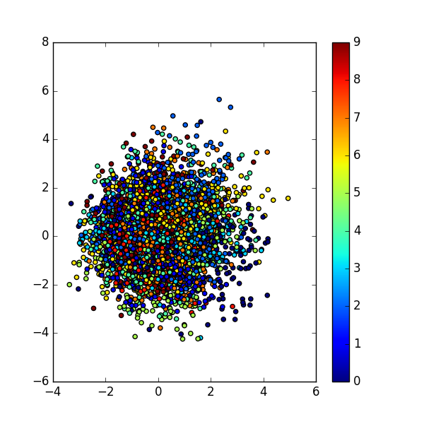

*[Image source](https://agustinus.kristia.de/blog/conditional-vae/)*

We see an unintelligible mixture of points instead of the distinct clusters that the plain VAE produced. The point is that instead of trying to place all digits in a single space $p(z) \sim \mathcal{N}(0, I)$, the model uses a separate latent space $p(z \mid y) \sim \mathcal{N}(0, I)$ for each digit:

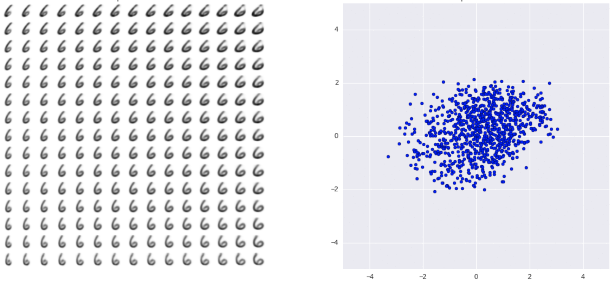

*[Image source](https://habr.com/ru/post/331664/)*

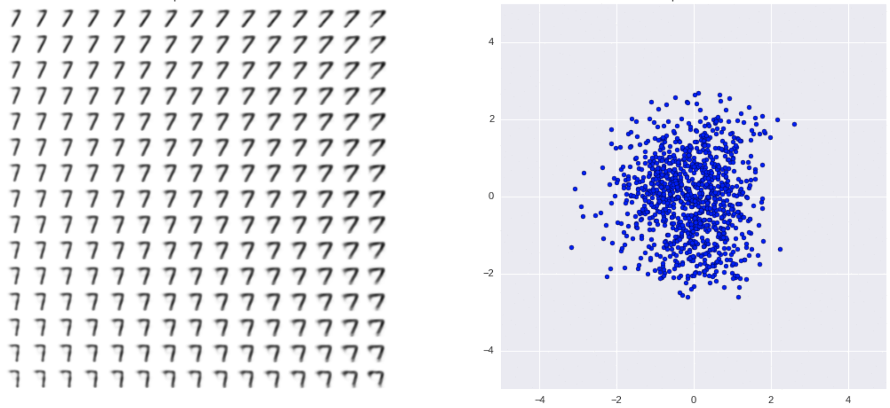

*[Image source](https://habr.com/ru/post/331664/)*

In each picture, the right part shows the prior distributions for the digits 6 and 7, and the left part visualizes the structure of the learned manifolds for these digits, built the same way as the analogous visualization for the VAE. The quality of the images of each individual digit improves noticeably:

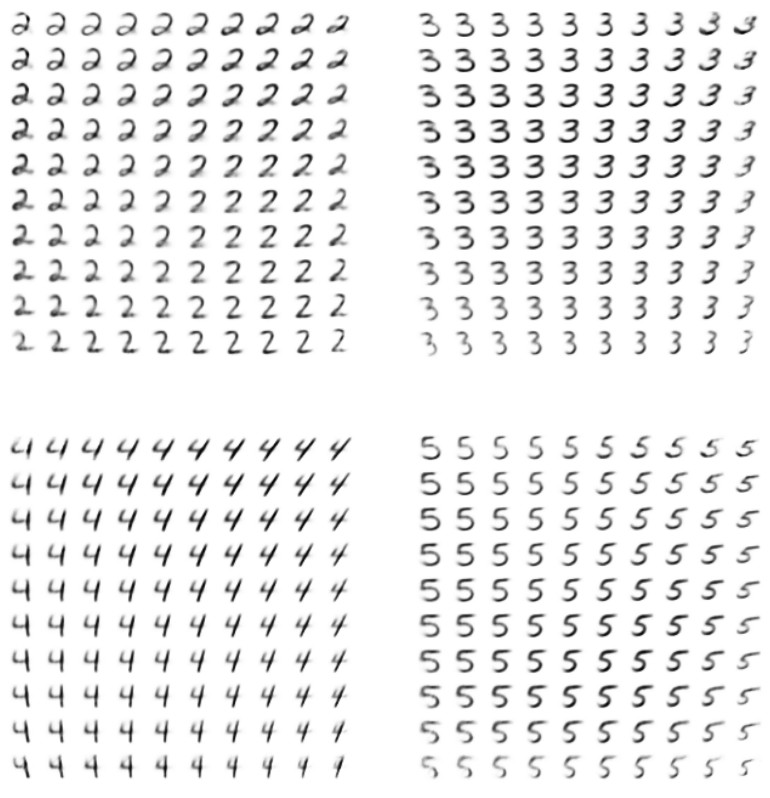

*[Image source](https://pure.uva.nl/ws/files/17891313/Thesis.pdf)*

The variability of the generated digits has also grown noticeably, and the model can imitate digits written in different handwriting styles.

## Key papers

Beyond the standard description of how VAE works, we will discuss several works building on the VAE idea. Although these papers came out in 2017–2021, we cover them not as "recent results" but as the foundation on which modern generative models are built: the idea of discrete latent codes from [VQ-VAE](https://arxiv.org/abs/1711.00937) became the basis for tokenizing non-textual data — images, audio and video, — and [DALL-E](https://arxiv.org/abs/2102.12092) was the first demonstration that a large language model can be trained on top of such tokens.

### VQ-VAE and VQ-VAE-2

The models [VQ-VAE](https://arxiv.org/pdf/1711.00937v2.pdf) and [VQ-VAE-2](https://arxiv.org/pdf/1906.00446.pdf) are interesting in that they employ discrete distributions as priors. In which situations can discrete distributions be more suitable than continuous ones? For example, when we deal with tokens in NLP tasks or phonemes in speech processing. Images, too, could be encoded by a set of integers: one number could encode the object type, another its color, a third the background color, and so on:

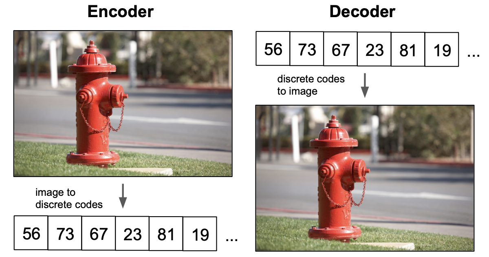

*[Image source](https://mlberkeley.substack.com/p/vq-vae)*

Moreover, there exist quite powerful algorithms (for example, the [Transformer](https://arxiv.org/abs/1706.03762)) designed to work with discrete data. Learning good discrete representations makes it possible to use such algorithms effectively for, say, image generation.

Looking ahead: this very idea — compressing a continuous signal into a sequence of discrete codes — turned out to be one of the most fruitful in modern deep learning. The neural audio codecs [SoundStream](https://arxiv.org/abs/2107.03312) and [EnCodec](https://arxiv.org/abs/2210.13438) are VQ-VAEs with multi-level residual quantization; the voice cloning model [VALL-E](https://arxiv.org/abs/2301.02111) operates on top of EnCodec tokens. Visual tokenizers ([VQGAN](https://arxiv.org/abs/2012.09841), [MAGVIT](https://arxiv.org/abs/2212.05199)) encode images and videos as discrete tokens for autoregressive generative models, and multimodal LLMs that generate images (for example, Meta's [Chameleon](https://arxiv.org/abs/2405.09818)) treat pictures as sequences of the same kind of tokens as text. The idea of structuring latent representations is developing in other directions as well — for example, the nested, "matryoshka-like" variable-size embeddings of [Matryoshka Representation Learning](https://arxiv.org/abs/2205.13147).

#### VQ-VAE

The authors of VQ-VAE introduce a discrete latent space in the form of $K$ real-valued vectors $e_1, \dots, e_K$ of dimension $D$. The vectors of this space are called **code vectors**, or **codes**. The figure below shows a rough scheme of training the proposed model.

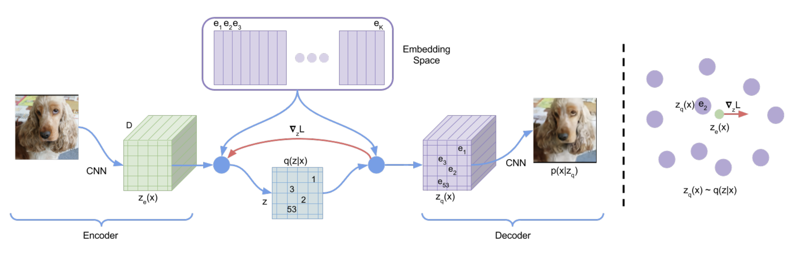

*[Image source](https://arxiv.org/pdf/1711.00937v2.pdf)*

The encoder takes an image $x$ as input and outputs a tensor $z_e(x)$. In the figure this tensor has shape $M \times M \times D$: the last dimension coincides with the length of the code vectors, and $M \times M$ is the spatial dimension of the CNN output (for simplicity we do not write out the batch dimension explicitly).

Each of the $M \times M$ vectors of $z_e(x)$ is mapped to the code vector nearest to it in $L_2$ distance. After this procedure the tensor $z_e(x)$ turns into a tensor $z_q(x)$ consisting of $M \times M$ code vectors. The decoder receives the tensor $z_q(x)$ as input and maps it back to the original image. For speech and text the authors used a two-dimensional tensor $z_e(x)$ instead of a three-dimensional one.

The output distribution of the encoder $q(z \mid x)$ is defined here as follows:

$$q(z = k \mid x) = \begin{cases} 1, & k = \arg\min_j \| z_e(x) - e_j \|_2, \\ 0, & \text{otherwise} \end{cases}
$$

During training, a uniform distribution $p(z)=\frac 1K$ is used as the prior over the latent space, so the term $D_{KL}(q(z \mid x) \| p(z))$ turns out to be constant and equal to $\log K$:

$$D_{KL}(q(z \mid x) \| p(z)) = -\sum_{k=1}^K q(z = k \mid x) \log \left( \frac{p(z)}{q(z = k \mid x)} \right) = \log K
$$

At the points where $q(z = k \mid x) = 0$, the next-to-last expression is extended by zero by continuity. Thus, the ELBO for such distributions takes the form

$$ELBO(x) = \mathbb{E}_{q(z \mid x)} [\log p_\theta(x \mid z_e(x))] - D_{KL}(q(z \mid x) \| p(z)) = \log p_\theta(x \mid z_q(x)) - \log K,
$$

where $\theta$ are the decoder parameters. During optimization the $\log K$ term can be ignored. The mapping of the encoder output to code vectors is not differentiable, so the following trick is used during training: on the backward pass, the gradient is copied directly from the decoder to the encoder, skipping the layer that maps encoder outputs to code vectors.

This trick is very close to the technique known as the **straight-through estimator**: on the backward pass the gradient flows through a non-differentiable operation as if it were not there. This technique was first proposed in [this paper](https://arxiv.org/pdf/1308.3432.pdf) (and a simple explanation of it can be found [here](https://www.hassanaskary.com/python/pytorch/deep%20learning/2020/09/19/intuitive-explanation-of-straight-through-estimators.html)). Using the straight-through estimator, however, does not allow training the code vectors themselves, since no gradients are computed for them. Therefore the loss function for training the model consists of three components:

$$\mathcal L = \log p(x \mid z_q(x)) + \| \operatorname{sg}[z_e(x)] - z_q(x) \|_2^2 + \beta \| z_e(x) - \operatorname{sg}[z_q(x)] \|_2^2
$$

Here $\operatorname{sg}[\cdot]$ denotes the stop-gradient operator: no gradients flow through its argument.

In the paper the loss is written somewhat differently:

$$\mathcal L = \log p(x \mid z_q(x)) + \| \operatorname{sg}[z_e(x)] - e \|_2^2 + \beta \| z_e(x) - \operatorname{sg}[e] \|_2^2
$$

This notation seems somewhat confusing, for two reasons:

1. The letter $e$ in the subscript of $z_e(x)$ is only meant to indicate that this is the encoder output, not the existence of a connection between the code vectors $e$ and the encoder parameters. But the latter is quite easy to assume by mistake.

2. Subtracting $e$ means subtracting not all elements of the codebook from the corresponding position of the tensor $z_e(x)$, but only the nearest neighbor of the element of $z_e(x)$ at that position. That is, in effect, subtracting $e$ in this notation is equivalent to subtracting $z_q(x)$. This is not clarified in the paper, but can be [seen](https://github.com/deepmind/sonnet/blob/v2/sonnet/src/nets/vqvae.py#L113) in the official implementation.

The first term is the ELBO up to a constant. The second term is responsible for moving the code vectors toward the encoder outputs. To prevent a situation where the encoder outputs keep dragging the code vectors around via the second loss component while themselves producing, at every iteration, vectors far from the current code vectors, a third term is added. It makes the encoder strive to output vectors close to the code vectors, and its importance is regulated by the coefficient $\beta$.

However, during training we lost the regularization term $D_{KL}(q(z \mid x) \| p(z))$, because of which the encoder distribution was under no obligation to approximate the prior and remained a narrow subset of it. As a result, when sampling from the uniform categorical distribution, we will most likely get plain noise instead of nice pictures:

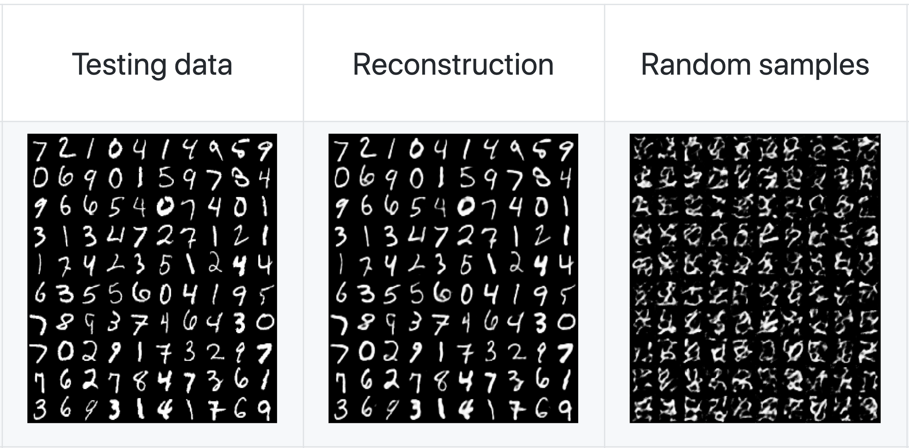

*Left to right: test data, their reconstructions, samples from the uniform prior. [Image source](https://github.com/jiazhao97/VQ-VAE_withPixelCNNprior)*

<details>
<summary><b>In a bit more detail</b></summary>

When training a plain VAE, we minimize the distance between the prior distribution and the distribution produced by the encoder via the regularization term $D_{KL}(q(z \mid x) \| p(z))$.

Thanks to it, for example, the two-dimensional latent codes of MNIST digits approximately arrange themselves into a ball — the normal prior. And if each digit is given its own latent space (by conditioning on the digit class), the conditional prior for each digit is very close to normal.

In the case of VQ-VAE we cannot force the distribution predicted by the encoder to be the uniform categorical one; we simply get some categorical distribution with unknown parameterization. This is reminiscent of the situation with a plain autoencoder: it also maps input images into a latent space, but we cannot sample from that space.

</details>

To fix this problem, the authors propose to learn, with an additional model, the prior distribution $p(z)$ of those latent variables that the model learned to generate during training. Since any code representation can be flattened into a sequence, and the number of codes is finite and fixed in advance, this task is close to training a language model.

Indeed, there we must predict the next word from the available vocabulary given the sequence of preceding words of a sentence, and in our case — predict the next latent code given the input sequence of discrete latent codes.

For images, the authors proposed to model the prior distribution of latent codes with PixelCNN. The details of this model's architecture and training can be found in the original [paper](https://arxiv.org/pdf/1606.05328v2.pdf); here we describe only the general idea.

PixelCNN generates the pixels of an image sequentially, moving from the top-left corner to the bottom-right. It traverses all rows one by one from top to bottom, and within each row moves left to right:

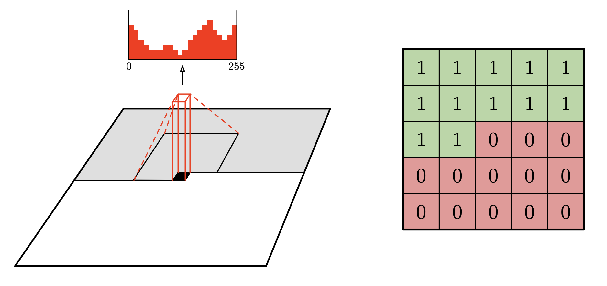

*[Image source](https://arxiv.org/pdf/1606.05328v2.pdf)*

For color images, the channels (R, G, B) are also modeled sequentially: when generating, channel B depends on R and G, and G only on R. When predicting the value of each next pixel, the model uses the values of already-generated neighbors from some surrounding square. To prevent the model from reading pixels that come after the currently predicted one, a special mask is used, an example of which is shown in the right part of the figure.

In the case of VQ-VAE, PixelCNN is trained not on pixels but on latent codes. Sampling from the learned prior looks much better than attempts to sample from the uniform one:

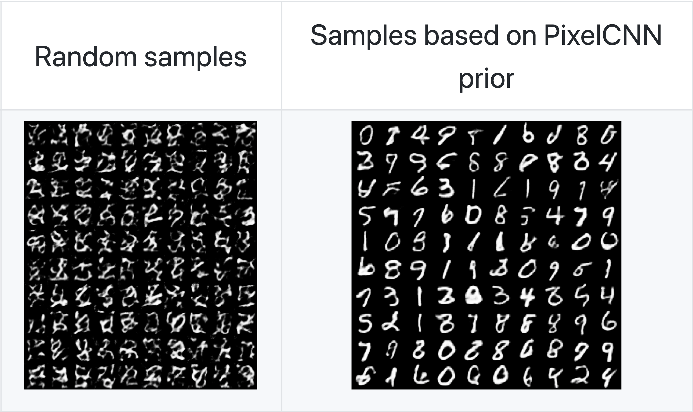

*Left: samples from the uniform prior; right: samples from the prior learned by PixelCNN. [Image source](https://github.com/jiazhao97/VQ-VAE_withPixelCNNprior)*

For audio, the authors use [WaveNet](https://deepmind.com/blog/article/wavenet-generative-model-raw-audio) instead of PixelCNN. When training the prior models, one can also feed in class labels, so that later one can sample from those classes (the same principle as for CVAE).

The results of reconstructing ImageNet images with VQ-VAE look quite good (by reconstruction we mean the output of the full model consisting of the encoder and decoder):

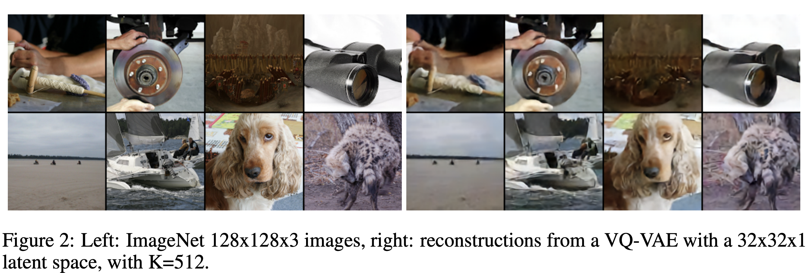

*Left: original ImageNet images (128×128); right: their VQ-VAE reconstructions with a 32×32 latent space and a codebook of 512 code vectors. [Image source](https://arxiv.org/pdf/1711.00937v2.pdf)*

And this is what sampling from a VQ-VAE with a PixelCNN-learned prior looks like:

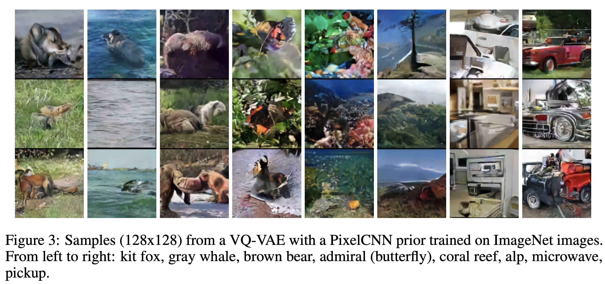

*128×128 samples from a VQ-VAE with a PixelCNN prior trained on ImageNet. Left to right: kit fox, gray whale, brown bear, admiral butterfly, coral reef, alp, microwave, pickup. [Image source](https://arxiv.org/pdf/1711.00937v2.pdf)*

#### VQ-VAE-2

The VQ-VAE-2 model is not used today by itself, but it is interesting as an example of how the VQ-VAE idea evolved — above all, through a hierarchy of discrete latent spaces.

<details>
<summary><b>More about VQ-VAE-2</b></summary>

The VQ-VAE-2 model is an extension of VQ-VAE. It shows a significant leap in the quality of generated images:

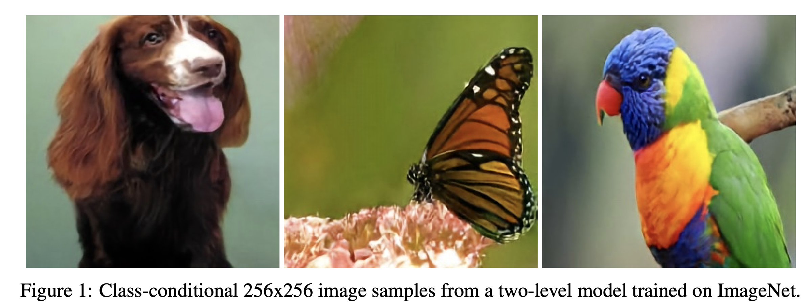

*Class-conditional 256×256 samples from a two-level VQ-VAE-2 trained on ImageNet. [Image source](https://arxiv.org/pdf/1906.00446.pdf)*

What is impressive is that the picture shows the result of sampling from the distribution learned by the model, not the result of reconstruction. The first key difference between VQ-VAE and VQ-VAE-2 is the use of hierarchical latent variables:

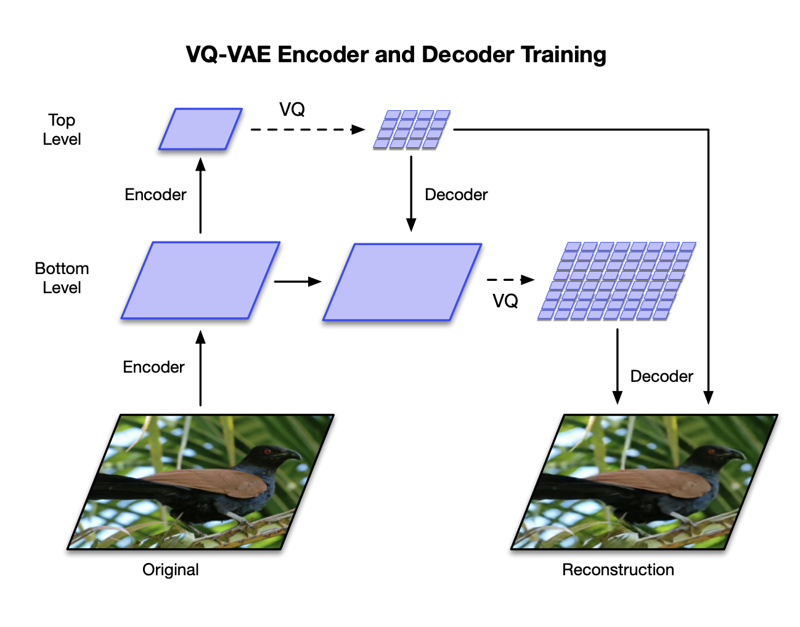

*[Image source](https://arxiv.org/pdf/1906.00446.pdf)*

Before moving on to the architecture description, a small disclaimer: whenever the text below says "a tensor of size $M \times M$", it means the tensor has shape $(B,M,M,C)$, where the first component corresponds to batches and the last one to channels.

The picture shows an example of a two-level architecture (although there may be more levels). Each level has its own encoder, decoder and set of code vectors (of a common dimension $D$ for all levels). Denote the bottom and top encoders by $Enc_\text{bottom}$ and $Enc_\text{top}$, and the decoders by $Dec_\text{bottom}$ and $Dec_\text{top}$.

* $Enc_\text{bottom}$ takes a three-channel image of size $256 \times 256$ pixels, maps it to a tensor of size $64 \times 64$ and passes it to $Enc_\text{top}$. $Enc_\text{top}$ outputs a tensor of size $32 \times 32$, which is then mapped to a tensor of code vectors $z_\text{top}$ (quantized)

* $z_\text{top}$ is fed into $Dec_\text{top}$, then the outputs of $Enc_\text{bottom}$ and $Dec_\text{top}$ are concatenated and quantized into $z_\text{bottom}$

* $z_\text{top}$ and $z_\text{bottom}$ are concatenated and fed into $Dec_\text{bottom}$, which maps them to the original image

The model is trained with almost the same loss as VQ-VAE. For VQ-VAE it had the form:

$$\mathcal L = \log p(x \mid z_q(x)) + \| \operatorname{sg}[z_e(x)] - z_q(x) \|_2^2 + \beta \| z_e(x) - \operatorname{sg}[z_q(x)] \|_2^2
$$

For VQ-VAE-2 the first and third terms keep their form, while the second term is replaced by updating the code vectors $e_i$ with an exponential moving average. Let $E(x)^{(t)}$ be the encoder output at step $t$, flattened into a two-dimensional tensor whose last dimension equals the dimension $D$ of the code vectors.

Let $\{ E_{i,1}^{(t)}, \dots, E_{i,n_i^{(t)}}^{(t)} \}$ be the set of $n_i^{(t)}$ vectors for which, at step $t$, the nearest code vector was $e_i^{(t-1)}$. Then $e_i$ is updated at step $t$ by the following formulas:

$$e_i^{(t)} = \frac{m_i^{(t)}}{N_i^{(t)}}
$$

$$m_i^{(t)} = m_i^{(t-1)} \cdot \gamma + \sum_j^{n_i^{(t)}} E(x)_{i,j}^{(t)} (1 - \gamma)
$$

$$N_i^{(t)} = N_i^{(t-1)} \cdot \gamma + n_i^{(t)} (1 - \gamma)
$$

Here $\gamma$ is some real-valued parameter.

Just as for VQ-VAE, the prior for VQ-VAE-2 is learned separately after the main model has been trained, but in the case of VQ-VAE-2 it has a hierarchical structure. The picture shows an example of such a distribution for a two-level architecture:

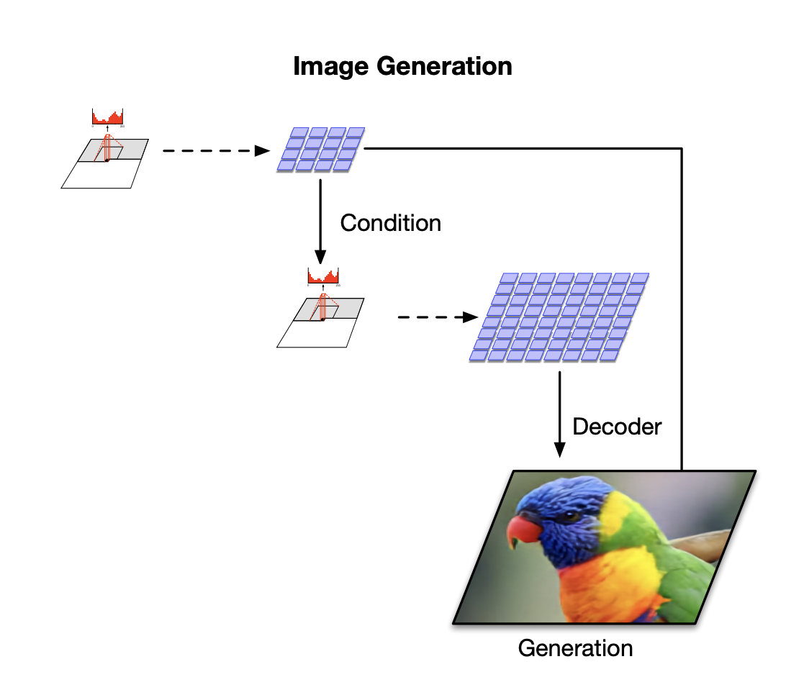

*[Image source](https://arxiv.org/pdf/1906.00446.pdf)*

A separate PixelCNN model is trained for each level: one on the code vectors of the first level, the other on the code vectors of the first and second levels. Both models also take as input the label of the class from which an image should be sampled.

Sampling from the final model goes as follows:

* vectors $e_\text{top}$ are sampled from the top distribution

* vectors $e_\text{bottom}$ are sampled from the bottom distribution conditioned on the vectors $e_\text{top}$

* the decoder takes the vectors $e_\text{top}$ and $e_\text{bottom}$ as input and outputs the final picture

Sampling results from a two-level VQ-VAE-2 trained on ImageNet:

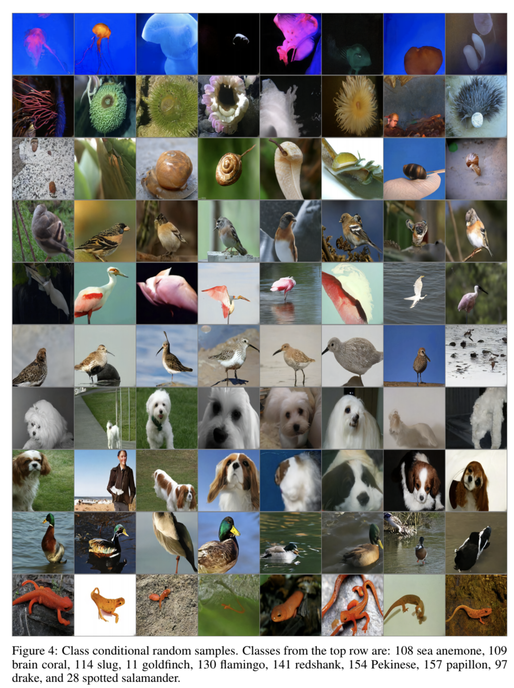

*Class-conditional samples from VQ-VAE-2. Classes by row, top to bottom: sea anemone, brain coral, slug, goldfinch, flamingo, redshank, Pekinese, papillon, drake, spotted salamander. [Image source](https://arxiv.org/pdf/1906.00446.pdf)*

And here are the sampling results from a three-level VQ-VAE-2 trained on [FFHQ](https://github.com/NVlabs/ffhq-dataset):

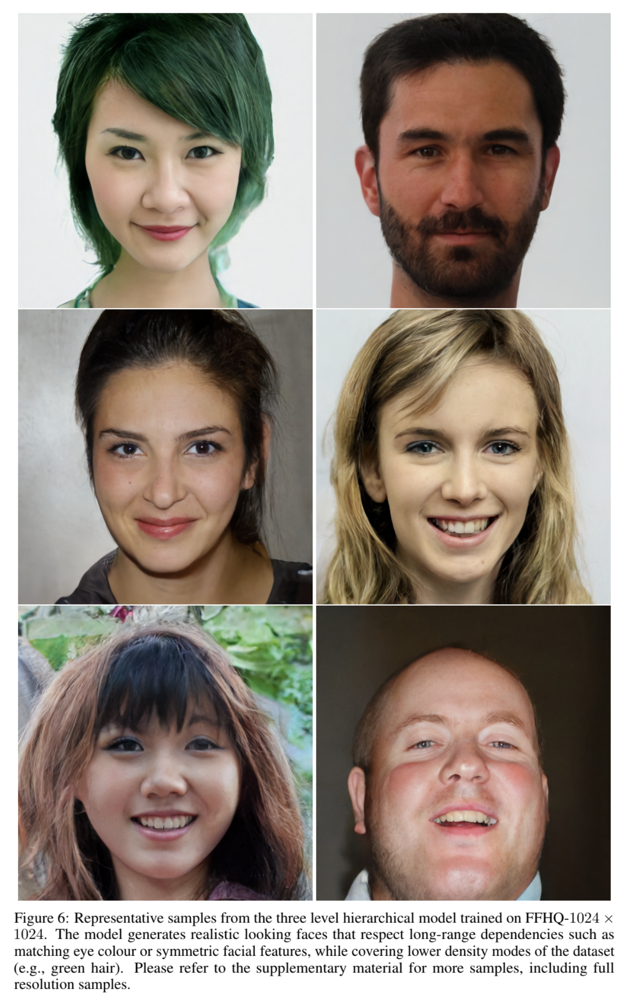

*Samples from a three-level model trained on FFHQ 1024×1024: the model maintains global dependencies (eye color, facial symmetry) while also covering rare modes of the dataset — for example, green hair. [Image source](https://arxiv.org/pdf/1906.00446.pdf)*

</details>

### DALL-E

Another work that largely shaped the development of generative models is [DALL-E](https://arxiv.org/pdf/2102.12092.pdf) by OpenAI. They trained a model with 12 billion parameters that generates pictures from their text descriptions. For training, the authors collected a dataset of 250 million image–caption pairs. Here are some examples of this model at work:

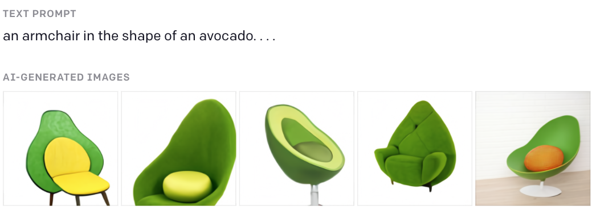

*Prompt: "an armchair in the shape of an avocado". [Image source](https://openai.com/index/dall-e/)*

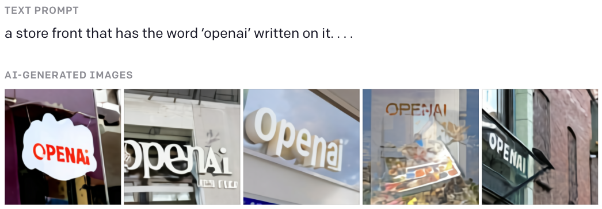

*Prompt: "a store front that has the word 'openai' written on it". [Image source](https://openai.com/index/dall-e/)*

More examples of generations for various text descriptions can be found in OpenAI's [blog post](https://openai.com/index/dall-e/) about DALL-E.

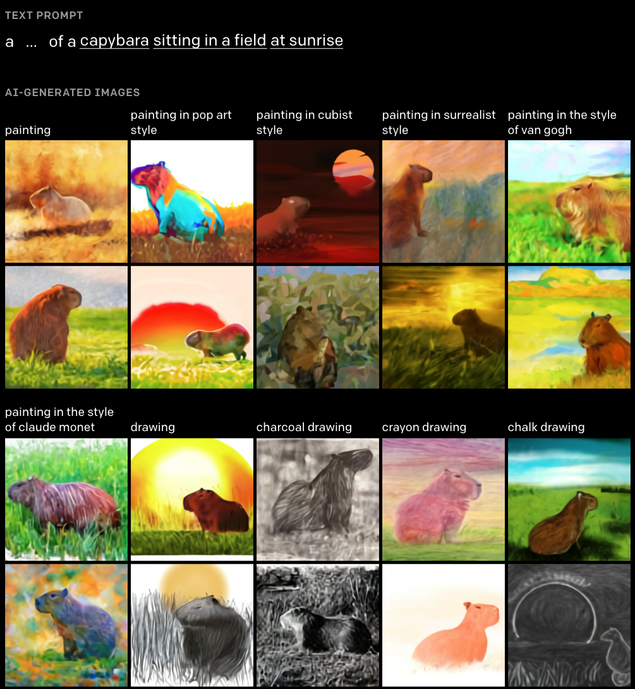

*Prompt: "a painting of a capybara sitting in a field at sunrise" in different styles: painting, pop art, cubism, surrealism, Van Gogh, Monet, pencil drawing, charcoal, crayons and chalk. [Image source](https://openai.com/index/dall-e/)*

Conceptually, DALL-E builds on the results of VQ-VAE: first, code vectors for pictures are learned, and then a Transformer is trained to model the joint prior distribution of texts and code vectors. (I'm preparing a separate series of posts about transformers — stay tuned.)

In essence, DALL-E is the first demonstration that the "textual" pretraining recipe (autoregressive next-token prediction) also works for non-textual data, provided it is first discretized with a VQ-VAE-style encoder. This recipe quickly spread beyond image generation: for example, the voice cloning system [Tortoise TTS](https://arxiv.org/abs/2305.07243) is modeled after DALL-E — its author explicitly [described](https://nonint.com/2022/02/03/dall-e-for-tts-tortoisetts/) the project as "DALL-E for speech synthesis".

DALL-E employs an architecture based on the decoder part of the original Transformer, so it is also worth [reading up](https://jalammar.github.io/illustrated-gpt2/) on the GPT-2 model, which works in a similar way.

Training proceeds in two stages:

* First, a discretized VAE (**dVAE**) is trained, with an encoder compressing $256 \times 256$ RGB images into a tensor of $32 \times 32 = 1024$ code vectors. This training stage strongly resembles VQ-VAE, but instead of adding extra loss terms for the code vectors, the DALL-E authors use the *Gumbel relaxation* — a trick that makes honest differentiation with respect to the encoder parameters possible. We will discuss dVAE training in more detail below.

* Then a Transformer is trained (more precisely, only the decoder part of the original Transformer architecture), whose task is to learn the joint distribution of pictures and their text descriptions. It takes as input the concatenation of the embeddings of the text tokens and the code vectors of the pictures, and learns to predict the continuation of each input sequence. Some details of the Transformer training will also be covered below.

Inference with the trained model goes like this: the embeddings of a picture's text description are fed into the Transformer, which autoregressively predicts the code vectors of a picture matching that description; the resulting code vectors are then passed through the dVAE decoder.

#### dVAE

The dVAE is trained by maximizing the ELBO for pictures $x$ and their discrete latent representations $z$:

$$\ln p_\theta(x) \ge \mathbb{E}_{q_\phi(z \mid x)} [\log p_\theta(x \mid z)] - \beta \, D_{KL}(q_\phi(z \mid x) \| p(z)),
$$

where $\phi$ and $\theta$ are the parameters of the encoder and decoder of the discretized VAE, and $p(z)$ is the uniform categorical distribution over the code vectors. Notice the extra coefficient $\beta$, which in a standard VAE always equals 1. The DALL-E authors introduced the additional parameter $\beta$ following the results of the [paper](https://arxiv.org/pdf/1904.10509.pdf) on $\beta$-VAE. Unlike the original paper, though, in their experiments the value of $\beta$ is gradually decreased during training.

The dVAE encoder maps $256 \times 256$ images into a tensor $z_e(x)$ of shape $32 \times 32 \times 8192$, where $8192$ is the number of code vectors. That is, to each of the $32 \times 32$ positions the encoder assigns a categorical distribution over the $8192$ code vectors, parameterized by the output logits.

To obtain the tensor $z_q(x)$ of code vectors, one could first apply $\text{softmax}$ to the distributions at each of the $32 \times 32$ positions, and then assign to each position the code vector whose index has the maximum probability (take the $\arg\max$ for that position).

However, the $\arg\max$ operation is not differentiable — and besides, in the VAE framework the decoder should receive a sample from the distribution predicted by the encoder, and taking the $\arg\max$ at each position is not sampling from the predicted distribution.

We will therefore need a couple of tricks that will let us simultaneously:

* approximate sampling from the $\text{softmax}$

* make the sampling differentiable

##### Gumbel-Max Trick and Gumbel-Softmax

The first trick is known as the Gumbel-Max Trick. Imagine we have network output logits $x_1, \dots, x_k$, and we want to use them to obtain a sample from the categorical distribution — that is, to predict a class stochastically. For this we usually apply $\text{softmax}$ to the logits to obtain probabilities $\pi_i$:

$$\pi_i = \frac{\exp x_i}{\sum_j \exp x_j},
$$

and then sample a class from the resulting categorical distribution $\{\pi_1, \dots, \pi_k\}$. It turns out that these two steps are equivalent to the following procedure:

* sample numbers $g_1, \dots, g_k$ from the standard [Gumbel](https://en.wikipedia.org/wiki/Gumbel_distribution) distribution,

* add the sample $g_i$ to each logit $x_i$,

* pick the class $j$ such that $j = \arg\max_i (x_i + g_i)$.

Why this is indeed the case can be read [here](https://lips.cs.princeton.edu/the-gumbel-max-trick-for-discrete-distributions/). But the Gumbel-Max Trick alone will not help us — the operation still is not differentiable. So we need one more trick, proposed almost simultaneously in two papers ([first](https://arxiv.org/pdf/1611.01144.pdf) and [second](https://arxiv.org/pdf/1611.00712v3.pdf)) and named **Gumbel-Softmax** in one of them.

To describe this trick, note that the result of the $\arg\max$ operation is the index of some class $j$. Such an index can be described by one-hot encoding — a vector of length $k$ in which all elements are zero except the $j$-th, which equals one.

Gumbel-Softmax consists of doing the following instead of taking the $\arg\max$ at the last step of the Gumbel-Max Trick:

* compute $y_i = \frac{\exp((x_i + g_i)/\tau)}{\sum_{j=1}^k \exp((x_j + g_j)/\tau)}$, $i = 1, \dots, k$, — an approximation of the one-hot vector via the $\text{softmax}$ activation with temperature;

* sum the code vectors $e_i$ with weights $y_i$: $z = \sum_i y_i e_i$;

* output the vector $z$ as the latent vector for the given position

Strictly speaking, the DALL-E authors did not specify how the output vector $z$ is aggregated from the code vectors and the $y_i$, but this is the approach taken in the PyTorch [implementation](https://github.com/lucidrains/DALLE-pytorch/tree/main/dalle_pytorch) of DALL-E.

As $\tau \to 0$, sampling from the distribution $\frac{\exp((x_i + g_i)/\tau)}{\sum_{j=1}^k \exp((x_j + g_j)/\tau)}$ tends to the $\arg\max$, and during dVAE training the authors gradually decreased the value of $\tau$. In the following picture, the left part shows the plain Gumbel-Max Trick, and the right part its differentiable variant:

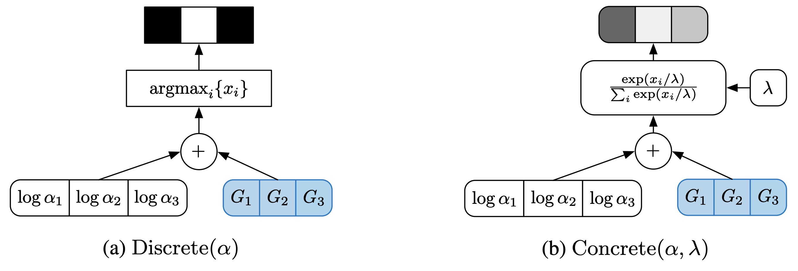

*[Image source](https://arxiv.org/pdf/1611.00712v3.pdf)*

Thus, training the code vectors of the dVAE requires no extra loss terms on top of the ELBO, nor copying gradients from the decoder to the encoder (as was the case in VQ-VAE).

Moreover, it is worth noting that $D_{KL}(q_\phi(z \mid x) \| p(z))$ in this case does not degenerate into a constant, but genuinely acts as a regularizer. Let us spell out how it works: the encoder outputs a $32 \times 32$ grid of positions and at each of them predicts its own categorical distribution over the $8192$ code vectors, while the prior $p(z)$ takes the code at each position to be equally probable among all options and independent of the other positions. The regularizer pulls the encoder's prediction at each position *separately* toward this uniform distribution.

Importantly, such regularization says nothing about the *joint* structure of all $1024$ codes of a picture: a real image corresponds to a strongly correlated set of codes, not at all to an independent set of equally probable ones. So one cannot sample pictures directly from the dVAE (drawing the code at each position independently) — the joint distribution of the codes has to be modeled separately, and that is exactly what the Transformer does in the second stage. Essentially, this is the same role that PixelCNN played in modeling the prior over codes for VQ-VAE.

Finally, the non-constant $KL$ has one more practical advantage — it encourages high codebook utilization. By pulling the distribution at each position toward the uniform one, the regularizer prevents the model from collapsing to the use of just a handful of codes (a problem known as *codebook collapse*). In hard VQ-VAE there is no such regularizer, so codebook collapse is fought there with separate techniques — for example, updating the code vectors with an exponential moving average (EMA; this technique is covered above in the section on VQ-VAE-2) or re-initializing "dead" codes that have stopped being selected.

<details>
<summary><b>Why a vanilla VAE blurs pictures and VQ-VAE does not</b></summary>

In the models we are discussing there are two completely different independence assumptions, and they are easy to confuse.

The first is the conditional independence of the object's components given the latent representation: $p_\theta(x \mid z) = \prod_j p_\theta(x_j \mid z)$. It is precisely what allowed us to write the reconstruction loss as a sum over pixels (see the section "Choosing the distributions"; for DALL-E — the Logit-Laplace distribution below).

The second is the independence of the latent variables themselves across positions, i.e. the factorized form of the prior $p(z)$ discussed above.

In a vanilla VAE the latent vector is single and small, so it is unable to explain all the correlations between pixels. And the decoder, by construction, cannot fill them in: it generates pixels independently. As a result, the model is forced to average over all admissible variants of the fine details — hence the characteristic blurriness of VAE samples.

When we move to a grid of $32 \times 32$ latents, the situation flips. The latent representation is now rich enough to explain almost the entire structure of the image, so the conditional independence of pixels given $z$ becomes a good approximation — and the reconstructions come out sharp (which we saw in the VQ-VAE pictures). But the correlations have not disappeared: they have moved into the distribution of the codes themselves, which is no longer factorized.

In other words, the modeling burden shifts from the decoder to the prior. Before, the dependencies between pixels had to be explained by the decoder — and it could not; now the dependencies between codes have to be explained by $p(z)$ — and a factorized $p(z)$ cannot handle that either. That is why it is replaced by an autoregressive model: PixelCNN in VQ-VAE, the Transformer in DALL-E.

</details>

##### The Logit-Laplace distribution

One more trick in dVAE training concerns the output distribution $p_\theta(x \mid z)$. The DALL-E authors noticed a problem arising with the commonly chosen Laplace and Gaussian distributions for $p_\theta(x \mid z)$: both are defined on the entire real line, whereas pixels take values from a bounded interval. Thus, part of the density is "lost" during modeling, ending up outside the feasible range of pixel values.

To fix this problem, the authors propose to use a distribution they called "Logit-Laplace". Its density is defined on the interval $(0,1)$ and is expressed by the following formula:

$$f(x \mid \mu, b) = \frac{1}{2b x(1-x)} \exp\left( -\frac{|\operatorname{logit}(x) - \mu|}{b} \right),
$$

$$\operatorname{logit}(x) = \log \frac{x}{1-x}
$$

This density corresponds to a random variable obtained by applying the sigmoid to a Laplace-distributed random variable. The expression for the Logit-Laplace distribution can be derived from the standard formula for the density of a random variable obtained by applying a monotone differentiable function to another random variable (see the formula, for example, [here](https://en.wikipedia.org/wiki/Probability_density_function)). The logarithm of this density is substituted into the ELBO in place of $\ln p_\theta(x \mid z)$.

The decoder outputs 6 tensors: the first three correspond to $\mu$ for the RGB channels, the remaining three correspond to $\ln b$, and these 6 tensors are used to compute the loss. Before being fed to the encoder, the image values are normalized by the function $\phi: [0,255] \to (\varepsilon, 1-\varepsilon)$:

$$\phi: x \mapsto \frac{1-2\varepsilon}{255} x + \varepsilon
$$

This way the authors ensure that the decoder models values from $(\varepsilon, 1-\varepsilon)$, which mitigates the computational problems associated with dividing by $x(1-x)$ in the density formula. At inference time, the reconstruction $\hat x$ of a picture $x$ is computed by the formula:

$$\hat{x} = \phi^{-1}(\operatorname{sigmoid}(\mu)),
$$

where $\mu$ is the first three tensors of the decoder output. The outputs corresponding to $\ln b$ are not used here.

#### The prior over texts and images

In the second stage, the authors freeze the parameters $\phi$ and $\theta$ and model the joint distribution of pictures and their text descriptions with a [Sparse Transformer](https://openai.com/index/sparse-transformer/) with 12 billion parameters. As input it receives the concatenation of a picture's text description and its code vectors. A picture is represented by 1024 code vectors obtained from the encoder $q_\phi$, and when sampling code sequences the plain $\arg\max$ is used, without adding noise from the Gumbel distribution.

The text description is tokenized with the BPE procedure (see the section on BPE [here](https://lena-voita.github.io/nlp_course/seq2seq_and_attention.html)), and each token is assigned a vector of real numbers representing it (an embedding). At most 256 tokens are used to represent the text, and the vocabulary size is 16,384 tokens.

The Transformer's task during training is to predict, for each initial segment of the input sequence, the token that follows it. This can be either a text token or an image code vector. Since the code vectors of a picture always come after the text tokens, when generating code vectors the attention mechanism also attends to all the preceding text tokens.

Furthermore, the attention mask for the code vectors takes into account that they are originally arranged not linearly one after another, but on a rectangular grid. The paper presents several variants of geometric patterns used for the attention mask over code vectors.

The loss is a weighted sum of the cross-entropy for the text tokens and the cross-entropy for the picture code vectors, with weights $\frac 18$ and $\frac 78$ respectively (image generation is given higher priority, hence the larger weight for its loss).

Of course, training a huge Transformer is anything but easy, and a substantial part of the paper is devoted to the tricks the authors applied to train such a large model.

#### Inference

At inference time, the tokens of a picture's text description are fed into the model, and based on them the model autoregressively predicts the code vectors:

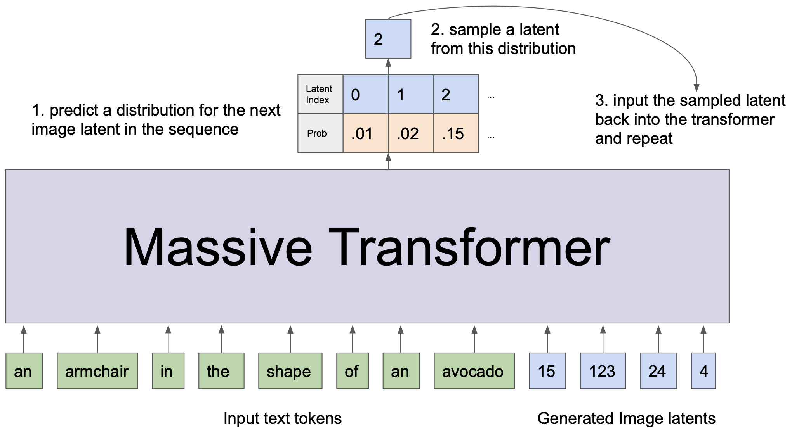

*[Image source](https://mlberkeley.substack.com/p/dalle2)*

The picture's code vectors are fed into the dVAE decoder, which maps them into the final picture:

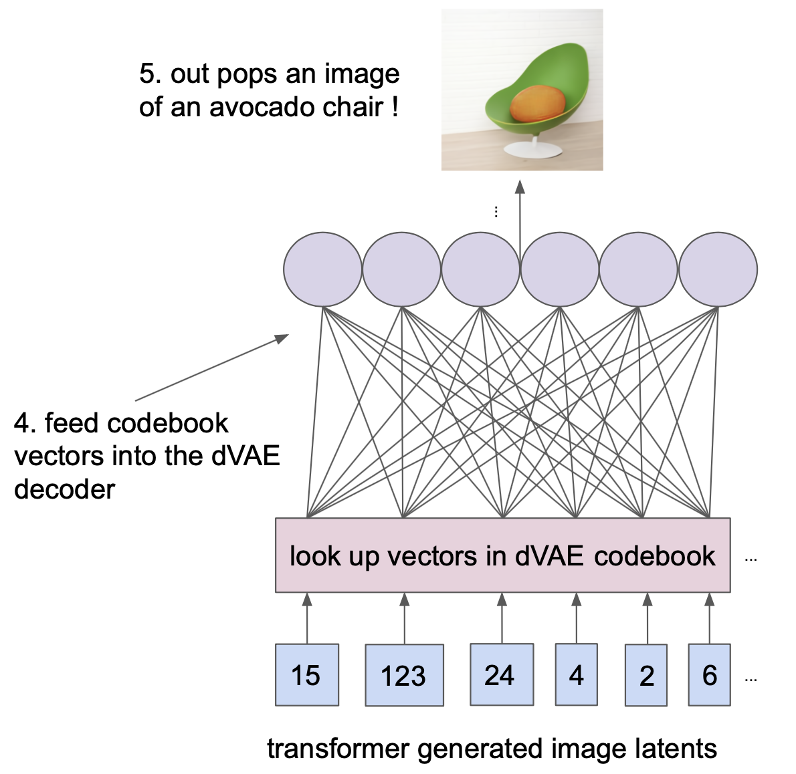

*[Image source](https://mlberkeley.substack.com/p/dalle2)*

To improve prediction quality, the authors first generate 512 pictures for each text description, and then pick the best picture among the predictions. Different sets of code vectors for the same text can be obtained, for example, by randomly picking a code vector at each generation step according to the distribution predicted by the Transformer. The ranking of the resulting 512 pictures is done with [CLIP](https://openai.com/index/clip/) — a large neural network trained without supervision on a large amount of data to model the joint distribution of pictures and texts.

## Conclusion

So, in this post we discussed how the VAE works in its classical form — with a continuous distribution of latent variables — and covered the works based on the idea of using discrete distributions in VAEs.

Of course, the various modifications of VAE are not limited to swapping continuous latent variables for discrete ones. There are many other possible directions for improving the model: hierarchical latent distributions (which we saw, by the way, in the context of VQ-VAE-2), loss functions other than the ELBO, various shapes of latent spaces, adversarial training, and much more.

A good list of papers on VAE modifications can be found [here](https://jmtomczak.github.io/blog/4/4_VAE.html#There-are-many,-many-more!). Among the works developing hierarchical distributions, [NVAE](https://arxiv.org/pdf/2007.03898.pdf) is worth noting — there is a good [video review](https://www.youtube.com/watch?v=x6T1zMSE4Ts) of it by Yannic Kilcher. It deserves a separate mention that the ideas of VAE underlie [latent diffusion models](https://arxiv.org/abs/2112.10752) (such as Stable Diffusion): in them, diffusion happens not in pixel space but in the latent space of a trained autoencoder.

This concludes our story about VAE. Hopefully, it gave you a general picture both of the original ideas from which the VAE model grew and of the most interesting results connected with it.

## Self-check questions

**1. Why introduce hidden (latent) variables when building a generative model? Why not just estimate $p(x)$ from the data directly?**

<details>
<summary>Answer</summary>

First, even very simple $p(z)$ and $p(x \mid z)$ can, after marginalization over $z$, yield a very complex, multimodal $p(x)$ — for example, a discrete $p(z)$ with Gaussian $p(x \mid z)$ gives a mixture of Gaussians, and a continuous $p(z)$ an "infinite" mixture. In other words, latent variables are a way to describe a complex distribution through simple building blocks.

Second, direct statistical density estimation $\hat{p}(x)$ runs into the curse of dimensionality: the higher the dimension of the data, the exponentially more examples are needed for an adequate estimate.

</details>

**2. Why can't the likelihood $p_\theta(x) = \mathbb{E}_{z \sim p_\theta(z)}[p_\theta(x \mid z)]$ simply be estimated by Monte Carlo, sampling $z$ from the prior?**

<details>
<summary>Answer</summary>

The number of samples needed to cover the latent space $Z^M$ well grows exponentially with the dimension $M$ (the curse of dimensionality). Meanwhile, the contribution of the overwhelming majority of $z$ to the estimate is practically zero: only a small part of the latent space maps to objects resembling the elements of the dataset. Hence the idea (akin to importance sampling): introduce a distribution $q_\phi(z \mid x)$ over the "preimages" of the object $x$ and sample only from it.

</details>

**3. What is the ELBO, and why is maximizing it a reasonable substitute for maximizing $\log p_\theta(x)$?**

<details>
<summary>Answer</summary>

The ELBO (evidence lower bound) is the functional

$$\mathcal{L}_{\theta,\phi}(x) = \mathbb{E}_{q_\phi(z \mid x)} [\log p_\theta(x,z) - \log q_\phi(z \mid x)]$$

The log-likelihood decomposes into the sum

$$\log p_\theta(x) = \mathcal{L}_{\theta,\phi}(x) + D_{KL}(q_\phi(z \mid x) \| p_\theta(z \mid x)),$$

and since the $KL$ divergence is nonnegative, the ELBO is a lower bound on $\log p_\theta(x)$, with the gap between them equal to $D_{KL}(q_\phi(z \mid x) \| p_\theta(z \mid x))$ — the distance between the encoder's distribution and the true (intractable) posterior. Therefore, by maximizing the ELBO we simultaneously increase $\log p_\theta(x)$ and bring $q_\phi(z \mid x)$ closer to $p_\theta(z \mid x)$.

</details>

**4. Which two terms does the ELBO consist of, and what is each of them responsible for?**

<details>
<summary>Answer</summary>

$$\mathcal{L}_{\theta,\phi}(x) = \underbrace{\mathbb{E}_{q_\phi(z \mid x)} [\log p_\theta(x \mid z)]}_{\text{reconstruction loss}} - \underbrace{D_{KL}(q_\phi(z \mid x) \| p_\theta(z))}_{\text{regularization term}}$$

The first term is the reconstruction loss: it measures how well the decoder reconstructs the object $x$ from its latent representation. The second is the regularization term: it pushes the distribution produced by the encoder toward the prior $p_\theta(z)$. It is thanks to this term that one can sample from a trained VAE by feeding $z \sim p(z)$ into the decoder.

</details>

**5. Why is the reparameterization trick needed when training a VAE? Why can an unbiased estimate of the ELBO gradient with respect to $\theta$ be obtained without it, but not with respect to $\phi$?**

<details>
<summary>Answer</summary>

The ELBO is an expectation over $z \sim q_\phi(z \mid x)$. The parameters $\theta$ do not participate in this distribution, so $\nabla_\theta$ can simply be moved under the expectation sign and estimated from samples. But $\phi$ parameterizes the very distribution over which the expectation is taken, so $\nabla_\phi$ cannot be moved under the expectation.

The reparameterization trick represents $z$ as a deterministic differentiable function of the parameters and independent noise: for example, $z = \mu_\phi(x) + \varepsilon \cdot \sigma_\phi(x)$, where $\varepsilon \sim \mathcal{N}(0, I)$. The source of randomness moves into the "input data", the expectation is now taken over $p_\varepsilon$, which does not depend on $\phi$, and gradients flow through deterministic variables — resulting in a setup typical for SGD.

</details>

**6. Which distributions are usually chosen for $p_\theta(z)$, $q_\phi(z \mid x)$ and $p_\theta(x \mid z)$ in a classical VAE?**

<details>
<summary>Answer</summary>

- Prior: $p_\theta(z) = \mathcal{N}(0, I)$.
- Encoder: $q_\phi(z \mid x) = \mathcal{N}(\mu_\phi(x), \sigma_\phi^2(x))$ with a diagonal covariance matrix — such a distribution admits reparameterization, and its $KL$ divergence with $\mathcal{N}(0, I)$ has a closed form: $\frac{1}{2} \sum_j (\sigma_j^2 + \mu_j^2 - 1 - \ln \sigma_j^2)$.
- Decoder: depends on the nature of the data — Gaussian $\mathcal{N}(f_\theta(z), \sigma^2)$ for continuous data (then the reconstruction loss turns into MSE up to constants), Bernoulli for binary, categorical for discrete.

</details>

**7. How do you generate a new object with a trained VAE? Is the encoder needed for this?**

<details>
<summary>Answer</summary>

It suffices to sample $z \sim \mathcal{N}(0, I)$ and feed it into the decoder — the encoder is not needed for generation. It comes in handy, though, if we want to estimate $\log p(x)$ for a particular object $x$ (say, a test one): the ELBO-based estimate with sampling from $q_\phi(z \mid x)$ converges much faster than direct Monte Carlo estimation with sampling from the prior.

</details>

**8. How does CVAE differ from a plain VAE? Why is it not the same as training a separate VAE per class?**

<details>
<summary>Answer</summary>

In a CVAE all distributions are conditioned on an additional variable $y$ (a label or an arbitrary tensor characterizing the object): $q_\phi(z \mid x, y)$, $p_\theta(x \mid z, y)$, $p_\theta(z \mid y)$. In practice this comes down to concatenating $y$ (e.g. as a one-hot vector) with the inputs of the encoder and decoder. For each value of $y$ the model effectively gets its own prior $p_\theta(z \mid y)$.

At the same time, the network weights are shared across all classes — unlike a collection of independent VAEs — so the model can reuse patterns learned across classes, and $y$ can also be continuous.

</details>

**9. How is the latent space of VQ-VAE organized? What happens to the $KL$ term of the ELBO during training, and how do gradients pass through the quantization operation?**

<details>
<summary>Answer</summary>

The latent space of VQ-VAE is a codebook of $K$ learnable code vectors $e_1, \dots, e_K$. Each vector of the encoder output $z_e(x)$ is replaced by the nearest code vector in $L_2$ distance. The encoder distribution $q(z \mid x)$ is then degenerate (one-hot), and the prior during training is uniform, so $D_{KL}(q(z \mid x) \| p(z)) = \log K$ — a constant that can be ignored during optimization.

Quantization is non-differentiable, so on the backward pass the gradient is copied from the decoder to the encoder "through" it — this is the straight-through estimator applied to the quantization operation. But this way the code vectors receive no gradients, so two more terms are added to the loss:

$$\mathcal L = \log p(x \mid z_q(x)) + \| \operatorname{sg}[z_e(x)] - z_q(x) \|_2^2 + \beta \| z_e(x) - \operatorname{sg}[z_q(x)] \|_2^2$$

The second term moves the code vectors toward the encoder outputs; the third makes the encoder produce vectors close to the code vectors.

</details>

**10. Why does sampling from the uniform prior of a trained VQ-VAE yield noise instead of meaningful pictures, and how do the authors solve this problem?**

<details>
<summary>Answer</summary>

The regularizing $KL$ term degenerated into a constant during VQ-VAE training, so nothing forced the distribution of latent codes to approach the uniform one — it remained an unknown "narrow subset" (a situation resembling a plain autoencoder, from whose latent space one cannot sample). A sample from the uniform distribution almost surely misses the region of actually used codes.

The solution is to learn the prior $p(z)$ with a separate autoregressive model over the discrete codes (which is close to training a language model): PixelCNN for images, WaveNet for audio. Samples from the learned prior look incomparably better.

</details>

**11. In a plain (continuous) VAE one can sample directly from the prior $\mathcal N(0,I)$, while VQ-VAE required a separate prior model (PixelCNN). Why?**

<details>
<summary>Answer</summary>

In a continuous VAE the regularizing $KL$ term does not degenerate: it penalizes $q_\phi(z\mid x)$ for deviating from $\mathcal N(0,I)$ for every $x$, so the aggregate distribution of the codes is trained to resemble the prior. Then sampling $z\sim\mathcal N(0,I)$ and passing it through the decoder yields meaningful objects. In VQ-VAE the $KL$ collapsed into a constant — the distribution of the codes is unregularized, arbitrary and unknown, so a sample from the uniform gives noise.

But there is a deeper reason, unrelated to the degeneration of the $KL$. A plain VAE typically encodes an object into a *single* latent vector, whose entire structure is "deciphered" by the decoder — and a simple $\mathcal N(0,I)$ suffices for it. VQ-VAE, in order to preserve details, keeps a *grid* of many latents, and to reconstruct a coherent picture the codes in different cells must be correlated (neighboring cells describe neighboring parts of the image). A factorized prior — a product of independent distributions over positions, $p(z)=\prod_i p(z_i)$, — cannot express such dependence in principle: it will only fit the marginals at each position, and an independent sample from it will produce an incoherent mosaic.

This can also be seen formally. If we fit a factorized $p(z)=\prod_i p_i(z_i)$ by maximum likelihood to the true distribution of codes $q(z)$, the objective decouples into per-position cross-entropies, each depending only on its own marginal $q_i$; the optimum is reached at $p_i = q_i$, and the irreducible gap equals $\sum_i H(q_i) - H(q)$ — the total correlation between positions. The objective simply has no term that would penalize incorrectly learned dependencies.

What fixes this is precisely a *non*-factorized, autoregressive prior $p(z)=\prod_i p(z_i \mid z_{\lt i})$ (PixelCNN, and in DALL-E — the Transformer), which does capture the dependencies between positions.

Incidentally, it is useful to notice where the correlations come from: the dVAE encoder predicts independent distributions over positions *for a fixed* $x$, but the dataset-aggregated distribution of codes $q(z) = \mathbb{E}_x\, q_\phi(z \mid x)$ is a mixture of such factorized distributions over all $x$, and a mixture of independent distributions is no longer independent. It is the mixing over the data that gives birth to the dependencies between positions, which the prior then has to model. This shows that discreteness as such is not the point: a continuous VAE with a latent grid would face the same issue and would also require a separate prior model — in fact, latent diffusion models (Stable Diffusion) do exactly that: they learn a distribution over the continuous latent grid of an autoencoder.

</details>

**12. When deriving the ELBO we assumed that the components of an object are conditionally independent given the latent representation: $p_\theta(x \mid z) = \prod_j p_\theta(x_j \mid z)$. But in VQ-VAE and dVAE the codes at different positions are, on the contrary, strongly correlated. Doesn't this violate the original assumption and render the ELBO incorrect?**

<details>
<summary>Answer</summary>

It does not: two different independence assumptions are being conflated here.

1. Conditional independence of the *object's components* given the latent, $p_\theta(x \mid z) = \prod_j p_\theta(x_j \mid z)$ — this is what turns the reconstruction loss into a sum over pixels. In VQ-VAE and dVAE it still holds: the decoder still outputs an independent distribution for each pixel (in DALL-E it is the Logit-Laplace).

2. Independence of the *latent variables across positions*, i.e. the factorized form of $p(z)$. It is this assumption that turns out to be inadequate — and the correlation of the codes contradicts precisely it, not the first assumption.

Moreover, the first assumption only becomes more plausible with the move to a grid of latents: a rich latent representation explains almost the entire structure of the picture, so the decoder hardly needs to "fill in" correlated details. Hence the sharp reconstructions of VQ-VAE — in contrast to the blurry samples of a vanilla VAE, where a small latent could not explain the pixel correlations, and the decoder by construction had no right to add them (see the box "Why a vanilla VAE blurs pictures and VQ-VAE does not").

The ELBO itself remains a valid lower bound on $\log p_\theta(x)$ — but for the model we defined. If the prior is factorized and uniform, the ELBO honestly estimates the likelihood of the model "independent uniform codes $\to$ decoder". There is no error in the derivation: it is the model family that is inadequate, not the bound. Such a model is simply a poor generator — it would produce a mosaic.

Finally, training the prior in the second stage is not a departure from the ELBO either. For the two-stage model $p(x) = \sum_z p_\psi(z) p_\theta(x \mid z)$, with the encoder and decoder frozen,

$$\log p(x) \ge \mathbb{E}_{q_\phi(z \mid x)} [\log p_\theta(x \mid z)] + \mathbb{E}_{q_\phi(z \mid x)} [\log p_\psi(z)] - \mathbb{E}_{q_\phi(z \mid x)} [\log q_\phi(z \mid x)],$$

and maximization over $\psi$ reduces to $\mathbb{E}_{q_\phi(z \mid x)}[\log p_\psi(z)] \to \max$ — that is, exactly to training PixelCNN or the Transformer by maximum likelihood on the codes produced by the encoder. So the two-stage scheme is coordinate ascent on a valid ELBO of the final model.

</details>

**13. What do the Gumbel-Max Trick and Gumbel-Softmax do, and why are they needed in the dVAE (DALL-E)?**

<details>
<summary>Answer</summary>

The Gumbel-Max Trick is a way to sample from a categorical distribution given by logits $x_1, \dots, x_k$: add independent samples $g_i$ from the Gumbel distribution to the logits and take $\arg\max_i (x_i + g_i)$. This is equivalent to sampling from $\text{softmax}(x)$, but is still non-differentiable because of the $\arg\max$.

Gumbel-Softmax replaces the $\arg\max$ with a temperature $\text{softmax}$: $y_i = \frac{\exp((x_i + g_i)/\tau)}{\sum_j \exp((x_j + g_j)/\tau)}$; the latent vector is assembled as a weighted sum of code vectors $z = \sum_i y_i e_i$. As $\tau \to 0$ the procedure tends to honest sampling with the $\arg\max$, which is why the temperature is gradually lowered during dVAE training.

As a result, sampling of discrete codes becomes differentiable: the dVAE is trained by honest ELBO optimization — without gradient copying or extra loss terms, which VQ-VAE needed. And the $KL$ term here does not degenerate into a constant and genuinely works as a regularizer.

A caveat is in order, though: the dVAE prior is factorized over positions. The encoder outputs a $32 \times 32$ grid of positions, each with its own categorical distribution over the $8192$ code vectors; the prior $p(z)$ takes the code index at each position to be equally probable among all $8192$ options and independent of the other positions. The $D_{KL}$ regularizer pulls the encoder's distribution at each position *separately* toward this prior, but says nothing about the joint structure of all $32 \times 32$ codes of a picture (much less about their connection with the text). And a meaningful picture corresponds to a strongly correlated set of codes — a negligible fraction of the space of all combinations. So sampling pictures "from the dVAE alone" (drawing the code at each position independently) is still impossible: the joint distribution of codes and text is learned in the second stage by the Transformer — just as PixelCNN played this role for VQ-VAE.

</details>

**14. Gumbel-Softmax allows training a dVAE by honest ELBO optimization, but in practice discrete tokenizers more often use hard VQ (straight-through + commitment loss). Does this mean that careful regularization of the token prior is not that important?**

<details>
<summary>Answer</summary>

To a large extent, yes. Since the joint distribution of the codes is learned by a separate second-stage model (the Transformer) anyway, how uniform the marginal of an individual token is has almost no effect on the final generation quality: the prior model will learn whatever token statistics the tokenizer produces — just as a language model works perfectly well with the fact that real tokens are not equally probable. So the "honest non-constant $KL$" is not the decisive practical advantage of Gumbel-Softmax.

The value of this approach is rather in the cleanliness of the formulation: an honest ELBO, differentiable sampling, no straight-through hack and no separate terms for the code vectors. Hard VQ is simpler (no temperature schedule and no bias from the relaxation) and works no worse, which is why most modern tokenizers use exactly it.

One caveat: pulling toward the uniform distribution is not entirely useless — it encourages high codebook utilization and prevents codebook collapse. But this property matters for training the tokenizer itself well, not for the ability to sample directly.

</details>

**15. Describe the two training stages of DALL-E and the inference procedure.**

<details>
<summary>Answer</summary>

Stage 1: a discretized VAE (dVAE) is trained, compressing a $256 \times 256$ picture into $32 \times 32 = 1024$ discrete codes from a codebook of size 8192; differentiability of the sampling is provided by the Gumbel relaxation (Gumbel-Softmax).

Stage 2: the dVAE is frozen, and a decoder-Transformer is trained on the concatenation of the caption's text tokens and the picture's code vectors — it learns the joint distribution of texts and pictures by predicting the continuation of the sequence.

Inference: the text description is fed into the Transformer, which autoregressively samples the picture's codes (predicts the distribution of the next code, samples from it and feeds the result back as input), after which the resulting codes are passed through the dVAE decoder, which produces the final picture.

</details>

## Practice

The hands-on notebook accompanying this chapter lives in the handbook materials repository: [chapters/representation_learning/vae.ipynb](https://github.com/yandexdataschool/ML-Handbook-materials/blob/main/chapters/representation_learning/vae.ipynb). You can [open it in Colab](https://colab.research.google.com/github/yandexdataschool/ML-Handbook-materials/blob/main/chapters/representation_learning/vae.ipynb) — no GPU needed, everything runs on a CPU in a few minutes. (The notebook is in Russian, but the code speaks for itself.)

In the notebook we build a VAE on MNIST from scratch and reproduce with our own hands all the key pictures of this chapter:

* the encoder, reparameterization, a Bernoulli decoder and the ELBO as the loss function;
* reconstructions and samples from the prior $\mathcal{N}(0, I)$;
* the latent space map for $M = 2$ — those very clusters of digits;
* the learned manifold: a uniform grid passed through $\Phi^{-1}$ and the decoder;
* the effect of the latent space dimension on sample quality;
* CVAE: conditioning on the class, generating a chosen digit, and per-class manifolds.

The exercises at the end of the notebook are worth doing separately. The most important one is to train the model with zero weight on the $KL$ term: the reconstructions get better, while the samples from the prior turn into garbage. This is exactly the situation we analyzed for VQ-VAE, and seeing it with your own eyes is more useful than reading about it.
