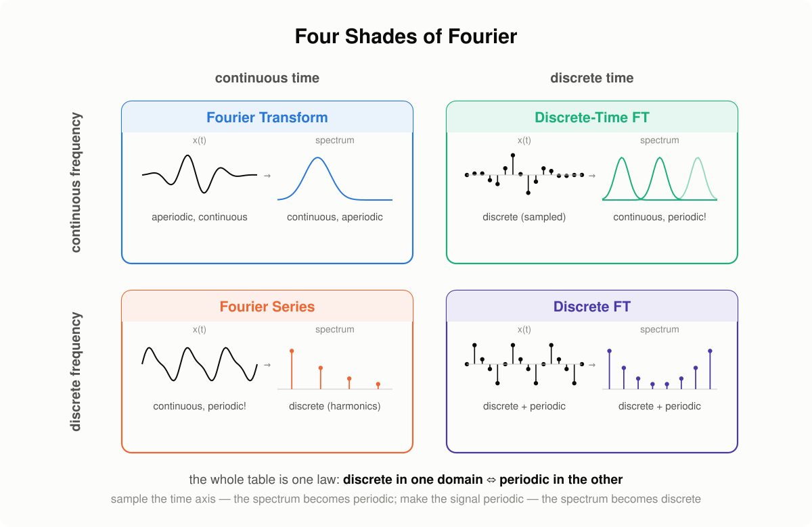

# Post 1 draft: From the Fourier Series to the Spectrogram

Status: skeleton + drafted intro and sections 1–2; slide numbers refer to `lecture_digest.md`.
Figures: every plot gets regenerated in matplotlib (house palette) or drawn as house-style SVG — no slide screenshots in the final post.

---

## Intro (drafted)

Open any tutorial on speech processing and you will meet the spectrogram in the
first five minutes — usually with a hand-wave: "we apply the Fourier transform in
sliding windows". Open a math textbook, and you will find the Fourier series in
its full rigor — with no hint of why an ML engineer should care. The road between
these two points is almost never walked end to end: every explanation starts
somewhere in the middle. This post walks the whole road: from air pressure and a
guitar string, through sampling and quantization, through the Fourier series and
the DFT, to the spectrogram — the picture that speech models actually consume.

Along the way we will meet several *different* creatures that all answer to the
name "Fourier": the Fourier **series**, the Fourier **transform**, its
**discrete-time** cousin, and the **discrete** Fourier transform. They form a
tidy 2×2 family — and untangling their family relationships is a story of its
own, which gets a separate post (and more): for now, one picture as a teaser.

*(teaser of the next post — in this one we will travel the FS → DFT diagonal)*

## 1. What is sound (slides 3–4) — drafted

The air around us is filled with molecules. Pull a guitar string — it creates a
vibration that travels through them as alternating zones of compression and
rarefaction: a pressure wave. A microphone senses exactly this: variations of
pressure relative to the atmospheric baseline. Plot that pressure against time —
and you get the most honest picture of sound there is: the **waveform**.

> Fun fact from the lecture notes: sound is a *mechanical* wave — it needs a
> medium. In the vacuum of space there is nothing to compress, which is why we
> can see the Sun but cannot hear it.

[FIGURE: pressure wave → microphone → waveform; house-style SVG]

## 2. Analog → digital (slides 5–9) — drafted

The microphone's output is an analog signal: continuous in time and in value. A
computer needs numbers, and the Analog-to-Digital Converter produces them by
discretizing along both axes:

- **sampling** — measure the signal at regular moments, $f_s$ times per second
  (time discretization);
- **quantization** — round each measurement to the nearest level of a fixed grid
  (amplitude discretization).

The result — a sequence of integers at a fixed rate — is **Pulse-Code
Modulation (PCM)**, the format inside every WAV file. Two numbers fully describe
the grid: the sampling rate (e.g. 44.1 kHz) and the bit depth (e.g. 16 bits).

[FIGURE: analog curve → sampled stems → quantized staircase; matplotlib, 3 panels]

Side quests to keep or drop (decide): intensity & loudness, decibels (slides
7–8); audio formats — WAV/FLAC/MP3 (slide 9); hearing ranges (slide 64).

## 3. Why the waveform is not enough (slides 12, 14–16) — skeleton

- 44 100 numbers per second, and none of them individually says anything about
  pitch or content
- Fourier's idea: a complex signal = a sum of simple oscillations, like a chord
  = individual notes
- The spectrum: amplitudes live on the frequency axis, not the time axis
- Funny-intro candidate (from the Notion TODO): angeloyeo's animation essay

## 4. The Fourier series (slides 17–18, 66) — skeleton

- Trigonometric form: $a_0$, $a_n$, $b_n$ (formulas ready in `shades_draft.md`)
- Cosine form: magnitude $A_n$, frequency $n/P$, phase $\phi_n$
- Exponential form via Euler; coefficients $c_n$ — "the spectrum of $x$"
- 💡 inset candidate: why the basis is orthogonal, in two lines

## 5. From the series to the DFT (slides 19–25; full derivation 68–76) — skeleton

**This is the chapter nobody else writes** — from basic math to the DFT with no
gaps, following the (now-dead, Wayback-archived) dsplib derivation:

- a sampled, time-limited signal; periodic extension with period $NT$
- naive attempt: Fourier coefficients of a "comb of points" are all zero
  (Riemann integral doesn't see isolated points) — slide 69
- fix: model a sample as a Dirac impulse (measurement as averaging over a
  shrinking interval) — slides 70–73
- the integral collapses into a sum; the coefficients become periodic with
  period $N$ — slides 21–22
- drop the physical units, keep indices — and the sum *is* the DFT; inverse DFT;
  the $1/N$ convention (slides 24–25, the famous "lolkekc" formulas 🙂)
- FFT in one paragraph: $O(N \log N)$, pointer to a good video (slide 26)

## 6. Properties of the DFT (slides 30–41) — skeleton

- N samples → N coefficients; only whole numbers of periods fit
- Frequency resolution $\Delta f = f_s / N$; the triad $f_s$ / Nyquist / $\Delta f$
- The amplitude spectrum; why speech people ignore phase (and when they don't)
- Symmetry for real signals: half the coefficients are redundant
- Shannon–Nyquist–Kotelnikov; Nyquist frequency sits mid-spectrum
- [FIGURE: two-sine spectrum "why do we see 2 peaks"; matplotlib]
- [FIGURE: spectrum of a real recording]

## 7. From DFT to the spectrogram (slides 44–53) — skeleton

- Speech is non-stationary; a whole-signal DFT averages the interesting parts away
- STFT: window slides, local spectra stack into columns
- Spectral leakage: the DFT thinks the window repeats forever; discontinuities
  smear energy across bins
- Window functions force continuity at the edges
- Hyperparameters: window length ⇄ frequency resolution, hop length
- What the sample rate defines vs what the window length defines (quiz from
  slides 50–51 — keep as a 💡 self-check)
- [FIGURE: spectrogram of speech + of a saxophone; librosa or manual STFT]

## 8. Mel scale and mel-spectrogram (slides 54–57) — skeleton

- Cochlea: we resolve low frequencies better than high ones
- Mel ↔ Hz conversion; mel filter bank as a linear projection $M = FS$
- log at the end; this is the input of most speech models
- [FIGURE: mel filter bank + spectrogram → mel-spectrogram]

## 9. Wrap-up — skeleton

- The chain: pressure → PCM → FS → DFT → STFT → (mel-)spectrogram
- Teaser again: the four shades and the roads between them — next post
- Acknowledgments: the YSDA speech course lineage; dsplib (via Wayback)

## Open questions

1. One long post or split after section 5? (The "series → DFT" derivation is the
   heart; sections 6–8 are more engineering.)
2. Do we include the acoustic wave equation (slide 63) as a 💡 inset or drop it?
3. Audio examples: embed actual audio players? (Hugo can serve wav/ogg; nice for
   "hear the chirp, see the chirp".)
4. Chirp example (slide 65) — great for showing time-frequency tradeoff?
